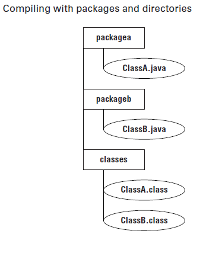

										WELCOME TO JAVA

# Learning About the Java Environment: (En savoir plus sur l'environnement Java)   
L'environnement Java consiste à comprendre un certain nombre de technologies. Dans les sections suivantes, nous passerons en revue les principaux termes et acronymes que vous devez connaître pour l'examen, puis nous discuterons du logiciel que vous devez étudier pour l'examen.    
### Major Components of Java: (Principaux composants de Java)   
Le kit de développement Java (JDK) contient le logiciel minimum dont vous avez besoin pour faire du développement Java. Les éléments clés incluent le compilateur (javac), qui convertit les fichiers .java en fichiers .class, et le lanceur java, qui crée la machine virtuelle et exécute le programme. Nous utiliserons les deux plus loin dans ce chapitre lors de l'exécution de programmes en ligne de commande. Le JDK contient également d'autres outils, notamment la commande archiver (jar), qui peut regrouper des fichiers, et la commande de documentation API (javadoc) pour générer la documentation.    

Le programme javac génère des instructions dans un format spécial que la commande java peut exécuter, appelé bytecode. Ensuite, java lance la machine virtuelle Java (JVM) avant d'exécuter le code. La JVM sait comment exécuter le bytecode sur la machine réelle sur laquelle elle se trouve. Vous pouvez considérer la JVM comme une boîte magique spéciale sur votre machine qui sait comment exécuter votre fichier .class.    
### JRE n'existe plus:
Dans les versions précédentes de Java, vous pouviez télécharger un environnement d'exécution Java (JRE) au lieu du JDK complet. Le JRE était un sous-ensemble du JDK qui était utilisé pour exécuter un programme mais qui ne pouvait pas en compiler un. C'était littéralement un sous-ensemble. En fait, si vous regardiez à l'intérieur de la structure de répertoires d'un JDK dans les anciennes versions de Java, vous verriez un dossier nommé jre.    
Dans Java 11, le JRE n'est plus disponible en tant que téléchargement autonome ou sous-répertoire du JDK. Les utilisateurs peuvent utiliser le JDK complet lors de l'exécution d'un programme Java. Les développeurs peuvent également fournir un exécutable contenant les éléments requis qui auraient été dans le JRE. La commande jlink crée cet exécutable.   
Bien que le JRE ne fasse pas partie de l'examen, le fait de savoir ce qui a changé peut vous aider à éliminer les mauvaises réponses.       
### LTS: (Long Time Support)
Oracle a annoncé un changement radical dans le cycle de release de Java. Il y aura dorénavant une release (version stable) majeure tous les 6 mois, une mineure tous les 2 mois et une LTS (Long Time Support, Support à long terme) tous les 3 ans.     
# Understanding the Java Class Structure: (Comprendre la structure des classes Java)    
Dans les programmes Java, les classes sont les blocs de construction de base. Lors de la définition d'une classe, vous décrivez toutes les parties et caractéristiques de l'un de ces blocs de construction. Pour utiliser la plupart des classes, vous devez créer des objets. Un objet est une instance d'exécution d'une classe en mémoire. Un objet est souvent appelé une instance car il représente une représentation unique de la classe. Tous les différents objets de toutes les différentes classes représentent l'état de votre programme. Une référence est une variable qui pointe vers un objet.    
### Fields and Methods : (Champs et méthodes)    
Les classes Java ont deux éléments principaux: *les méthodes*, souvent appelées fonctions ou procédures dans d'autres langages, et *les champs*, plus généralement appelés variables. Ensemble, ils sont appelés *les membres de la classe*. Les variables contiennent l'état du programme et les méthodes fonctionnent sur cet état. S'il est important de se souvenir du changement, une variable stocke ce changement. C’est vraiment tout ce que font les classes. C’est le programmeur qui crée et organise ces éléments de manière à ce que le code résultant soit utile et, idéalement, facile à comprendre pour les autres programmeurs.        
### Classes vs. Files: (Classes vs fichiers)    
La plupart du temps, chaque classe Java est définie dans son propre fichier .java. Il est généralement public, ce qui signifie que n'importe quel code peut l'appeler. Fait intéressant, Java n'exige pas que la classe soit publique. Par exemple, cette classe est très bien:    

	class Animal {
		String name;
	}
Vous pouvez même mettre deux classes dans le même fichier. Lorsque vous procédez ainsi, au plus une des classes du fichier est autorisée à être publique. Cela signifie qu'un fichier contenant les éléments suivants convient également:   

	public class Animal {
		private String name;
	}
	
	class Animal2 {
	}
Si vous avez une classe publique, elle doit correspondre au nom de fichier. La déclaration publique class Animal2 ne se compilerait pas dans un fichier nommé Animal.java.    
# Ecrire le méthode main():
- Pour vérifier le version du java, on lance cette commande: **java -version**   
-  On écrit cette méthode dans un fichier Zoo.java:   

			public class Zoo {    
				public static void main(String[] args) {    
					System.out.println("Hello Zoo");   
				}    
			}  
    
Le mot clé 'public'est ce qu'on appelle un modificateur d'accés. Il déclare le niveau d'exposition de cette méthode aux acteurs potentiels du programme.   
			 
le mot clé 'static' lie une méthode à sa classe afin qu'elle puisse etre appelée uniquement par le nom de la classe, comme dans, par exemple, Zoo.main (). 
    
La méthode main() permet à la JVM d'appeler notre code.

La méthode main(), recoit une liste de param, representée sous forme d'un tableau de string (String[]).  
### Passing param to a java Program:  

		public class Zoo {    
			public static void main(String[] args) {    
				System.out.println(args[0]);     
				System.out.println(args[1]);   
			}    
		}    

javac Zoo.java    
java Zoo "San Diego" Zoo   
=> Cela affiche :   
 "San Diego"    
 Zoo    
### Lancer un programme sur une seule ligne:  
A partir de java 11, vous pouvez exécuter un programme sans compiler, c-a-d sans taper la commande javac.  
 
	public class Zoo {    
		public static void main(String[] args) {    
			System.out.println(args[0]);     
		}    
	}   	
On peut exécuter note programme Zoo sans le compilé.  
java Zoo.java Cleveland    

cette fonctionnalité (one-liner), exécute le programmes de code source à un seul fichier.  

# Comprendre la declaration des package et les imports:
Java a besoin d'un moyen d'organiser les classes.Il gère cela d'une manière similaire à un classeur. Vous mettez tous vos morceaux de papier dans un dossier. Java met des classes dans des packages. Ce sont des regroupements logiques pour les classes.
   
*import* java.util.Random; //import nous indique où trouver Random   

**Wildcards**:  
les classes d'un même package sont souvent importées ensemble. Vous pouvez utiliser un raccourci pour importer toutes les classes du package. 
 
	import java.util.*; // import la class Random ainsi que toutes les classes de ce packages.  

On a ces imports:  

	import java.nio.file.Files;   
	import java.nio.file.Paths;   

Certaines importations qui ne **fonctionnent** pas:  

	 import java.nio.*; // le Wildcard correspond q'avec le nom de la classe.  
	 import java.nio.*.*; // on peut avoir qu'un seul Wildcard et doit etre à la fin de l'import.  
	 import java.nio.file.Paths.*; // On peut pas importer des méthode que des classes.  
 
**Redundant Import**:  
java.lang est un package spécial il est automatiqument importé, donc c'est redondant de l'importer. 
  
	import java.util.Random;  
	import java.util.*; // ici c'est redondant parce que la class Random est importé avec le premier import.  

**Naming Conflicts**:     

Parmis les raison d'utiliser les packages est le nom de la classe ne soit pas unique dans un projet Java. Par exemple:  

	import java.util.Date; // ou java.util.*;    
	import java.sql.Date;  // ou java.sql.*;   
	
	public class Conflicts {  
	   Date date;  
	}  

Ce code **ne compile pas**, on a un conflit, en fait le compilateur java ne peut pas deviner quelle classe va utiliser, pour remidier a ce problème on deux solution:
* Soit on supprime un des deux imports.  
* Soit on garde une seule declaration explicite de classe:  
	
	import java.util.Date;  
	import java.sql.*;   
=>Ah, maintenant ça marche. Si vous importez explicitement un nom de classe, il est **prioritaire** sur tous les caractères génériques présents. Java pense: "Le programmeur veut vraiment que j'assume l'utilisation de la classe java.util.Date."   

# Créer un nouveau package:  
Vous apprendrez java beaucoup plus facilement en utilisant la ligne de commande pour compiler et tester vos exemples.   
Une fois que vous connaissez bien la syntaxe Java, vous pouvez passer à un IDE.  

Nous créons deux fichier ClassA.java et ClassB.java sur ce chemin:   
C:\temp\packagea\ClassA.java et C:\temp\packageb\ClassB.java   
on va sous le repertoir C:\tmp    

	package packagea;       
	public class ClassA {   
		public static void main(String[] args) {     
			System.out.println(args[0]);    
		}   
	}    
	
	package packageB;
	import packagea.ClassA;       
	public class ClassB {   
		public static void main(String[] args) {     
			ClassA a;    
		}   
	} 
 
* Pour compiler:   
**javac** packagea/ClassA packageb/ClassB   

* Pour exécuter: (nous sommes sous le répetoire C:\temp\ un cran avant le package)    
**java** packagea.ClassA packageb.ClassB   

* Si on va sous le repertoir C:\temp\packagea et on essaye d'exécuter le programme de la classA on aura une erreure d'exécution: " java.lang.NoClassDefFoundError: packagea\ClassA "   
   
**Exemple 2:** (Account.java)

	package ocp.chapiter1;
	public class Account {
		public static void main(String[] args) {
			System.out.println("Hello 1 2 3 testing...");
		}
	}

	/OCP-EXAMS-1Z0-815/src/ocp/chapiter1/> javac Account.java
Un fichier Account.class est crée dans le même repertoire.

	/OCP-EXAMS-1Z0-815/src/ocp/chapiter1/> java Account
Résultat:
*Error: Could not find or load main class Account*
*Caused by: java.lang.NoClassDefFoundError: ocp/chapiter1/Account (wrong name: Account)*
Par défaut, le compilateur Java compile le fichier source java et place le fichier classe dans le même dossier que le fichier source. Mais le commande que lance la JVM s'attend que le fichier .class se trouve dans un chemin de repertoire qui imite le nom de package.

Pour que cet exemple compile il faut se deplacer dans: 

	/OCP-EXAMS-1Z0-815/src/> java ocp.chapiter1.Account   
Résultat: *Hello 1 2 3 testing...*
     
### Utilisation d'un autre répertoire:  

Par défaut la commande javac place les classes compilées dans leurs repertoires sources, en revanche il existe une option pour placer le fichiers class complilent dans un repertoire différent, -d demande au compilateur de créer la structure de repertoires selon le nom du package de la classe et de placer le fichier dans repertoir cible (targer directory) c'est pour ça -d (directory).   

	javac -d classes packagea/ClassA packageb/ClassB   
	

Dans cet exemple on dit au compilateur de compliler les deux classes ClassA et ClassB et de copier les fichiers ".class" sous le repertoire *classes*.      
	
Là on a comme résultat:  
*C:\temp\classes\packagea\ClassA.class* **et** *C:\temp\classes\packageb\ClassB.class*   

pour exécuter le programme, vous spécifiez le chemin d'accés aux classes (classpath) pour que Java sache où trouver les classes.    

	java -cp classes packageb.ClassB //on met la classe qui a la méthode main()
		OU
	java -classpath classes packageb.ClassB
		OU
	java --class-path classes packageb.ClassB

Exemple2: 

	$ javac -d . Account.java
cette commande copie *Account.class* **sous**  *ocp/chapiter1*, pour exécute le programme en fait:

	java -cp . ocp.chapiter1.Account
	
# Compiling with JAR Files:  

	java -cp "c:\tmp\maJarFile.jar" MyPackage.MyClass    
### Creating Jar File:   
On peut créer une jar par nous même, en utilisant la commande jar avec deux façon:
  
	> jar -cvf myNewFile.jar   
	OU   
	> jar --create --verbose --file myNewFile.jar  

### How run a Jar file: 

	java -jar file.jar

# Order elements in a Class:    

| Element           | Exemple            | Obligatoire  | ordere dans la classe                   |
| ------------------|:------------------:| ------------:|----------------------------------------:|
| package           | package abc;       | NON          | premier élément                         |
| import            | import java.util.*;| NON          | juste aprés le package s'il est present |
| class             | public class A     | OUI          | juste aprés l'import s'il est present   |
| champs et méthodes| int a; method() {} | NON          | Dans la Classe                          |
					  	
