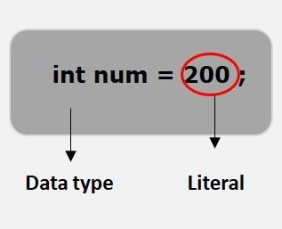
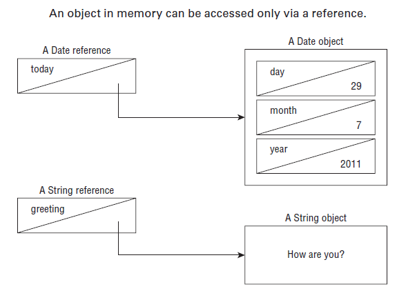
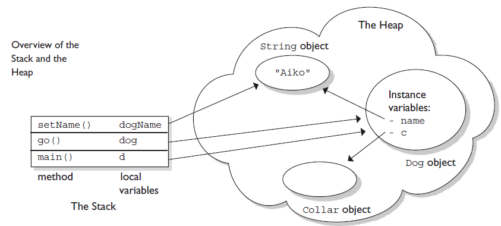
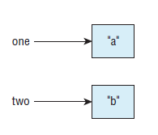
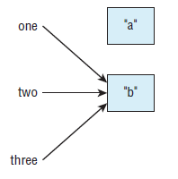
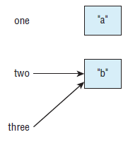

								JAVA BUILDING BLOCKS 
								
# Creating object:  
Pour créer une instance de classe, il suffit d'ecrire le mot **new <nom_de_classe>()**, comme ci-dessous:   
Park p = new Park();  
Park est le type de variable, p une referance sur un objet de type Park et Park() le constructeur. 

### Exécution de blocs d'initialisation d'instance:   

Lorsque vous avez découvert les méthodes, vous avez vu des accolades ({}) le code entre les accolades s'appelle un bloc de code. Partout où vous voyez des accolades se trouve un bloc de code.   
Parfois le bloc de code (*code block*) est dans une méthode, il sera exécuté quand on appelle la méthode, autre moment en dehors de la méthode, il s'appelle  initialiseur d'instance **instance initializer**.   

### Suite à l'ordre d'initialisation: (Following Order of initialisation) (voir code  OcpTest1)  
 
Quand on ecrit ce code ci-dessous:

		public class OcpTest1 {
			private String name = "fluffy";
			{System.out.println("setting field " + name);}
			
			public OcpTest1() {
				name = "Tiny";
				System.out.println("setting constructor");
			}
		
			public static void main(String[] args) {
				OcpTest1 ocpTest1 = new OcpTest1();
				System.out.println(ocpTest1.name);
			}
		}
Exécutant ce code:

	setting field fluffy
	setting constructor
	Tiny
losqu'on crée l'objet avec *new OcpTest1()*, java intialise l'attribut name = "fulffy" en premier lieu, après exécute le bloc d'initialisation et à la fin il appelle constructure et set name="Tiny".  

# Understing data type:  

Dans les applications java, il y a deux types de variable, type primitive et type de référance:

### Type Primitive: (voir code  OcpTest2)   
| Type                                      |                           Keyword                            | Default value                             |
| ----------------------------------------- |:------------------------------------------------------------:|-------------------------------------------|
| boolean                                   |                  boolean ( true or false )                   | false                                     |
| type numéric sans floating-point (décimal)| byte (8-bit), short (16-bit), int (32-bit) et long (64-bit)  | byte (0), short (0), int (0) et long (0L) |
| type numéric avec floating_point (décimal)|                    float(123.45f), double                    | float(0.0f), double (0.0)                 |
| type char                                 | char (stocker un seul caractère sur 16 bits - Unicode value) | '\u0000'                                    |
 
* char: 'a', La primitive char est utilisée pour stocker un seul caractère **Unicode 16 bits** et nécessite 16 bits de mémoire.    

Tous les type numéric sont **signés** peuvent avoir une valuer négative, int x = -128   

Pour l'**examen**, sachez que short et char sont étroitement liés, les deux type sont sur 16-bit, la difference entre les deux que short est signé mais char non signé. 

* Is String a Primitive ? (La chaîne est-elle une primitive): Non, ce n’est pas le cas. Cela dit, String est souvent confondu avec une neuvième primitive car Java inclut la prise en charge intégrée des littéraux et des opérateurs String. Vous en apprendrez plus sur String au chapitre 5, mais pour l’instant, rappelez-vous que ce sont des objets et non des primitives.    

### Ecrire les Literals:

il y a une choses que vous devez savoir sur les primitives numériques. Lorsqu'un nombre est présent dans le code, il est appelé un *literal*.    
Un littéral est une représentation de code source d'une valeur fixe. Ils sont représentés directement dans le code sans aucun calcul.   

Les littéraux peuvent être affectés à n'importe quelle variable de type primitif.    

	byte a = 68; // 68 est un literal
	char a = 'A'
	float f = 15.14f; // c'est literal

	long max = 3123456789; // Don't compile
	long max = 3123456789l; //compile c'est un literal 
le segment de code suivant montre les utilisations de **char**. Les littéraux valides incluent des caractères individuels:  

		char c1 = 's';	// s en charactère
		char c2 = '\u0068';	// h en UNICODE
		char c3 = 0x0065;	// e en Hexadecimal
		char c4 = 0154;	// l en Octal
		System.out.println(c1+", "+c2+", "+c3+", "+c4);	// s, h, e, l
Une autre façon de spécifier des nombres est de **changer la base**, 
* Octal (digits 0-7): le nombre à un préfix "0" *(int amount = 0156;)*
* Hexadecimal (digits 0-9 et A-F): le nombre à un préfixe "0x" *(int amount = 0xE;)*  
* Binary (digit 0-1): le nombre à un préfixe "0b" *(int amount = 0b101;)*   

		int dec = 110;            // no prefix   --> decimal literal     
		int bin = 0b1101110;      // '0b' prefix --> binary literal     
		int oct = 0156;           // '0' prefix  --> octal literal     
		int hex = 0x6E;           // '0x' prefix --> hexadecimal literal         

La dernière chose qu'il faut savoir sur les literal numérique, on peut ajouter le underscores dans un nombre. 

		int million1 = 1000000;
		int million2 = 1_000_000;// COMPILE
		double notAtStart = _1000.00; // DOES NOT COMPILE
		double notAtEnd = 1000.00_; // DOES NOT COMPILE
		double notByDicimal = 1000_.00; // DOES NOT COMPILE
		double notAtStart = 1________2; // COMPILE
		double notAtStart = 10_0_0.0_0; //  COMPILE
### Using Reference Types: (Utilisation des types de référence)   
Un type référence fait référence à un objet (une instance d'une classe). Contrairement aux types primitifs qui conservent leurs valeurs dans la mémoire où la variable est allouée, les références ne contiennent pas la valeur de l'objet auquel elles font référence. Au lieu de cela, une référence «pointe» vers un objet en stockant l'adresse mémoire où se trouve l'objet, un concept appelé pointeur. Contrairement à d'autres langages, Java ne vous permet pas d'apprendre quelle est l'adresse mémoire physique. Vous ne pouvez utiliser la référence que pour faire référence à l'objet.   
Jetons un coup d'œil à quelques exemples qui déclarent et initialisent des types de référence. Supposons que nous déclarions une référence de type java.util.Date et une référence de type String:   

	java.util.Date today;
	String greeting;
La variable today est une référence de type Date et ne peut pointer que sur un objet Date. La variable greeting est une référence qui ne peut pointer que vers un objet String. Une valeur est affectée à une référence de l'une des deux manières suivantes:   
* Une référence peut être affectée à un autre objet de même type ou de type compatible.   
* Une référence peut être affectée à un nouvel objet à l'aide du mot-clé new.    

Par exemple, les instructions suivantes affectent ces références à de nouveaux objets:   

	today = new java.util.Date();
	greeting = new String("How are you?");
La référence d'aujourd'hui pointe maintenant vers un nouvel objet Date en mémoire, et peut aujourd'hui être utilisée pour accéder aux différents champs et méthodes de cet objet Date. De même, la référence du message d'accueil pointe vers un nouvel objet String, "Comment allez-vous?". Les objets String et Date n'ont pas de nom et sont accessibles uniquement via leur référence correspondante. La figure ci-dessous montre comment les types de référence apparaissent en mémoire.  

### Stack and Heap: (Pile et tas)  
Pour la plupart des gens, comprendre les bases de la pile et du tas facilite beaucoup la compréhension de sujets tels que le passage d'arguments, le polymorphisme, les threads, les exceptions et le garbage collection. Dans cette section, nous nous en tiendrons à une vue d'ensemble, mais nous développerons ces sujets plusieurs fois tout au long du livre.   
Pour la plupart, les différents éléments (méthodes, variables et objets) des programmes Java résident dans l'un des deux endroits de la mémoire: la pile ou le tas. Pour l'instant, nous allons nous préoccuper de seulement trois types de choses: les variables d'instance, les variables locales et les objets:   
* Les variables d'instance et les objets vivent sur le tas.   
* Les variables locales vivent sur la pile.   

Jetons un coup d'œil à un programme Java, et comment ses différents éléments sont créés et mappés dans la pile (Stack) et le tas(Heap):    

	public class Collar { }

	class Dog {
		Collar c; // instance variable
		String name; // instance variable
		
		public static void main(String[] args) {	// LINE 7
		
			Dog d; // local variable: d	// LINE 9
			d = new Dog();	// LINE 10
			d.go(d);
		}
		
		void go(Dog dog) { // local variable: dog	// LINE 13
			c = new Collar();	// LINE 14
			dog.setName("Aiko");
		}
		
		void setName(String dogName) { // local var: dogName // LINE 17
			name = dogName;	// LINE 18
			// do more stuff LINE 19
		}
	}
La figure ci-dessous, montre l'état de la pile et du tas une fois que le programme atteint la ligne 19. Voici quelques points clés:   

* Ligne 7 - main() est placée sur la pile.   
* Ligne 9 - la variable de référence d est créée sur la pile, mais il n'y a pas encore d'objet Dog.   
* Ligne 10: un nouvel objet Dog est créé et affecté à la variable de référence d.    
* Ligne 11 - une copie de la variable de référence d est transmise à la méthode go().   
* Ligne 13 - la méthode go() est placée sur la pile, avec le paramètre dog comme variable locale.  
* Ligne 14: un nouvel objet Collar est créé sur le tas et affecté à la variable d'instance Dog.   
* Ligne 17 - setName() est ajouté à la pile, avec le paramètre dogName comme variable locale.   
* Ligne 18 - la variable d'instance de nom fait désormais également référence à l'objet String.    
* Notez que deux variables locales différentes font référence au même objet Dog.   
* Notez qu'une variable locale et une variable d'instance font toutes deux référence à la même chaîne "Aiko".              
* Une fois la ligne 19 terminée, setName() se termine et est supprimé de la pile. À ce stade, la variable locale dogName disparaît également, bien que l'objet String auquel elle se réfère soit toujours sur le tas. 
   
# Declaring variable:  
Une variable est un nom pour un morceau de mémoire qui stocke des données.   

	int numberAnimals; // numberAnimals une variable de type int
Une fois qu'on a déclaré une variable on lui donne une valuer, et là on parle d'initialiser une variable.  

	 int numberAnimals = 100; 
### Identifier les identifiants (Identifying identifiers):  (OcpTest3)  
Java a mit des régles précises sur le nom de l'identifiant, Un **identifiant** est le nom d'une variable, méthode, classe, interface ou package. Heureusement, les régles relatives aux identificateurs de variables s'appliquent à tous les autres types que vous êtes libre de nommer.  
* Les identifiant doivent commencer par une lettre, un symbole $ ou un symbole _  
* Les identifiants peuvent inclure des chiffres mais ne doivent pas commencer des chiffres  
* Depuis Java 9, un seul underscore _ n'est pas autorisé comme identifiant  
* On ne peut pas utiliser les mots réservé au Java, comme case, default, switch,etc..  

Java a instaurer une convention pour nommer les identifiants.
* Style camelCase: thisIsMyClass   
* Style snake_case: this_is_my_class  
  
# Initialisatin variable:(Initializing Variables)  

Avant de pouvoir utiliser une variable, elle a besoin d'une valeur. Certains types de variables 
obtiennent automatiquement cette valeur, et d'autres nécessitent que le programmeur la spécifie. 
Dans les sections suivantes, nous examinerons les différences entre les valeurs par défaut des 
variables locales, les variable d'instance et variables de classe.

### Créer des variables locales: (Creating local variables)  

Une variable locale est variable définie dans un constructeur, méthode ou un bloc d'intialisation.  
Une variable locale n'a pas une valuer par défaut est **doit** être initialisée.  

	public int notValid() {
		int y = 10;
		int x;
		int reply = x + y; // DOES NOT COMPILE
		return reply;
	}
Ce code ne compile pas parce que la variable x est utilisée sans être initialisée.  

### Passer des paramétres de constructeur et de méthode: (Passing constructor and method parameters)  

Les variables passées à un constructeur ou à une méthode sont appelées paramètres de constructeur 
ou paramétres de méthode, respect. Ces paramètres sont des variables locales qui ont été 
pré-initialisées.  

	public void findAnswer(boolean check) {}
		
	public void checkAnswer() {
		boolean value;
		findAnswer(value);// DOES NOT COMPILE
	}
L'appel de findAnswer ne compile pas par ce que la variable value n'etait pas initialisée.  

### Définition des variables d'instance et de classe: (Defining instance and class variables)  

* Une variable d'instance, et appeler aussi un champ, est une valeur définie dans une instance 
spécifique d'un objet.   
* Une variable de classe: une variable de classe est une variable définie au niveau 
de la classe et partagée entre toutes les instances de la classe. une variable de classe est
caractiriser par le mot clé **static** avant la variable.    

		public class OcpTest4 {    
			private String name; // instance variable     
			private static float temp; // class variable    
		}   
		
les variables d'instance ou de classe, n'est pas obligatoire de l'insialisées. Dés que vous déclarez 
ces variables, une valeur par défaut leur est attribuée.  

	
| Variable type          | Default initialization value	| 
| -----------------------|:----------------------------:|
| boolean				 | false		                |
| byte, short, int, long | 0		                    |
| float, double			 | 0.0		                    |
| char				     | '\u0000' (NULL)              |
| All Object references	 | null     		            |
### Présentation de var: (Introducing var)  

A partir de Java 10, vous avez la possibilité d'utiliser le mot-clé var au lieu du type de variable 
locale sous certaines conditions. Pour utiliser cette fonctionnalité, vous tapez simplement var au 
lieu du type primitif ou référence. Voici un exemple:  

	public void whatTypeAmI() {
		var name = "Hello";
		var size = 7;
	}
Le nom formel de cette fonctionnalité est *l'inférence de type de variable locale*.   

	public class OcpTest4 {
		var tricky = "Hello"; // DOES NOT COMPILE
	}
Ce code ne compile pas par ce que cette fonctionnalitée concerne que les varaible **locale**.  

### Inférence de type de var: (Type inference of var)  

Maintenant que vous comprenez la partie variable locale, il est temps de passer aux signification 
d'inférence de type. la bonne nouvelle est que cela signifie également à quoi cela ressemble. 
Lorsque vous tapez var, vous demandez au compilateur de déterminer le type pour vous. 
Le compilateur examine le code sur la ligne de la déclaration et l'utilise pour déduire le type. 
Jetez un œil à cet exemple:   

	public void reassignment() {
		var number = 7;
		number = 4;
		number = "five"; // DOES NOT COMPILE
	}
Dans le première ligne, le compilateur détermine que le variable number est de type int, le deuxième
ligne on affecte le variable par 4, mais dans le 3em ligne on affecte par un String c'est pas le 
même type int donc ne compile pas.  
Par souci de simplicité, lorsque nous aborderons var dans la section suivante, nous allons 
supposer qu'une instruction de déclaration de variable est complétée en une seule ligne.
Par exemple, vous pouvez insérer un saut de ligne entre le nom de la variable et son initialisation.  

	public void breakingDeclaration() {
			var number 
			= 7;
	}  

### Exemples avec var:  

	public void doesThisCompile(boolean check) {
		var question; // DOES NOT COMPILE
		question = 1;
	}
Ce code ne compile pas, N'oubliez pas que pour l'inférence de type de variable locale, 
le compilateur ne regarde que la ligne avec la déclaration. comme question ne reçoit pas de valeurs 
sur la ligne où elle est définie, le compilateur ne sait pas ce qui en fait.   

	public void notValid() {
		int a, var b= 3; // DOES NOT COMPILE
		var x = 2, y = 8; // DOES NOT COMPILE
		var n = null; // DOES NOT COMPILE
	}
Java n'autorise pas var à la déclaration de plusieurs variables.  
Les concepteurs de Java ont décidé qu'il serait préférable de ne pas autoriser la valeur null pour 
var plutôt  que de deviner l'intention.  

alors qu'un var ne peut pas être initialisé avec une valeur nulle, il peut se voir attribuer une 
valeur nulle après sa déclaration, à condition que le type sous-jacent du var soit un objet.    

	public void varAndNull() {
		var n = "myData";
		n = null;
		var m = 4;
		var m = null; // DOES NOT COMPILE
		var var = 7.1; // COMPILE
	} 
### Révision des règles var: (Review of var Rules) 
Nous complétons cette section en résumant toutes les différentes règles d'utilisation de var dans 
votre code.  
1. Un var est utilisé comme variable **locale**.    
2. Un var ne peut pas être utilisé dans les paramétres du constructeur, les paramétres de méthode  
3. Le var est toujours initialisé sur la même ligne (ou instruction) où il est déclaré    
4. La valeur de var peut changer, mais pas le type  
5. Un var ne peut pas etre initialiser avec la valuer null  
6. Un var n'autorise pas la declaration multiple des variables  
7. Un var est un nom de type réservé mais pas un mot réservé, ce qui signifie qu'il peut être 
utilisé comme identificateur sauf comme nom de classe, d'interface ou d'énumération  

# Managing variable scoop:  

Vous avez appris que les variables locales sont déclarées dans une méthode. Combien de variables 
locales voyez-vous dans cet exemple:  

	public void eat(int piecesOfCheese) {
		int bitesOfCheese = 1;
	}
Il y a deux variables locales {piecesOfCheese et bitesOfCheese}  

### Limiter la portée: (Limiting Scope)  

Les variables locales ne peuvent jamais avoir une portée plus grande que la méthode dans laquelle 
elles sont définies. Cependant, elles peuvent avoir une portée plus petite.  

	public void eatifHungry(boolean hungry) {
		if(hungry) {
			int bitesOfCheese = 1;
		}// bitesOfCheese goes out of scope here
		System.out.println(bitesOfCheese);// DOES NOT COMPILE
	}
La variable hungry a une portée de la méthode entière, tandis que la variable bitesOfCheese a une 
portée plus petite. Il n'est disponible que pour une utilisation dans l'instruction if dans 
laquelle il est déclaré.    

Regardons cet exemple:

	void tScope(String name) {
		int name = 2; // DOES NOT COMPILE Duplicate local variable name
	}
Ce code ne compile parce que on a le même nom de variables locals.     
### Imbrication portée: (Nesting scope)  
N'oubliez pas que les blocs peuvent contenir d'autres blocs. Ces petits blocs contenus peuvent 
référencer des variables définies dans les grands blocs de portée, mais pas l'inverse. Voici un 
exemple:   

	public void eatifHungry(boolean hungry) {
		if(hungry) {
			int bitesOfCheese = 1;
			{
				var teenyBit = true;
				System.out.println(bitesOfCheese);
			}
		}
		System.out.println(teenyBit);// DOES NOT COMPILE
	}
### Application de portée aux classes: (Applying Scope to Classes)  
Tout cela était pour les variables locales. Heureusement, la règle des variables d'instance est plus
simple: elles sont disponibles dés qu'elles sont définies et durent toute la durée de vie de 
l'objet lui-même.  

	public class Mouse{
		final static int MAX_LENGTH = 5;
		int length;
		public void grow(int inches) {
			if(length < MAX_LENGTH) {
				int newSize = length + inches;
				length = newSize;
			}
		}
	}
### Révision de la portée: (Reviewing Scope)  
Vous avez tout ça? Passons en revue les règles de portée.  
* Variables locales: dans la portée de la déclaration à la fin du bloc
* Variables d'instances: Dans la portée de la déclaration jusqu'à l'objet éligible pour le garbage
collection  
* Variables de classes: Dans la portée de la déclaration jusqu'à la fin du programme  

# Destroying Object:  
Maintenant que j'ai joué avec nos objets, il est temps de les ranger. Heureusement, la JVM s'en 
charge automatiquement pour vous. Java fournit un garbage collector pour rechercher automatiquement
les objets qui ne sont plus nécessaires.  
### Comprendre la collecte des ordures: (Understanding Garbage Collection)  
Le garbage collection fait référence au processus de libération automatique de la mémoire sur le 
tas **heap** en supprimant les objets qui ne sont plus accessibles dans votre programme. Il existe 
de nombreux algorithmes différents pour le ramasse-miettes, mais vous n'avez pas besoin d'en 
connaître pour l'examen. Si vous êtes curieux, cependant, un alghorithme est de garder un compteur 
sur le nombre de lieux où un objet est accessible à un moment donné et de le marquer comme èligible 
pour le ramasse-miettes si le compteur atteint jamais zéro.  
### Eligible à la collecte des ordures: (Eligible for Garbage Collection)  
En tant que développeur, la partie la plus intéressante du garbage collection est de déterminer 
quand la mémoire appartenant à un objet peut être récupérée. En Java et dans d'autres langages, 
éligible pour le garbage collection fait référence à l'état d'un objet de ne plus être accessible 
dans un programme et donc capable d'être garbage collection.  
Un objet est **eligible pour le garbage collection**, cela ne veut pas dire qu'il sera immédaitement
détruit de la mémoire. Lorsque l'objet est réellement supprimé n'est pas sous votre contrôle, 
mais pour l'examen, vous devrez savoir à tout moment quels objets sont éligibles pour le garbage 
collection.  

Pensez à l'éligibilité au ramassage des ordures comme à l'expédition d'un colis. Vous pouvez 
prendre un article, le sceller dans une boite étiquetée et le mettre dans votre boite aux lettres. 
Cela revient à rendre un article éligible au garbage collection, mais lorsque le facteur vient 
le chercher, ce n'est pas sous votre contrôle. 

En tant que programmeur, la chose la plus importante que vous puissiez faire pour limiter les 
problèmes de mémoire insuffisante est de vous assurer que les objets sont éligibles pour GC une 
fois qu'ils ne sont plus nécessaires. il est de la responsabilité de la JVM d'actualiser le GC   
### Appel System.gc(): (Calling System.gc())  
Java inclut une méthode intégrée pour aider à prendre en charge le garbage collection qui peut être appelé à tout moment.  

	public static void main(String[] args) {
		System.gc();
	}
Quel est le rôle garanti de **la commande System.gc()** ? Rien, en fait.  
System.gc() **suggère** simplement que la JVM de lancer le garbage collection, La JVM peut effectuer un garbage collection à ce moment-là ou non. La JVM est libre d'ignorer la demande.  
### Tracage Eligibilité: (Tracing Eligibility)  
Comment la JVM sait-elle quand un objet est éligible pour le garbage collection? la JVM attend patiemment et surveille chaque objet jusqu'à ce qu'elle détermine que le code n'a plus besoin de cette mémoire. Un objet restera sur le tas (heap) jusqu'à ce qu'il n'est plus accéssible. Un objet n'est plus accessible lorsque l'une des deux situations se produit:     
* L'objet n'a plus de références pointant vers lui  
* Toutes les références à l'objet sont hors de portée            

		public class Scope {
			public static void main(String[] args) {
				String one, two;
				one = new String("a");
				two = new String("b"); // LINE 5
				one = two; // LINE 6
				String three = one;
				one = null;
			}
		}

Dans la mémoire on a deux objets de types String "a" et "b". jusqu'à la ligne 5  

   
  
Avec l'instruction one = two (ligne 6), l'objet "a" est eligible pour la premier fois en GC.  
Ensuite avec l'instruction String three = one, on obtient 3 references qui pointent sur le'objet "b".  

Avec l'instruction one = null, on supprime la ligne entre one et "b" puisque cette variable est null.      

       
    
"b" a des flèches pointant vers lui jusqu'à ce qu'il sorte de la portée. Cela signifie que "b" ne sort pas de la portée jusqu'à la fin de la méthode.   
##### finalize():     
Java permet aux objets d'implémenter une méthode appelée **finalize()** de la classe Object, qui a cette signature:  

	protected void finalize throws Throwable{}

Cette fonctionnalité peut être déroutante et difficile à utiliser correctement. En un mot, le garbage collector appelle une fois la méthode finalize(). Si le ramasse-miettes ne s’est pas exécuté, il n’y a pas eu d’appel à finaliser(). Si le garbage collector n'a pas réussi à collecter l'objet et a réessayé plus tard, il n'y a pas eu de deuxième appel à finalize().
Ce sujet n'est plus à l'examen. En fait, il est obsolète dans Object à partir de Java 9, la documentation officielle indiquant: «Le mécanisme de finalisation est intrinsèquement problématique.» Nous mentionnons la méthode finalize() au cas où Oracle emprunterait à une ancienne question d'examen. N'oubliez pas que finalize() peut s'exécuter zéro ou une fois. Il ne peut pas fonctionner **deux** fois.