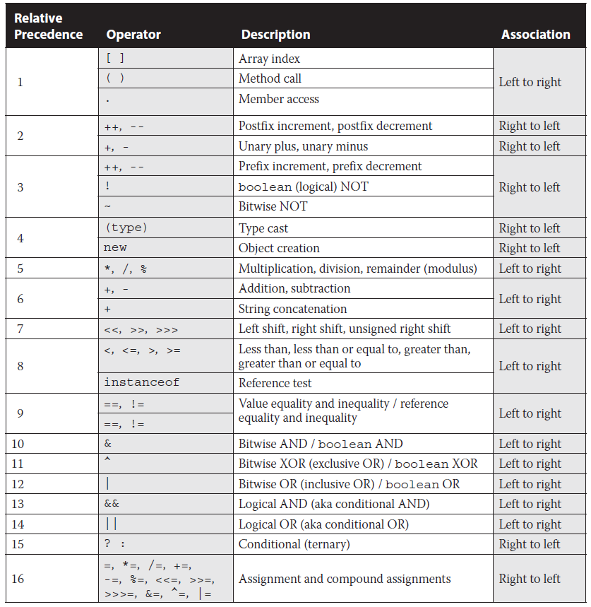

						          OPERATORS

						
# Comprendre les opérateurs Java: (understand Java Operators)  
L'opérateur est un symbole spécial qui peut être appliqué à un ensemble de variables, de valeurs ou 
de littéraux - appelés opérandes - et qui renvoie un résultat. 
### Expressions: (Expressions)    
Une expression est une construction composée de variables, d'opérateurs et d'appels de méthode, qui sont construits selon la syntaxe du langage, qui s'évalue à une valeur unique. Vous avez déjà vu des exemples d'expressions, voila une liste d'**expressions**  

	int cadence = 0; // Expression
	anArray[0] = 100; // Expression
	int result = 1 + 2; // result is now 3 Expression
	if (value1 == value2) // value1 == value2 est un Expression
	1 * 2 * 3 // Expression
### Type d'opérateurs: (Type d'opérateurs)   
En général, trois types d'opérateurs sont disponibles en java:  
* Unary: besoin d'un seul opérande (-8)    
* Binary: besoin 2 opérandes (7 + 9)    
* Ternary: besoind 3 opérandes (total > MAX ? total + 1 : total * 2)   

Ces types d'opérateurs peuvent être appliqués à un, deux ou trois opérandes, respectivement  
### Priorité de l'opérateur: (Operator Precedence)  
Lors de la lecture d'un livre ou d'un journal, certaines langues écrites sont évaluées de gauche à 
droite, tandis que d'autres sont évaluées de droite à gauche. En mathématiques, certains opérateurs 
peuvent remplacer d'autres opérateurs et être évalués en premier. déterminer quels opérateurs sont 
évalués dans quel ordre est appelé priorité des opérateurs. De cette manière, Java suit de plus 
près les règles des mathématiques. Evaluons cette expression: 

		int height = 7;
		int length = 3;
		var perimeter = 2 * height + 2 * length;
		System.out.println(perimeter);
L'operateur de multiplication (*) a une priorité plus élevée que l'opérateur d'addition (+), donc 
on va multiplier height et length par 2 avant de faire l'addition, l'affectation (=) a une priorité 
la moin élevée. donc ce code affiche **20**    

# Application d'opérateurs unaires: (Applying Unary Operators)    
Par définition, un opérateur unaire est celui qui nécessite exactement un opérande.  
### Opérateurs de complément logique et de négation: (Logical Complement and Negation Operators)    
Puisque nous allons travailler avec beaucoup d'opérateurs numériques dans le chapitre, éliminons d'abord le booléen. L'opérateur de complément logique (!) Inverse la valeur d'une expression booléenne.  

		boolean isAnimalAsleep = false;
		System.out.println(isAnimalAsleep); //false
		System.out.println(!isAnimalAsleep); //true
De même, l'opérateur de négation (-) inverse le signe d'une expression numérique  

		double zooTemperature = 1.21;
		System.out.println(zooTemperature); // 1.21
		System.out.println(-zooTemperature); // -1.21
### Opérateurs d'incrémentation et de décrémentation: (Increment and Decrement Operators)  
Les opérateurs d'incrémentation et de décrémentation, ++ et --, respectivement, peuvent être appliqués à une variable numérique et ont un ordre de priorité élevé, par rapport aux opérateurs binaires.  

Les opérateurs d'incrémentation et de décrémentation nécessitent une attention particulière car l'ordre dans lequel ils sont attachés à leur variable associée peut faire une différence dans la façon dont une expression est traitée  

si l'opérateur est placé avant l'opérande, appelé opérateur de pré-incrémentation et opérateur de pré-décrémentation, l'opérateur est appliqué en premier et la valeur retrunée est la nouvelle valeur de l'expression. Sinon, si l'oprateur est placé après l'opérande, appelé ème opérateur de post-incrémentation et post-décrémentation, alors la valeur d'origine de l'expression est retournée, avec operatof appliqué après le retour de la valeur

		int parkAttendance = 0;
		System.out.println(parkAttendance); //0
		System.out.println(++parkAttendance); //1
		System.out.println(parkAttendance); //1
		System.out.println(parkAttendance--); //1
		System.out.println(parkAttendance); //0
Une pratique courante dans un examen de certification, bien que moins courante dans le monde réel, consiste à appliquer plusieurs opérateurs d'incrémentation ou de décrémentation à une seule variable sur la même ligne.  

		int lion = 3;
		int tiger = ++lion * 5 / lion--;
		System.out.println("Lion is " + lion); // 3
		System.out.println("Tiger is " + tiger); // 5
premierement on incremente lion et returne l'expression int tiger = 4 * 5 / lion--;      
ensuite on decremente lion mais l'expression garde la valeur 4 int tiger  4 * 5 / 4;    
finellement on multiple 4 * 5 alors int tiger = 20 / 4; parce que l'association est de gauche à droite.      
# Travailler avec l'arithmétique binaire: (Working with Binary Arithmetic)  
Ensuite, nous passons aux opérateurs qui prennent deux arguments, appelés opérateurs binaires.  
 
Les opérateurs arithmétqiues binaires sont: +, -, *, /, %
### Opérateurs arithmétiques: (Arithmetic Operators)

	int price = 2 * 5 + 3 * 4 - 8;
Tout d'abord, vous évaluez 2 * 5 et 3 * 4, ce qui réduit l'expression à ceci:  
int price = 10 + 12 - 8; le résultat est donc 14.  
### Opérateurs de division et de module: (Division and Modulus Operators)

		System.out.println( 9 / 3); // 3 la division
		System.out.println( 9 % 3); // 0 modulus le reste.
### Promotion numérique: (Numeric Promotion)
Règles de promotion numériques:
* Si deux valeurs ont des types de données différents, Java promouvra automatiquement l'une des valeurs vers le type de donnée le plus grand.    
* Si deux valeurs ont des types de données différents, Java promouvra automatiquement l'une des valeurs vers la lager des deux types de données.  
* Les types de données plus petits, à savoir les bytes, les shorts et les char, sont tous promus en int à chaque fois qu'ils sont utilisés avec des opérateurs arithmétiques binaires Java.  
* Une fois que toutes les promotions ont eu lieu et que les opérandes ont le même type de données, la valeur résultante aura le même type de date que celle qui a promu les opérandes.

# Affectation des valeurs: (Assigning Values)
Les opérateurs d'affectation des formulaires d'erreur de compilation sont souvent négligés lors de l'examen, en partie à cause de la subtilité de ces erreurs.  

	int herd = 1; //  = est l'operateur d'attribution
### Casting Values:
La Cast est une opération unaire dans laquelle un type de données est explicitement interprété comme un autre type de données.  
La conversion (Casting) est effectuée en plaçant le type de données, entre parenthèses, à gauche de la valeur que vous souhaitez convertir, Voici quelques exemples de casting :

		int fur = (int) 5;
		int hair = (short) 2;
		String type = (String) "Bird";
Casting est un opérateur unitaire dons on dois mettre des parenthèse si on veut l'appliquer à une expression:

		short tail = (short) (4 + 5);
On peut mettre plusieurs cast sur une expression:    

		int note = 2;
		short a = (byte)(double)(note *= 3);	// COMPILE
On met les parenthèse à gauche :

		long feathers = 10(long); // DOES NOT COMPILE
Les exemples suivant ne compilent pas parce que on essaye d'attribuer un type de taille grande.

	int fish  = 1.0;
	short bird = 19212222;
	int mam = 9f; 
### Application de Casting: (Applying Casting)  
Nous pouvons corriger l'ensemble précédent d'exemples en convertissant les résultats en un type de données plus petit.

	int fish  = (int)1.0;
	short bird = (short)19212222;
	int mam = (int)9f; 
Revenons à un exemple similaire de la section "Promotion numérique" plus haut dans le chapitre

		short mouse = 10;
		short hamster = 3;
		short capybara = mouse * hamster; // DOES NOT COMPILE
		short capybara = (short) mouse * hamster; // DOES NOT COMPILE
Pour que cette exemple compile on doit faire ça:  

	short capybara = (short) (mouse * hamster); // COMPILE
### Opérateurs d'affectation composés: (Compound Assignment Operators) 
Les opérateurs d'affection composés sont: +=, -=, *-, /=     

		int camel = 2 , giraffe = 3;
		camel = camel * giraffe; // Simple Assignment Operator
		camel *= giraffe; // Compound Assignment Operator
Les opérateurs composés ne sont pas seulement utiles pour la sténographie, ils peuvent également nous **éviter** d'avoir à transtyper explicitement une valeur. Par exemple, considérons l'exemple suivant. Pouvez-vous comprendre pourquoi la dernière ligne ne compile pas ?  

		long goat = 10;
		int sheep = 5;
		sheep =  sheep * goat; // DOES NOT COMPILE  
De la section précédente, vous devriez être en mesure de repérer le problème dans la dernière ligne. Nous essayons d'attribuer une valeur longue à une variable int. Cette dernière ligne peut être corrigée avec un transtypage explicite en (int), mais il existe un meilleur moyen d'utiliser l'opérateur d'affectation composé.    

		long goat = 10;
		int sheep = 5;
		sheep *= goat; // COMPILE   
L'opérateur composé convertira d'abord sheep (mouton) en un long, appliquera la multiplication de deux valeurs longues, puis convertira le résultat en un int. Contrairement à l'exemple précédent, dans lequel le compilateur a signalé une erreur, dans cet exemple, nous voyons que le **compilateur convertira automatiquement** la valeur résultante dans le type de données de la valeur sur le côté gauche de l'opérateur composé.     
### Valeur de retour de l'opérateur d'affectation:(Assignment Operator Return Value)  
Une dernière chose à savoir sur les opérateurs d'affectation est que le résultat d'une affectation est une expression en soi, égale à la valeur de l'affectation, par exemple, l'extrait de code suivant est parfaitement valide:

		long wolf = 5;
		long coyote = (wolf=3);
		System.out.println(wolf); // 3
		System.out.println(coyote);// 3
La clé ici est que (wolf = 3) fait deux choses. Premièrement, il définit la valeur de la variable wolf sur 3. Deuxièmement, il renvoie une valeur de l'affectation, qui est également 3.
# Comparaison des valeurs: (Comparing Values)
Le dernier ensemble d'opérateurs binaires tourne autour de la comparaison des valeurs.
### Opérateurs d'égalité: (Equality Operators)
La détermination de l'égalité en Java peut être un effort non triviale car il existe une différence sémantique entre «deux objets qui wsont les mêmes» et «deux objets sont équivalents».  
Les opérateurs d'égalités sont: **== et !=**  

* Comparer deux numeriques: 

		int x = 5;
		int y = 4;
		System.out.println(x == y); // false
		System.out.println(x != y); // true
* Comparer deux boolean:

		boolean b = true;
		boolean a = false;
		System.out.println(a == b); //false
Pour les types primitifs, la comparaison est appliquée sur l'equalité des valeurs.

* Comparaison entre objets, en incluant les String et null: 

		File monday = new File("f1.txt");
		File tuesday = new File(f1.txt");
		File wednesday = tuesday;
		System.out.println(monday == tuesday); // false
		System.out.println(tuesday == wednesday); //true
Pour les objet l'opérateur d'egalité est appliqué sur les references, donc on compare si les references pointent sur le meme objet.

		System.out.println(null == null); //true
### Opérateurs relationnels: (Relational Operators)
Nous passons maintenant aux opérateurs relationnels, qui comparent deux expressions et renvoient une valeur booléenne.  
La liste des opérateur est: **<, <=, >, >=, a instanceof b**  

		int gibbonNumFeet = 2 , wolfNumFeet = 4, ostrichNumFeet = 2;
		System.out.println(gibbonNumFeet < wolfNumFeet); // true
		System.out.println(gibbonNumFeet <= wolfNumFeet); // true
		System.out.println(gibbonNumFeet >= ostrichNumFeet); // true
		System.out.println(gibbonNumFeet > ostrichNumFeet);// false
### instanceof Opérateur: (instanceof Operator)
L'opérateur relationnel final dont vous avez besoin pour l'examen est l'opérateur instanceof. Il est utile pour déterminer si un objet arbitraire est membre d'une classe ou d'une interface particulière au moment de l'exécution  

L'opérateur instanceof fonctionne sur le principe de la relation **Is-A**. Le concept de relation is-a est basé sur l' héritage de classe ou l'implémentation d'interface  

		Integer zooTime = Integer.valueOf(9);
		Number num = zooTime;
		Object obj = zooTime;   
Dans cet exemple, il n'y a qu'un seul objet créé en mémoire, mais trois références de différence à celui-ci car Integer hérite à la fois de Number et Object. Cela signifie que vous pouvez appeler instanceof sur n'importe laquelle de ces références avec trois types de données différents et qu'elle renvoie true pour chacune d'elles.  

	public void openZoo(Number time){
		if(time instanceof Integer) {
			System.out.println((Integer) time + " O'clock");
		}else
			System.out.println(time);
	}
ce code affiche: 

	9 O'clock
Notez que nous convertissons la valeur Integer dans cet exemple. Il est courant d'utiliser le casting et l'instance ensemble lorsque vous travaillez avec des objets qui peuvent être de différents types, car cela peut vous donner accès aux champs disponibles uniquement dans les classes plus spécifiques. Il est considéré comme une bonne pratique de codage d'utiliser l'opérateur instanceof avant de convertir d'un objet un objet en un type plus étroit.
### Invalid instance:
Un domaine dans lequel l'examen pourrait essayer de vous tromper est l'utilisation d'instance de type incompatible. Par exemple, Number ne peut pas contenir de valeur String, donc ce qui suit provoquerait une erreur de compilation.

	public void openZoo(Number time){
		if(time instanceof String) { // DOES NOT COMPILE
		.....
### null and instanceof operator:
Que se passe-t-il si vous appelez instanceof sur une variable nulle? pour l'examen, vous devez savoir que l'appel de instanceof sur le littéral nul ou une référence nulle renvoie toujours false

	System.out.println(null instanceof String); // false
Cet exemple ne compile pas:

	System.out.println(null instanceof null); // DOES NOT COMPILE
# Opérateurs logiques:(Logical Operators)      
Les opérateurs logiques sont: **&, |, ^**   

* & : AND logique n'est vrai que si les deux valeurs sont true   
* | : Inclusive OR est true si au moins une des valeurs est true    
* ^ : Exclusive OR est true si une valeur est true et l'autre est false     

		boolean eyesClosed = true;
		boolean breathingSlowly = true;
		System.out.println(eyesClosed & breathingSlowly); // true
		System.out.println(eyesClosed | breathingSlowly); // true
		System.out.println(eyesClosed ^ breathingSlowly); // false
# Opérateurs de court-circuit: (Short-Circuit Operators)
Ensuite, nous présentons les opérateurs conditionnels: **&&, ||**  

Les opérateurs de court-circuit sont presque identiques aux opérateurs logiques, & et |, sauf que le côté droit de l'expression peut ne jamais être évalué si le résultat final peut être déterminé par le côté gauche de l'expression. Par exemple:

		int hour = 10;
		boolean zooOpen = true || (hour < 4);
		System.out.println(zooOpen);  // true
### éviter une exception NullPointerException: (avoiding a NullPointerException)
Un exemple plus courant d'utilisation d'opérateurs de court-circuit est la vérification des objets nuls avant d'effectuer une opération, Dans l'exemple suivant, si duck est nul, alors le programme lancera un NullPointerExceptio à l'exécution (runtime): 
	
	if(duck != null & duck.getAge()< 5){ // pourrait lever un NullPointerException
		// Do someting
	}
Le problème est que l'opérateur logique AND (&) évalue les deux côtés de l'expression, Une solution facile à lire consiste à utiliser l'opérateur AND court-circuit (&&)

	if(duck != null && duck.getAge()< 5){
		// Do someting
	}
### Vérification les effet de bord: (Checking for Unperformed Side effects)  
Méfiez-vous du comportement de court-circuit à l'examen, car les questions sont connues pour modifier une variable du côté droit de l'expression qui peut ne jamais être plus accessible.

		int rabbit = 6;
		boolean bunny = (rabbit >= 6 ) || (++rabbit <= 7);
		System.out.println(rabbit); // 6
Comme rabbit >= 6 est true, l'opérateur d'incrementation n'a pas eu lieu donc le valuer de rabbit est 6
# Prise de décision avec l'opérateur ternaire: (Making Decision with the Ternary Operator)
L'opérateur final que vous devez connaître pour l'examen est l'opérateur conditionnel **? :** autrement connu sous le nom d'opérateur ternaire *ternary operator*  
L'opérateur ternaire a la forme suivante: *booleanExpression ? expression1 : expression2*  

	int stripes = 3;
	System.out.println((stripes > 5 ) ? 21 : "Zebra"); // Zebra
