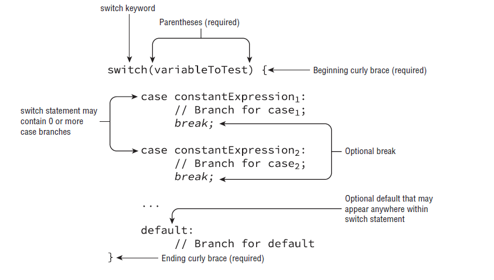
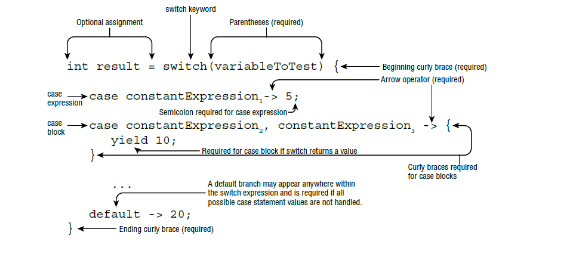

									MAKING DECISIONS
									
# Création de décision-faire des instructions: (Creating Decision-Making Statements)
Les opérateurs Java vous permettent de créer de nombreuses expressions complexes, mais ils sont limités dans la manière dont ils peuvent contrôler le flux du programme. 

### Instructions et blocs:(Statements and Blocks)
Comme vous vous en souvenez du chapitre 2, une instruction Java est une unité d'exécution complète en Java, terminée par un point-virgule(semicolon) **;**  
Ces instructions peuvent être appliquées à des expressions uniques ainsi qu'à un bloc de code Java. Comme décrit au chapitre 2, un bloc de code en Java est un groupe de zéro instruction ou plus entre accolades équilibrées **{}**  

	patrons++; // Single statement
	
	{
		partron++; // Statement inside a block
	} 
Une déclaration ou un bloc fonctionnent souvent comme la cible d'une déclaration de prise de décision. Par exemple, nous pouvons ajouter la déclaration de L'instruction if à ces deux exemples

	if(ticketsTaken > 1)
		patron++; // Single statement
		
	if(ticketsTaken > 1){
		patron++; // Statement inside a block
	}
Ces deux  codes sont equivalants.  
### L'instruction if: (The if statement)
Souvent, nous voulons exécuter un bloc de code uniquement dans certaines circonstances, l'instruction if accomplit cela en permettant à votre application d'exécuter un bloc particulier  

	if(booleanExpression) {
		//Branch if true
	}		
Par exemple, imaginons que nous ayons une fonction qui utilisait l'heure du jour, une valeur entière de 0 à 23, pour afficher un message à l'utilisateur:

	if(hourOfDay < 11)
		System.out.println("Good Morning");
si l'heure de la journée est inférieure à 11, le message sera affiché
Si l'heure du jour est inférieure à 11, alors le message s'affichera. Supposons maintenant que nous voulions également incrémenter une valeur, morningGreetingCount, à chaque fois que le message d'accueil est imprimé. Nous pourrions écrire l'instruction if deux fois, mais heureusement, Java nous offre une approche plus naturelle en utilisant un bloc:    

	if(hourOfDay < 11){
		System.out.println("Good Morning");
		morningGreetingCount++;
	}
##### L'instruction else: (The else statement)
Développons un peu notre exemple, que faire si nous voulons afficher un message différent s'il est 11 h ou plus tard. Pourrions-nous le faire en utilisant uniquement les outils dont nous disposons? bien sûr on peut, on utilisant l'instruction **else**  

	if(booleanExpression){
		// Branch if true
	} else{
		// Branch if false
	}
Alors notre exemple devient:

	if(hourOfDay < 11){
		System.out.println("Good Morning");
	} else{
		System.out.println("Good Afternoon");
	}
Maintenant, notre code bifurque véritablement entre l'une des deux options possibles, l'évaluation booléenne ne se produisant qu'une seule fois. L'opérateur else prend une instruction ou un bloc d'instructions, de la même manière que l'instruction if. De même, nous pouvons ajouter une instruction if supplémentaire à un bloc else pour arriver à un exemple plus raffiné  
	
	if(hourOfDay < 11){
		System.out.println("Good Morning");
	} else if(hourOfDay < 15){
		System.out.println("Good Afternoon");
	}esle {
		System.out.println("Good Evening");
	}
### Pattern Matching for instanceof: JAVA 16
Java 16 a officiellement introduit la correspondance de modèle (Pattern Matching) avec les instructions if et l'opérateur instanceof. La correspondance de modèles est une technique de contrôle du flux de programme qui n'exécute qu'une section de code répondant à certains critères. Il est utilisé en conjonction avec les instructions if pour un meilleur contrôle du programme.     

Note: Si la correspondance de modèles est nouvelle pour vous, veillez à ne pas la confondre avec la classe Java Pattern ou les expressions régulières (regex). Bien que la correspondance de modèles puisse inclure l'utilisation d'expressions régulières pour le filtrage, ce sont des concepts sans rapport.  

Le pattern matching est un nouvel outil à votre disposition pour réduire le passe-partout dans votre code. Le code standard est un code qui a tendance à être dupliqué dans une section de code encore et encore de la même manière. Un grand nombre des dernières améliorations apportées au langage Java se concentrent sur la réduction du code passe-partout (boilerplate code).   

Pour comprendre pourquoi cet outil a été ajouté, considérez le code suivant qui prend une instance Number et la compare à la valeur 5. Si vous n'avez pas vu Number ou Integer, vous devez juste savoir que Integer hérite de Number pour le moment. Vous les verrez beaucoup dans ce livre !   

	void compareIntegers(Number number) {
		if (number instanceof Integer) {
			Integer data = (Integer) number;
			System.out.print(data.compareTo(5));
		}
	}
Le cast est nécessaire puisque la méthode compareTo() est définie sur Integer, mais pas sur Number.    

Le code qui vérifie d'abord si une variable est d'un type particulier, puis la convertit immédiatement en ce type est extrêmement courant dans le monde Java. C'est tellement courant que les auteurs de Java ont décidé d'implémenter une syntaxe plus courte :   

	void compareIntegers(Number number) {
		if (number instanceof Integer data) {
			System.out.print(data.compareTo(5));
		}
	}
Les données variables dans cet exemple sont appelées variables de modèle. Notez que ce code évite également toute ClassCastException potentielle car l'opération de cast n'est exécutée que si l'opérateur instanceof implicite renvoie true.   
##### Pattern Variables and Expressions: 
La correspondance de modèle inclut des expressions qui peuvent être utilisées pour filtrer les données, comme dans l'exemple suivant:   

	void printIntegersGreaterThan5(Number number) {
		if (number instanceof Integer data && data.compareTo(5) > 0)
			System.out.print(data);
	}
Nous pouvons appliquer un certain nombre de filtres, ou modèles, afin que l'instruction if ne soit exécutée que dans des circonstances spécifiques. Notez que nous utilisons la variable de modèle dans une expression dans la même ligne dans laquelle elle est déclarée.   
##### Subtypes:   
Le type de la variable de modèle doit être un sous-type de la variable sur le côté gauche de l'expression. Il ne peut pas non plus être du même type. Cependant, cette règle n'existe pas pour les expressions d'opérateur instanceof traditionnelles. Considérez les deux utilisations suivantes de l'opérateur instanceof:   

		Integer value = 123;
		if(value instanceof Integer) {}
		if(value instanceof Integer data) {} // DOES NOT COMPILE
Pendant la compilation de la deuxième ligne, la dernière ligne ne se compile pas car la correspondance de modèle nécessite que le type de variable de modèle Integer soit un sous-type strict de Integer. 
### L'instruction switch: (The switch statement)
Que faire si nous avons beaucoup de branches possibles pour une valeur unique, par exemple, nous pourrions vouloir imprimer un message différent en fonction du jour de la semaine. Nous pourrions certainement accomplir cela avec une combinaison de sept si ou autre, mais cela tend à créer du code long et difficile à lire.  
Heureusement, Java, avec de nombreux autres langages, offre une approche plus propre. Une instruction switch  

	
###### Syntaxe appropriée du Switch:(Proper Switch syntax) 
Étant donné que les instructions de Switch peuvent être plus longues que la plupart des déclarations de prise de décision, l'examen peut présenter une syntaxe de switch non valide pour voir si vous faites attention.

	int month = 5;
	switch month { // DOES NOT COMPILE
			case 1: System.out.println("January");
	}
L'instruction switch ne compile pas car il  manquante les parenthèses entre la variable switch **(month)**  

	switch (month) // DOES NOT COMPILE
			case 1: System.out.println("January");
L'instruction switch ne compile pas car il  manquante les accolade **{}**

	switch (month) { 
			case 1: 2: System.out.println("January");// DOES NOT COMPILE
	}
L'instruction switch ne compile pas car le mot clé case est manquant avant le 2, comme le code suivant:   
	*case 1: case 2: System.out.println("January");// COMPILE*           

	switch (month) { 
			case 1 || 2: System.out.println("January");// DOES NOT COMPILE
	}
Enfin, la dernière instruction switch ne compile pas car **1 || 2** utilise les opérateurs booléens de court-circuit, qui ne peuvent pas être appliqués aux valeurs numériques. Un seul opérateur au niveau du bit(bitwise) **|** aurait tout le code à compiler (pas l'opératuer ou logique aussi(|), donc l'interpretation de 1 | 2 donne la valuer 3 et pas 1 ou 2:

	switch (month) { 
		case 1 | 2: System.out.println("January");// COMPILE Operator BITWISE, not OR Logique
	}
###### Changer de type de données:(Switch Data Types)
Avant Java 5.0, la variable de l'instruction switch ne pouvait être que **int ou les valeurs pouvant être promues en int telsque (byte, short, char)**. la variable de l'instruction switch accepte les wrapper classes (Integer, Byte,..).  
Lorsque l'énumération, notée enum, était ajoutée dans Java 5.0, le support était ajouté à switch.  
Dans Java 7, les instructions switch ont été davantage mises à jour pour permettre la correspondance sur les valeurs String.  
Dans Java 10, si le type auquel une variable est résolue est l'un des types pris en charge par une instruction switch, alors var peut également être utilisé dans une instruction switch.    
Mais attendez, il y a plus. Java 12 a été lancé avec une version préliminaire d'une nouvelle fonctionnalité puissante appelée Switch Expressions, une construction qui combine des instructions switch avec des expressions lambda et permet aux instructions switch de renvoyer une valeur. Vous n'aurez pas besoin de connaître Switch Expressions pour l'examen, mais c'est juste un signe que les rédacteurs de Java sont loin d'avoir fini d'apporter des améliorations aux instructions switch.     

Voici une liste de tous les types de données pris en charge par l'instruction switch:    
• int et Integer     
• byte et Byte    
• short et Short   
• char et Character    
• String   
• enum     
• var (Si le type se résout en l'un des types précédents)   

###### Flux de contrôle de Switch: (Switch Control Flow)     
* Exemple 1:  

		int dayOfWeek = 5;
		switch(dayOfWeek) {
			default:
				System.out.println("Weekday");
				break;
			case 0:
				System.out.println("Sunday");
				break;
			case 6:
				System.out.println("Saturday");
				break;
		} 
Cet exemple affiche **Weekday**
Le bloc **case ou default** n'ont pas **un ordre particulier** dans l'instruction switch.
* Exemple 2:   

		var dayOfWeek = 5;
		switch(dayOfWeek) {
			case 0:
				System.out.println("Sunday");
			default:
				System.out.println("Weekday");
			case 6:
				System.out.println("Saturday");
				break;
		}
Cet exemple affiche: 

	Weekday 
	Saturday
Le remarque ici que l'instruction **break** ne figure pas dans le bloc default donc on passe automatiquement au bloc suivant.       
* Exemple 3:      

		int num = 20;
		final int num2 = 20; 
		switch (num) {
			default: 
				System.out.println("default");
			case num2: 
				System.out.println(4); 
		}
ce code afficher: **4** 
###### Valeurs de case acceptables: (Acceptable case Values) 
Dans ce paragraphe on va parler sur les valeurs accéptées par l'instruction case.

		final int getCookies() {return 4;}
	
		final int bananas = 1;
		int apples = 2;
		int numberofAnimals = 3;
		final int cookies = getCookies();
		final int strawberry;
		strawberry = 5;
		switch(numberofAnimals) {
			case bananas:
			case apples: // DOES NOT COMPILES
			case getCookies(): // DOES NOT COMPILES
			case cookies: // DOES NOT COMPILES
			case 3*5:
			case strawberry: // DOES NOT COMPILES
		}

 - bananas est marqué final, sa valeur est connue au moment de la compilation.  
 - apples non marqué final, même si sa valeur est connue, elle n'est donc pas autorisée.  
 - getCookies() et cookies, ne compilent pas par ce que leurs valeurs ne sont pas évalués à la complition, elles sont évaluées pendent l'exécution (runtime).  
 - 3*5 est une expression, et comme expression sont autorisés comme valeur de case.    
 - la variable strawberry n'est pas évaluée une constante pendant la complilation pourtant étiquitée par final.    
###### Un exemple plus complexe: (A More Complex Example) 

		private int getSortOrder(String firsName, final String lastName) {
		
		String middleName = "Patricia";
		final String suffix = "JR";
		int id = 0;
		switch(firsName) {
			case "Test":
				return 52;
			case middleName: // DOES NOT COMPILE
				id = 5;
				break;
			case suffix:
				id = 0;
				break;
			case lastName: // DOES NOT COMPILE
				id = 8;
				break;
			case 5: // DOES NOT COMPILE
				id = 7;
				break;
			case 'J': // DOES NOT COMPILE
				id = 10;
				break;
			case java.time.DayOfWeek.SUNDAY: // DOES NOT COMPILE
				id = 15;
				break;
		}
		return id;
	}  
- Le premier instruction case "Test" compile parce que c'est litéral.  
- middleName ne compile pas parc que n'est pas marqué final.  
- suffix compile  est une constante final.   
- lastName, bien qu'il soit final, ce n'est pas une variable constante car il est passé à la fonction  
- 5 ne complie parceq que c'est int et non pas String  
- 'J' c'est un char ne matche pas avec un String    
- java.time.DayOfWeek.SUNDAY enum ne match pas avec String  

###### Promotion numérique et casting: (Numeric Promotion and Casting)  
Enfin, l'instruction Switch prend en charge la promotion numérique qui ne nécessite pas de conversion explicite. Par exemple:

		short size = 4;
		final int small = 15;
		final int big = 1_000_000;
		switch(size) {
			case small:
			case 1+2:
			case big: // DOES NOT COMPILE
		}
  
- small et l'expresion 1+2 Le compilateur peut facilement cast un small ou 1+2  à int au moment de la compilation car la valeur 15  et la valuer 3 est suffisamment petite pour tenir dans un short.  
- big est trop grand pour contenir un short.  

### The switch Expression (JAVA 14): 
Notre deuxième implémentation de printDayOfWeek() a été améliorée mais reste assez longue. Notez qu'il y avait beaucoup de code passe-partout, ainsi que de nombreuses instructions de rupture. Peut-on faire mieux ? Oui, grâce aux nouvelles expressions switch qui ont été officiellement ajoutées à Java 14.   
Une expression switch est une forme beaucoup plus compacte d'une instruction switch, capable de renvoyer une valeur. Jetez un oeil à la nouvelle syntaxe de la figure 3.4.   

Parce qu'une expression switch est une forme compacte, il se passe beaucoup de choses dans la figure 3.4 ! Pour commencer, nous pouvons maintenant affecter le résultat d'une expression switch à un résultat variable. Pour que cela fonctionne, toutes les branches de cas et par défaut doivent renvoyer un type de données compatible avec l'affectation. L'expression switch prend en charge deux types de branches : une expression et un bloc. Chacun a des règles syntaxiques différentes sur la façon dont il doit être crée. Plus sur ces sujets sous peu.

Comme une instruction switch traditionnelle, une expression switch prend en charge zéro ou plusieurs branches de cas et une branche par défaut facultative. Les deux prennent également en charge la nouvelle fonctionnalité qui permet aux valeurs de cas d'être combinées avec une seule instruction de cas à l'aide de virgules. Contrairement à une instruction switch traditionnelle, cependant, les expressions switch ont des règles spéciales concernant le moment où la branche par défaut est requise.      

		public static void printDayOfWeek(int day) {
			var result = switch (day) {
			case 0 -> "Sunday";
			case 1 -> "Monday";
			case 2 -> "Tuesday";
			case 3 -> "Wednesday";
			case 4 -> "Thursday";
			case 5 -> "Friday";
			case 6 -> "Saturday";
			default -> "Invalid value";
			};
			System.out.print(result);
		}
Comparez ce code avec l'instruction switch que nous avons écrite précédemment. Les deux accomplissent la même tâche, mais une grande partie du code passe-partout a été supprimée, laissant le comportement qui nous intéresse le plus.    
Notez qu'un **point-virgule est requis après chaque expression Switch**. Par exemple, le code suivant ne compile pas. Combien de points-virgules manque-t-il ?    
### Exhaustiveness (dans le cas switch Expression return un resultat):
Contrairement aux instructions switch, les cas des expressions switch qui retourne un résultat **doivent être exhaustifs** (courvre tout les cas possible), ce qui signifie que pour toutes les valeurs possibles, il doit y avoir une étiquette switch correspondante. Ainsi, les expressions switch nécessitent normalement une clause default. Cependant, pour **les expressions switch enum** qui couvrent toutes les constantes connues, **le compilateur insère une clause default implicite**.    

	enum Day {
		MONDAY, FRIDAY, SUNDAY, TUESDAY, THURSDAY, SATURDAY,WEDNESDAY
	}

	public static boolean isWeekEnd(Day dayEnum) { // COMPILE
        return switch (dayEnum) {
            case MONDAY, FRIDAY, SUNDAY, TUESDAY, THURSDAY -> false;
            case SATURDAY,WEDNESDAY -> true;
        };
    }
Ce code compile, parce que toutes les constantes sont couverts.    

	public static boolean isWeekEnd(Day dayEnum) { // NO COMPILE
        return switch (dayEnum) {
			case SATURDAY,WEDNESDAY -> true;
		};
	}
Ce code ne compile pas parce qu'il courvre pas les cas MONDAY, FRIDAY, SUNDAY, TUESDAY, THURSDAY.   
On a comme message d'erreure : *'switch' expression does not cover all possible input values*, pour résoudre le problème de comilation on a deux solutions, soit ajouter le défault ou courvrire tout les cas possible.    

	public static void isWeekEnd(Day dayEnum) { // COMPILE
		switch (dayEnum) {
			case SATURDAY,WEDNESDAY -> System.out.println(true);
		};
	}
Par contre ce code compile pourtant il ne couvre pas tout les cas, parce que l'instruction switch ne renvoie pas une valeur.     

	var result = switch(bear) {
		case 30 -> "Grizzly"
		default -> "Panda"
	}
La réponse est trois. Chaque cas ou expression par défaut nécessite un point-virgule ainsi que l'affectation elle-même. Ce qui suit corrige le code.    

	var result = switch (bear) {
		case 30 -> "Grizzly";
		default -> "Panda";
	};  
Comme le montre la figure 3.4, les instructions case peuvent prendre plusieurs valeurs, **séparées par des virgules**. Réécrivons notre méthode printSeason() avec une expression switch :   

	public void printSeason(int month) {
		switch (month) {
		case 1, 2, 3 -> System.out.print("Winter");
		case 4, 5, 6 -> System.out.print("Spring");
		case 7, 8, 9 -> System.out.print("Summer");
		case 10, 11, 12 -> System.out.print("Fall");
		}
	}
Appeler printSeason(2) affiche la valeur unique Winter. Cette fois, nous n'avons pas à nous soucier des instructions break, puisqu'une seule branche est exécutée.   

Toutes les règles précédentes concernant les types de données de commutation et les valeurs de cas s'appliquent toujours, bien que nous ayons quelques nouvelles règles. Ne vous inquiètez pas si ces règles sont nouvelles pour vous ou si vous n'avez jamais vu le mot-clé rendement auparavant; nous en discuterons dans les sections suivantes.      

1. Toutes les branches d'une expression Switch qui **ne lèvent pas d'exception** doivent renvoyer un **type de données cohérent** (si l'expression Switch **renvoie une valeur**).    
2. Si l'expression switch renvoie une valeur, alors chaque branche qui n'est pas une expression doit produire une valeur.  
3. Une branche par défaut est requise à moins que tous les cas soient couverts ou qu'aucune valeur ne soit renvoyée. Nous couvrons briévement la dernière règle, mais notez que notre exemple printSeason() ne contient pas de branche par défaut. étant donnée que l'expression switch ne renvoie pas de valeur et ne l'affecte pas à une variable, elle est entièrement facultative.  

##### Returning Consistent Data Types (Retourner des types de données cohérents):   
La première régle d'utilisation d'une expression switch est probablement la plus simple. Vous ne pouvez pas renvoyer des types de données incompatibles ou aléatoires. Par exemple, voyez-vous pourquoi trois des lignes du code suivant ne se compilent pas?   

	int measurement = 10;
	int size = switch (measurement) {
		case 5 -> 1;
		case 10 -> (short) 2;
		default -> 5;
		case 20 -> "3"; // DOES NOT COMPILE
		case 40 -> 4L; // DOES NOT COMPILE
		case 50 -> null; // DOES NOT COMPILE
	};
Notez que la deuxiéme expression de cas renvoie un short, mais qui peut être implicitement transtype en un int. De cette manière, les valeurs doivent être cohérentes avec la taille, mais elles ne doivent pas toutes être du même type de données. Les trois dernières expressions de cas ne compilent pas car chacune renvoie un type qui ne peut pas être affecté à la variable int.   
##### Applying a case Block (Application d'un bloc de cas)   
Une expression Switch prend en charge à la fois une expression et un bloc dans les branches case et default. Comme un bloc normal, un bloc case est un bloc entour d'accolades (**{ }**). Il inclut également une instruction **yield** si l'expression switch renvoie une valeur. Par exemple, ce qui suit utilise un mélange d'expressions de casse et de blocs:

	int fish = 5;
	int length = 12;
	var name = switch (fish) {
		case 1 -> "Goldfish";
		case 2 -> {
			yield "Trout";
		}
		case 3 -> {
			if (length > 10)
				yield "Blobfish";
			else
				yield "Green";
		}
		default -> "Swordfish";
	};
	System.out.println(name);	// Swordfish
Le mot clé **yield** équivaut à une instruction **return dans une expression switch** et est utilisée pour éviter toute ambiguaité quant à savoir si vous vouliez quitter le bloc ou la méthode autour de l'expression switch.   

En référence à notre deuxiéme régle pour les expressions switch, les instructions yield ne sont pas facultatives si l'instruction switch renvoie une valeur. Pouvez-vous voir pourquoi les lignes suivantes ne compilent pas ?    

	int fish = 5;
	int length = 12;
	var name = switch (fish) {
		case 1 -> "Goldfish";
		case 2 -> {} // DOES NOT COMPILE line 14
		case 3 -> {
			if (length > 10)
				yield "Blobfish";
		} // DOES NOT COMPILE line 17
		default -> "Swordfish";
	};
La ligne 14 ne compile pas car elle ne renvoie pas de valeur à l'aide de yield. La ligne 17 ne compile pas non plus. Alors que le code renvoie une valeur pour la longueur supérieure à 10, il ne renvoie pas de valeur si la longueur est inférieure ou égale à 10. Peu importe que la longueur soit définie sur 12 ; toutes les branches doivent produire une valeur dans le bloc case.    
##### Covering All Possible Values (Couvrir toutes les valeurs possibles):   
La dernière régle concernant les expressions switch est probablement celle sur laquelle l'examen est le plus susceptible d'essayer de vous tromper: une expression switch qui renvoie une valeur doit gérer toutes les valeurs d'entrée possibles. Et comme vous l'avez vu précédemment, lorsqu'il ne renvoie pas de valeur, il est facultatif.     

Essayons ceci. étant donnée le code suivant, quelle est la valeur de type si canis vaut 5?    

	String type = switch (canis) { // DOES NOT COMPILE
		case 1 -> "dog";
		case 2 -> "wolf";
		case 3 -> "coyote";
	};
Il n'y a pas de branche de cas pour couvrir 5 (ou 4, -1, 0, etc.), donc l'expression switch doit-elle renvoyer null, la chaine vide, undefined ou une autre valeur? Lors de l'ajout d'expressions switch au langage Java, les auteurs ont décidé que ce comportement ne serait pas pris en charge. Chaque expression de commutateur doit gèrer toutes les valeurs possibles de la variable de commutateur. En tant que développeur, il existe deux façons de résoudre ce problème:   
	• Ajouter une branche par défaut.   
	• Si l'expression switch prend une valeur d'énumération, ajoutez une branche de cas pour chaque valeur d'énumération possible   

En pratique, la première solution est celle qui est le plus souvent utilisée. La deuxième solution ne s'applique qu'aux expressions switch qui acceptent une énumération. Vous pouvez essayer d'écrire des instructions case pour toutes les valeurs int possibles, mais nous vous promettons que cela ne fonctionnera pas! Même les types plus petits comme byte ne sont pas autorisés par le compilateur, bien qu'il n'y ait que 256 valeurs possibles.    

Pour les énumérations, la deuxième solution fonctionne bien lorsque le nombre de valeurs d'énumération est relativement faible. Par exemple, considérez la définition et la méthode enum suivantes:   

	enum Season {
		WINTER, SPRING, SUMMER, FALL
	}

	String getWeather(Season value) {
		return switch (value) {
			case WINTER -> "Cold";
			case SPRING -> "Rainy";
			case SUMMER -> "Hot";
			case FALL -> "Warm";
		};
	}
Etant donnée que toutes les permutations possibles de Season sont couvertes, une branche par défaut n'est pas requise dans cette expression de commutateur. Vous pouvez cependant inclure une branche par défaut facultative, même si vous couvrez toutes les valeurs connues.   
# Pattern matching for switch expressions and statements - JEP 441 - JAVA 21: 
Le Pattern matching for switch (Correspondance de modèle pour le switch) a été présentée pour la première fois dans Java 17, ensuite améliorés dans Java 18, 19 et 20. La fonctionnalité est désormais finalisée et sera incluse dans le JDK 21.    
L'objectif de cette feature (fonctionnalité) est:    
• Etendre l'expressivité de switch expressions et statements en parmettant au patterns (modèles) d’apparaître dans les étiquettes de case.    
• Augmentez la sécurité des instructions switch en exigeant que le modèle des instructions switch couvrent toutes les valeurs d'entrée possibles.  
• Permettre à null-hostility de switch d'être relacher lorsque cela est souhaité.     
• Assurez-vous que toutes les switch expressions et switch instructions existantes, continuent d’être compilées sans modifications et s’exécutent avec une sémantique identique.   

##### Etendre l'expressivité de switch:
Cette motivation nous permet de contourner le problème que switch ne peut commuter que sur des valeurs de type byte, short, char, int, String et enum. Prenant cet exemple:  

Supposant on une interface Animal qui sere implémentée par 3 classes:  

	interface Animal { }
	
	class Dog implements Animal {
		public String bark() { return "bark..!"; }
	}
	
	class Cat implements Animal {
		public String meow() { return "meow..!"; }
	}
	
	class Bird implements Animal {
		public String chirp() { return "chirp..!"; }
	}
Et chaque classe implémente une méthode pour renvoyer le type de son de l'animal.   
Dans le classe main on appelle une méthode qui peut faire la distinction entre les animaux et affiche le son.  
Avant Java 21 la méthode sera implémenter de cette façon:  

	public static String getAnimalSound(Animal animal) {
        if(animal instanceof Dog dog) {
            return dog.bark();
        }else if(animal instanceof Cat cat) {
            return cat.meow();
        }else if (animal instanceof Bird bird) {
            return bird.chirp();
        }
        return "";
    }
En regardant ça on dit que c'est un un excellent cas d'utilisation pour les instructions switch car il existe plusieurs instructions if-else qui doivent être simplifiées. Mais vu les limites des types gérer par switch on ne peut pas l'utilise.   
Heureusement avec Java 21 ce problème est résolu avec Pattern matching:  

	public static String getAnimalSoundJava21(Animal animal) {
		return switch (animal) {
			case Dog dog-> dog.bark();
			case Cat cat -> cat.meow();
			case Bird bird -> bird.chirp();
			case null -> "A null animal";
			default -> throw new RuntimeException("There is a problem !");
		};
	}
##### Exhaustivité des switch expressions: 
Une expression switch nécessite que toutes les valeurs possibles de l’expression du sélecteur soient gérées dans le bloc switch ; en d'autres termes, il doit être exhaustif. Cela maintient la propriété selon laquelle une évaluation réussie d’une expression switch produit toujours une valeur.  
Considérez cet exempledu modèle expression de switch (erroné) :  

	// As of Java 21
	static int coverage(Object obj) {
		return switch (obj) {           // Error - not exhaustive
			case String s -> s.length();
		};
	}
Ce pattern switch expression n'est pas exhaustive car la couverture de type de selector dans le bloc switch n'inclut pas tout les sous-type.  
Consider this (still erroneous) example :   

	// As of Java 21
	static int coverage(Object obj) {
		return switch (obj) {           // Error - still not exhaustive
			case String s  -> s.length();
			case Integer i -> i;
		};
	}
Donc ce pattern switch expression n'est pas non plus exhaustive et provoque une erreur de compilation.   
La couverture de types d'une étiquette par défaut est de tous types, donc cet exemple est (enfin !) légal : 

	// As of Java 21
	static int coverage(Object obj) {
		return switch (obj) {
			case String s  -> s.length();
			case Integer i -> i;
			default -> 0;
		};
	}
##### null-hostility de switch: 
Avec les instructions switch et les expressions switch traditionnelles, renvoient un NullPointerException si l'expression du sélecteur est évaluée à null, donc le test de null doit être effectué en dehors du switch.   

	// Prior to Java 21
	static void testFooBarOld(String s) {
		if (s == null) {
			System.out.println("Oops!");
			return;
		}

		switch (s) {
			case "Foo", "Bar" -> System.out.println("Great");
			default           -> System.out.println("Ok");
		}
	}
Donc il serait résonable d'intégrer le test null dans le switch en autorisant une nouvelle étiquette de cas null, c'est pour cela Java 21 a ajouté cette fonctionnalité.   

	// As of Java 21
	static void testFooBarNew(String s) {
		switch (s) {
			case null         -> System.out.println("Oops");
			case "Foo", "Bar" -> System.out.println("Great");
			default           -> System.out.println("Ok");
		}
	}
# Écriture de boucles While: (Writing While Loops) 
Une pratique courante lors de l'écriture de logiciels est la nécessité de faire la même tâche un certain 
nombre de fois. Vous pouvez utiliser les structures de décision que nous avons présentées jusqu'à présent 
pour y parvenir, mais cela va être une assez longue chaîne de déclarations if ou else...  
Entrez des boucles! Une boucle est une structure de contrôle répétitive qui peut exécuter une instruction 
de code plusieurs fois de suite  
Dans l'exemple suivant, la boucle incrémente une variable de compteur qui fait augmenter la valeur de price
de 10 à chaque exécution de la boucle  

	int counter = 0;
	while (counter < 10) {
		double price = counter * 10;
		System.out.println(price);
		counter++;
	}

### La déclaration While :(The While Statement)  
La structure de contrôle respective la plus simple en Java est l'instruction while, il a une condition de 
terminaison, implémentée comme une expression booléenne, qui continuera tant que l'expression sera évaluée 
à vrai

	while(booleanExpression){
		// Body
	}
Les parentheses sont obligatoire et les curly braces obliqatoire si le block contient plusieus instructions.  
### La déclaration do/While: (The do/While Statement)
La seconde forme qu'une boucle while peut prendre est appelée boucle do / while. Contrairement à une boucle while, through, une boucle do / while garantit que l'instruction ou le bloc sera exécuté au moins une fois  

	do{
		// BODY
	}while(booleanExpression); // semicolon(virgule) obligatoire
### Comparaison des boucles while et do / while: (Comparing while and do/while loops)  

		int llama = 10;
		
		while(llama > 10) {
			System.out.println("Llama while!");
		}
		
		do {
			System.out.println("Llama do/while!");
		}while(llama > 10);
La boucle While n'affiche rien, contrairement la boucle do/while affiche *Llama do/while!* donc grandit l'execution du bloc une fois.  
# Construction boucles for: (Construction for Loops)  
Avec cela, nous présentons la structure de contrôle de répétition la plus pratique des boucles for, Il existe deux types de la boule for, bien que les deux utilisent le même mot-clé for. La première est appelée boucle for de base et la seconde est souvent appelée boucle for améliorée. Pour plus de clarté, nous les appellerons respectivement la boucle for et la boucle for-each, tout au long du livre.  
### La boucle for: (The for loop)  
Une boucle for de base a la même expression et instruction booléenne conditionnelle, ou bloc d'instructions, que les boucles while, ainsi que deux nouvelles sections: un bloc d'initialisation et une instruction de mise à jour.  

	for(initialization; booleanExpression; updateStatement){
		//Body
	}
Dans la boucle for il y a 5 étapes: 
1. L'instruction d'initialisation s'exécute
2. si booleanExpression est vrai continuer, sinon quitter la boucle
3. Exécution du corps
4. Exécuter updateStatement
5. Retourner à l'étape 2  

Jetons un coup d'oeil à un exemple qui imprime les cinq premiers nombres commençant par zéro:  

		for(int i = 0; i < 5; i++) {
			System.out.print(i + " "); // 0 1 2 3 4
		}
### Afficher d'éléments à l'envers: (Printing Elements in Reverse)  
Disons que vous vouliez imprimer les mêmes cinq premiers nombres pour zéro que nous l'avons fait dans la section précédente, mais cette fois dans l'ordre inverse, le but est d'afficher 4 3 2 1 0.  
Comment feriez-vous cela ? À partir de Java 10, vous pouvez maintenant voir var utilisé dans une boucle for, alors utilisons-le pour cet exemple. Une mise en oeuvre initiale peut ressembler à ce qui suit:

		for(var counter = 5; counter > 0; counter--) {
			System.out.print(counter + " "); //5 4 3 2 1
		}
C'est pas ça le resultat entendu, en doit initialiser en 4 et afficher le 0:  

		for(var counter = 4; counter >= 0; counter--) {
			System.out.print(counter + " "); //4 3 2 1 0 
		}
Finalement! Nous avons du code qui affiche 4 3 2 1 0.  
### Travailler avec les boucles for:(Working with for loops)  
Bien que la plupart des boucles for que vous êtes susceptible de rencontrer dans votre expérience de développement professionnel seront bien définies et similaires aux exemples précédents, il existe un certain nombre de variations et de cas extrêmes que vous pourriez voir à l'examen. Vous devez vous familiariser avec les 5 exemples suivants:  
###### Créer une boucle infinie: (Creating an infinite loop)

	for( ; ; )
		System.out.print("Hello world");
Visisblement cet exemple ne compile pas, ça va en fait compile et s'eécute sans problème. Cet exemple crée une boucel infinie.  
###### Ajout de plusieurs termes à l'instruction for:(Adding Multiple Terms to the for statement) 

		int x = 0;
		for(long y = 0, z = 4 ; x < 5 && y < 10 ; x++, y++)
			System.out.print(y + " ");
		System.out.println(x + " "); // 0 1 2 3 4 5 
Ce code montre 3 variables dans une boucle for  
###### Déclaration d'une variable dans le bloc d'initialisation: (Declaring a Variable in the Initialization Block)  

		int x = 0;
		for(int x = 4; x < 5; x++) { // DOES NOT COMPILE
			System.out.println(x + "");
		}
Ce code ne compile pas, à cause du bloc d'initialisation, x est répété dans le bloc d'initialisation après avoir déjà été déclaré avant la boucle.  Pour corriger ça:     

		int x = 0;
		for(x = 4; x < 5; x++) { // COMPILE
			System.out.println(x + "");
		}
###### Utilisation de types de données incompatibles dans le bloc d'initialisation: (Using Incompatible Data types in the Initialization block)  

		int x = 0;
		for(long y = 0, int z = 4; x < 5; x++) { // DOES NOT COMPILE
			System.out.print(y + " ");
		}
Ce code ne compile pas, parce que les variables dans le bloc d'initialisation doivent etre de même type.  

		int x = 0;
		for(long y = 0,z = 4; x < 5; x++) { // COMPILE
			System.out.print(y + " "); // 0 0 0 0 0 
		}
###### Utilisation de variables de boucle en dehors de la boucle:(Using Loop Variables Outside the Loop)  

		for(long y = 0, x = 4; x < 5 && y < 10; y++) {
			System.out.print(y + " ");
		}
		System.out.println(x); // DOES NOT COMPILE
Ce code ne compile pas, la variable x est initialisée dans la boucle dans la portée de la variable x est dans la boucle for.
### Modification des variables de boucle: (Modifying Loop Variables)
Que se passe-t-il si vous modifiez une variable dans une boucle for, ou toute autre boucle d'ailleurs:  

		for(int i=0; i<10; i++)
			i=0;
			
		for(int j=0; j<10; j++)
			j--;
		
		for(int k=0; k<10;)
			k++;
Ces deux codes compilient bien, comme Java vous permet de modifier les variables de boucle, qu'elles soient dans les boucles for, while ou do/while      
* Le premier et le deuxieme exemple créent une boucle infinie.    
* Le dernier exécute la boucle 10 fois.    

### La boucle for-each: (The for-each Loop)
Disons que vous voulez parcourir un ensemble de valeurs, comme une liste de noms, et affiche chacune de nom. En utilisant une boucle for, cela peut être accompli avec une variable de compteur:

	public void printNames(String[] names){
		for(int counter = 0; counter < names.length; counter++)
			System.out.println(names[counter]);
	}
cela fonctionne, bien que ce soit un peu verbeux, donc les auteurs de Java ont ajouté les améliorations pour la boucle For, la boucle for-each est une structure spécialisée conçue pour itérer sur des tableaux et diverses classes du Framework de collections: 

	for(datatype instance : collection){ // patenthenses and Colon":" are required
		// BADY
	}
Revenons à notre exemple précédent et voyons comment nous pouvons lui appliquer une boucle for-each:

	public void printNames(String[] names){
		for(String name: names)
			System.out.println(name);
	}
* Exemples avec for-each:      

		final String[] names = new String[3];
			names[0] = "Lisa";
			names[1] = "Kevin";
			names[2] = "Roger";
			for(String name : names)
				System.out.print(name + ", ");
ce code compile sans problème est effiche: **Lisa, Kevin, Roger,**

		String str = "Lisa";
		for(String name: str) // DOES NOT COMPILE
			System.out.print(name + ", ");
ce code ne compile pas, String n'est pas un tableau.
# Contrôle du flux avec branchement: (Controlling Flow with Branching)
Le dernier type de structure de contrôle que nous aborderons dans le chapitre sont les instructions de branchement.
### Boucles imbriquées: (Nested loops)
Avant de passer aux instructions de branchement, nous devons introduire le concept de boucles imbriquées. Une boucle imbriquée est une boucle qui contient une autre boucle comprenant des boucles while, do/while, for et for-each, supposons maintenant que ce qui suit est de savoir comment déclarer un tableau à deux dimensions:     

	   int [][] myComplexArray = {{5,2,1,3}, {3,9,8,9}, {5,7,12,7}};
		for(int[] mySimpleArray: myComplexArray) {
			for(int i=0; i<mySimpleArray.length; i++)
				System.out.print(mySimpleArray[i]+"\t");
			System.out.println();
		}
Notez que nous mélangeons intentionnellement une boucle for et foreach dans cet exemple. La boucle externe s'exécutera trois fois au total. Chaque fois que la boucle externe s'exécute, la boucle interne est exécutée plusieurs fois. Lorsque nous exécutons ce code, nous voyons la sortie suivante:

		5	2	1	3	
		3	9	8	9	
		5	7	12	7
### Ajout d'étiquettes facultatives:(Adding Optional Labels)
Une chose que nous avons volontairement ignorée, nous avons présenté l'instruction if, les instructions switch et les boucles, c'est qu'elles ont toutes des étiquettes optionnelles.
Une étiquette **label** est un pointeur facultatif vers l'en-tête d'une instruction qui permet au flux d'application d'y accéder ou d'en rompre. L'étiquette est un identifiant unique précédé de deux points (:)

		int [][] myComplexArray = {{5,2,1,3}, {3,9,8,9}, {5,7,12,7}};
		OUTER_LOOP: for(int[] mySimpleArray: myComplexArray) {
			INNER_LOOP: for(int i=0; i<mySimpleArray.length; i++)
				System.out.print(mySimpleArray[i]+"\t");
			System.out.println();
		}
Les étiquettes suivent les mêmes règles de mise en forme que les identificateurs, elles sont généralement exprimées en majuscules, avec des traits de soulignement entre les mots, pour les distinguer des variables régulières.
### La déclaration de rupture: (The break Statement) OcpTest9
Comme vous l'avez vu lors de l'exécution de l'instruction switch, une instruction break transfère le flux de contrôle vers l'instruction englobante, il en va de même pour une instruction break qui apparaît à l'intérieur d'un while, do/while ou for loop:

	optionalLabel: while(booleanExpression){
		// BODY
		// Somewher in loop
		break optionalLabel;
	}
Que l'instruction break peut prendre une étiquette facultative. Sans un paramètre d'étiquette, l'instruction break terminera la boucle interne la plus proche qu'elle est actuellement en cours d'exécution. Le paramètre d'étiquette facultatif nous permet de sortir d'une boucle externe de niveau supérieur. Dans l'exemple suivant, nous recherchons la première position d'index de tableau (x, y) d'un nombre dans un tableau à deux dimensions non trié:

		int [][] list = {{1,13}, {5,2}, {2,2}};
		int searchValue = 2;
		int positionX = -1;
		int positionY = -1;
		PARENT_LOOP: for(int i=0; i<list.length; i++) {
			for(int j=0; j<list[i].length; j++) {
				if(list[i][j] == searchValue) {
					positionX = i;
					positionY = j;
					break PARENT_LOOP;
				}
			}
		}
		System.out.println("Value found at: ("+ positionX + "," + positionY+")" );
Quand on execute ce programmme on aura ça comme resultat: **Value found at: (1,1)** 
En particulier, jetez un œil à l'instruction break PARANT_LOOP, l'instruction sortira de l'ensemble de la structure de la boucle dès que la première valeur correspondante sera trouvée.  
Maintenant, imaginez ce qui se passerait si nous remplaçions le corps de la boucle interne par ce qui suit:

				if(list[i][j] == searchValue) {
					positionX = i;
					positionY = j;
					break;
				}
Comment cela changerait notre flux, et la sortie changerait-elle? Au lieu de quitter lorsque la première valeur correspondante est trouvée, le programme ne quittera désormais la boucle interne que lorsque la condition est remplie:  
Quand on execute le programmme **sans** le Label **PARENT_LOOP** on aura ça comme resultat: **Value 2 found at: (2,0)** 
### L'instruction continue: (The continue Statement) OcpTest10

	optionalLabel: while(booleanExpression){
		// BODY
		// Somewher in loop
		continue optionalLabel;
	}
Vous remarquerez peut-être que la syntaxe de l'instruction continue reflète celle de l'instruction break. En fait, les déclarations sont identiques dans la façon dont elles sont utilisées, mais avec des résultats différents. Alors que l'instruction break transfère le contrôle à l'instruction englobante, l'instruction continue transfère le contrôle à l'expression booléenne qui détermine si la boucle doit continuer  
Jetons un coup d'œil à un exemple:

	 CLEANING: for(char stables = 'a'; stables <= 'd'; stables++) {
			for(int leopard = 1; leopard<4; leopard++) {
				if(stables=='b' || leopard==2) {
					continue CLEANING;
				}
				System.out.println("Cleaning: "+stables+","+leopard);
			}
		}
Ce programme affiche:
	
		Cleaning: a,1
		Cleaning: c,1
		Cleaning: d,1
Maintenant, imaginez que nous ayons supprimé l'étiquette CLEANING dans l'instruction continue afin que le contrôle soit retourné à la boucle interne au lieu de la boucle externe  

				if(stables=='b' || leopard==2) {
					continue;
				}
Cela correspond au gardien de zoo sautant tous les léopards sauf ceux étiquetés 2 ou en écurie, ce serait alors le suivant:  

		Cleaning : a,1
		Cleaning : a,3
		Cleaning : c,1
		Cleaning : c,3
		Cleaning : d,1
		Cleaning : d,3
### La déclaration de retour: (The return Statement) OcpTest11
Étant donné que ce livre ne devrait pas être votre premier dans la programmation, nous espérons que vous avez rencontré des méthodes contenant des instructions return.  
Pour l'instant, cependant, vous devez être familier avec l'idée que la création de méthodes et l'utilisation d'instructions return peuvent être utilisées comme une alternative à l'utilisation d'étiquettes et d'instructions break. Par exemple, jetez un œil à cette réécriture de notre précédente classe FindInMatix  
Quand on execude le programme de la classe **OcpTest11**on aura ce resultat:  

	Value 2 found at: (1,1)
### Code inaccessible:(Unreachable code)  
Une facette de break, continue et return dont vous devez être conscient est que tout code placé immédiatement après dans le même bloc est considéré comme inaccessible  

		int checkDate = 0;
		while(checkDate < 10) {
			if(checkDate>100) {
				break;
				checkDate++; // DOES NOT COMPILE
			}
		}
Cet exmple et vrai pour continue et return

		int minute = 1;
		WATCH: while(minute > 2) {
			if(minute++ >2) {
				continue WATCH;
				System.out.println(minute); // DOES NOT COMPILE
			}
