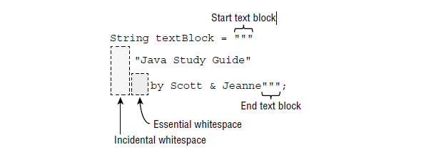

									CORE JAVA APIs
									
									
# Créer et manipuler les Strings:(Creating and manipulating Strings)  
La classe String est une classe tellement fondamentale que vous auriez du mal à écrire du code sans elle. Après tout, vous ne pouvez même pas écrire une méthode main () sans utiliser la classe String. Un string est essentiellement une séquence de caractères, voici un exemple:

	String name = "Fluffy";
Dans Java, on peut crée de deux façon un string:

	String name = "Fluffy";
	String name =  new String("Fluffy");
Les deux vous donnent une variable de référence nommée name pointant vers l'objet String "Fluffy". Ils sont subtilement différents, comme vous le verrez dans la section "Le pool de chaînes" plus loin dans le chapitre. Pour l'instant, rappelez-vous simplement que la classe String est spéciale et n'a pas besoin d'être instanciée avec new.
### Concatenation: (Enchaînement)
Placer une chaîne avant l'autre chaîne et les combiner est appelée concaténation de chaînes.  
Les créateurs d'examens apprécient la concaténation de chaînes car l'opérateur + peut être utilisé de deux manières dans la même ligne de code.Il n'y a pas beaucoup de règles à connaître pour cela, mais vous devez bien les connaître:  
	- Si les deux opérandes sont numériques, + signifie une addition numérique.  
	- Si l'un des opérandes est une chaîne, + signifie concaténation.  
	- L'expression est évaluée de gauche à droite.  
Ci-dessous, qques exemples:

		System.out.println(1 + 2);	// 3
		System.out.println("a" + "b");	// ab
		System.out.println("a" + "b" + 3);	// ab3
		System.out.println(1 + 2 + "c");	// 3c
		System.out.println("c" + 1 + 2);	// c12
Il n'y a plus qu'une chose à savoir sur la concaténation, mais c'est facile. Dans cet exemple, il vous suffit de vous rappeler ce que fait +=  

	String s = "1";
	s += "2";
	s += "3";
	System.out.println(s);	// 123
Vous avez appris que + est utilisé pour faire la concaténation de chaînes en Java. Il existe une autre méthode **concat** qui n'est pas beaucoup utilisée sur de vrais projets mais qui est idéale pour tromper les gens à l'examen:  

	String s = "1";
	String s1 = s.concat("2");
	System.out.println(s1);	// 12
### Immutability: (Immutabilité)
Une fois qu'un objet String est créé, il n'est pas autorisé à changer. Il ne peut pas être agrandi ou réduit et vous ne pouvez pas modifier l'un des caractères qu'il contient.  
À l'examen, vous devez savoir que String est immuable.
Une classe immuable a seulement des getters.  

### Important String Methods: (Méthodes de chaîne importantes) (StringMethods.java)  
La classe String a des dizaines de méthodes. Heureusement, vous n'avez besoin d'en connaître que quleques une pour l'examen.  
Pour toutes ces méthodes, vous devez vous rappeler que la chaîne est une séquence de caractères en Java qui compte à partir de 0 lorsqu'elle est indexée. par exemple String s = "animals"; est une séquence de 7 charactères:    
      
| a | n | i | m | a | l | s | 
|---|---|---|---|---|---|---|   
| 0 | 1 | 2 | 3 | 4 | 5 | 6 |  

###### length(): 
La méthode lenghth() renvoie le nombre de caractères dans la chaîne, la signature de la méthode est:  
	*int length()*

		String s = "animals";
		System.out.println(s.length());	// 7
###### charAt():  
La méthode charAt(), vous permet d'interroger la chaîne pour savoir quel caractère se trouve dans un index spécifique. La signature de la méthode est la suivante:  
	*char charAt(int index)*  
	
		String s = "animals";
		System.out.println(s.charAt(0));	// a
		System.out.println(s.charAt(6));	// s
		System.out.println(s.charAt(7));	// throws exception String index out of range: 7
###### indexOf():
La méthode indexOf(), regarde les caractères de la chaîne et trouve le premier index qui correspond à la valeur souhaitée.  
indexOf peut fonctionner avec un caractère individuel ou une chaîne entière en entrée. Il peut également démarrer à partir d'une position demandée. Les signatures de la méthode sont les suivantes:  
	*int indexOf(int ch)*  
	*int indexOf(int ch, int fromIndex)*  
	*int indexOf(String str)*  
	*int indexOf(String str, int fromIndex)*  
Le code suivant montre comment utiliser indexOf():  

		String s = "animals"; 
		System.out.println(s.indexOf('a'));	// 0
		System.out.println(s.indexOf("al"));	// 4
		System.out.println(s.indexOf('a', 4));	// 4
		System.out.println(s.indexOf("al",5));	// -1
Contrairement à charAt(), la méthode indexOf() ne lève pas une exception si le match n'est pas trouvé, mais elle renvoie la valeur **-1** comme dans le dernier exemple.  
###### substring():
La méthode substring permet **d'extraire une sous-chaîne** de caractères à partir des positions spécifiées.. Le premier paramètre est l'index avec lequel commencer pour la chaîne retournée. Il existe un deuxième paramètre facultatif, qui est l'index de fin auquel vous souhaitez vous arrêter. Les signatures de la méthode sont les suivantes:      
	*String substring(int beginIndex)*     
	*String substring(int beginIndex, int endIndex)*    
Il est utile de penser les index un peu différemment pour les méthodes de substring(). Faire semblant que **les index sont juste avant le caractère vers lequel ils pointeraient**.  
Le code suivant montre comment utiliser substring():  

		String s = "animals";
		System.out.println(s.substring(3));	// mals
		System.out.println(s.substring(7));	// empty String dernier index
		System.out.println(s.substring(s.indexOf('m')));	//mals
		System.out.println(s.substring(3, 4));	// m
		System.out.println(s.substring(3, 3));	// empty String
		System.out.println(s.substring(5, 4));	//throws exception
		System.out.println(s.substring(5, 8));	//throws exception
		System.out.println(s.substring(8));	// //throws exception

###### toLowerCase() and toUpperCase():
Ces méthodes font ce qu'elles disent. toUpperCase convertit tous les caractères minuscules en majuscules dans la chaîne renvoyée. toLowerCase convertit tous les caractères majuscules en minuscules. Les signatures de la méthode sont les suivantes:  
	*String toLowerCase()*
	*String toUpperCase()*
Le code suivant montre comment utiliser toLowerCase et toUpperCase:  

		String str = "robin";
		System.out.println(str.toUpperCase());	// ROBIN
		System.out.println("ABC123".toLowerCase());	// abc123
###### equals() and equalsIgnoreCase():
La méthode equals() vérifie si deux objets String contiennent exactement les mêmes caractères dans le même ordre, le méthode equalsIgnoreCase() resemble la méthode equlas() sauf qu'elle ignore la casse. Les signatures de la méthode sont les suivantes:    
	*boolean equals(Object obj)*   
	*boolean equalsIgnoreCase(Object obj)*      
Le code suivant montre comment utiliser equals() et equalsIgnoreCase():    

		System.out.println("abc".equals("ABC"));	// false
		System.out.println("abc".equals("abc"));	// true
		System.out.println("abc".equalsIgnoreCase("ABC"));	//true
###### startsWith() and endsWith():  
Les méthodes startsWith () et endsWith () vérifient si la valeur fournie correspond à une partie de la chaîne. Les signatures de la méthode sont les suivantes:     
	*boolean startsWith(String prefix)*    
	*boolean endsWith(String suffix)*     
Le code suivant montre comment utiliser startsWith() et endsWith():    

		System.out.println("abc".startsWith("a"));	// true
		System.out.println("abc".startsWith("A"));	// false
		System.out.println("abc".endsWith("c"));	// true
		System.out.println("abc".endsWith("a"));	// false
###### replace(): 
La méthode replace() effectue une simple recherche et remplacement sur la string. Il existe une version qui prend les paramètres char ainsi qu'une version prend les paramètres CharSequence. Les signatures de la méthode sont les suivantes:  
	*String replace(char oldChar, char newCher)*   
	*String replace(CharSequence target, CharSequence replacement)*   
Le code suivant montre comment utiliser replace():    

		System.out.println("abcab".replace('a', 'A'));	// AbcAb
		System.out.println("abcab".replace("bc", "BC"));	// aBCab
La classe String **implements** l'interface CharSequence.  
###### contains():  
La méthode contains() recherche des correspondances dans la chaîne. Ce n'est pas aussi particulier que startsWith() et endsWith(). La correspondance peut être n'importe où dans la chaîne. La signature de la méthode est la suivantee:  
	*boolean contains(CharSequence charSeq)*  
Le code suivant montre comment utiliser replace():  

		System.out.println("abc".contains("a"));	// true
		System.out.println("abc".contains("B"));	// false
###### trim(),strip(), stripLeading(), and stripTrailing():  
Vous avez vu presque toutes les méthodes String que vous devez connaître. La prochaine étape consiste à supprimer l'espace vide du début et/ou de la fin d'une chaîne. Les méthodes strip() et trim() suppriment les espaces du début et de la fin d'un String.  
Dans les termes de l'examen, les espaces se composent d'espaces ainsi que des caractères \t (tab) et \n (newLine).       
La méthode strip() est nouvelle dans **Java 11**. Elle fait tout ce que trim() fait, mais elle prend en charge Unicode.  
De plus, les méthodes stripLeading() et stripTrailing() ont été ajoutées dans Java11. La méthode stripLeading() supprime les espaces au début de la chaîne et les laisse à la fin. La méthode stripTrailing() fait le contraire. Les signatures de la méthode sont les suivantes:  
	*String strip()*    
	*String stripLeading()*    
	*String stripTrailing()*         
	*String trim()*    

		System.out.println("\t  a b c \n".strip());	//a b c
		System.out.println("\t  a b c \n".trim());	//a b c
		String text = " abc\t ";
		System.out.println(text.trim().length());	// 3
		System.out.println(text.strip().length());	// 3
		System.out.println(text.stripLeading().length());	// 5
		System.out.printlntext.stripTrailing().length());	// 4
###### intern():  
la méthode intern() renvoie la valeur du pool de String s'il y en a. Sinon, il ajoute la valeur au pool de String, on aura d'avantage d'explication dans le paragraphe concernant string pool.  
##### Chaînage de méthodes: (Method Chaining)  
Il est courant d'appeler plusieurs méthodes comme indiqué ici:  

		String start = "AniMaL ";
		String trimmed = start.trim();	// "AniMaL"
		String lowercase = trimmed.toLowerCase();	// "animal"
		String result = lowercase.replace('a', 'A');	// "AnimAl"
	   	System.out.println(result);	// AnimAl
Ceci est juste une série de méthodes String. A chaque appel, la valeur renvoyée est placée dans une nouvelle variable. Il existe quatre valeurs String en cours de route et AnimAl est généré. Cependant, lors de l'examen, il y a une tendance à entasser autant de code que possible dans un petit espace. Vous verrez du code utilisant une technique de chaînage de méthode appelée. Voici un exemple  

		String res = "AniMal ".trim().toLowerCase().replace('a', 'A');
		System.out.println(res);	// AnimAl
### Defining Text Blocks: JAVA 15
Plus tôt, nous avons vu une chaîne (String)simple avec la valeur "hello". Que se passe-t-il si nous voulons avoir une String avec quelque chose de plus compliqué ? Par exemple, découvrons comment créer une String avec cette valeur: 

	"Java Study Guide"
		by Scott & Jeanne
Construire ceci en tant que chaîne nécessite deux choses que vous n'avez pas encore apprises. La syntaxe \" vous permet de dire que vous voulez un " plutôt que de terminer la chaîne, et \n indique que vous voulez une nouvelle ligne. Ces deux caractères sont appelés caractères d'échappement car la barre oblique inverse a une signification particulière. Avec ces deux nouvelles compétences, nous pouvons écrire:    

	String eyeTest = "\"Java Study Guide\"\n by Scott & Jeanne";
Bien que cela fonctionne, il est difficile à lire. Heureusement, Java a des blocs de texte, également appelés chaînes multilignes. Voir la figure pour l'équivalent du bloc de texte.    

Un bloc de texte commence et se termine par trois guillemets doubles ("""), et le contenu n'a pas besoin d'être échappé. C'est beaucoup plus facile à lire. Remarquez que le type est toujours String. Cela signifie que les méthodes que vous apprenez dans Chapitre 4 pour String fonctionne à la fois pour une chaîne normale et un bloc de texte.    

Vous avez peut-être remarqué les mots espace blanc accessoire et espace blanc essentiel dans la figure. Qu'est ce que c'est? Les espaces blancs essentiels font partie de votre chaîne et sont importants pour vous. Il se trouve que des espaces blancs accessoires sont là pour rendre le code plus facile à lire. Vous pouvez reformater votre code et modifier la quantité d'espaces blancs accessoires sans aucun impact sur votre valeur String.   

Imaginez une ligne verticale tracée sur le caractère non blanc le plus à gauche de votre bloc de texte. Tout ce qui se trouve à gauche est un espace blanc accessoire, et tout ce qui se trouve à droite est un espace blanc essentiel. Essayons un exemple. Combien de lignes cela produit-il, et combien de caractères d'espacement accessoires et essentiels commencent chaque ligne ?   

	String pyramid = """ // line 14
			  *			//line 15
			 * *		//line 16
			* * *		//line 17
			""";		//line 18
		System.out.print(pyramid);
		System.out.println("-------");
Ce code afficher: 

	  *
	 * *
	* * *
	-------
Il y a quatre lignes de sortie. Les lignes 15 à 17 ont des étoiles. La ligne 18 est une ligne sans aucun caractère. Le triple "" fermant aurait dû être sur la ligne 17 si nous ne voulions pas cette ligne vide. Il n'y a pas de caractères d'espacement accessoires ici. Les """ fermants sur la ligne 18 sont les caractères les plus à gauche, donc la ligne est tracée à la position la plus à gauche. La ligne 15 a deux caractères d'espacement essentiels pour commencer la ligne, et la ligne 16 en a un. Cet espace remplit la ligne tracée pour correspondre à la ligne 18.   

Essayons quelques exemples. Tout d'abord, voyez-vous pourquoi cela ne compile pas ?   

	String block = """doe"""; // DOES NOT COMPILE
Les blocs de texte nécessitent **un saut de ligne** après l'ouverture """, ce qui rend celui-ci invalide. Essayons maintenant un valide. Combien de lignes pensez-vous qu'il y a dans ce bloc de texte ?   

	String block = """
				doe \
				deer""";
Juste un. La sortie est *doe deer* car le \ indique à Java de ne pas ajouter de la nouvelle ligne avant deer.    
### String Templates (Modèle String) - Java 21 (JEP 465):  
Le modèle String compète le string litéral et le bloc text de String, en associant le texte littéral à des expressions intégrées et à des processeurs de modèles pour produire des résultats spécialisés. La motiviation de cette fonctionnalité est :     
• Simplifiez l'écriture de programmes Java en facilitant l'expression de chaînes contenant des valeurs calculées au moment de l'exécution.       
• Améliorer la lisibilité des expressions qui mélangent texte et expressions.       
• Simplifiez l’utilisation des API qui acceptent les chaînes écrites dans des langages non Java (par exemple, SQL, XML et JSON).         

Syntactiquement, une expression de modèle (template expression) ressemble à un littéral de chaîne avec un préfixe. Regardons cet exemple ci-dessous : 

	String name = "Joan";
	String info = STR."My name is \{name}";
	System.out.println(info );  // true
Le template expression STR."My name is \\{name}" consiste en :   
• Un template processor (STR)    
• Un point character (U+002E)     
• Un template ("My name is \\{name}") qui contient une expression intégrée (\\{name})        

STR est un processeur de modèle défini dans la plate-forme Java. Il effectue une interpolation de String en remplaçant chaque expression intégrée dans le modèle par la valeur (stringifiée) de cette expression.    
Voici un exemple template expression désignant du texte JSON, le tout réparti sur plusieurs lignes :  

	String name = "Joan Smith";
	String phone = "555-123-4567";
	String address = "1 Maple Drive, Anytown";
	String json = STR."""
		{
			"name":    "\{name}",
			"phone":   "\{phone}",
			"address": "\{address}"
		}
		""";
	System.out.println(json);
ce code nous affiche:   

	{
		"name":    "Joan Smith",
		"phone":   "555-123-4567",
		"address": "1 Maple Drive, Anytown"
	}
C'est genial !
# Utilisation de la classe StringBuilder: (Using the StringBuilder Class)  
La classe StringBuilder crée un String sans stocker toutes ces valeurs String provisoires. Contrairement à la classe String, StringBuilder n'est pas immuable
### Mutabilité et chaînage: (Mutability ans Chaining)
L'examen tentera probablement de vous tromper sur le fait que String et Stringbuilder sont mutables.  
lorsque nous avons enchaîné les appels de la méthode String, le résultat était un nouveau String avec la réponse. Au lieu de cela, le StringBuilder change son propre état et renvoie une référence à lui-même.  
Regardons un exemple pour rendre cela plus clair:  

		StringBuilder sb = new StringBuilder("start");
		sb.append("+middle");
		StringBuilder same = sb.append("+end");
		System.out.println(sb);	// start+middle+end
		System.out.println(same);	// start+middle+end
Les deux reference affiche le même resultat, contrairement avec la classe String.  
### Créer un StringBuilder: (Creating a StringBuilder)  
Il existe **trois** façons de construire un StringBuilder:  

	StringBuilder sb1 = new StringBuilder();  
	StringBuilder sb2 = new StringBuilder("animal");  
	StringBuilder sb3 = new StringBuilder(10);
La première ligne, crée un StringBuilder  contient une séquence vide.  
La deuxième ligne, crée un StringBuilder contient la chaine "animal".  
La dernière indique à Java que nous avons une idée de la taille de la valeur éventuelle.  
### Méthodes StringBuilder importantes: (Important StringBuilder Methods)  StringMethods.java
Comme avec String, nous n'allons pas couvrir toutes les méthodes de la classe StringBuilder, Ce sont ceux que vous pourriez voir à l'examen:  
###### charAt(), indexOf(), lengh() and substring():  
Ces quatre méthodes fonctionnent exactement de la même manière que dans la classe String. Assurez-vous de pouvoir identifier la sortie de cet exemple:  

		StringBuilder strB = new StringBuilder("animals"); 
		String sub = strB.substring(strB.indexOf("a"), strB.indexOf("al"));
		int len = strB.length();
		char ch = strB.charAt(6);
		System.out.println(sub + " " + len + " " + ch);	// anim 7 s
Il faut noter que **substring** renvoie String plutôt qu'in StringBuilder
###### append(): 
La méthode append() est de loin la méthode la plus fréquement utilisé dans StringBuilder. Elle ajoute le paramètre au StringBuilder et renvoie une référene au StringBuilder acutel. L'une des signature des méthde est la suivante:  
	*append(String str)*     
Notez que nous avois dit l'une des signatures de la méthode. Il existe plus de **10** signatures:     

	StringBuilder sb = new StringBuilder().append(1).append('c').append("-").append(true);
		System.out.println(sb);	// 1c-true
###### insert(): 
Ajoute des caractères au StringBuilder à l'index demandé et renvoie une référence au StringBuilder actuel. Il existe plusieurs signatures des méthodes pour differents types, en voici un:  
	*StringBuilder insert(int offset, String str)*    
Le code suivant montre comment utiliser insert():  

		StringBuilder sb = new StringBuilder("animals");
		sb.insert(7, "-");		// sb = animals-
		sb.insert(0, "-");	// sb = -animals-
		sb.insert(4, "-");	// sb = ani-mals-
		System.out.println(sb);	// -ani-mals-
il faut faire attention:

		StringBuilder sb = new StringBuilder("animals");
		sb.insert(8, "-");		// throws an exception
###### delete() and deleteCharAt():  
La méthode delete() est l'inverse de la méthode insert() permet de supprimer une séquence de caractères, et la méthode deleteCharAt() est pratique si on veut supprimer un seul caractère, les signagures de méthodes sont les suivantes:  
	*StringBuilder delete(int start, int end)*    
	*StringBuilder deleteCharAt(int index)*     
Le code suivant montre comment utiliser delete() et deleteCharAt():  

		StringBuilder sb = new StringBuilder("abcdef");
		sb.delete(1, 3);	// sb = adef
		sb.deleteCharAt(5);	// throws an exception
Si vous spécifiez un deuxième paramètre qui dépasse la fin de StringBuilder, Java supposera simplement que vous vouliez dire la fin.  
		
			StringBuilder sb = new StringBuilder("abcdef");
			sb.delete(1, 100);	// sb = a
###### replace():  
La méthode replace() fonctionne différemment pour StringBuilder et pour String. La signature de la méthode est la suivante:  
	*StringBuilder replace(int startIndex, int endIndex, String newString)*  
Le code suivant montre comment utiliser la méthode replace():  

		StringBuilder builder = new StringBuilder("pigeon dirty");
		builder.replace(3, 6, "sty");
		System.out.println(builder);	// pigsty dirty
###### reverse():  
Après tout cela, il est temps de choisir une méthode simple et agréable. Le méthode reverse() inverse les caractère des séquences et renvoie une référence au StringBuilder atuel. La signature de la méthode est la suivante:  
	*StringBuilder reverse()*  
Le code suivant montre comment utiliser la méthode reverse():  

		StringBuilder sb = new StringBuilder("ABC");
		sb.reverse();
		System.out.println(sb);	// CBA
###### toString():    
La dernière méthode convertit un StringBuilder en String, La signature de la méthode est la suivante: 
	*String toString()*
Le code suivant montre comment utiliser la méthode toString():  

	StringBuilder sb = new StringBuilder("ABC");
	String s = sb.toString();
# Comprendre l'égalité: (Understanding Equality)  UnderstandEqual.java
Dans le chapitre 3, vous avez appris à utiliser == pour comparer des nombres et que les références d'objet font référence au même objet. 
### Comparaison equlas() et "==" : (Comparing equals() and "==" )  
Prenons cet exemple:  

		StringBuilder one = new StringBuilder();
		StringBuilder two = new StringBuilder();
		StringBuilder three = one.append("a");
		System.out.println(one == two); // false
		System.out.println(one == three); // true
Puisque cet exemple ne traite pas des primitives, nous savons chercher si les références font référence au même objet. one et two sont les deux des StringBuilders complètement séparés, ce qui nous donne deux objets. Par conséquent, la première instruction print nous donne false. three est plus intéressant. Rappelez-vous comment les méthodes StringBuilder aiment renvoyer la référence actuelle pour le chaînage? Cela signifie qu'un et trois pointent tous les deux vers le même objet et la deuxième instruction d'impression nous donne vrai.
Vous avez vu précédemment que vous pouvez dire que vous voulez l'égalité logique plutôt que l'égalité d'objet pour les objets String:   

		String x = "Hello World";	// literal string
		String y = " Hello World".trim();
		System.out.println(x.equals(y)); // true
Cela fonctionne car les auteurs de la classe String ont implémenté une méthode standard appelée equals pour vérifier l'egalité des valeurs à l'intérieur de String plutôt que la référence String elle-même. Et si la classe n'implemente pas la méthode equlas(), alors la classe va vérifier si les references pointent sur le même objet, c'est la même chose ce qu'elle fait l'opérateur ==  

Regardons cet exemple très important:

		String s1 = new String();
		String s2 = new String();
		System.out.println(s1 == s2);	// false
		System.out.println(s1.equals(s2));	// true
Avec une classe qque qui s'appelle Tiger:  

		Tiger t1 = new Tiger();
		Tiger t2 = new Tiger();
		Tiger t3 = t1;
		System.out.println(t1 == t3);	// true
		System.out.println(t1 == t2);	// false
		System.out.println(t1.equals(t2));	// false
Le resultat est different que la classe String, parce que la classe Tiger  n'implemente pas la méthode equals(). Si la classen'implemente pas equals() alros == et equals() donnent le même résultat.

Enfin, l'examen pourrait essayer de vous tromper avec une question comme celle-ci:  

		String str = "a";
		StringBuilder builder = new StringBuilder("a");
		System.out.println(str == builder);	// DOES NOT COMPILE
N'oubliez pas que == vérifie l'égalité des références d'objet de même type.
### The String pool:  
Comme les Strings sont partout en Java, elles utilisent beaucoup de mémoire. Dans certaines applications de production, ils peuvent utiliser une grande quantité de mémoire dans l'ensemble du programme. Java se rend compte que de nombreuses chaînes se répètent dans le programme et résout ce problème en réutilisant les chaînes courantes. Le pool de Strings, également appelé pool interne, est un emplacement de la machine virtuelle Java (JVM) qui collecte toutes ces chaînes.  
Le pool de chaînes contient des valeurs littérales et des constantes qui apparaissent dans votre programme. Par exemple, "name" est un littéral et va donc dans le pool de chaînes. myObject.toString () est une chaîne mais pas un littéral, donc il n'entre pas dans le pool de Strings.  

Le pool String **fonctionne** de cette façon, lorqu'on crée une chaine *String  s = "apple";* la JVM  vérifie automatiquement si la même valeur existe dans le pool de constantes de String ou non, si oui **s** refère sur la valeur existante si non une nouvelle chaîne et l'ajoute au pool de String.   

Voyons maintenant le scénario plus complexe et déroutant, l'égalité des chaînes, en partie à cause de la façon dont la JVM réutilise les littéraux de chaîne.  

		String x = "Hello World";
		String y = "Hello World";
		System.out.println(x == y); // true
x et y deux litéraux avec la même valeure "Hello World" donc le JVM va crée un seul litéral dans la mémoire, exactement dans le Pool Strings, et x et y les deux pointent sur cet objet.  
Cela devient encore plus délicat. Considérez ce code:  

		String x = "Hello World";
		String z = " Hello World".trim();
		System.out.println(x == z); // false
Dans cet exemple, nous n'avons pas deux même littéral String. Bien que x et z soient évalués sur la même chaîne, l'un est calculé au moment de l'exécution (runtime), ce n'est pas la même chose au moment de la compilation (compile-time), donc un nouvel objet chaîne est créé. Regardons un deuxième exemple:  

		String singleString = "hello world";
		String oneLine = "hello " + "world"; 
		String concat = "hello ".concat("world");
		System.out.println(singleString == oneLine);	// true
		System.out.println(singleString == concat);	//false
Dans cette exemple *oneLine* est évoluer au moment la compilation (**compile-time**) donc automatiquement sera mit dans le pool String, dans le cas de la chaine *concat*, on utilise la méthode concat de la classe String donc l'évaluation sera au **run-time**. i
On peut dire à Java d'utiliser le pool de String. La méthode intern() utilisera un objet dans le pool de chaînes s'il y en a un. Si le littéral n'est pas encore dans le pool de chaînes, Java l'ajoutera à ce moment:  

		String name = "Hello world";
		String name2 = new String("Hello world").intern();
		System.out.println(name == name2);	// true
# Comprendre les tableaux Java: (Understanding Java Arrays)  
Un tableau est une zone de mémoire sur le tas (Heap) avec de l'espace pour un nombre désigné d'éléments. Une grande différence est qu'un tableau peut être de n'importe quel type Java. Si nous ne voulions pas utiliser un String pour une raison quelconque, nous pourrions utiliser directement un tableau de primitives char:  
	*char [] letters:*  
### Créer un tableau de primitives: (Creating an Array of Primitives) CreatingArray.java 
La façon la plus courante de créer un tableau ressemble à ceci:  

		int[] numbers = new int[3];	// [] les brackets sont obligatoires pour un tableau
numbers est un tableau de type int et de taille 3. 

 
Une autre façon de créer un tableau est de spécifier tous les éléments avec lesquels il doit commencer:  

		int[] numbers2 = new int[] {4, 52, 89};
Dans cet exemple, nous créons également un tableau int de taille 3. Cette fois, nous spécifions les valeurs initiales de ces trois éléments au lieu d'utiliser les valeurs par défaut.  

Java reconnaît que cette expression est redondante. Puisque vous spécifiez le type du tableau sur le côté gauche du signe égal, Java connaît déjà le type. Et puisque vous spécifiez les valeurs initiales, il connaît déjà la taille. En tant que raccourci, Java vous permet d'écrire ceci:  

		int[] numbers2 = {4, 52, 89};
Enfin, vous pouvez taper le [] avant ou après le nom, et l'ajout d'un espace est facultatif. Cela signifie que ces 5 instructions font exactement la même chose:  

		int[] numAnimals;
		int [] numAnimals2;
		int []numAnimals3;
		int numAnimals4[];
		int numAnimals5 [];
* Plusieurs «tableaux» dans les déclarations: 

		int [] ids, types; // on creé deux tableau de type int.     
		int a[], b; // a un tableau de type int et b une primitive sur un entier      
### Création d'un tableau avec des variables de référence: (Creating an Array with Reference Variables) 
Vous pouvez choisir n'importe quel type Java comme type de tableau. Cela inclut les classes que vous créez vous-même. Jetons un coup d'œil à un type String: 

		String [] bugs = {"cricket", "beetle", "ladybug"};
		String [] alias = bugs;
		System.out.println(bugs.equals(alias));	// true
		System.out.println(bugs.toString());	// [Ljava.lang.String;@39ed3c8d
Nous pouvons appeler equals() car **un tableau est un objet**. Il renvoie true en raison de l'égalité de référence. La méthode equals () sur les tableaux ne regarde pas les éléments du tableau. Rappelez-vous que cela fonctionnerait même sur un int [] aussi. int est un primitif, int[] est un objet. 

   

### Utilisation d'un tableau: (Using an Array)  
Maintenant que nous savons comment créer un tableau, essayons d’y accéder:  

		String[] mammals = {"monkey", "chimp", "donkey"};	// déclare et initialise le tableau
		System.out.println(mammals.length); // 3
		System.out.println(mammals[0]); // monkey
		System.out.println(mammals[1]); // chimp
		System.out.println(mammals[2]); // donkey
Pour vous assurer que vous comprenez comment fonctionne la longueur (length):  
	
		String[] birds = new String[6];
		System.out.println(birds.length);	// 6
		
### Lancer une exception (throwing an exception): 
Lors de l'examen, vous verrez deux types de code qui entraînent une exception. Le premier est le code qui est faux. Voici un exemple:   

		String[] array = new String[0];
		System.out.println(array[0]);
Ce code lève une **ArrayIndexOutOfBoundsException** puisque le **tableau n'a aucun élément (array et représenter comme ça dans la mémoire [])**. Cela signifie que les questions sur les exceptions peuvent être cachées dans des questions qui semblent concerner autre chose.
### Tri: (Sorting)  
Java facilite le tri d'un tableau en fournissant une méthode de tri, ou plutôt un ensemble de méthodes de tri. Tout comme StringBuilder vous a permis de transmettre presque tout à append (), vous pouvez passer presque n'importe quel tableau à **Arrays.sort ()**.  
Arrays est la première classe fournie par Java que nous avons utilisée et qui nécessite une importation. Pour l'utiliser, vous devez avoir l'une des deux instructions suivantes dans votre classe:  

		import java.util.* // import whole package including Arrays
		import java.util.Arrays; // import just Arrays
Cet exemple trie trois nombres:

		int [] tab = {9, 5 , 1};
		Arrays.sort(tab);
		for(int i : tab)
			System.out.println(i + " ");	// 1 5 9
Réessayez avec les types String:  

		String[] strings = { "10", "9", "100" };
		Arrays.sort(strings);
		for (String string : strings)
			System.out.print(string + " ");	// 10 100 9
Cette fois, le résultat n'est peut-être pas celui que vous attendez. Ce code produit 10 100 9. Le problème est que String trie par ordre alphabétique et 1 trie avant 9. (Les nombres sont triés avant les lettres et les majuscules avant les minuscules, au cas où vous vous poseriez la question.)
### Searching: (Recherche)  
Java fournit également un moyen pratique de recherche, mais uniquement si **le tableau est déjà trié**, en utilisant **Arrays.binarySearch()**. Ci-dessous on trouve les règles de la recherche:  
	- Si l'élément cible est trouvé dans un tableau trié alors on retourne l'index de l'élément.  
	- Si l'élément cible n'est pas trouvé dans un tableau trié alors on retourne une valeur négative strictement inférieur à l'index ou devrait l'être, alors la sortie sera égale à **la valeur (-(insertion point) - 1)**.    
	- Si le tableau n'est pas trié alors on aura une valeur surpprise.  
Essayons ces règles avec un exemple :  

		int[] tabInt = {2,4,6,8};
		System.out.println(Arrays.binarySearch(tabInt, 2)); // 0
		System.out.println(Arrays.binarySearch(tabInt, 4)); // 1
		System.out.println(Arrays.binarySearch(tabInt, 1)); // -1 (-(insertion point) - 1) = 0-1 = -1
		System.out.println(Arrays.binarySearch(tabInt, 3)); // -2 (-(insertion point) - 1) = -1-1 = -2
		System.out.println(Arrays.binarySearch(tabInt, 9)); // -5  (-(insertion point) - 1) = -4-1 = -5
Que pensez-vous qu'il se passe dans cet exemple ?  

		int [] tabNoSort = new int[] {3,2,1};
		System.out.println(Arrays.binarySearch(tabNoSort, 2));	//1
		System.out.println(Arrays.binarySearch(tabNoSort, 3));	// -4
Dans l'exam dès que vous voyez que le tableau n’est pas trié, recherchez un choix de réponse concernant une sortie imprévisible.
### Comparant: (Comparing) 
Java fournit également des méthodes pour comparer deux tableaux afin de déterminer lequel est "plus petit". Nous allons d'abord couvrir la méthode compare(), puis passer à mismatch() " l'incompatibilité".
###### compare():  
Il y a un tas de règles que vous devez connaître avant d'appeler compare(). Vous devez d'abord savoir ce que signifie la valeur de retour. vous n'avez pas besoin de connaître les valeurs de retour exactes, mais vous devez connaître les éléments suivants:  
	- Un nombre négatif signifie que le premier tableau est plus petit que le second.
	- Un zéro signifie que les tableaux sont égaux.
	- Le nombre positif signifie que le premier tableau est plus grand que le second.  
Voici un exemple : 

		System.out.println(Arrays.compare(new int[] {1}, new int[] {2}));	// -1
Retourne -1 parce que 1 est plus petit que 2, c'est normal.  
Mais si on veut comparer deux tableaux avec une taille differente, qq ce passe ? Ci-dessous des exemples qui illustrent les règles :  

	System.out.println(Arrays.compare(new int[] {1, 2}, new int[] {2}));	// -1
	System.out.println(Arrays.compare(new int[] {1, 2}, new int[] {1, 2}));	// 0
	System.out.println(Arrays.compare(new int[] {1, 2}, new int[] {2, 1}));	// -1
	System.out.println(Arrays.compare(new String[] {"a"}, new String[] {"aa"}));	// -1
	System.out.println(Arrays.compare(new String[] {"a"}, new String[] {"A"}));	// 32
	System.out.println(Arrays.compare(new String[] {"a"}, new String[] {null}));	//1
	System.out.println(Arrays.compare(new int[] {1}, new String[] {"a"}));	// DOES NOT COMPILE
###### mismatch():  
Il est maintenant temps d'en apprendre davantage sur les mismatch(). si les tableaux sont égaux, mismatch() renvoie -1. Sinon, il renvoie le premier index où ils diffèrent. Pouvez-vous comprendre ce que ces imprimés?  

	System.out.println(Arrays.mismatch(new int[] {1},  new int[] {1}));	// -1
	System.out.println(Arrays.mismatch(new String[] {"a"}, new String[] {"A"}));	// 0
	System.out.println(Arrays.mismatch(new int[] {1, 2},  new int[] {1}));	// 1
### Varargs:  
Lorsque vous créez un tableau vous-même, cela ressemble à ce que nous avons vu jusqu'à présent. Quand on est passé à votre méthode, il y a une autre façon dont cela peut ressembler. Voici trois exemples avec une méthode main():  

		public static void main(String[] args)
		public static void main(String args[])
		public static void main(String... args) // varargs
Le troisième exemple utilise une syntaxe appelée varargs (arguments de variable), que vous avez vue au chapitre 1. Vous apprendrez comment appeler une méthode à l'aide de varargs au chapitre 7, «Méthodes et encapsulation». Pour l'instant, tout ce que vous devez savoir, c'est que vous pouvez utiliser une variable définie à l'aide de varargs comme s'il s'agissait d'un tableau normal. Par exemple, args.length et args[0] sont légaux.
# Tableaux multidimensionnels: (Multidimensional Arrays)   
Les tableaux sont des objets et, bien entendu, les composants du tableau peuvent être des objets. Il ne faut pas beaucoup de temps, en frottant ces deux faits ensemble, pour se demander si les tableaux peuvent contenir d'autres tableaux, et bien sûr ils le peuvent.  
### Création d'un tableau multidimensionnel: (Creating a Multidimensional Array) 
Plusieurs séparateurs de tableau sont tout ce qu'il faut pour déclarer des tableaux avec plusieurs dimensions. Vous pouvez les localiser avec le type ou le nom de variable dans la déclaration, comme précédemment:  

		int[][] vars1; // 2D array
		int vars2 [][]; // 2D array
		int[] vars3[]; // 2D array
		int[] vars4 [], space [][]; // a 2D AND a 3D array
Vous pouvez spécifier la taille de votre tableau multidimensionnel dans la déclaration si vous le souhaitez:  

		String [][] rectangle = new String[3][2];
Le résultat de cette instruction est un de tableau avec trois éléments, chacun faisant référence à un 
tableau de deux éléments. Vous pouvez considérer la plage adressable de rectangle [0][0] à rectangle[2][1], mais ne la considérez pas comme une structure d'adresses comme [0,0] ou [2,1].  
Supposons maintenant que nous définissions l'une de ces valeurs:  

		rectangle[0][1] = "set";
Une autre façon de créer un tableau 2D consiste à initialiser uniquement la première dimension d'un tableau et à définir la taille de chaque composant du tableau dans une instruction distincte:  

		int [][] args = new int[4][];
		args[0] = new int[5];
		args[1] = new int[3];
Cette technique révèle ce que vous obtenez réellement avec Java: des tableaux de tableaux qui, correctement gérés, offrent un effet multidimensionnel.

   
Bien que ce tableau soit de forme rectangulaire, un tableau n’a pas besoin de l’être. Considérez celui-ci:     

	int[][] differentSizes = {{1, 4}, {3}, {9,8,7}};
Nous commençons toujours avec un tableau de trois éléments. Cependant, cette fois, les éléments du niveau suivant sont tous de tailles différentes. L'une est de longueur 2, la longueur suivante 1 et la dernière longueur 3 (voir figure ci-dessous). Cette fois, le tableau est composé de primitives, elles sont donc affichées comme si elles étaient elles-mêmes dans le tableau.  

  

### Utilisation d'un tableau multidimensionnel: (Using a Multidimensional Array)
L'opération la plus courante sur un tableau multidimensionnel est de le parcourir. Cet exemple imprime un tableau 2D:

		int[][] twoD = new int[3][2];
		for (int i = 0; i < twoD.length; i++) {
			for (int j = 0; j < twoD[i].length; j++)
				System.out.print(twoD[i][j] + " "); // print element
			System.out.println(); // time for a new row
		}
# Java Collections:  
Java Collections Framework comprend des classes qui implémententent, List, Set, Queue et Map. La plate-forme Java ne fournit aucune implémentation directe de cette interface.    
Nous avons vu des tableaux , tels que int[]. Un tableau *ne fait pas partie* de Collections Framework.   Étant donné que le tri et la recherche sont similaires entre les listes et les tableaux, les deux sont couverts par l'examen. De plus, étant donné que l'OCP est cumulatif, vous devez toujours savoir comment travailler avec les baies de l'OCA.   
Une collection est un groupe d'objets contenus dans un seul objet. Le Java Collections Framework est un ensemble de classes dans java.util pour stocker des collections. Il existe quatre interfaces principales dans Java Collections Framework.     
* List: une liste est une collection ordonnée d'éléments qui permet des entrées en double. Les éléments d'une liste sont accessibles par un index int.    
* Set: est une collection qui n'autorise pas les entrées en double.    
* Queue (File d'attente): une file d'attente est une collection qui classe ses éléments dans un ordre spécifique pour le traitement. Une file d'attente typique traite ses éléments dans un ordre premier entré, premier sorti, mais d'autres classements sont possibles.    
* Map (Carte): une carte est une collection qui mappe des clés à des valeurs, sans que les clés en double soient autorisées. Les éléments d'une carte sont des paires clé/valeur.    

l'interface Collection et ses sous-interfaces principales. Notez que Map n'implémente pas l'interface Collection. Il est considéré comme faisant partie du Java Collections Framework, même s'il ne s'agit pas techniquement d'une collection. C'est une collection (notez les minuscules), cependant, en ce qu'elle contient un groupe d'objets. La raison pour laquelle les cartes sont traitées différemment est qu'elles nécessitent des méthodes différentes en raison du fait qu'elles sont des paires clé/valeur.  
Nous allons d'abord discuter des méthodes que Collection fournit à toutes les classes d'implémentation. Ensuite, nous couvrirons les différents types de collections, y compris quand utiliser chacune et les sous-classes concrètes. Ensuite, nous comparerons les différents types.   

L'interface Collection a des méthodes on site les principales, y'on d'autres :          

• public int size()                                   
• public boolean isEmpty()                            
• public boolean contains(Object element)             
• public boolean add(E e)                             
• public boolean remove(Object element)               
• public Iterator iterator()                          

### Hierarchy of Collection Framework in Java: 
Comme nous le savons, le framework collection est une architecture de classes et d'interfaces. Voyons maintenant leur hiérarchie.

### L'interface List:  
L'interface List est une collection ordonnée et peut contenir des éléments en double. Vous pouvez accéder à n'importe quel élément à partir de son index. La liste ressemble plus à un tableau avec une longueur dynamique. La liste est l'un des types de collection les plus utilisés. ArrayList et LinkedList sont des classes d'implémentation de l'interface List. 
##### ArrayList:   
On peut dire que ArrayList, est un tableau dynamique, n'a pas une taille fixe. 

 

##### LinkedList: (liste doublement chaînée)    
LinkedList est une structure de données linéaire, les éléments LinkedList ne sont pas stockés dans des emplacements contigus comme des tableaux, ils sont liés les uns aux autres à l'aide de pointeurs. Chaque élément de la LinkedList a la référence (adresse/pointeur) vers l'élément suivant de la LinkedList.  

 
##### Différence entre ArrayList et LinkedList en Java:    
ArrayList et LinkedList implémentent tous deux l'interface List et leurs méthodes et résultats sont presque identiques. Cependant, il existe peu de différences entre eux qui les rendent meilleurs par rapport aux autres en fonction des besoins.    
* Opération de recherche: ArrayList O(1) est assez rapide par rapport à l'opération de recherche LinkedListO(n). ArrayList maintient un système basé sur un index pour ses éléments car il utilise implicitement une structure de données de tableau, ce qui accélère la recherche d'un élément dans la liste. De l'autre côté, LinkedList implémente une liste doublement chaînée qui nécessite le parcours de tous les éléments pour rechercher un élément.    
* Opération de suppression: LinkedList donne des O(1)performances tandis que ArrayList donne des performances variables O(n). En fait, chaque élément de LinkedList conserve deux pointeurs (adresses) qui pointent vers les deux éléments voisins de la liste. Par conséquent, la suppression ne nécessite que le changement de l'emplacement du pointeur dans les deux nœuds voisins (éléments) du nœud qui va être supprimé. Dans ArrayList, tous les éléments doivent être déplacés pour remplir l'espace créé par l'élément supprimé.      
* Inserts Performance: La méthode d'ajout de LinkedList donne des O(1) performances tandis que ArrayList donne O(n) dans le pire des cas. La raison est la même que celle expliquée pour la suppression.   
    
### L'interface Map:   
Une Map est un objet qui mappe des clés à des valeurs. Une carte (Map) **ne peut pas contenir de clés en double**. Il existe 4 principales implémentations des interfaces Map : HashMap, Hashtable, TreeMap et LinkedHashMap.   
##### HashMap:    
HashMap est une classe de collection basée sur Map qui est utilisée pour stocker des paires clé et valeur, elle est désignée par HashMap<Key, Value> ou HashMap<K, V>. Cette classe ne donne aucune garantie quant à l'ordre de la carte (ce n'est pas une collection ordonnée). Elle est similaire à la classe Hashtable sauf qu'elle n'est pas synchronisée et **autorise les valeurs nulles (valeurs nulles et clé nulle)**.
##### Hashtable:   
Cette classe implémente une table de hachage, qui mappe les clés aux valeurs. Tout objet **non nul** peut être utilisé comme clé ou comme valeur. Hashtable est similaire à HashMap sauf qu'il est **synchronisé convient pour les opérations thread-safe**, et **n'autorise pas les clés nulles et les valeurs nulles**.     
la compilation passe mais on aura **NullPointerException** en runtime.  
##### TreeMap:   
La classe TreeMap implémente une interface Map similaire à la HashMap classe. La principale différence entre eux est que HashMap est une collection non ordonnée,alors que TreeMap **est trié dans l'ordre croissant de ses clés**.   
##### LinkedHashMap: 
Est une implémentation de table de hachage et de liste chaînée de l'interface Map, Le LinkedHashMap est assez similaire au HashMap, avec une fonctionnalité supplémentaire permettant de **conserver l'ordre de l'élément inséré**.    

• Remarque:  HashMap, TreeMap, et LinkedHashMap sont des classes de collection non synchronisées, ce qui signifie qu'elles ne convient pas aux opérations thread-safe jusqu'à ce qu'elles soient explicitement synchronisées.   
   
### Interface Set:
L'interface java.util.set est un sous type de l'interface java.util.Collections . Il représente un ensemble d'objets dans lequel on ne peut pas trouver de doublons. L'interface set contient seulement les méthodes héritées de Collections.     
La plateforme Java comporte 3 implémentations de Set:  
• HashSet    
• TreeSet    
• LinkedHashSet      

# Comprendre une ArrayList: (Understanding an ArrayList)  
Un tableau a un inconvénient flagrant: vous devez savoir combien d'éléments seront dans le tableau lorsque vous le créez, puis vous êtes coincé avec ce choix.   
Tout comme un StringBuilder, ArrayList peut changer de taille au moment de l'exécution si nécessaire. Comme un tableau, un ArrayList est une séquence ordonnée **qui autorise les doublons**.  
Une ArrayList est une implementation de List qui est *une collection d'objets*.  
Comme lorsque nous utilisons Arrays.sort, ArrayList nécessite une importation. Pour l'utiliser, vous devez avoir l'une des deux instructions suivantes dans votre classe:  

	import java.util.*;	//import whole package
	import java.util.ArrayList;	//import just ArrayList
Dans cette section, nous examinerons la création d'une ArrayList, des méthodes courantes, *autoboxing*, de la conversion et du tri.  
### Créer une ArrayList: (Creating an ArrayList )  
Comme avec StringBuilder, il existe trois façons de créer une ArrayList:  

		ArrayList list1 = new ArrayList();
		ArrayList list2 = new ArrayList(10);
		ArrayList list3 = new ArrayList(list2);
Ces trois ArrayList sont vides.   
- Le premier dit de créer une ArrayList contenant un espace pour le nombre d'éléments par défaut.   
- Le second dit de créer une ArrayList contenant un nombre spécifique d'emplacements.  
- Le dernier exemple indique à Java que nous voulons faire une copie d'une autre ArrayList. Nous copions à la fois la taille et le contenu de cette ArrayList.  
Java 5 vous permet d'indiquer au compilateur quel serait le type en le spécifiant entre <>. C'est ce qu'on appelle l'opérateur **diamant** car <> ressemble à un diamant. 

		ArrayList<String> listJava5 = new ArrayList<String>();
Depuis Java 7:

		ArrayList<String> listJava7 = new ArrayList<>();
##### Utilisation de var avec ArrayList: (Using var with ArrayList)  
Maintenant que var peut être utilisé pour masquer les types de données, il existe un tout nouveau groupe de questions qui peuvent être posées avec des génériques. Considérez ce code mélangeant les deux:   

		var listStr = new ArrayList<String>();
		listStr.add("a");
		for(String s : listStr) {}
Le type de var est ArrayList <String>. Cela signifie que vous pouvez ajouter une chaîne ou une boucle à travers les objets String.   

		var listObj = new ArrayList<>();
		listObj.add("a");
		for(String s : listObj) {} // DOES NOT COMPILE
Le type de var est ArrayList <Object>. Puisqu'il n'y a pas de type dans l'opérateur diamant, Java doit assumer l'option la plus générique possible. Par conséquent, il choisit Object, la superclasse ultime. L'ajout d'une chaîne à la liste est très bien. Vous pouvez ajouter n'importe quelle sous-classe d'Object. Cependant, dans la boucle, nous devons utiliser le type Object plutôt que String.  
### Utilisation d'un ArrayList: (Using an ArrayList)  
ArrayList possède de nombreuses méthodes, mais vous n'avez besoin d'en connaître que quelques-unes, encore moins que pour String et StringBuilder.  
Avant de poursuivre la lecture, vous allez voir quelque chose de nouveau dans les signatures de méthode: une «classe» nommée E. Ne vous inquiétez pas, ce n’est pas vraiment une classe. E est utilisé par convention dans les génériques pour signifier «toute classe que ce tableau peut contenir». Si vous n’avez pas spécifié de type lors de la création de la ArrayList, E signifie Object. Sinon, cela signifie la classe que vous mettez entre <>.   
Vous devez également savoir qu'*ArrayList* **implémente toString()** afin que vous puissiez facilement voir le contenu simplement en l'affichant. Les tableaux ne produisent pas une sortie aussi jolie.    
##### add():  
Les méthodes add() insèrent une nouvelle valeur dans ArrayList. Les signatures de méthode sont les suivantes:  

		boolean add(E element)
		void add(int index, E element)
Comme add () est la méthode ArrayList la plus critique que vous devez connaître pour l'examen, nous allons vous montrer quelques ensembles d'exemples. Commençons par le cas le plus simple:  
Essayons maintenant d'ajouter plusieurs valeurs à différentes positions.   

		List<String> birds = new ArrayList<>();
		birds.add("hawk"); // [hawk]
		birds.add(1, "robin"); // [hawk, robin]
		birds.add(0, "blue jay"); // [blue jay, hawk, robin]
		birds.add(1, "cardinal"); // [blue jay, cardinal, hawk, robin]
		System.out.println(birds); // [blue jay, cardinal, hawk, robin]
##### remove():
Les méthodes remove() suppriment la première valeur correspondante dans ArrayList ou suppriment l'élément à un index spécifié. Les signatures de méthode sont les suivantes:

		boolean remove(Object object)
		E remove(int index)  
Cette fois, la valeur de retour booléenne nous indique si une correspondance a été supprimée. Le type de retour E est l'élément qui a effectivement été supprimé. Ce qui suit montre comment utiliser ces méthodes:   

		List<String> birds2 = new ArrayList<>();
		birds2.add("hawk"); // [hawk]
		birds2.add("hawk"); // [hawk, hawk]
		System.out.println(birds2.remove("cardinal")); // prints false
		System.out.println(birds2.remove("hawk")); // prints true
		System.out.println(birds2.remove(0)); // prints hawk
		System.out.println(birds2); // []
Puisque l’appel de remove () avec un int utilise l’index, un index qui n’existe pas lèvera une exception. Par exemple, birds.remove (100) lève une IndexOutOfBoundsException.   
Il existe également une méthode removeIf (). Nous en parlerons dans le chapitre suivant car il utilise des expressions lambda (un sujet dans ce chapitre).   
##### get():
La méthode get() de ArrayList en Java est utilisée pour obtenir l'élément d'un index spécifié dans la liste. La signature de la méthode est la suivante:  

	E get(int index)
Le type de retour E est l'élément qui a été obtenu, Ce qui suit montre comment utiliser cette méthode:  

		ArrayList<String> arr = new ArrayList<>();
		arr.add("a");
		arr.add("b");
		arr.add("c");
		System.out.println(arr.get(1));	// b
##### set():  
La méthode set() modifie l'un des éléments de ArrayList sans changer la taille. La signature de la méthode est la suivante:  

		E set(int index, E newElement)
Le type de retour E est l'élément qui a été remplacé. Ce qui suit montre comment utiliser cette méthode:   

		List<String> birds3 = new ArrayList<>();
		birds3.add("hawk"); // [hawk]
		System.out.println(birds3.size()); // 1
		birds3.set(0, "robin"); // [robin]
		System.out.println(birds3.size()); // 1
		birds3.set(1, "robin"); // IndexOutOfBoundsException  
##### isEmpty() and size():  
Les méthodes isEmpty() et size() regardent combien d'emplacements sont utilisés. Les signatures de méthode sont les suivantes:   

		boolean isEmpty()
		int size()
Ce qui suit montre comment utiliser ces méthodes:  

		List<String> birds4 = new ArrayList<>();
		System.out.println(birds4.isEmpty()); // true
		System.out.println(birds4.size()); // 0
		birds4.add("hawk"); // [hawk]
		birds4.add("hawk");	// [hawk, hawk]
		System.out.println(birds4.isEmpty()); // false
		System.out.println(birds4.size()); // 2
Remarque:la méthode isEmpty() est une méthode pratique pour ne pas implémenté size() == 0
##### clear():  
La méthode clear () permet de supprimer facilement tous les éléments de ArrayList. La signature de la méthode est la suivante:   

	void clear()
Ce qui suit montre comment utiliser cette méthode:  

		birds4.clear(); // []
		System.out.println(birds4.isEmpty()); // true
		System.out.println(birds4.size()); // 0
Après avoir appelé clear(), les birds4 redeviennent une ArrayList vide de taille 0.
##### contains():  
La méthode contains () vérifie si une certaine valeur se trouve dans ArrayList. La signature de la méthode est la suivante:  

		boolean contains(Object object)
Ce qui suit montre comment utiliser cette méthode:  

		List<String> birds = new ArrayList<>();
		birds.add("hawk"); // [hawk]
		System.out.println(birds.contains("hawk")); // true
		System.out.println(birds.contains("robin")); // false  
Cette méthode appelle equals() sur chaque élément de ArrayList pour voir s'il existe des correspondances. Puisque String implémente equals(), cela fonctionne bien.   
##### equals():  
Enfin, ArrayList a une implémentation personnalisée de equals() afin que vous puissiez comparer deux listes pour voir si elles contiennent les mêmes éléments dans le même ordre. 
Voici un exemple:  

		List<String> one = new ArrayList<>();
		List<String> two = new ArrayList<>();
		System.out.println(one.equals(two)); // true
		one.add("a"); // [a]
		System.out.println(one.equals(two)); // false
		two.add("a"); // [a]
		System.out.println(one.equals(two)); // true
		one.add("b"); // [a,b]
		two.add(0, "b"); // [b,a]
		System.out.println(one.equals(two)); // false   
##### Classes Enveloppée :(Wrapper Classes)  
Jusqu'à présent, nous n'avons placé que des objets String dans ArrayList. Que se passe-t-il si nous voulons insérer des primitives? le code ne compile, en fait ArrayList acepte des collection des objets pas des types primitifs. Dans ce cas les classe wrapper interviennent.  
Chaque type primitif a une classe wrapper, qui est un type d'objet qui correspond à la primitive.  
Dans le package java.lang, on retrouve **huit classes** qui représentant les huit types de données primitives.   
Toutes ces classes (sauf Character) possèdent **deux constructeurs**: le premier prend en paramètre une valeur de type primitif et le second prend un String (Exemple la classe Integer).       

		public Integer (int i)
		public Integer (String s)

| Primitive type        | Wrapper class	            | Example of creating                           |
| --------------------- |:-------------------------:| ---------------------------------------------:|
| boolean				| Boolean		            | Boolean.valueof(true) ou new Boolean ("true") |
| byte 				    | Byte 		                | new Byte((byte) 1) ou new Byte("1")           |
| short 				| Short 	                | new Short((short)1) ou new Short((short)1)    |
| int 				    | Integer 	                | new Integer(1) ou new Integer("1")            |
| long 				    | Long 		                | new Long(1) ou new Llong("1")                 |
| float 				| Float 	                | new Float(1.0) new Float("1.0")               |
| double 				| Double 		            | new Double(1.0) ou new Double("1.0")          |
|  char 				| Character                 | new Character('c')                            |

Cette declaration est également légal parce que le constructeur ignore les casses:       

		Boolean b = new Boolean ("TrUe");
Les classes wrapper ont également une méthode qui se reconvertit en primitive. Vous n’avez pas besoin d’en savoir beaucoup sur les méthodes de type valueOf() ou intValue() pour l’examen, car l’autoboxing en a supprimé le besoin (voir la section suivante). Vous pouvez rencontrer cette syntaxe sur des questions qui figurent à l'examen depuis de nombreuses années. Cependant, il vous suffit de pouvoir lire le code et de ne pas y chercher des astuces. 

		Integer valWrapp = Integer.valueOf(2);	// valueOf valeur primitive to wrapper class
		int valprimitive = valWrapp.intValue();	// intValue() wrapper class to primitive
Il existe également des méthodes pour convertir une String en une classe primitive ou wrapper. Vous devez connaître ces méthodes. Les méthodes d'analyse, telles que parseInt(), renvoient une primitive et la méthode valueOf () renvoie une classe wrapper. Ceci est facile à retenir car le nom de la primitive renvoyée est dans le nom de la méthode. Par exemple: 

		int primitive = Integer.parseInt("123");	// String to int
		Integer wrapper = Integer.valueOf("123");	// String to wrapper class Integer  
Si la chaîne transmise n'est pas valide pour le type donné, Java lève une exception. Dans ces exemples, les lettres et les points ne sont pas valides pour une valeur entière:  

		int bad1 = Integer.parseInt("a"); // throws NumberFormatException
Avant de vous inquiéter, l'examen ne vous fera pas reconnaître que la méthode parseInt() est utilisée plutôt que parseInteger(). Vous devez simplement être capable de reconnaître les méthodes lorsqu'elles sont présentées à vous. De plus, la classe **Character** n'a pas des méthodes parse/valueOf. Comme une String est composée de caractères, vous pouvez simplement appeler charAt() normalement.

		float f = Float.parseFloat("1");	// String to float
		Float F = Float.valueOf("2.2");	// String to wrapper class Float
Egalement on peut convertir un objet de type wrapper à un String:  

		String string = Integer.toString(5);	// Integer to String
		String str2 = Float.toString(1.17f);	// Float to String
##### Autoboxing (ou Boxing) and Unboxing: 
Depuis Java 5, vous pouvez simplement taper la valeur primitive et Java la convertira pour vous dans la classe wrapper appropriée. C'est ce qu'on appelle la boxe automatique (autoboxing). La conversion inverse de la classe wrapper en valeur primitive est appelée unboxing. Prenons un exemple:  

		List<Double> weights = new ArrayList<>();
		Double w = 50.5; // Autoboxing
		weights.add(w); // [50.5]
		weights.add(Double.valueOf(60)); // [50.5, 60.0]
		weights.remove(50.5); // [60.0]  Autoboxing ou Boxing
		double first = weights.get(0); // 60.0 Unboxing
Que pensez-vous si vous essayez de Unbox un null?  

		List<Integer> heights = new ArrayList<>();
		heights.add(null);	// Add null  to the list this is legal
		int h = heights.get(0); // NullPointerException
Dans cet exemple nous essayons de Unbox un null en une primitive int, c'est un problème donc Java génère une NullPointerException.   
Soyez prudent lorsque vous effectuez un Unboxing d'Integer. Que pensez-vous que ce code produit?  

		List<Integer> numbers = new ArrayList<>();
		numbers.add(1);
		numbers.add(2);
		numbers.remove(1);
		System.out.println(numbers);
Il produit en fait [1]. Après avoir ajouté les deux valeurs, la liste contient [1, 2]. Nous demandons ensuite la suppression de l'élément d'index 1. C’est vrai: index 1. Comme il existe déjà une méthode remove() qui prend un paramètre int, Java appelle cette méthode plutôt que l’autoboxing. Si vous souhaitez supprimer le 2, vous pouvez écrire: 

		numbers.remove(new Integer(2));	// pour forcer l'utilisation de la classe wrapper
##### Conversion entre tableau et liste: (Converting Between array and List)  
Vous devez savoir comment convertir entre un tableau et un ArrayList. 
* Commençons par transformer une ArrayList en un tableau:  

		List<String> list = new ArrayList<>();
		list.add("hawk");
		list.add("robin");
		Object[] objectArray = list.toArray(); // ligne 4
		String[] stringArray = list.toArray(new String[0]); // ligne 5
		list.clear();
		System.out.println(objectArray.length);	// 2
		System.out.println(stringArray.length);	// 2
La ligne 4 montre qu'un ArrayList sait comment se convertir en tableau. Le seul problème est qu'il utilise par défaut un tableau de classe Object. Ce n'est généralement pas ce que vous voulez.  
La ligne 5 spécifie le type du tableau et fait ce que nous voulons réellement. L'avantage de spécifier une taille de 0 pour le paramètre est que Java créera un nouveau tableau de la taille appropriée pour la valeur de retour.
* La conversion d'un tableau en une liste:  

Nous allons vous montrer deux méthodes pour effectuer cette conversion. Notez que vous n'êtes pas assuré d'obtenir une java.util.ArrayList de l'un ou l'autre. Cela signifie que chacun a un comportement spécial à connaître.  
Une option consiste à créer une liste liée au tableau d'origine. Lorsqu'une modification est apportée à l'un, elle est disponible dans l'autre. Il s'agit d'une liste de taille fixe et est également connue sous le nom de liste sauvegardée (**List backed**) car le tableau change avec la liste crée et vice-versa.  

		String[] array = { "hawk", "robin" }; // [hawk, robin]
		List<String> liste = Arrays.asList(array); // returns fixed size list
		System.out.println(liste.size()); // 2
		liste.set(1, "test"); // [hawk, test]
		array[0] = "new"; // [new, test]
		for (String b : array) System.out.print(b + " "); // new test
		System.out.println(liste);	// [new, test]
		liste.remove(1); // throws UnsupportedOperation Exception
On convertit dans la 2ème ligne un tableau à une liste, notez que ce n'est pas la *java.util.ArrayList* à laquelle nous nous sommes habitués, en fait c'est une **List backed**, la conversion et faite en utilisant la classe *Arrays*, cette classe contient diverses méthodes pour manipuler les tableaux (comme le tri et la recherche) par exemple.     
La dernière ligne lève une exception parce que nous *n'avons pas le droit a modifier la* **taille** *de la liste*.   
##### Utilisation de Varargs pour créer une liste: (Using Varargs to Create a List)  
L'utilisation de varargs vous permet de créer une liste de manière cool:  

		List<String> list1 = Arrays.asList("one", "two");
		List<String> list2 = List.of("one", "two");
Ces deux méthodes utilisent des varargs, qui vous permettent de transmettre un tableau ou simplement de taper les valeurs String. Ceci est pratique lors des tests car vous pouvez facilement créer et remplir une liste sur une seule ligne. Les deux méthodes créent des tableaux de taille fixe. Si vous avez besoin d'ajouter ou de supprimer des éléments ultérieurement, vous devrez toujours créer une ArrayList à l'aide du constructeur.    
Notez qu'aucune des options ne vous permet de modifier le nombre d'éléments. Si vous voulez faire cela, vous devrez en fait écrire une logique pour créer le nouvel objet. Voici un exemple:  

		List<String> fixedSizeList = Arrays.asList("a", "b", "c");
		List<String> expandableList = new ArrayList<String>(fixedSizeList);
		expandableList.add(0,"z");
		System.out.println("expandableList" + expandableList); // expandableList[z, a, b, c]
##### Tri: (Sorting)  
Le tri d'un ArrayList est très similaire au tri d'un tableau. Vous utilisez simplement une class utiliatair différente, on utilise *la classe Collections*:

		List<Integer> numbers = new ArrayList<>();
		numbers.add(99);
		numbers.add(5);
		numbers.add(81);
		Collections.sort(numbers);
		System.out.println(numbers);// [5, 81, 99]
# Création d'ensembles et de cartes: (Creating Sets and Maps)  
Bien que les sujets de collections avancés ne soient pas couverts avant le 1Z0-816. vous devriez toujours connaître les bases de Set and Map maintenant.
### Présentation des ensembles: (Introducing Sets)  
Un ensemble (Set) est une collection d'objets qui ne peuvent pas contenir de doublons. Si vous essayez d'ajouter un doublon à un ensemble, l'API ne répondra pas à la demande.   

Toutes les méthodes que vous avez apprises pour ArrayList s'appliquent à un ensemble à l'exception de celles qui prennent un index comme paramètre.    
Toutes les méthodes que vous avez apprises pour ArrayList s'appliquent à un Set à l'exception de celles qui prennent un index comme paramètre. Pourquoi est-ce? eh bien, un ensemble n'est pas ordonné, donc cela n'aurait pas de sens de parler du premier élément. Cela signifie que vous ne pouvez pas appeler set(index, valeur) ou remove(index, valeur). Vous pouvez appeler d'autres méthodes comme add(value) ou remove(value).   
Vous souvenez-vous de la valeur de retour booléenne sur add() qui renvoie toujours true pour un ArrayList? Set est une raison pour laquelle il a besoin d'exister. Lorsque vous essayez d'ajouter une valeur en double, la méthode renvoie false et n'ajoute pas la valeur.  
Il existe deux classes courantes qui implémentent Set que vous pourriez voir sur l'examen.**HashSet** est le plus courant, **TreeSet** est utilisé lorsque le tri est important.     
Pour vous assurer que vous comprenez les Set, suivez ce code:   

		Set<Integer> set = new HashSet<Integer>();
		System.out.println(set.add(66));	// true
		System.out.println(set.add(66));	// flase
		System.out.println(set.size());	// 1
		set.remove(66);
		System.out.println(set.isEmpty());	// true
### Présentation des cartes: (Introducing Maps)
Une Map utilise une clé pour identifier la valeur. Par exemple, lorsque vous utilisez la liste de contacts sur votre téléphone, vous recherchez «George» plutôt que de parcourir chaque numéro de téléphone à tour de rôle.   

L'implémentation la plus courante de Map est HashMap. Certaines des méthodes sont les mêmes que celles de arrayList comme clear(), isEmpty() et size().   
Il existe également des méthodes spécifiques pour traiter les paires clé et valeur. 

		Map<String, String> map = new HashMap<>();
		// V put(K key, V value), Ajoutez ou remplacez la paire clé/valeur. Renvoie la valeur précédente ou null
		map.put("koala", "bamboo");
		map.put("bird", "tree");
		// get(Obejctkey), renvoie les valeurs mappées par clé ou nul si aucune n'est mappée
		System.out.println(map.get("koala"));	// bamboo
		// getOrDefault(Object k, V other), renvoie les valeurs mappées par clé ou orther si aucune n'est mappée
		System.out.println(map.getOrDefault("ant", "leaf"));	// leaf
		System.out.println(map.getOrDefault("bird", "leaf"));	// tree
		// boolean containsKey(Object key), Renvoie si la clé dans la Map
		System.out.println(map.containsKey("koala"));	// true
		// boolean containsValue(Object v), Renvoie si la valeur dans la Map
		System.out.println(map.containsValue("tree"));	// true
		// Collection<v> values(), renvoie Collection de toutes les valeurs
		Collection<String> values = map.values();
		System.out.println(values);	//	[bamboo, tree]
		// V remove(Object key), supprime et renvoie la valeur mappée da le clé ou null si aucune n'est mappée.
		String rmv = map.remove("bird");
		System.out.println(rmv);	// tree
		// Set<k> keySet(), renvoie un Set de toutes les clés
		for(String key: map.keySet())
			System.out.println(map.get(key));	// bamboo    
		// Set<Map.Entry<K,V>> entrySet(), Renvoie une vue d'ensemble du mappage de la carte
		Set<Entry<String, Double>> entrySet = map.entrySet();
		for(Entry<String, Double> entry: entrySet)
			System.out.print(entry.getKey() + " - " + entry.getValue());	// koala - bamboo
• Remarque :    
Lorsqu'on va parcourir une Map, il vaut mieux utiliser le *map.keySet()* que *map.entrySet()*, c'est plus simple !     
##### Logic for get and put Operations for Java Hash table (Hash Collision):
En term très simple, l'implementations da tables de hachage Java utilisent la logique suivante pour les opération get et put.
1. Identifier d'abort le "bucket" en utilisant **le hash code de la clé "Key" de HashMap**.
2. S'il n'a pas d'objects dans le "bucket" avec le même hash code alors:   
   . on ajoute l'objet pour la méthode **put**.  
   . on retourne la valeur null avec la méthode **get**.
3. Si on trouve un object dans le "bucket" avec le même hash code, alors **la méthode equals de la clé "Key" de HashMap** sera solicitée:    
   . Si equals() retoune true, avec **put** on ecrasse l'ancien object et on met le nouveau, et avec **get** on retourne l'objet.   
   . Si equals() retourn false, avec **put** on ajoute le nouveau objet dans une nouvelle entrée de buket, et avec **get** on retourne null.

# Sequenced collections (Jep 431 Java21):
### Motivation: 
Le framework Collections propose de nombreuses interfaces et classes pour représenter et manipuler des Collections tellesques List, Set,.. mais ne dispose pas d'un type de collection qui représente une séquence d'éléments qui ont un ordre de parcours.  
Un autre problème est qu’il n’existe pas de méthode uniforme pour accéder au premier et au dernier élément d’une collection, ou pour parcourir ses éléments dans l’ordre inverse.    

Une collection séquencée est une collection dont les éléments ont un ordre de parcours défini, Chaque élément de cette collection a une position bien définie – premier, deuxième, et ainsi de suite, jusqu'au dernier élément. Les principales caractéristiques comprennent :      
• Méthodes pour ajouter, obtenir et supprimer des éléments aux deux extrémités de la collection.    
• Une méthode reversed() pour fournir une vue ordonnée inverse de la collection.        

L'interface SequencedCollection et modélisée comme ci-dessous : 

	interface SequencedCollection<E> extends Collection<E> {
		// new method
		SequencedCollection<E> reversed();
		// methods promoted from Deque
		void addFirst(E);
		void addLast(E);
		E getFirst();
		E getLast();
		E removeFirst();
		E removeLast();
	}
Exemple de code:  

	public class MainSequencedCollection {
		public static void main(String[] args) {
			List<Integer> nombres = new ArrayList<>();
			nombres.add(2);
			nombres.addFirst(1);
			nombres.addLast(3);
			System.out.println(nombres); // [1, 2, 3]
			System.out.println(nombres.getFirst()); // 1
			System.out.println(nombres.getLast()); // 3
			System.out.println(nombres.reversed()); // [3, 2, 1]
			nombres.removeLast();
			nombres.removeFirst();
			System.out.println(nombres); // [2]
		}
	}
### Sequenced sets :
Un ensemble séquencé est un Set qui est un SequencedCollection qui ne contient aucun élément en double.  

	interface SequencedSet<E> extends Set<E>, SequencedCollection<E> {
		SequencedSet<E> reversed();    // covariant override
	}
Exemple :

	@Test
	@DisplayName("Sequenced Set test")
	public void sequencedSet_test() {
		SequencedSet<String> sequencedSet = new LinkedHashSet<>();
		sequencedSet.add("Banana");
		sequencedSet.addFirst("Apple");
		sequencedSet.addLast("Cherry");
		System.out.println(sequencedSet); // [Apple, Banana, Cherry]
		sequencedSet.removeFirst();
		System.out.println(sequencedSet.reversed()); //[Cherry, Banana]
		System.out.println(sequencedSet.getLast()); // Cherry
	}
### Sequenced maps: 
Une Map séquencée est une Map dont les entrées ont un ordre de parcouts défini.   

	interface SequencedMap<K,V> extends Map<K,V> {
		// new methods
		SequencedMap<K,V> reversed();
		SequencedSet<K> sequencedKeySet();
		SequencedCollection<V> sequencedValues();
		SequencedSet<Entry<K,V>> sequencedEntrySet();
		V putFirst(K, V);
		V putLast(K, V);
		// methods promoted from NavigableMap
		Entry<K, V> firstEntry();
		Entry<K, V> lastEntry();
		Entry<K, V> pollFirstEntry();
		Entry<K, V> pollLastEntry();
	}
Exemple :

	@Test
	@DisplayName("Sequence Maps test")
	public void sequencedMap_test() {
		// Given - precondition or setup
		SequencedMap<String, Integer> sequencedMap = new LinkedHashMap<>();
		// When - action or the behaviour
		sequencedMap.putFirst("Apple", 10);
		sequencedMap.put("Banana", 20);
		sequencedMap.putLast("Cherry", 30);
		// Then - verify the output
		assertEquals("Apple", sequencedMap.firstEntry().getKey());
		assertEquals(30, sequencedMap.lastEntry().getValue());
	}
### Retrofitting (Rénovation):
Les trois nouvelles interfaces définies ci-dessus s'intègrent parfaitement dans la hiérarchie des types de collections existantes :  

# Redéfinir toString, equals(Object) et hashCode():     
Toutes les classes de Java héritent de java.lang.Object, directement ou indirectement, ce qui signifie que toutes les classes héritent de toutes les méthodes définies dans Object. Trois de ces méthodes sont courantes pour les sous-classes à redéfinir par une implémentation personnalisée. Tout d'abord, nous allons examiner toString(). Ensuite, nous parlerons de equals() et hashCode(). Enfin, nous discuterons de la relation entre equals() et hashCode().     
### toString():   
La méthode toString() est appelée lorsque vous essayez **d'afficher un objet** ou de concaténer l'objet avec une chaîne (avec String). Il est généralement redéfinie par une version qui afficher une description unique de l'instance à l'aide de ses champs d'instance.    
De toute évidence, fournir une belle sortie lisible par l'homme va rendre les choses plus faciles pour les développeurs qui travaillent avec votre code. Ils peuvent simplement imprimer votre objet et comprendre ce qu'il représente. Heureusement, il est facile de redéfinir toString() et de fournir votre propre implémentation.     
Prenons cette classe :   

		class Hippo {
			private String name;
			private double weight;
		
			public Hippo(String name, double weight) {
				this.name = name;
				this.weight = weight;
			}
		
			@Override
			public String toString() {
				return "Name: " + name + ", Weight: " + weight;
			}
		}
		
		public class HippoMain {
			
			public static void main(String[] args) {
				Hippo h1 = new Hippo("Harry", 3100);
				System.out.println(h1); // Name: Harry, Weight: 3100.0
			}
		}
C'est jolie comme affichage !   
### equals(Object):    
N'oubliez pas que Java utilise **== pour comparer les primitives**.  
Java utilise **== pour vérifier si deux variables font référence au même objet**.   
La méthode **equals** est utilisée **pour comparer deux objets**, l'implémentation par défaut utilisant simplement l'opérateur ==, vous devez redéfinir la méthode equals(Object) chaque fois que vous souhaitez comparer facilement des éléments pour **l'égalité**.       

		String s1 = new String("lion");
		String s2 = new String("lion");
		System.out.println(s1.equals(s2)); // true
		StringBuilder sb1 = new StringBuilder("lion");
		StringBuilder sb2 = new StringBuilder("lion");
		System.out.println(sb1.equals(sb2)); // false 
String a une méthode equals() redéfinis. Il vérifie que les valeurs sont les mêmes. StringBuilder utilise l'implémentation de equals() fournie par Object, qui vérifie simplement si les deux objets auxquels il est fait référence sont les mêmes.    
##### Exemple d'implémentation:    
Prenons la classe Lion:      

	class Lion {
		private int idNumber;
		private int age;
		private String name;
	
		public Lion(int idNumber, int age, String name) {
			this.idNumber = idNumber;
			this.age = age;
			this.name = name;
		}
	
		@Override
		public boolean equals(Object o) {
			if(o == this)
				return true;
			if(!(o instanceof Lion)) // Effective Java, by Joshua Bloch
				return false;
			Lion lion = (Lion) o;
			return lion.idNumber == this.idNumber 
					&& lion.age == this.age 
					&& lion.name.equals(this.name);
		}
	}
	
	public class LionMain {
	
		public static void main(String[] args) {
			Lion lion1 = new Lion(1, 12, "Lion_1");
			Lion lion2 = new Lion(2, 8, "Lion_2");
			Lion lion3 = new Lion(1, 12, "Lion_1");
			System.out.println(lion1.equals(lion2));	// false
			System.out.println(lion1.equals(lion3));	// true
		}
	}
##### The Contract for equals() Methods:   
Étant donné que equals() est une méthode clé, Java fournit un certain nombre de règles dans le contrat pour la méthode. L'examen s'attend à ce que vous reconnaissiez les méthodes equals() correctes et incorrectes, mais il ne vous demandera pas de nommer quelle propriété est cassée. Cela dit, il est utile de l'avoir vu au moins une fois.    
La méthode equals() implémente une relation d'équivalence sur les références d'objets non nuls :   
* C'est réflexif : pour toute valeur de référence non nulle x, x.equals(x) doit retourner vrai.
* Il est symétrique : pour toutes les valeurs de référence non nulles x et y, x.equals(y) doit retourner vrai si et seulement si y.equals(x) retourne vrai.
* Il est transitif : pour toutes les valeurs de référence non nulles x, y et z, si x.equals(y) renvoie vrai et y.equals(z) renvoie vrai, alors x.equals(z) doit renvoyer vrai.
* Il est cohérent : pour toutes les valeurs de référence non nulles x et y, les appels multiples de x.equals(y) renvoient systématiquement vrai ou renvoient systématiquement faux, à condition qu'aucune information utilisée dans les comparaisons d'égalité sur les objets ne soit modifiée.
* Pour toute valeur de référence non nulle x, x.equals(null) doit renvoyer false.    

### hashcode:   
Chaque fois que vous **redéfinir equals(Object), vous devez redefinir hashCode()** pour être cohérent. Cela signifie que pour deux objets, *si a.equals(b) est vrai, alors a.hashCode() == b.hashCode() doit également être vrai*. S'ils ne sont pas cohérents, cela pourrait entraîner des données invalides et des effets secondaires dans les collections basées sur le hachage telles que HashMap et HashSet.     
L'implementation de equals() et hashCode(),doit suivre ces règles:   
*  Si o1.equals(o2), alors o1.hashCode() == o2.hashCode() devrait toujours être true.    
*  Si o1.hashCode() == o2.hashCode c’est vrai, cela ne veut pas dire que o1.equals(o2) sera true.     

Prenons la classe Card ci-dessous, au premier lieu on va redéfinir juste la méthode equals(object):  

	class Card {
		private String rank;
		private String suit;
	
		public Card(String r, String s) {
			if (r == null || s == null)
				throw new IllegalArgumentException();
			rank = r;
			suit = s;
		}
		
		@Override
		public boolean equals(Object o) {
			if(o == this)
				return true;
			if(!(o instanceof Card))
				return false;
			Card card = (Card) o;
			return card.rank == this.rank && card.suit == this.suit;
		}
	}
	
	public class CardMain {
	
		public static void main(String[] args) {
			Map<Card, String> c = new HashMap<Card, String>();
			c.put(new Card("4", "52"), "Jenny");
			System.out.println(c.get(new Card("4", "52"))); // null
		}
	}
À ce stade, vous pouvez vous attendre à ce que new Card("4", "52") renvoie "Jenny", mais à la place, il renvoie null. Pourtant que les deux objets sont égaux.  
L'échec de la classe Card est du au non redéfinition de la méthode hashCode, fait que les deux instances égales ont des codes de hachage inégaux, **en violation du contrat hashCode**.    

Résoudre ce problème est aussi simple que d'écrire une méthode de hachage appropriée pour la classe Card.      
Pour écrire une méthode de hashCode, il y a des règle à suivre **Effective Java, by Joshua Bloch**:   
* Déclarez une variable int nommée result et initialisez-la avec le code de hachage c pour le premier champ significatif de votre objet.   
* Calculez un hashcode int c pour le champ.  
* Combinez le code de hachage c calculé à l'étape 2 dans le résultat suivant.  
* Return result.     

##### Exemple d'implémentation de hashCode:  
		@Override
		public int hashCode() {
			int result = rank.hashCode();	// This hash code algorithm from the book
			result = 31 * result + suit.hashCode(); // Effective Java, by Joshua Bloch
			return result;
		}
La valeur **31** a été choisie car il s'agit d'un **nombre premier impair**. S'il était pair et que la multiplication débordait, l'information serait perdue, car la multiplication par 2 équivaut à un décalage.      
Maintenant on re-exécute le programme:   

	public class CardMain {
	
		public static void main(String[] args) {
			Map<Card, String> c = new HashMap<Card, String>();
			c.put(new Card("4", "52"), "Jenny");
			System.out.println(c.get(new Card("4", "52"))); // Jenny
		}
	}
Notre code afficher bel et bien **Jenny**.  
 
# comparable vs Comparateur : (Comparable vs. Comparator)   
On a vu précedement quand peut trier une liste avec des string en utilisant la sort de la classe Collections.  En fait on peut fair ça parce que la classe String implémente l'interface **Comparable**, mais si on essaye de comparer un objet crée par nous même on aura une erreure.      
Mais on peut également trier les objets que nous créons. Java fournit une interface appelée Comparable . Si votre classe implémente Comparable , elle peut être utilisée dans ces structures de données qui nécessitent une comparaison. Il existe également une interface appelée **Comparator** , qui est utilisée pour spécifier que vous souhaitez utiliser un ordre différent de celui fourni par l'objet lui-même.     
Comparable et Comparator sont suffisamment similaires pour être délicats. L'examen aime voir s'il peut vous amener à mélanger les deux. Ne soyez pas confus ! Dans cette section, nous discuterons d'abord de Comparable. Ensuite, en parcourant Comparator , nous soulignerons toutes les différences.     
### Comparable:   
L'interface Comparable n'a qu'une seule méthode. En fait, c'est toute l'interface:      

	public interface Comparable<T> {
		public int compareTo(T o);
	}
Vous voyez l'utilisation de génériques là-dedans ? Cela vous permet d'éviter le cast lors de l'implémentation de compareTo() . Un objet peut être Comparable. Par exemple, nous avons un tas de canards et voulons les trier par nom : 

	public class Duck implements Comparable<Duck> {
	
		private String name;
		private int weight;
		
		public Duck(String name) { this.name = name; }
		
		public String getName() { return name;}
		public void setName(String name) {this.name = name; }
		public int getWeight() { return weight; }
		public void setWeight(int weight) { this.weight = weight; }
	
		@Override
		public int compareTo(Duck o) {
			return name.compareTo(o.getName());
		}
		@Override
		public String toString() {
			return "Duck [name=" + name + "]";
		}
		
		public static void main(String[] args) {
			List<Duck> ducks = new ArrayList<>();
			ducks.add(new Duck("Quack"));
			ducks.add(new Duck("Puddles"));
			System.out.println("Before tri: " + ducks); // [Quack, Puddles]
			Collections.sort(ducks); // sort by name
			System.out.println("After tri: " + ducks); // [Puddles, Quack]
		} 
	}
On remarque que l'interface Comparable fournit la méthode compareTo() pour trier les éléments, par conséquent Comparable fournit une séquence de tri unique. En d’autres termes, nous pouvons trier une collection sur la base d’un seul élément, tel que le nom su canard ou le poid.   
### Comparator:    
Parfois, vous souhaitez trier un objet qui n'a pas implémenté Comparable, ou vous souhaitez trier des objets de différentes manières à différents moments.
Supposons que nous ajoutions du poids à notre classe Duck. Nous avons maintenant les éléments suivants :    

	public class DuckWithComparator {
	
		private String name;
		private int weight;
		
		public DuckWithComparator(String name, int weight) {
			this.name = name; 
			this.weight = weight;
		}
		
		public String getName() { return name;}
		public void setName(String name) {this.name = name; }
		public int getWeight() { return weight; }
		public void setWeight(int weight) { this.weight = weight; }
		
		@Override
		public String toString() {
			return "[name=" + name + ", weight=" + weight + "]";
		}
	
		public static void main(String[] args) {
			List<DuckWithComparator> ducks = new ArrayList<>();
			ducks.add(new DuckWithComparator("Quack", 7));
			ducks.add(new DuckWithComparator("Puddles", 10));
			Collections.sort(ducks, (d1, d2) -> d1.getName().compareTo(d2.getName()));
			System.out.println("Tri avec nom: " + ducks);
			Collections.sort(ducks, (d1, d2) -> d1.getWeight() - 
					d2.getWeight());
			System.out.println("Tri avec poid: " + ducks);
		}
	}
Cet exemple à comme output:  

	Tri avec nom: [[name=Puddles, weight=10], [name=Quack, weight=7]]
	Tri avec poid: [[name=Quack, weight=7], [name=Puddles, weight=10]]
Comparator est une interface fonctionnelle puisqu'il n'y a qu'une seule méthode abstraite à implémenter.  Donc on peut utilser une expression lambda pour ecrire le comparateur.  

	Collections.sort(ducks, (d1, d2) -> d1.getName().compareTo(d2.getName()));   
	Collections.sort(ducks, (d1, d2) -> d1.getWeight() - d2.getWeight());   
### Comparaison Comparable et Comparateur: (Comparing Comparable and Comparator)  
Il y a un bon nombre de différences entre Comparable et Comparator:  

| Difference                      | Comparable	           | Comparator                         |
| --------------------------------|:----------------------:|:----------------------------------:|
| Package name				      | java.lang	           | java.util                          |
| Interface doit être implementer | Oui	                   | Non                                |
| Nom de méthode				  | int compareTo(T t)     | int compare(T t, U u)              |
| Utilisation lambda expression	  | Non                    | Oui                                |
| Trier				              | Collections.sort(List) | Collections.sort(List, Comparator) |

• Comparable est destiné aux objets avec un ordre naturel, ce qui signifie que l'objet lui-même doit savoir comment il doit être ordonné.   
• Une caractéristique de différenciation de base est qu'en utilisant comparable pour une seule comparaison et nous utilisons un seut attribut, alors que nous pouvons écrire plus d'un comparateur personnalisé comme vous le souhaitez pour un objet, nous pouvions également utiliser différents attributs.       
### Comparaison de plusieurs champs (Comparing Multiple Fields) :
Lors de l'écriture d'un Comparator (comparateur) qui compare plusieurs variables d'instance, le code devient un peu confus. Supposons que nous ayons une classe Squirrel (écureuil), comme illustré ici : 

	public class Squirrel {
		private int weight;
		private String species;
		// Assume getters/setters/constructors provided/ toString
	}
Nous voulons écrire un comparateur pour trier par nom d'espèce. Si deux écureuils appartiennent à la même espèce, nous voulons trier en premier celui qui pèse le moins. Nous pourrions le faire avec un code qui ressemble à ceci :  

	class MultiFieldComparator implements Comparator<Squirrel> {
		public int compare(Squirrel s1, Squirrel s2) {
			int result = s1.getSpecies().compareTo(s2.getSpecies());
			if (result != 0) 
				return result;
			return s1.getWeight()-s2.getWeight();
		}
	}
Notre méthode main rassemblait àa ça : 

	public static void main(String[] args) {
		Squirrel spece01 = new Squirrel(12, "spece01");
		Squirrel spece02 = new Squirrel(13, "spece01");
		List<Squirrel> squirrelList = new ArrayList<>();
		squirrelList.add(spece01);
		squirrelList.add(spece02);
		Collections.sort(squirrelList, new MultiFieldComparator());
		System.out.println(squirrelList); // [Squirrel{weight=12, species='spece01'}, Squirrel{weight=13, species='spece01'}]
	}
Cela fonctionne, ce n'est cependant pas facile à lire. Il est également facile de se tromper.   
Alternativement, nous pouvons utiliser des références de méthode et construire le comparateur. Ce code représente la logique pour la même comparaison :   

	Comparator<Squirrel> c = Comparator.comparing(Squirrel::getSpecies)
									.thenComparingInt(Squirrel::getWeight);
Cette fois-ci, on enchaîne les méthodes. On crée d'abord un Comparator sur les espèces en ordre croissant. Ensuite, s'il y a égalité, on trie par poids. On peut aussi trier par ordre décroissant. Certaines méthodes sur Comparator, comme thenComparingInt(), sont des méthodes par défaut.     

Supposons que nous voulions trier par ordre décroissant par espèce.  

	var c = Comparator.comparing(Squirrel::getSpecies).reversed();
L'interface fonctionnelle (Functional Interface) **Comparator** a introduit depuis Java 8 une méthode statique appelée **comparing** qui vous permet de spécifier **une fonction clé (clé de tri)** pour comparer des objets. Cette fonction est utilisée pour extraire une valeur d'un objet et la comparer à cette valeur lors du tri.
# Travailler avec les dates et les heures: (Working with Dates and Times)   
A pariter de Java 8, Oracle a complètement repensé la façon dont nous travaillons avec les dates et les heures. Vous pouvez toujours écrire du code «à l'ancienne», mais ces cours ne font pas partie de l'examen. Nous mentionnerons «l'ancienne méthode» dans les scénarios du monde réel afin que vous puissiez apprendre la «nouvelle façon» plus facilement si vous avez appris Java pour la première fois avant la version 8. Même si vous apprenez Java à partir de la version 8, cela vous aidera vous lorsque vous avez besoin de lire du code plus ancien. Sachez simplement que «l'ancienne méthode» ne fait pas partie de l'examen.     
Comme avec une ArrayList, vous avez besoin d'une instruction d'importation pour travailler avec les classes de date et d'heure. La plupart d'entre eux sont dans le package **java.time**. Pour l'utiliser, ajoutez cette importation à votre programme: 

		import java.time.*;  
Dans les sections suivantes, nous examinerons la création, la manipulation et le formatage des dates et des heures.
### Créer des dates et des heures: (Creating Dates and Times)   
Dans le monde réel, nous parlons généralement de dates et de fuseaux horaires comme si l'autre personne se trouvait près de nous. Par exemple, si vous dites «Je vous appellerai mardi matin à 11h00», nous supposons que 11h00 signifie la même chose pour nous deux. Mais si vous vivez à New York et que nous vivons en Californie, vous devez être plus précis. La Californie est trois heures plus tôt que New York car les États sont dans des fuseaux horaires différents. Vous diriez plutôt: "Je vous appellerai à 11 h 00 HNE mardi matin." Heureusement, l'examen ne couvre pas les fuseaux horaires, il est donc plus facile de discuter des dates et des heures.   
Lorsque vous travaillez avec des dates et des heures, la première chose à faire est de décider de la quantité d'informations dont vous avez besoin. L'examen vous offre trois choix:   
###### LocalDate:  
LocalDate contient juste une date, pas d'heure ni de fuseau horaire. Un bon exemple de LocalDate est votre anniversaire cette année. C'est votre anniversaire pour une journée entière quelle que soit l'heure.
Pour commencer, créons simplement une date sans heure. Ces deux exemples créent la même date:  

		LocalDate date1 = LocalDate.of(2015, Month.JANUARY, 20);	// 2015-01-20
		LocalDate date2 = LocalDate.of(2015, 1, 20);	// 2015-01-20
Les deux passent dans l'année, le mois et la date. Bien qu'il soit bon d'utiliser les constantes Month (pour rendre le code plus facile à lire), vous pouvez passer directement le nombre entier du mois. Utilisez simplement le numéro du mois de la même manière que vous le feriez si vous écriviez la date dans la vraie vie. Les signatures de méthode sont les suivantes:  

		public static LocalDate of(int year, int month, int dayOfMonth)
		public static LocalDate of(int year, Month month, int dayOfMonth)
Month est un type spécial de classe appelé enum. Vous n'avez pas besoin de connaître les énumérations à l'examen OCA et vous ne pouvez pas simplement les traiter comme des constantes.  
###### LocalTime:   
Lors de la création d'une heure, vous pouvez choisir le niveau de détail souhaité. Vous pouvez spécifier uniquement l'heure et les minutes, ou vous pouvez ajouter le nombre de secondes. Vous pouvez même ajouter des nanosecondes si vous voulez être très précis. (Une nanoseconde est un milliardième de seconde - vous n'aurez probablement pas besoin d'être aussi précis.)    

		LocalTime time1 = LocalTime.of(6, 15); // hour and minute 06:15
		LocalTime time2 = LocalTime.of(6, 15, 30); // + seconds 06:15:30
		LocalTime time3 = LocalTime.of(6, 15, 30, 200); // + nanoseconds 06:15:30.000000200
Ces trois temps sont tous différents mais à moins d'une minute l'un de l'autre. Les signatures de méthode sont les suivantes:   

		public static LocalTime of(int hour, int minute)
		public static LocalTime of(int hour, int minute, int second)
		public static LocalTime of(int hour, int minute, int second, int nanos)
###### LocalDateTime:   
Enfin, nous pouvons combiner des dates et des heures:  

		LocalDateTime dateTime1 = LocalDateTime.of(2015, Month.JANUARY, 20, 6, 15, 30);	//2015-01-20T06:15:30
		LocalDateTime dateTime2 = LocalDateTime.of(date1, time1);	// 2015-01-20T06:15
La première ligne de code montre comment vous pouvez spécifier toutes les informations sur le droit LocalDateTime dans la même ligne. Il existe de nombreuses signatures de méthodes vous permettant de spécifier différentes choses. Cependant, avoir autant de chiffres d'affilée devient difficile à lire. La deuxième ligne de code montre comment créer des objets LocalDate et LocalTime séparément, puis les combiner pour créer un objet LocalDateTime.   
Il y a beaucoup de signatures de méthodes car il y a plus de combinaisons. Violz qques signatures de méthode:    

		public static LocalDateTime of(LocalDate date, LocalTime)
		public static LocalDateTime of(int year, int month, int dayOfMonth, int hour, int minute)
Chacune des trois classes a une méthode statique appelée now() qui donne la date et l'heure actuelles. Votre sortie dépendra de la date/heure à laquelle vous l'exécutez et de l'endroit où vous vivez. Les auteurs vivent aux États-Unis, ce qui donne à la sortie l'aspect suivant lorsqu'elle est diffusée le 20 janvier à 12 h 45:  

		System.out.println(LocalDate.now());	// 2020-12-06
		System.out.println(LocalTime.now());	// 10:40:44.529754300
		System.out.println(LocalDateTime.now());	// 2020-12-06T10:40:44.529754300
Avez-vous remarqué que nous n'avons pas utilisé de constructeur dans aucun des exemples? Les classes de date et d'heure ont des constructeurs privés, pour nous forcer à utiliser les méthodes statiques. Les créateurs de l'examen peuvent essayer de vous lancer quelque chose comme ceci:  

		LocalDate d = new LocalDate(); // DOES NOT COMPILE
######  Current Timestamp :(Horodatage actuel)  
* Timestamp (Horotadage): Lorsque l’on enregistre la date et l’heure d'un événement, on parle d’**horodatage**, c'est l'instant de l'évenement (date et heure). 
* Epoch: Une époque est une référence temporelle absolue, La plupart des langages de programmation dont Java  utilisent l'époque Unix (midnight 1/1/1970).  

Utilisez *java.time.Instant* pour obtenir un horodatage de l'époque Java. Selon le JavaDoc , «les secondes d'époque sont mesurées à partir de l'époque Java standard de 1970-01-01T00: 00: 00Z, où les instants après l'époque ont des valeurs positives:   

		Instant instant = Instant.now();
		long timeStampMillis = instant.toEpochMilli();
		System.out.println("epoch milliseconds is: " + timeStampMillis);	// 1607426862354
		long timeStampSeconds = instant.getEpochSecond();
		System.out.println("epoch-seconds is:" + timeStampSeconds);	// 1607426862
### Manipulation des dates et des heures: (Manipulating Dates and Times)   
L'ajout à une date est facile. Les classes de date et d'heure sont immuables, tout comme l'était String. Cela signifie que nous devons nous rappeler d'attribuer les résultats de ces méthodes à une variable de référence afin qu'ils ne soient pas perdus.  

		LocalDate date = LocalDate.of(2014, Month.JANUARY, 20);
		System.out.println(date); // 2014-01-20
		date = date.plusDays(2);
		System.out.println(date); // 2014-01-22
		date = date.plusWeeks(1);
		System.out.println(date); // 2014-01-29
		date = date.plusMonths(1);
		System.out.println(date); // 2014-02-28
		date = date.plusYears(5);
		System.out.println(date); // 2019-02-28
		date = date.minusDays(5);
		System.out.println(date); // 2019-02-23
### Formatage des dates et heures: (Formatting Dates and Times)   
Les classes de date et d'heure prennent en charge de nombreuses méthodes pour en extraire des données:   

		LocalDate date = LocalDate.of(2020, Month.JANUARY, 20);
		System.out.println(date.getDayOfWeek()); // MONDAY
		System.out.println(date.getMonth()); // JANUARY
		System.out.println(date.getYear()); // 2020
		System.out.println(date.getDayOfYear()); // 20
Nous pourrions utiliser ces informations pour afficher des informations sur la date. Cependant, ce serait plus de travail que nécessaire. Java fournit une classe appelée DateTimeFormatter pour nous aider. Contrairement à la classe LocalDateTime, DateTimeFormatter peut être utilisé pour mettre en forme tout type d'objet de date et / ou d'heure. Ce qui change, c'est le format. DateTimeFormatter est dans le package java.time.format.  

		LocalDate dateF = LocalDate.of(2020, Month.JANUARY, 20);
		LocalTime time = LocalTime.of(11, 12, 34);
		LocalDateTime dateTime = LocalDateTime.of(dateF, time);
		System.out.println(dateF.format(DateTimeFormatter.ISO_LOCAL_DATE));	// 2020-01-20
		System.out.println(time.format(DateTimeFormatter.ISO_LOCAL_TIME));	// 11:12:34
		System.out.println(dateTime.format(DateTimeFormatter.ISO_LOCAL_DATE_TIME));	// 2020-01-20T11:12:34
L'**ISO** est une norme pour les dates.   
Si vous ne souhaitez pas utiliser l'un des formats prédéfinis, vous pouvez créer le vôtre. Par exemple, ce code précise le mois:   

		DateTimeFormatter f = DateTimeFormatter.ofPattern("MMMM dd, yyyy, hh:mm");
		System.out.println(dateTime.format(f)); // January 20, 2020, 11:12  
Avant d'examiner la syntaxe, sachez que vous n'êtes pas censé mémoriser la signification des différents nombres de chaque symbole. Tout ce que vous aurez à faire est de reconnaître la date et l'heure.   
* MMMM: M représente le mois. Plus vous avez de Ms, plus la sortie Java est verbeuse. Par exemple, M sorties 1, MM sorties 01, MMM sorties Jan et MMMM sorties Janvier.  
* dd: d représente la date du mois.  
* yyyy: y représente l'année. yy génère une année à deux chiffres et yyyy une année à quatre chiffres.   
* hh: h représente l'heure.   
* Utilisez ":" : si vous souhaitez afficher deux points.
* mm: m représente la minute.  
   
### Analyse des dates et heures: (Parsing Dates and Times)   
Maintenant que vous savez comment convertir une date ou une heure en chaîne formatée, il vous sera facile de convertir une String en une date ou une heure. Tout comme la méthode format(), la méthode parse() prend également un formateur. Si vous n'en spécifiez pas, il utilise la valeur par défaut pour ce type.   

		DateTimeFormatter dtf = DateTimeFormatter.ofPattern("MM dd yyyy");
		LocalDate dateL = LocalDate.parse("01 02 2015", dtf);
		LocalTime timeL = LocalTime.parse("11:22");
		System.out.println(dateL); // 2015-01-02
		System.out.println(timeL); // 11:22
Ici, nous montrons en utilisant à la fois un formateur personnalisé et une valeur par défaut. Ce n'est pas courant, mais vous devrez peut-être lire du code qui ressemble à ceci lors de l'examen. L'analyse est cohérente en ce sens que si quelque chose ne va pas, Java lève une exception d'exécution. Cela peut être un format qui ne correspond pas à la chaîne à analyser ou une date non valide.
# Calcul avec les API Math: (Calculating with Math APIs)  
Il n'est pas surprenant que les ordinateurs soient bons pour calculer les nombres. Java est livré avec une classe de mathématiques puissante avec de nombreuses méthodes pour vous faciliter la vie. Nous aborderons ici quelques exemples courants qui sont les plus susceptibles d'apparaître à l'examen.Lorsque vous réalisez vos propres projets, consultez le Math Javadoc pour voir quelles autres méthodes peuvent vous aider.  
### min() and max():  
les méthodes min() et max() comparent deux valeurs et retournent l'une d'elles. Les signatures de méthode pour 
min() sont les suivantes:    

	double min(double a, double b);
	float min(float a, float b);i
	int min(int a, int b);
	long min(long a, long b);
Il existe quatre méthodes surchargées, vous avez donc toujours une API disponible avec le même type. Chaque méthode renvoie la valeur la plus petite de a ou de b. La méthode max () fonctionne de la même manière sauf qu'elle renvoie la valeur de la lager.     
Ce qui suit montre comment utiliser ces méthodes:   

		int first = Math.max(3, 7);	// 7
		int second = Math.min(8, -9);	// -9
### round():  
La méthode round() supprime la partie décimale de la valeur, en choisissant le nombre immédiatement supérieur approprié. Si la partie fractionnaire est égale ou supérieure à 0,5 nous arrondissons. Les signatures de méthode pour round() sont les suivantes:   

		long round(double d);
		int roud(float f);
Ce qui suit montre comment utiliser ces méthodes:   

		long low = Math.round(123.45);	// 123
		long high = Math.round(123.50);	//124 
		int formfloat = Math.round(123.45f);	// 1233
### pow():  
La méthode pow () gère les exposants. 3 exposant 2 c-a-d 3*3, La signatures de méthode pour pow() est la suivante:  

		double pow(double number, double exponent)
Ce qui suit montre comment utiliser cette méthode:  

		double squared = Math.pow(5, 2);	// 25 
### random():   
La méthode random() renvoie une valeur supérieure ou égale à 0 et inférieure à 1. La signature de la méthode est la suivante: 

		double random()
Ce qui suit montre comment utiliser cette méthode:  

		double num = Math.random();	// 0.45324572940820507
