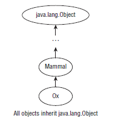
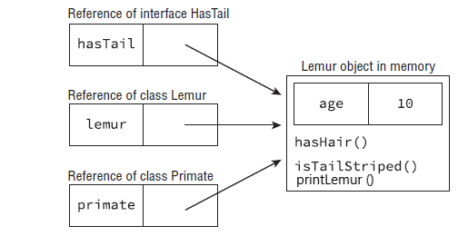

									CLASS DESIGN
									
À la base, une conception de classe Java appropriée concerne la réutilisabilité du code, une fonctionnalité accrue et la standardisation. Par exemple, en créant une nouvelle classe qui étend une classe existante, vous pouvez accéder à un grand nombre de primitives, d'objets et de méthodes hérités. Sinon, en concevant une interface standard pour votre application, vous vous assurez que toute classe qui implémente l'interface dispose de certaines méthodes requises définies. Enfin, en créant des définitions de classe abstraites, vous définissez une plate-forme que d'autres développeurs peuvent étendre et utiliser.   					
# Comprendre l'héritage: (Understanding Inheritance)  
Lors de la création d'une nouvelle classe en Java, vous pouvez définir la classe à hériter d'une classe existante. L'héritage est le processus par lequel la nouvelle sous-classe enfant inclut automatiquement toutes les primitives, objets ou méthodes publics ou protégés définis dans la classe parente.  
À des fins d'illustration, nous nous référons à toute classe qui hérite d'une autre classe en tant que classe enfant, ou un descendant de cette classe. Alternativement, nous nous référons à la classe dont l'enfant hérite en tant que classe parent, ou ancêtre de la classe. Si l'enfant X hérite de la classe Y, qui à son tour hérite de la classe Z, alors X serait considéré comme un enfant indirect, ou descendant, de la classe Z.  
 
Dans le dernier chapitre, vous avez appris qu'il existe quatre niveaux d'accès: public, protégé, package-private et private. Lorsqu'une classe hérite d'une classe parent, tous les membres publics et protégés sont automatiquement disponibles dans le cadre de la classe enfant. Les membres package-private sont disponibles si la classe enfant est dans le même package que la classe parent. Dernier point mais pas le dernier, les membres privés sont restitués à la classe dans laquelle ils sont définis et ne sont jamais disponibles via inheritane. Cela ne signifie pas que la classe parente n'a pas de membres privés qui peuvent contenir des données ou modifier un objet, cela signifie simplement que la classe enfant n'a aucune référence directe accés memebres. 

Regardons cet exemple avec les classes BigCat et Jaguar:

		public class BigCat {
			public double size;
		}
		
		public class Jaguar extends BigCat {
			public Jaguar() {
				size = 10.2;
			}
			
			public void printDetails() {
				System.out.println();
			}
		}
Dans la classe Jaguar, la variable "size" est accessible car elle est marquée publique. Par héritage, la sous-classe Jaguar peut lire ou écrire "size" comme si elle était son propre membre
### Héritage unique vs multiple: (Single vs. Multiple Inheritance)  
Java prend en charge **l'héritage unique** (single inheritance), par lequel une classe peut hériter d'une seule classe parente directe. Java prend également en charge plusieurs niveaux d'héritage, par lesquels une classe peut étendre une autre classe, qui à son tour étend une autre classe. Vous pouvez étendre une classe un nombre illimité de fois, ce qui permet à chaque descendant d’accéder aux membres de ses ancêtres.  
Pour vraiment comprendre l'héritage unique, il peut être utile de le comparer à l'héritage multiple, par lequel une classe peut avoir plusieurs parents directs. Par conception, Java ne prend pas en charge l'héritage multiple dans le langage, car des études ont montré que l'héritage multiple peut conduire à des modèles de données complexes et souvent difficiles à gérer. Java autorise une exception à la règle d'héritage unique: les classes peuvent implémenter plusieurs interfaces, comme vous le verrez plus loin dans le chapite 9.  
### Objet hérité: (Inheriting Object)  
Tout au long de notre discussion sur Java dans ce livre, nous avons jeté de nombreuses fois le mot objet - et avec raison. En Java, toutes les classes héritent d'une seule classe: *java.lang.Object*, ou Object en abrégé. De plus, Object est la seule classe qui n'a pas de classe parente.   
Vous vous demandez peut-être: "Aucune des classes que j'ai écrites jusqu'à présent n'étend Object, alors comment toutes les classes en héritent-elles ?". 
La réponse que le compilateur a inséré automatiquement du code dans toute classe que vous écrivez qui n'étend pas une classe spécifique. Par exemple, considérez les deux définitions de classe équivalentes suivantes:

	public class Zoo {}
	
	public class Zoo extends java.lang.Object {}
Lorsque Java voit que vous définissez une classe qui n'étend pas une autre classe, ajoute automatiquement la syntaxe *extends java.lang.Object* à la définition de classe. Le résultat est que chaque classe accède à toutes les méthodes accessibles de la classe Object. Par exemple, les méthodes toString() et equals() sont disponibles dans Object, par conséquent, elles sont accessibles dans toutes les classes. Sans être redéfinit dans une sous-classe, elles ne peuvent ne pas être bien utiles, nous couvrirons les méthodes de redéfinition plus loin dans ce chapitre.  
D'un autre côté, lorsque vous définissez une nouvelle classe qui étend une classe existante, Java n'étend pas automatiquement la classe Object. Comme toutes les classes héritent d'Object, l'extension d'une classe existante signifie que l'enfant hérite déjà d'Object par définition. Si vous regardez la structure d'héritage de n'importe quelle classe, elle se terminera toujours par Object en haut de l'arborescence, comme le montre la figure.    

		
# Créer des classes: (Creating Classes)  
Maintenant que nous avons établi le fonctionnement de l'héritage en Java, nous pouvons l'utiliser pour définir et créer des relations de classe complexes. Dans cette section, nous passerons en revue les bases de la création et de l'utilisation des classes.  
### Extension d'une classe: (Extending a Class)   
En Java, vous pouvez étendre une classe en ajoutant le nom de la classe parent dans la définition à l'aide du mot clé **extends**. La syntaxe de définition et d'extension d'une classe est affichée ci-dessous:  

	public abstract class ElephantSeal extends Seal {
		// Methods and Variables defined here
	}
* public: access modifier, il peut être public ou default (package-private) 
* abstract: keyword (optional) abstract or final 
* class: class keyword (required)
* ElephantSeal: class name
* extends Seal: extends parent class (optional)

Comme Java n'autorise qu'une seule classe publique par fichier, nous pouvons créer deux fichiers, Animal.java et Lion.java, dans lesquels la classe Lion étend la classe Animal. En supposant qu'ils sont dans le même package, une instruction d'importation n'est pas requise dans Lion.java pour accéder à la classe Animal.
Voici le contenu d'Animal.java:  

		public class Animal {
			 private int age;
			 protected String name;
			 
			 public int getAge() {
				 return age;
			 }
			 
			 public void setAge(int age) {
				 this.age = age;
			 }
		}
Et voici le contenu de Lion.java:

	public class Lion extends Animal {
	
		 public void setProperties(int age, String n) {
			 setAge(age);
			 name = n;
			 
		 }
		 private void roar() {
			 System.out.println(name + ", age " + getAge() + ", says: Roar!");
		}
		 
		public static void main(String[] args) {
			var lion = new Lion();
			lion.setProperties(3, "kio");
			lion.roar();
		}
	}
Le mot clé extend est utilisé pour exprimer que la classe Lion hérite de la classe Animal. Une fois exécuté, le programme Lion affiche les éléments suivants: *kio, age 3, says: Roar!*  

Jetons un coup d'œil aux membres de la classe Lion. La variable d'instance age est marquée comme privée et n'est pas directement accessible depuis la sous-classe (subclass) Lion. Par conséquent, ce qui suit ne compilerait pas:

	public class Lion extends Animal {
		private void roar() {
		System.out.println("The "+age+" year old lion says: Roar!");
	 	// DOES NOT COMPILE
	  }
    }
La variable "age" n'est pas accessible directement parce qu'elle marqué privée dans la classe Animal, en revanche elle est accessible indirectement via setAge et getAge méthodes.
La variable name est accessible directement parce qu'elle est protected dans la classe Animal.  
### Application des modificateurs d'accès aux classes: (Applying Class Access Modifiers) 
Vous pouvez appliquer des modificateurs d'accès (public, privé, protégé, par défaut) aux méthodes de classe et aux variables. Ce n'est pas surprenant que vous puissiez également appliquer des modificateurs d'accès aux définitions de classe, puisque nous avons ajouté le modificateur d'accès public à presque toutes les classes jusqu'à présent.  
En Java, une classe de **niveau supérieur (top-level)** est une classe qui n'est pas définie dans une autre classe c'est à dire **n'est pas une classe interne (inner class)**. La plupart des cours de ce livre sont des cours de haut niveau.  
Ils ne peuvent avoir qu'un accès public ou package-privé. L'application d'un accès public à une classe indique qu'elle peut être référencée et utilisée dans n'importe quelle classe. L'application de l'accès par défaut (package-private), dont vous vous souviendrez est l'absence de tout modificateur d'accès, indique que la classe n'est accessible que par une classe dans le même package.   
* Remarque: Une classe interne **(innner class)** est une classe définie à l'intérieur d'une autre classe (au contraire d'une classe de premier niveau). En plus de l'accès public et package-privé, les classes internes peuvent également avoir un *accès protégé et privé*. Nous discuterons des classes internes au chapitre 9.

Un fichier Java peut avoir plusieurs classes de premier-niveau mais une seule classe de premier niveau avec l'accés public. En fait, il se peut qu'il n'y ait aucune classe publique du tout. L'un des avantages de l'utilisation du modificateur private de package par défaut est que vous pouvez définir plusieurs classes dans le même fichier Java. Par exemple, la définition suivante peut apparaître dans un seul fichier Java nommé Groundhog.java, car il ne contient qu'une seule classe public:  

		class Rodent {}
		public class Groundhog extends Rodent {}
Si on ajoute devant la classe Rodent le modificateur d'accés public le fichier Groundhog.java ne se compilerait, pour corriger ça on doit la classe Rodent était déplacée vers son propre fichier Rodent.java.  
### Accéder à cette "this" référence: (Accessing the this Reference) 
Que se passe-t-il lorsqu'un paramètre de méthode porte le même nom qu'une variable d'instance existante ? Jetons un œil à un exemple. Que pensez-vous que le programme suivant affiche ?  

		public class Flamingo {
		
			private String color;
			
			public void setColor(String color) {
				color = color;
			}
			public static void main(String[] args) {
				Flamingo f = new Flamingo();
				f.setColor("PINK");
				System.out.println(f.color);
			}
		}
Ce code affiche "null", Java utilise la portée la plus granulaire (pécis), donc quand on a fait color = color, on a assigné la valeur du paramètre de méthode par lui-même, et la variable d'instance color n'est jamais était modifier, c'est pour cela on afficher null dans la méthode main().   
Le correctif lorsque vous avez une variable locale avec le même nom qu'une variable d'instance consiste à utiliser la référence "this" ou le mot-clé "this".  
La référence *this* fait référence à l'instance actuelle de la classe et peut être utilisée pour accéder à n'importe quel membre de la classe, y compris les membres hérités. Il peut être utilisé dans n'importe quelle méthode d'instance, constructeur et bloc d'initialisation d'instance. Il ne peut pas être utilisé lorsqu'il n'y a pas d'instance implicite de la classe, comme dans une méthode statique ou un bloc d'initialisation statique. Nous appliquons *this* à notre implémentation précédente de methos comme suit: 

			public void setColor(String color) {
				this.color = color;
			}
Le code corrigé imprimera maintenant PINK, Dans de nombreux cas, la référence *this* est facultative. Si Java rencontre une variable ou une méthode qu'il ne trouve pas, il vérifiera la hiérarchie des classes pour voir si elle est disponible.  
Voyons maintenant quelques exemples qui ne sont pas courants mais que vous pourriez voir à l'examen:  

	public class Duck {
	
		private String color;
		private int height;
		private int length;
		
		public void setData(int length, int theHeight) {
			length = this.height; // Backward - no good
			height = theHeight;	// Fine because a different name
			this.color = "white";	// Fine, but this not necessary
		}
		public static void main(String[] args) {
			Duck b = new Duck();
			b.setData(1, 2);
			System.out.println(b.length +" " + b.height + " " + b.color);
		}
	}
Ce code affiche: *0 2 white*    
### Appel de la super référence: (Calling the super Reference)    
En Java, une variable ou une méthode peut être définie à la fois dans une classe parent et dans une classe enfant. Lorsque cela se produit, comment référencer la version dans la classe parente au lieu de la classe actuelle ?
Pour ce faire, vous pouvez utiliser la référence ou le mot-clé *super*. La super référence est similaire à la référence *this*, sauf qu'elle exclut tous les membres trouvés dans la classe actuelle. En d'autres termes, le membre doit être accessible via l'héritage. La classe suivante montre comment appliquer *super* pour utiliser deux variables avec le même nom dans une méthode:  

		class Mammal{
			String type = "mammal";
		}

		public class Bat extends Mammal{		
			String type = "bat";
			public String getType() {
				return super.type + ":" + this.type;
			}
			public static void main(String[] args) {
				System.out.println(new Bat().getType());
			}
		}
Le programme affiche: *mammal:bat*    
Que pensez-vous si la *super référence* était supprimée ? le programme affichera: *bat:bat*    
Java utilise la portée la plus petite possible - dans ce cas la variable "type" définie dans la classe Bat.      

Voyons si vous avez compris this et super. Que produit le programme suivant ?

	class Insect {
		protected int numberOfLegs = 4;
		String label = "buggy";
	}
	public class Beetle extends Insect{
		protected int numberOfLegs = 6;
		short age = 3;
		public void printData() {
			System.out.println(this.label);	// buggy
			System.out.println(super.label);	// buggy
			System.out.println(this.age);	// 3
			System.out.println(super.age);	// DOES Not Compile
			System.out.println(super.numberOfLegs);		// 4
			System.out.println(numberOfLegs);	// 6
		}
		public static void main(String[] args) {
			new Beetle().printData();
		}
	}
* Ce code ne compile pas.
* label: est definit dans la classe parent, cette variable est accessible à la fois par this et super référence.  
* age: est définit seulement dans la classe fille, donc elle est accissible via le mot clé this et non super, et pour cela le programme ne compile pas.
* numberOfLegs: est définit dans la classe mère est fille, donc avec super.numberOfLegs on accède à la classe mère et super.numberOfLegs pour accéder à la classe fille. 

# Déclarer les constructeurs: (Declaring Constructors)  
Comme vous l'avez appris au chapitre 2, un constructeur est une méthode spéciale qui correspond au nom de la classe et qui n'a pas de type de retour. Il est appelé lorsqu'une nouvelle instance de la classe est créée. Pour l'examen, vous aurez besoin de connaître de nombreuses règles sur les constructeurs. Dans la section, nous montrerons comment créer un constructeur. Ensuite, nous examinerons les constructeurs par défaut, la surcharge des constructeurs, l'appel des constructeurs parents, les champs finaux et l'ordre d'initialisation dans une classe.  
### Créer un constructeur: (Creating a Constructor)  
Commençons par un constructeur simple:  

		public class Bunny {
			public Bunny() {
				System.out.println("constructor");
			}
		}
Le nom du constructeur, Bunny, correspond au nom de la classe, Bunny, et il n'y a pas de *type de retour*, même pas void. Cela en fait un constructeur.   
Pouvez-vous dire pourquoi ces deux constructeurs ne sont pas valides pour la classe Bunny ?

		public bunny() { } // DOES NOT COMPILE
		public void Bunny() { }
Le premier ne correspond pas au nom de la classe car Java est sensible à la casse. Comme il ne correspond pas, Java sait qu'il ne peut pas être un constructeur et qu'il est censé être une méthode régulière. Cependant, il manque le type de retour et ne compile pas.      
La deuxième méthode est une méthode parfaitement bonne, mais n'est pas un constructeur car elle a un type de retour.        

Comme les paramètres de méthode, les paramètres de constructeur peuvent être n'importe quel type de classe, tableau ou primitif valide, y compris les génériques, mais ne peuvent pas inclure **var**. ce qui suit ne compile pas:        

		class Bonobo {
			public Bonobo(var food) {	// DOES NOT COMPILE
			}
		}
Une classe peut avoir plusieurs constructeurs, à condition que chaque constructeur ait une signature unique. Dans ce cas, cela signifie que les paramètres du constructeur doivent être distincts. Comme les méthodes avec le même nom mais avec des signatures différentes, la déclaration de plusieurs constructeurs avec des signatures différentes est appelée surcharge de constructeur. La classe Turtle suivante a quatre constructeurs surchargés distincts:

		public class Turtle {
			private String name;
			
			public Turtle() {
				name = "John Doe";
			}
			public Turtle(int age) {}
			public Turtle(long age) {}
			public Turtle(String newName, String... favoriteFoods) {
				name = newName;
			}
		}
Les constructeurs sont utilisés lors de la création d'un nouvel objet. Ce processus est appelé instanciation car il crée une nouvelle instance de la classe. Un constructeur est appelé lorsque nous écrivons *new* suivi du nom de la classe que nous voulons instancier. Par exemple:

	new Turtle()
Lorsque Java voit le mot-clé *new*, il alloue de la mémoire pour le nouvel objet. Java recherche également un constructeur et l'appelle.
### Constructeur par défaut: (Default Constructor)  
Chaque classe en Java a un constructeur, que vous en codiez un ou non. Si vous n'incluez aucun constructeur dans la classe, Java en créera un pour vous sans aucun paramètre.  
Ce constructeur créé par Java est appelé le constructeur par défaut et est ajouté à chaque fois qu'une classe est déclarée sans aucun constructeur. Nous l'appelons souvent le constructeur sans arguments par défaut pour plus de clarté. Voici un exemple:  

		public class Rabbit {
			public static void main(String[] args) {
				Rabbit rabbit = new Rabbit(); // Calls default constructor
			}
		}
Dans la classe Rabbit, Java voit qu'aucun constructeur n'a été codé et en crée un. Ce constructeur par défaut équivaut à taper ceci:  

		public Rabbit() {}
Le constructeur par défaut a une liste de paramètres vide et un corps vide. Il est juste que vous saisissiez cela en vous-même. Cependant, comme il ne fait rien, Java se fera un plaisir de vous le fournir et de vous éviter de taper.
Nous n'arrêtons pas de dire généré. Cela se produit pendant l'étape de *compilation*. Si vous regardez le fichier avec l'extension .java, le constructeur sera toujours manquant. Ce n'est que dans le fichier compilé avec l'extension.class qu'il fait son apparition.     

Lorsque le compilateur ajoute le constructeur par défaut il met **le même modificateur d'accés** de la classe. Regardons cet exemple:     

	class Foo { }
le compilateur ajoute le constructeur par défaut:     

	Foo() {} // package-private like her class      
N'oubliez pas qu'un constructeur par défaut n'est fourni que s'il n'y a pas de constructeur présent. Selon vous, laquelle de ces classes a un constructeur par défaut ?

		class Rabbit1 {
		}
		class Rabbit2 {
		 public Rabbit2() { }
		}
		class Rabbit3 {
		 public Rabbit3(boolean b) { }
		}
		class Rabbit4 {
		 private Rabbit4() { }
		}
Seul Rabbit1 a un constructeur sans argument par défaut. Voyons rapidement comment appeler ces constructeurs:  

		public class RabbitsMultiply {
			public static void main(String[] args) {
				Rabbit1 r1 = new Rabbit1();
				Rabbit2 r2 = new Rabbit2();
				Rabbit3 r3 = new Rabbit3(true);
				Rabbit4 r4 = new Rabbit4(); // DOES NOT COMPILE
		} }
Rabbit4 a rendu le constructeur privé afin que les autres classes ne puissent pas l'appeler, donc ne compile pas.  
*Remarque:* Avoir un constructeur privé dans une classe indique au compilateur de ne pas fournir de constructeur noargument par défaut. Cela empêche également les autres classes d'instancier la classe. Ceci est utile lorsqu'une classe n'a que des méthodes statiques ou que la classe veut contrôler tous les appels pour créer de nouvelles instances d'elle-même.   
### Appel de constructeurs surchargés avec this(): (Calling Overloaded Constructors with this())  
N'oubliez pas qu'une seule classe peut avoir plusieurs constructeurs. C'est ce qu'on appelle la surcharge de constructeur car tous les constructeurs ont le même nom inhérent mais une signature différente.  
Jetons un coup d'œil à cela plus en détail en utilisant une classe Hamster:   

	public class Hamster {
		 private String color;
		 private int weight;
		 
		 public Hamster(int weight) { // first constructor
			 this.weight = weight;
			 color = "brown";
		 }
		 
		 public Hamster(int weight, String color) { // second constructor
			 this.weight = weight;
			 this.color = color;
		 }
	}
L'un des constructeurs prend un seul paramètre int. L'autre prend un int et un String. Ces listes de paramètres sont différentes, les constructeurs sont donc surchargés avec succès.  
Il y a cependant un problème ici. Il y a un peu de duplication. En programmation, même un peu de duplication a tendance à se transformer en beaucoup de duplication. Ce que nous voulons vraiment, c'est que le premier constructeur appelle le second constructeur avec deux paramètres. Vous pourriez être tenté d'écrire ceci:  

		public Hamster(int weight) {
			Hamster(weight, "brown"); // DOES NOT COMPILE
		}
Cela ne fonctionnera pas. Les constructeurs ne peuvent être appelés qu'en écrivant **new** avant le nom du constructeur. Ce ne sont pas des méthodes normales que vous pouvez simplement appeler. Que se passe-t-il si nous plaçons new avant le nom du constructeur ?

		public Hamster(int weight) {
			new Hamster(weight, "brown"); // Compiles but does not do what we want
		}
Cette tentative compile. Cependant, cela ne fait pas ce que nous voulons !
Java fournit une solution: *this* - oui, le même mot-clé que nous avons utilisé pour désigner les variables d'instance. Lorsqu'il est utilisé comme s'il s'agissait d'une méthode, Java appelle un autre constructeur sur la même instance de la classe.  

		public Hamster(int weight) {
			this(weight, "brown");
		}
Succès! Maintenant, Java appelle le constructeur qui prend deux paramètres. le poids et la couleur sont définis sur cette instance.
L'appel de this() a une règle spéciale que vous devez connaître. Si vous choisissez de l'appeler, l'appel this() doit être la première instruction du constructeur. L'effet secondaire de ceci est qu'il ne peut y avoir qu'un seul appel à this() dans n'importe quel constructeur.  

		public Hamster(int weight) {
			System.out.println("in constructor");
			// ready to call this
			this(weight, "brown"); // DOES NOT COMPILE
		}
Même si une instruction d'affichage ne change aucune variable, il s'agit toujours d'une instruction Java et ne peut pas être insérée avant l'appel à this(). Le commentaire. Les commentaires n'exécutent pas d'instructions Java et sont autorisés partout.  
Le compilateur est capable de détecter que ce constructeur s'appelle lui-même indéfiniment. Étant donné que ce code ne peut jamais se terminer, le compilateur s'arrête et signale cela comme une erreur. De même, cela ne compile pas non plus:  

		public class Gopher {
			public Gopher() {
				this(5);	// DOES NOT COMPILE
			}
			public Gopher(int dugHoles) {
				this();	// DOES NOT COMPILE
			}
		}
Ce code ne compile pas à cause: *Recursive constructor invocation*
* this vs. this(): Malgré l'utilisation du même mot-clé, this et this() sont très différents. Le premier, this, fait référence à une instance de la classe, tandis que le second, this(), fait référence à un appel de constructeur dans la classe. L'examen peut essayer de vous tromper en utilisant les deux ensemble, alors assurez-vous de savoir lequel utiliser et pourquoi.

### Appel du constructeur parent avec super(): (Calling Parent Constructor with super())  
En Java, **la première instruction de chaque constructeur** est soit un appel à un autre constructeur de la classe, en utilisant this(), soit un appel à un constructeur dans la classe parent directe, en utilisant super().   
Si un constructeur parent prend des arguments, **l'appel super() prend également des arguments**.         
Jetons un coup d'œil à la classe Animal et à sa sous-classe Zebra et voyons comment leurs constructeurs peuvent être correctement écrits pour en appeler un autre:

		public class Animal {
			private int age;
			public Animal(int age) {
				super();	// Refers to constructor in java.lang.Object
				this.age = age; 
			}
		}
		
		public class Zebra extends Animal {
			public Zebra(int age) {
				super(age);	// Refers to constructor in Animal
			}
			public Zebra() {
				this(4); // Refers to constructor in Zebra with int argument
			}
		}
Dans la première classe Animal, la première instruction du constructeur est un appel au constructeur parent défini dans java.lang.Object qui ne prend aucun argument.  
Dans la deuxième classe Zebra, la première instruction du premier constructeur est un appel au constructeur d'Animal, qui prend un seul argument. La classe Zebra comprend également un second constructeur sans argument qui n'appelle pas super() mais appelle à la place l'autre constructeur de la classe Zebra en utilisant this(4).  
Comme this(), la super() ne peut être utilisée que comme *première instruction du constructeur*. Par exemple, les deux définitions de classe suivantes ne seront pas compilées:   

		public class Zoo {
			public Zoo() {
				System.out.println("Zoo created");
				super(); // DOES NOT COMPILE
			}
		}
Deuxième exemple:

		public class Zoo {
			public Zoo() {
				super();
				System.out.println("Zoo created");
				super(); // DOES NOT COMPILE
			}
		}
La première classe ne sera pas compilée car l'appel au constructeur parent doit être la première instruction du constructeur.  
Dans le deuxième extrait de code, super() est la première instruction du constructeur, mais elle est également utilisée comme troisième instruction. Puisque super() ne peut être utilisé que comme la première instruction du constructeur, le code ne se compilera pas non plus.  

Si la classe parent a plus d'un constructeur, la classe enfant peut utiliser n'importe quel constructeur parent valide dans sa définition, comme illustré dans l'exemple suivant:  

		public class Animal {
			private int age;
			private String name;
			public Animal(int age, String name) {
				super();
				this.age = age;
				this.name = name;
			}
			public Animal(int age) {
				super();
				this.age = age;
				this.name = null;
			}
		}
		
		public class Gorilla extends Animal {
			public Gorilla(int age) {
				super(age,"Gorilla");
			}
			public Gorilla() {
				super(5);
			}
		}
Dans cet exemple, le premier constructeur enfant prend un argument, age, et appelle le constructeur parent, qui prend deux arguments, age et name. Le deuxième constructeur enfant n'accepte aucun argument et appelle le constructeur parent, qui prend un argument, age. Dans cet exemple, notez que les constructeurs enfants ne sont pas obligés d'appeler les constructeurs parents correspondants. Tout constructeur parent valide est acceptable tant que les paramètres d'entrée appropriés au constructeur parent sont fournis.  
* Remarque: comme this et this(), super et super() ne sont pas liés en java. le super est utilisé pour référencer les membres de la classe parent. tandis que supe() appelle un constructeur parent.   

##### Comprendre les améliorations du compilateur: (Understanding Compiler Enhancements)  
Attendez une seconde, nous avons dit que la première ligne de chaque constructeur est un appel à this() ou super(), mais nous avons créé des classes et des constructeurs tout au long de ce livre, et nous l'avons rarement fait non plus. 
alors pourquoi le code a-t-il été compilé? La réponse est que le compilateur Java insère automatiquement un appel au constructeur sans argument super() si la première instruction n'est pas un appel au constructeur parent. Par exemple, les trois définitions de classe et de constructeur suivantes sont équivalentes, car le compilateur les convertira automatiquement dans le *dernier exemple*:  

		public class Donkey {
		
		}
		public class Donkey {
			public Donkey() {
			}
		}
		public class Donkey {
			public Donkey() {
				super();
			}
		}
Assurez-vous que vous comprenez les différences entre ces trois définitions de classe Donkey et pourquoi Java les convertira toutes automatiquement à la dernière définition. Gardez à l'esprit le processus de compilation Java lorsque nous aborderons les quelques exemples suivants.  
##### Il manque un constructeur sans argument par défaut: (Missing a Default No-Argument Constructor)  
Que se passe-t-il si la classe parente n’a pas de constructeur sans argument ? Rappelez-vous que le constructeur sans argument n'est pas obligatoire et n'est inséré que s'il n'y a pas de constructeur défini dans la classe. Dans ce cas, le compilateur Java n'aidera pas et vous devez créer au moins un constructeur dans votre classe enfant qui appelle explicitement un constructeur parent via la commande super(). Par exemple, le code suivant ne sera pas compilé:  

		public class Mammal{
			public Mammal(int age) {
			}
		}
		public class Elephant extends Mammal{	// DOES NOT COMPILE
		}
Puisque Elephant ne définit aucun constructeur, le compilateur Java tentera d'insérer un constructeur sans argument par défaut. En tant que deuxième amélioration lors de la compilation, il insérera également automatiquement un appel à super() comme première ligne du consturcteur sans argument par défaut. Notre précédente déclinaison Elephant est ensuite convertie par le compilateur en la déclaration suivante:

	public class Elephant extends Mammal{	
		public Elephant(){
			super();	// DOES NOT COMPILE
		}
	}
Étant donné que la classe Mammal a au moins un constructeur déclaré, le compilateur n'insère pas de constructeur sans argument par défaut. Par conséquent, l'appel super() dans la déclaration de classe Elephant ne compile pas. Dans ce cas, le compilateur Java n'aidera pas, et vous devez créer au moins un constructeur dans votre classe enfant qui appelle explicitement un constructeur parent via la commande super().    
Nous pouvons résoudre ce problème en ajoutant un appel à un constructeur parent qui prend un **argument fixe**, **ou** on ajoute un consturcteur avenc **un argument**.    
On commance par la **1ere** solution:    

	public class Elephant extends Mammal{	
		public Elephant(){
			super(10);	// COMPILE
		}
	}
Ce code compilera car nous avons ajouté un constructeur avec un appel explicite à un constructeur parent. Notez que la classe Elephant a maintenant un constructeur sans argument même si sa classe parent Mammal n'en a pas. Les sous-classes peuvent définir des constructeurs sans argument même si leurs classes parentes ne le font pas, à condition que le constructeur de l'enfant mappe à un constructeur parent via un appel explicite de la commande super().   
Cela signifie que les sous-classes de l'éléphant peuvent s'appuyer sur les améliorations du compilateur. Par exemple, la classe suivante se compile car Elephant a maintenant un constructeur sans argument, bien qu'il soit défini explicitement

	public class AfricanElephant extends Elephant { }	// COMPILE
Vous devez vous méfier de toute question d’examen dans laquelle la classe parente définit un constructeur qui prend des arguments et ne définit pas de constructeur sans argument. Assurez-vous de vérifier que le code se compile avant de répondre à une question à ce sujet.    
La **2eme** solution:  

	public class Elephant extends Mammal{	
		int x;
		public Elephant(int x){
			super(x);	// COMPILE
		}
	}
* Remarque: si on écrit ce code:    

		public class Elephant extends Mammal{	
			int x;
			public Elephant(){
				super(x);	// DOES NOT COMPILE 
			}
		} 
C'est normal que ce code ne compile pas, est on a ce message d'erreure *Impossible de faire référence à un champ d'instance arg tout en appelant explicitement un constructeur*, en fait on essaye de passer une variable d'instance à un constructeur avant qu'on construit l'instance, c'est aberrant!     
   
*super() fait toujours référence au parent le plus direct: (super() always Refers to the Most Direct Parent)* Une classe peut avoir plusieurs ancêtres via l'héritage. Dans notre exemple précédent, AfricanElephant est une sous-classe de la classe Elephant, qui à son tour est une sous-classe de Mammel. Pour les constructeurs via super() fait toujours référence au parent le plus direct. Dans cet exemple, appeler super() dans la classe AfricanElephant fait toujours référence à la classe Elephant, et jamais à la classe Mammel.   
### Constructeurs et les champs final: (Constructors and final fields)  
La valeur final static doit se voir attribuer une valeur exactement une seule fois. vous avez vu cela se produire dans la ligne de la déclaration et dans un initialiseur statique. Les variables d'instance marquées comme finales suivent des règles similaires. Des valeurs peuvent leur être affectées dans la ligne dans laquelle elles sont déclarées ou dans un initialiseur d'instance.

	 public class MouseHouse {
		 private final int volume;
		 private final String name = "The Mouse House";
		 {
			 volume = 10;
		 }
	 }
Comme les autres variables finales, une fois que la valeur est affectée, elle ne peut pas être modifiée. Le constructeur fait partie du processus d'initialisation, il est donc autorisé à y affecter une variable d'instance finale. Pour l'examen, vous devez connaître une règle importante. Au moment où le constructeur se termine, toutes les variables d'instance finale doivent recevoir une valeur. Essayons ceci dans un exemple:  

		public class MouseHouse {
			 private final int volume;
			 private final String name = "The Mouse House";
			 public MouseHouse(int length, int width, int height) {
				 volume = length * width * height;
			 }
		}
Dans notre implémentation MousseHouse, les valeurs de "volume" et "type" sont attribuées dans le constructeur. N'oubliez pas que le mot-clé «this» est facultatif car la variable d'instance fait partie de la déclaration de classe et qu'il n'y a pas de paramètres de constructeur portant le même nom.  
Contrairement à la variable finale locale, qui n'est pas obligée d'avoir une valeur sauf si elle est réellement utilisée, la variable d'instance finale doit se voir attribuer une valeur. Les valeurs par défaut ne sont pas utilisées pour ces variables. Si aucune valeur ne leur est affectée dans la ligne où ils sont déclarés ou dans un initialiseur d'instance, une valeur doit leur être attribuée dans la déclaration du constructeur.
Si vous ne le faites pas, une erreur du compilateur se produira sur la ligne qui déclare le constructeur.  

		public class MouseHouse {
			 private final int volume;
			 private final String type;
			 {
				 volume = 10;
			 }
			 public MouseHouse(String type) {
				 this.type = type;
			 }
			 public MouseHouse() {	// DOES NOT COMPILE
				 this.volume = 2;	// DOES NOT COMPILE
			 }
		}
Dans cet exemple, le premier constructeur qui accepte un argument String se compile. Bien qu'une variable d'instance finale ne puisse recevoir une valeur qu'une seule fois, chaque constructeur est considéré indépendamment en termes d'affectation. 
Le deuxième constructeur ne compile pas pour deux raisons: Tout d'abord, le constructeur ne parvient pas à définir une valeur pour la variable "type". Le compilateur détecte qu'une valeur n'est jamais définie pour "type" et signale une erreur sur la ligne où le constructeur est déclaré. Deuxièmement, le constructeur définit une valeur pour la variable de volume, et comme cette variable est attribué avec une valeur par l'initialiseur d'instance. Le compilateur signale cette erreur sur la ligne où le "volume" est défini.
### Ordre d'initialisation: (Order of Initialization)  
Dans le chapitre 2, nous avons présenté l'ordre d'initialisation. Avec l'héritage, à travers, l'ordre d'initialisation d'une instance devient un peu plus compliqué. Nous allons commencer par comment initialiser la classe, puis nous développerons l'initialisation de l'instance.  
##### Initialisation de classe: (Class Initialization)   
Tout d'abord, vous devez initialiser la classe, ce qui implique d'appeler tous les membres statiques de la hiérarchie de classes, en commençant par la superclasse la plus élevée et en descendant. Ceci est souvent appelé chargement de la classe. La JVM contrôle le moment où la classe est initialisée, bien que vous puissiez supposer que la classe est chargée avant d'être utilisée. La classe peut être initialisée au premier démarrage du programme, lorsqu'un membre statique de la classe est référencé ou peu de temps avant la création d'une instance de la classe.   
La règle la plus importante avec l'initialisation de classe est que cela se produit au plus une fois pour chaque classe. La classe peut également ne jamais être chargée si elle n'est pas utilisée dans le programme. Nous résumons l'ordre d'initialisation d'une classe comme suit:  
*Initialize Class X:*
* S'il existe une superclasse Y de X, initialisez d'abord la classe Y.  
* Traitez toutes les déclarations de variables static dans l'ordre dans lequel elles apparaissent dans la classe.   
* Traitez tous les initialiseurs static dans l'ordre dans lequel ils apparaissent dans la classe.  

En regardant un exemple, qu'est-ce que le programme suivant affiche ?  

		class Animal{
			static {System.out.print("A");}
		}
		public class Hippo extends Animal{
			static {System.out.print("B");}
			public static void main(String[] args) {
				System.out.print("C");
				new Hippo();
				new Hippo();
				new Hippo();
			}
		}
Ce programme affiche *ABC*. Puisque la méthode main() est à l'intérieur de la classe Hippo, la classe sera initialisée en premier, en commençant par la superclasse et en imprimant AB. Ensuite, la méthode main() est exécutée, imprimant C. Même si la méthode main() crée trois instances, **la classe** n'est chargée (initialisée) **qu'une seule fois**.  
##### Initialisation de l'instance: (Instance Initialization)  
Une instance est initialisée à chaque fois que le mot-clé new est utilisé. Dans notre exemple précédent, il y avait trois nouveaux appels Hippo(), entraînant l'initialisation de trois instances Hippo. L'initialisation d'une instance est un peu plus compliquée que l'initialisation de classe, car une classe ou une superclasse peut avoir de nombreux constructeurs déclarés, mais seulement un seul constructeur est utilisé dans le cadre de l'initialisation de l'instance.  
Tout d'abord, commencez par le constructeur de niveau le plus bas où le mot-clé new est utilisé. Rappelez-vous, la première ligne de chaque constructeur est un appel à this() ou super(), et si omis, le compilateur insérera automatiquement un appel au constructeur sans-argument parent super(). Ensuite, progressez vers le haut et notez l'ordre des constructeurs. Enfin, initialisez chaque classe en commençant par la superclasse, en traitant chaque initialiseur et constructeur d'instance dans l'ordre inverse dans lequel il a été appelé. Nous résumons l'ordre d'initialisation d'une instance comme suit:  
*Initialize Instance of X:*
* S'il y a une superclasse Y de X, initialisez d'abord l'instance de Y.
* Traitez toutes les déclarations de variables d'instance dans l'ordre dans lequel elles apparaissent dans la classe.
* Traitez tous les initialiseurs d'instance dans l'ordre dans lequel ils apparaissent dans la classe.
* Initialisez le constructeur en incluant tous les constructeurs surchargés référencés par this().  

Essayons un exemple simple sans héritage. Voyez si vous pouvez comprendre ce que les applications suivantes produisent:  

		public class ZooTickets {
			private String name = "BestZoo";	// line 2
			{System.out.println(name+"-");}	// line 3
			private static int COUNT = 0;	// line 4
			static{System.out.println(COUNT+"-");}	// line 5
			static {COUNT += 10; System.out.println(COUNT+"-");}	// line 6
			
			public ZooTickets( ) {	// line 8
				System.out.println("z-");	// line 9
			}	// line 10
			
			public static void main(String... patrons) {
				new ZooTickets();	// line 13
			}
		}
Ce programme affiche : **0-10-BestZoo-z-**, voila l'explication ci-dessous:
En premier lieu on doit initialiser la classe, étant donné que la classe ZooTickets n'a pas une class mère (bien évidament la classe Objetc et ça class mère), donc on commence par les composants static. Dans notre cas les lignes 4, 5 et 6 seront exécutées en affichant "0-10". Ensuite, on initialise les instances, et comme n'a pas un classe mère nous commençons par les composants d'instances, les lignes 2 et 3 seront exécutées en affichant "BestZoo-". Finalement, on exécute le consturcteur (les ligne 8, 9 et 10) en affichant "z-".        
Si on crée une deuxième instance de ZooTickets: new ZooTickets(); on affiche "BestZoo-z-", il ne faut oublie que l'initialisation de la classe se fait une seule fois.

Ensuite, essayons un exemple simple avec héritage:  

		class Primate{
			public Primate() {
				System.out.print("Primate-");
			}
		}
		class Ape extends Primate{
			public Ape(int fur) {
				System.out.print("Ape1-");
			}
			public Ape() {
				System.out.print("Ape2-");
			}
		}
		public class Chimpanzee extends Ape{
			public Chimpanzee() {
				super(2);
				System.out.print("Chimpanzee-");
			}
			public static void main(String[] args) {
				new Chimpanzee();
			}
		}
Le compilateur insère la commande super () comme première instruction des constructeurs Primate et Ape. Le code s'exécutera avec les constructeurs parents appelés en premier et produira la sortie suivante: *Primate-Ape1-Chimpanzee-*   
Notez que seul l'un des deux constructeurs Ape() est appelé. Vous devez commencer par l'appel à new Chimpanzee() pour déterminer quels constructeurs seront exécutés. Se souvient, les constructeurs sont exécutés de bas en haut.  

L'exemple suivant est un peu plus difficile. Que pensez-vous qu'il se passe ici ? 

		public class Cuttlefish {
			private String name = "swimmy";
			{ System.out.print(name+"-"); }
			private static int COUNT = 0;
			static { System.out.print(COUNT+"-");}
			{ COUNT++; System.out.print(COUNT+"-"); }
			
			public Cuttlefish() {
				System.out.println("Constructor");
			}
			public static void main(String[] args) {
				System.out.print("Ready-");
				new Cuttlefish();
			}
		} 
Ce programme affiche: **0-Ready-swimmy-1-Constructor**  
Dans notre cas la classe Cuttlefish n'a pas de classe mère donc on peut ignorer les règles de l'héritage. En commençant par les variables statics et les initialiseurs statics, on affciher "0-", ensuite en exécture la méthode main() en affichant "Ready-" après on exécute les variables d'instances et les initialiseurs d'instances en affichant "swimmy-1-". A la fin on exécute le constructuer "Constructor".   ,

Prêt pour un exemple plus difficile: 

		class GiraffeFamily {
			static { System.out.print("A"); }
			{ System.out.print("B"); }
			
			public GiraffeFamily(String name) {
				this(1);
				System.out.print("C");
			}
			public GiraffeFamily() {
				System.out.print("D");
			}
			public GiraffeFamily(int stripes) {
				System.out.print("E");
			}
		}
		public class Okapi extends GiraffeFamily{
			static { System.out.print("F"); }
			
			public Okapi(int stripes) {
				super("sugar");
				System.out.print("G");
			}
			{ System.out.print("H"); }
			
			public static void main(String[] args) {
				new Okapi(1);
				System.out.println();
				new Okapi(2);
			}
		}
Ce programme affiche:     

		AFBECHG
		BECHG
On commence par l'initialisation de la classe Okapi, or elle a une classe mère GiraffeFamily, donc elle sera initialisée avant donc on affiche "A" ensuite "F".
Après l'initialisation de la classe, on exécute la méthode main(), la première ligne de cette méthode est new Okapi, cette ligne déclanche le process d'initialisation d'instance. Et comme Okapi a une superclasse, alors on commence par GiraffeFamily et on affiche "B". Selon la quatrième règle, nous initialisons les constructeurs donc on exécute le constructeur Okapi(int stripes), qui a sont tour appelle le consturcteur avec le paramètre String de sa superclasse ensuite l'appel this(1) tous ça affiche "EC", car les corps du constructeur sont déroulés dans l'ordre inverse qu'ils ont appelé.
Le process continu avec l'initialisation de l'initialiseur d'instance qui affiche "H", ensuite la fin du constructeur qui affiche "G".
La deuxième instanciation du l'objet Okapi, repecte le même ordre d'initialisation du premier objet sans l'initialisation de la class, du coup on affiche "BECHG".
### Révision des règles du constructeur: (Reviewing Constructor Rules)  
Passons en revue certaines des règles de constructeur les plus importantes que nous avons couvertes dans la partie du chapitre:  
1. La première instruction de chaque constructeur est un appel à un constructeur surchargé via this(), ou à un constructeur du parent direct via super().  
2. Si la première instruction d'un constructeur n'est pas un appel à this() ou à super(), le compilateur insérera un super() sans argument après la première instruction d'un constructeur.  
3. L'appel de this() et super() après une instruction d'un constructeur entraîne une erreur du compilateur.
4. Si la classe parente n'a pas de constructeur sans-argument, alors chaque constructeur de la classe enfant doit commencer par un appel explicite du consturcteur this() ou super().   
5. Si la classe parent n'a pas de constructeur sans-argument et que l'enfant ne définit aucun constructeur, alors la classe enfant ne compilera pas.
6. Si une classe définit uniquement des constructeurs privés, elle ne peut pas être étendue par une classe de niveau supérieur **(top-level: n'est pas une classe inner)** .       
7. Toutes les variables d'instance finales doivent se voir attribuer une valeur une fois, et au moins à la fin du constructeur. Toute variable d'instance finale sans valeur attribuée sera signalée comme une erreur du compilateur sur la ligne où le constructeur est déclaré.   

Assurez-vous de bien comprendre ces règles. l'examen fournira souvent un code qui enfreint une ou plusieurs de ces règles et ne compile donc pas.  
# Membres héritiers: (Inheriting Members)  
L'une des plus grandes forces de Java est de tirer parti de son modèle d'héritage pour simplifier le code. 
Disons que vous avez cinq classes d'animaux qui s'étendent chacune de la classe Animal. De plus, chaque classe définit une méthode eat() avec des implémentations identiques. Dans ce scénario, il est beaucoup mieux de définir la méthode eat() une fois dans la classe Animal avec les modificateurs d'accès appropriés que de devoir maintenir la même méthode dans cinq classes distinctes. Comme vous le verrez également dans cette section, Java permet à l'une des cinq sous-classes de remplacer l'implémentation de la méthode parente lors de l'exécution.  
### Appel des membres hérités: (Calling Inherited Members)   
Les classes Java peuvent utiliser n'importe quel membre public ou protégé de la classe parent, y compris des méthodes, des primitives ou des références d'objet. Si la classe parent et la classe enfant font partie du même package, la classe enfant peut également utiliser tous les membres par défaut (package-private) définis dans la classe parent. Enfin, une classe enfant ne peut jamais accéder à un membre privé de la classe parent, du moins pas via une référence directe. Comme vous l'avez vu dans le premier exemple de ce chapitre, un âge de membre privé peut être accédé indirectement via une méthode publique ou protégée.   
Pour référencer un membre dans une classe parent, vous pouvez simplement l'appeler directement, comme dans l'exemple suivant avec la fonction de sortie displaySharkDetails():   

		class Fish {
			 protected int size;
			 private int age;
		
			 public Fish(int age) {
				 this.age = age;
			 }
			 public int getAge() {
				 return age;
			 }
		}
		
		public class Shark extends Fish {
			private int numberOfFins = 8;
			
			public Shark(int age) {
				super(age);
				this.size = 4;
			}
			 public void displaySharkDetails() {
				 System.out.print("Shark with age: "+getAge());
				 System.out.print(" and "+size+" meters long");
				 System.out.print(" with "+numberOfFins+" fins");
			}
		}
Dans la classe enfant, nous utilisons la méthode publique getAge() et le membre protégé "size" pour accéder aux valeurs de la classe parent.      
N'oubliez pas que vous pouvez utiliser *this* pour accéder aux membres visibles de la classe actuelle ou d'une classe parent, et vous pouvez utiliser *super* pour accéder aux membres visibles d'une classe parent.  

	public void displaySharkDetails() {
		System.out.print("Shark with age: "+super.getAge());
		System.out.print(" and "+super.size+" meters long");
		System.out.print(" with "+super.numberOfFins+" fins"); // DOES NOT COMPILE
	}
Dans cet exemple, **getAge() et size sont accessibles avec "this" ou "super"** puisqu'ils sont définis dans la classe parent, tandis que **numberOfFins** ne peut être accédé **qu'avec "this" et non "super"** car il ne s'agit pas d'un héritage.     
### Hériter des méthodes: (Inheriting Methods)  
Hériter d'une classe nous donne accès aux membres publics et protégés de la classe parent, mais ouvre également la voie aux collisions entre les méthodes définies à la fois dans la classe parent et dans la sous-classe. Dans cette section, nous passerons en revue les règles d'héritage des méthodes et la façon dont Java gère de tels scénarios.         
##### Redéfinir une méthode: (Overriding a Method)   
Que faire si une méthode est définie dans les classes parent et enfant avec la même signature ? Par exemple, vous pouvez définir une nouvelle version de la méthode et la faire se comporter différemment pour cette sous-classe. La solution consiste à redéfinir la méthode dans la classe enfant. En Java, la redéfinition d'une méthode se produit lorsqu'une sous-classe déclare une nouvelle implémentation pour une méthode héritée avec la même signature et le même type de retour compatible. N'oubliez pas qu'une signature de méthode comprend le nom de la méthode et les paramètres de méthode.   
Lorsque vous redifinissez une méthode, vous pouvez référencer la version parente de la méthode à l'aide du mot clé *super*. De cette manière, les mots-clés *this* et *super* vous permettent de choisir entre la version actuelle et la version parente d'une méthode, respectivement. Nous illustrons cela avec l'exemple suivant:   

	class Canine {
		public double getAverageWeight() {
			return 50;
		}
	}
	public class Wolf extends Canine{
		
		public double getAverageWeight() {
			 return super.getAverageWeight()+20;
		}
		public static void main(String[] args) {
			System.out.println(new Canine().getAverageWeight());
			System.out.println(new Wolf().getAverageWeight());
		}
	}
Dans cet exemple, dans lequel la classe enfant Wolf remplace la classe parent Canine, la méthode getAverageWeight() s'exécute sans problème et génère les éléments suivants:

	50.0
	70.0
Vous vous demandez peut-être si l’utilisation de *super* dans la méthode de l’enfant était nécessaire ? Par exemple, que produirait le code suivant si nous supprimions le mot clé *super* dans la méthode getAverageWeight() de la classe Wolf ?

	public double getAverageWeight() {
		return getAverageWeight()+20; // StackOverFlowError (INFINITE LOOP)
	}
Dans cet exemple, le compilateur n'appellerait pas la méthode Canine parent, il appellerait la méthode de la classe Wolf car il penserait que vous exécutez un appel récursif. Une fonction récursive est une fonction qui s'appelle elle-même dans le cadre de l'exécution, et elle est courante en programmation. Une fonction récursive doit avoir une condition de terminaison. Dans cet exemple, il n'y a pas de condition d'arrêt, par conséquent, l'application tentera de s'appeler elle-même infiniment et produira une "stackOverflowError" au moment de l'exécution.  

*Définition du sous-type et du super type: (Defining Subtype and SuperType)*  
Lorsque nous discutons d'héritage et de polymorphisme, nous utilisons souvent le mot sous-type plutôt que sous-classe, depuis que Java inclut l'interface.   
Un sous-type est la relation entre deux types où un type hérite de l'autre. Si nous définissons X comme étant un sous-type de Y, alors l'un des éléments suivants est vrai:    
* X et Y sont des classes et X est une sous-classe de Y.  
* X et Y sont des interfaces, et X est une sous-interface de Y.  
* X est une classe et Y est une interface, et X implémente Y (soit directement soit via une classe héritée).

Le redéfinition d'une méthode a des limites. Le compilateur effectue les vérifications suivantes lorsque vous remplacez une méthode non privée:  
1. La méthode de la classe enfant doit avoir la même signature que la méthode de la classe parent.  
2. La méthode de la classe enfant doit être au moins le même niveau d'accessibleté ou plus accessible que la méthode de la classe parent.  
3. La méthode de la classe enfant ne peut pas lever une nouvelle exception vérifiée, ou plus large que l'exception levée dans la méthode de classe parent.  
4. Si la méthode retourne une valeur, elle doit être de même type ou une sous-classe de type de retour de la méthode dans la classe parente (appelée **types de retour covariants**).    

La première règle consistant à ignorer une méthode est assez explicite. Si deux méthodes ont le même nom mais des signatures différentes, les méthodes sont surchargées et non redéfinies. Les méthodes surchargées sont considérées comme indépendantes et ne partagent pas les mêmes propriétés polymorphes que les méthodes redéfinies.

###### Surchargé vs redéfinit: (Overloading vs. Overriding)*      
La surcharge d'une méthode et la redéfinition d'une méthode sont similaires en ce qu'elles impliquent toutes deux a utilisé le même nom. Ils diffèrent en ce qu'une méthode surchargée utilisera une signature différente d'une méthode redéfinit. Cette distinction permet aux méthodes surchargées beaucoup plus de liberté dans la syntaxe qu'une méthode redéfinit n'en aurait. Par exemple, comparez le chargmement de fly() surchargé avec al redefinition de eat() dans la classe Eagle.     

	class Bird {
		public void fly() {
			System.out.println("Bird is flying");
		}
	
		public void eat(int food) {
			System.out.println("Bird is eating " + food + " units of food");
		}
	}
	
	public class Eagle extends Bird {
		public int fly(int height) {
			System.out.println("Bird is flying at " + height + " meters");
			return height;
		}
		public int eat(int food) { // DOES NOT COMPILE
			System.out.println("Bird is eating " + food + " units of food");
			return food;
		}
	}
- La première méthode, fly(), est surchargée dans la sous-classe Eagle, car la signature passe d'une méthode sans argument à une méthode avec un argument int. Étant donné que la méthode est surchargée et non redéfinit, le type de retour peut être changé de void à int sans problème.  
- La deuxième méthode, eat(), est redéfinit dans la sous-classe Eagle, puisque la signature est la même que dans la classe parente Bird. Elles prennent toutes les deux un seul argument int. Étant donné que la méthode est redéfnit, le type de retour de la méthode dans Eagle doit être le même ou une sous-classe du type de retour de la méthode dans Bird. Dans cet exemple, le type de retour void n'est pas une sous-classe de int, par conséquent, le compilateur ne compile passur cette définition de méthode.  

Chaque fois que vous voyez une méthode sur l'examen avec le même nom qu'une méthode dans la classe parente, déterminez si la méthode est surchargée ou redéfinit en premier, cela vous aidera à vous demander si le code sera compilé.    

Quel est le but de la deuxième règle sur les modificateurs d'accès ? Essayons un exemple illustratif  

	class Camel {
		protected int getNumberOfHumps() {
			return 1;
		}
	}
	class BactrianCamel extends Camel {
		private int getNumberOfHumps() { // DOES NOT COMPILE
			return 2;
		}
	}
	public class Rider {
		public static void main(String [] args) {
			Camel c = new BactrianCamel();
			System.out.println(c.getNumberOfHumps());
		}
	} 
Dans cet exemple, BactrianCamel tente de redéfinir la méthode getNumberOfHumps() définie dans la classe parente mais échoue car le modificateur d'accès private est plus restrictif que celui défini dans la version parente de la méthode. Disons que BactrianCamel a été autorisé à compiler! L'appel à getNumberOfHumps() dans Rider et la méthode main() a-t-il réussi ou échoué ? Comme vous le verrez lorsque nous entrerons dans le polymorphisme plus loin dans ce chapitre, la réponse est assez ambiguë. Le type de référence de l'objet est Camel, où la méthode est déclarée publique, mais l'objet est en fait une instance de type BactrianCamel, qui est déclarée privée. Java évite ces types de problèmes d'ambiguïté en limitant la redéfinition d'une méthode pour accéder à des modificateurs qui sont aussi accessibles ou plus accessibles que la verison de la méthode héritée.     

La troisième règle dit que la redéfinition d'une méthode ne peut pas déclarer de nouvelles exceptions vérifiées ou deélarer une exception plus large de la méthode héritée. Ceci est fait pour des raisons polymorphes similaires à celles des modificateurs d'accès limitants.  
En d'autres termes, vous pourriez vous retrouver avec un objet plus restrictif que le type de référence auquel il est affecté, résultant en une exception vérifiée qui n'est pas gérée ou déclarée. Nous discuterons de ce que signifie une exception à vérifier dans le chapitre 10, "Exception". Pour l'instant, vous devez simplement reconnaître que si une exception vérifiée plus large est déclarée dans la méthode de redefinition, le code ne sera pas compilé. Essayons un exemple:  

	class Reptile {
		protected void sleepInShell() throws IOException {}
		protected void hideInShell() throws NumberFormatException {}
		protected void exitShell() throws FileNotFoundException {}
	}
	
	public class GalapagosTortois extends Reptile{
		public void sleepInShell() throws FileNotFoundException {}
		public void hideInShell() throws IllegalArgumentException  {}
		public void exitShell() throws IOException {}	// DOES NOT COMPILE
	}
Dans l'exemple, nous avons trois méthodes rédéfinies. Ces méthodes rédéfinies utilisent le modificateur public plus accessible, qui est autorisé par notre deuxième règle sur les méthodes rédéfinies. La méthode rédéfinie sleepInShell() déclare FileNotFoundException, qui est une sous-classe de l'exception déclarée dans la méthode héritée, IOException. Selon notre troisième règle des méthodes rédéfinies, il s'agit d'un rédéfinissement réussi car l'exception est plus étroite dans la méthode rédéfinie.  
La méthode rédéfinie hideInShell(), compile aussi pour la même raison que la méthode que la méthode hideInShell().  
La troisième redifinission de la méthode exitShell(), ne complile pas, parce que la méthode redéfinit declare une exception IOException qui est une supre-classe de l'exception déclarée dans la méthode héritée FileNotFoundException.   

La quatrième et dernière règle concernant le redéfinition d'une méthode est probablement la plus compliquée, car elle nécessite de connaître les relations entre les types de retour. La méthode de redéfinit doit utiliser un type de retour qui est covariant avec le type de retour de la méthode héritée. Essayons un exemple à des fins d'illustration:   

	class Rhino {
		protected CharSequence getName() {
			return "rhino";
		}
		protected String getColor() {
			return "grey, black, or white";
		}
	}
	public class JavaRhino extends Rhino {
		public String getName() {
			return "rhino";
		}
		public CharSequence getColor() {	// DEOS NOT COMPILE
			return "grey, black, or white";
		}
	}
La sous-classe JavaRhino tente de redéfinir deux méthodes de Rhino, getName() et getColor(). Les deux méthodes redéfinies ont les mêmes nom, mêmes signatures que les méthode héritées, le modifiacteur d'accés et plus large qui celui des méthodes héritées (public > protected). Du coup les règles 1 et 2 sont bien valides (3 y a pas de declaration d'exception). Dans le chapitre 5 on a dit que la classe String implemente l'interfece CharSequence, donc String est un sous-type de CharSequence, le redéfinition de la méthode getName() ok parce que le type de retour est String, mais le redéfinition de getColor() ne compile pas car CharSequence est un super-type de String. La règle 4 n'est pas valide.   
##### Redéfinir une méthode générique: (Overriding a Generic Method)	
La redéfinitition des méthodes est assez compliqué, mais ajoutez-y des génériques et les choses ne font que devenir plus difficiles. Dans cette section, nous fournirons une discussion sur les aspects de la redéfinitition des méthodes génériques que vous devrez connaître pour l'examen.   
###### Revue de la surcharge d'une méthode générique: (Review of Overloading a Generic Method)    
Au chapitre 7, vous avez appris que vous ne pouvez pas surcharger la méthode en changeant le type générique en raison de l'effacement de type. Pour vérifier, une seule des deux méthodes est autorisée dans une classe car l'effacement de type réduira les deux ensembles d'arguments à (List input).

		public class LongTailAnimal {
			protected void chew(List<Object> input) {}
			protected void chew(List<Double> input) {}	// DOES NOT COMPILE
		}
Pour la même raison, vous *ne pouvez pas* non plus redéfinir une méthode générique dans une classe parent:

		public class LongTailAnimal {
			protected void chew(List<Object> input) {}
		}
		class Anteater extends LongTailAnimal {
			protected void chew(List<Double> input) {}	// DOES NOT COMPILE
		}
La compilation de ces deux exemples échoue en raison de l'effacement du type. Pendant la compilation le type générique est supprimé et apparaît comme une méthode surchargée non valide.  
###### Paramètres de méthode générique: (Generic Method Parameters)  
D'autre part, vous pouvez redéfinit une méthode avec un paramètre générique, mais vous devez faire correspondre exactement la signature comprenant le type générique. Par exemple, cette version de la classe Anteater se compile car elle utilise le même type générique dans la méthode redéfinie que celle définie dans la classe parent.  

		public class LongTailAnimal {
			protected void chew(List<String> input) {}
		}
		class Anteater extends LongTailAnimal {
			protected void chew(List<String> input) {}
		}
Les paramètres de type générique doivent correspondre, mais qu'en est-il de la classe ou de l'interface générique ? Jetez un œil à l'exemple suivant. D'après ce que vous savez jusqu'à présent, pensez-vous que ces classes vont se compiler ?

		public class LongTailAnimal {
			protected void chew(List<Object> input) {}
		}
		class Anteater extends LongTailAnimal {
			protected void chew(ArrayList<Double> input) {}
		}
Oui, ces classes se compilent. Cependant, ils sont considérés comme une méthode surchargée et non une méthode redéfinie, parce que la signature ce n'est pas le même. L'effacement de type ne change pas le fait que l'un des arguments de méthode est une List et l'autre est une ArrayList.
###### Génériques et Joker: (Generics and Wildcards)  
Java inclut la prise en charge de Wildcard génériques utilisant le caractère point d'interrogation (?). Il prend même en charge les wildcards délimités.   

	void sing1(List<?> v) {} // unbounded wildcard
	void sing2(List<? super String> v) {} // lower bounded wildcard
	void sing1(List<? extends String> v) {} // upper bounded wildcard
Utiliser des génériques avec des "jokers", des méthodes surchargées et des méthodes redéfinies peut devenir assez compliqué. Heureusement, les caractères génériques sont hors de portée pour l'examen 1Z0-815. Ils avaient besoin de connaissances cependant, lorsque vous passez l'examen 1Z0-816.  
Les caractères génériques sont situés dans des positions différentes ont des significations différentes :  
* Collection<?>: Décrit un ensemble qui accepte tous les types d'arguments (contient tous les types d'objets).  
* List<? extends Number>: décrit une liste où tous les éléments sont du type Number ou sous-type de   
* Comparator<? super String>: décrit un comparateur (Comparator) dont le paramètre doit être String ou un class parent de String (superclass).  

		Collection<?> coll = new ArrayList<Double>();
		List<? extends Number> listNumber = new ArrayList<Long>();
		List<? super String> listString = new ArrayList<CharSequence>();
Ci-dessous, des exemples qui ne compilent pas : 

	// String n'est pas le sous-type de Number, donc il y a une erreur.
	List<? extends Number> list = new ArrayList<String>();
	// String n'est pas une super-type parent d'Integer, donc il y a une erreur.
	ArrayList<? super String> cmp = new ArrayList<Integer>();

Lorsque vous travaillez avec des méthodes redéfinies qui renvoient des génériques, les valeurs de retour doivent être covariantes. En termes de génériques, cela signifie que le type de retour de la classe ou de l'interface déclarée dans la méthode de redéfinition doit être un sous-type de la classe définie dans la classe parente. Le type de paramètre générique doit correspondre exactement au type de son parent.
Compte tenu de la déclaration suivante pour la classe Mammal, laquelle des deux sous-classes Monkey et Goat compile ?  

		class Mammal{
			public List<CharSequence> play() { ... } 
			public CharSequence spleep() { ... } 
		}
		class Monkey extends Mammal{
			public ArrayList<CharSequence> play() { ... }
		}
		class Goat extends Mammal{
			public List<String> play() { ... }	// DOES NOT COMPILE
			public CharSequence spleep() { ... } 
		}
La classe Monkey compile car ArrayList est un sous-type de List. La méthode play() de la classe Goat ne compile pas, cependant. Pour que les types de retour soient covariants, le paramètre de type générique doit correspondre. Même si String est un sous-type de CharSequence, il ne correspond pas exactement au type générique défini dans la classe Mammal. Par conséquent, cela est considéré comme un redéfinition non valide.  
Notez que la méthode sleep() de la classe Goat se compile car String est un sous-type de CharSequence. Cet exemple montre que la covariance s'applique au type de retour, mais pas au type de paramètre générique.   
Pour l'examen, il peut être utile que vous appliquiez la suppression (erasure) de type aux questions impliquant des génériques pour vous assurer qu'elles se compilent correctement. Une fois que vous avez déterminé quelles méthodes sont redéfinies et celles qui sont surchargées, travaillez en arrière, en vous assurant que les types génériques correspondent aux méthodes remplacées. Et rappelez-vous, les méthodes génériques ne doivent pas être surchargées en changeant uniquement le type de paramètre générique.  
##### Redéclarer des méthodes privées: (Redeclaring private Methods)  
Que se passe-t-il si vous essayez de remplacer une méthode privée ? En Java, vous ne pouvez pas redéfinir les méthodes privées car elles ne sont pas héritées. Ce n'est pas parce qu'une classe enfant n'a pas accès à la méthode parente que la classe enfant ne peut pas définir sa propre version de la méthode. Cela signifie simplement, à proprement parler, que la nouvelle méthode n’est pas une version redéfnie de la méthode de la classe parente.   
Java vous permet de redéclarer une nouvelle méthode dans la classe enfant avec la même signature ou une signature modifiée que la méthode de la classe parent. Cette méthode de la classe enfant est une méthode distincte et indépendante, sans rapport avec la méthode de la version parente, de sorte qu’aucune des règles de remplacement des méthodes n’est appelée. Par exemple, revenons à l'exemple Camel que nous avons utilisé dans la section précédente et montrons deux classes associées qui définissent la même méthode:  

	class Camel {
		private String getNumberOfHumps() {
			return ""Undefined";
		}
	}
	class BactrianCamel extends Camel {
		private int getNumberOfHumps() {
			return 1;
		}
	}
Ce code se compile sans problème. Notez que le type de retour diffère dans la méthode enfant de String à int. Dans cet exemple, la méthode getNumberOfHumps() de la classe parent est masquée, donc la méthode de la classe enfant est une nouvelle méthode et non une redéfinition de la méthode dans la classe parent. Comme vous l'avez vu dans la section précédente, si la méthode de la classe parente était publique ou protégée, la méthode de la classe enfant ne serait pas compilée car elle violerait règles deux de méthodes de redéfinition. La méthode parente dans cet exemple est privée, il n'y a donc pas de tels problèmes.  
### Masquer les méthodes statiques: (Hiding Static Methods) 
Une méthode masquée se produit lorsqu'une classe enfant définit une méthode statique avec le même nom et la même signature qu'une méthode statique définie dans une classe parent. Le masquage de méthode est similaire mais pas exactement le même que le redéfinition de méthode. Les quatre règles précédentes pour redéfinir une méthode doivent être suivies par une 5ème règle lorsqu'une méthode est masquée.     

5. La méthode définie dans la classe enfant doit être marquée comme statique si elle est marquée comme statique dans la classe parent (masquage de méthode).   

En termes simples, il s'agit d'un masquage de méthode si les deux méthodes sont marquées statiques et d'une substitution de méthode si elles ne sont pas marquées statiques. Si l'un est marqué comme statique et l'autre non, la classe ne se compilera pas.   
Passons en revue quelques exemples de la nouvelle règle.  

	class Bear {
		public static void eat() {
			System.out.println("Bear is eating");
		}
	}
	public class Panda extends Bear {
		public static void eat() {
			System.out.println("Panda bear is chewing");
		}
		public static void main(String[] args) {
			Panda.eat();
		}
	}
Dans cet exemple, le code compile et s'exécute sans problème. La méthode eat() dans la classe enfant masque la méthode eat() dans la classe (parente) Bear, et afficher "Panda bear is chewing" à l'exécution. Comme ils sont tous les deux marqués comme statiques, cela n'est pas considéré comme une méthode redéfinie. 
Cela dit, il y a encore un héritage en cours. si vous supprimez la méthode eat() dans la classe Panda, alors le programme imprime "Bear is eating" à l'exécution.       
Comparons ceci avec des exemples qui violent la cinquième règle:

		class Bear {
			public static void sneeze() {
				System.out.println("Bear is sneezing");
			}
			public void hibernate() {
				System.out.println("Bear is hibernating");
			}
			public static void laugh() {
				System.out.println("Bear is laugh");
			}
		}
		public class Panda extends Bear {
			public void sneeze() { // DOES NOT COMPILE
				System.out.println("Panda bear sneezes quietly");
			}
			public static void hibernate() { // DOES NOT COMPILE
				System.out.println("Panda bear is going to sleep");
			}
			protected static void laugh() {	// DOES NOT COMPILE
				System.out.println("Panda is laugh");
			}
		}
Dans cet exemple, sneeze() est marqué comme statique dans la classe parent mais pas dans la calsse enfant. Le compilateur détecte que vous essayez de redéfinir à l'aide d'une méthode d'instance. Cependant, sneeze() est une méthode statique qui doit être masquée, ce qui oblige le compilateur à générer une erreur.  
Dans la deuxième méthode, hibernate() est un membre d'instance dans la classe parent mais une méthode statique dans la classe enfant.Dans ce scénario, le compilateur pense que vous essayez de masquer une méthode statique. Étant donné que hibernate() est une méthode d'instance qui doit être redéfinie, le compilateur génère une erreur.   
Enfin, la méthode laugh() ne compile pas. Même si les deux versions de méthode sont marquées comme statiques, la version de la classe Panda a un modificateur d'accès plus restrictif que celui dont elle hérite, et elle viole la deuxième règle de redéfinition des méthodes. N'oubliez pas que les quatre règles de redefinition des méthodes doivent être suivies lors du masquage des méthodes statiques.     
### Création de méthodes finales: (Creating final Methods)
Nous concluons notre discussion sur l'héritage de méthode par une règle quelque peu explicite: les méthodes finales ne peuvent pas être redéfies.       
En marquant une méthode comme finale, vous interdisez à une classe enfant de redéfinir cette méthode. Cette règle est en place à la fois lorsque vous remplacez une méthode et lorsque vous masquez une méthode. En d'autres termes, vous ne pouvez pas masquer une méthode statique dans une classe parent si elle est marquée comme finale.
Prenons un exemple:  

		public class Bird {
			public final boolean hasFeathers() {
				return true;
			}
			public final static void flyAway() {}
		}
		public class Penguin extends Bird {
			public final boolean hasFeathers() { // DOES NOT COMPILE
				return false;
			}
			public final static void flyAway() {} // DOES NOT COMPILE
		}
Dans cet exemple, la méthode hasFeathers() est marquée comme finale dans la classe parent Bird, de sorte que la classe enfant Penguin ne peut pas redéfinir la méthode parent, ce qui entraîne une erreur du compilateur.  
Dans cet exemple, la méthode hasFeathers() est marquée comme finale dans la classe parent Bird, de sorte que la classe enfant Penguin ne peut pas remplacer la méthode parent, ce qui entraîne une erreur du compilateur.   
Cette règle s'applique uniquement aux méthodes héritées. Par exemple, si les deux méthodes étaient marquées comme privées dans la classe Bird parente, alors la classe Penguin telle que définie serait compilée. Dans ce cas, les méthodes privées seraient redéclarées, non écrasées ou masquées.   
### Masquer les variables: (Hiding Variables)   
Comme vous l'avez vu avec la redéfinition de méthode, il existe de nombreuses règles lorsque deux méthodes ont la même signature et sont définies dans les classes parent et enfant. Heureusement, les règles pour les variables portant le même nom dans les classes parent et enfant sont beaucoup plus simples. En fait, *Java n'autorise pas la redéfinition des variables*. Les variables peuvent cependant être *masquées*.  
Une *variable masquée* se produit lorsqu'une classe enfant définit une variable portant le même nom qu'une variable héritée définie dans la classe parent. Cela crée deux copies distinctes de la variable dans une instance de la classe enfant: une instance définie dans la classe parent et une autre définie dans la classe enfant.  
Comme lorsque vous masquez une méthode statique, vous ne pouvez pas redefinir une variable, vous ne pouvez que la masquer.  Prenons l'exemple suivant:  

		class Carnivore {
			protected boolean hasFur = false;
		}
		public class Meerkat extends  Carnivore{
			protected boolean hasFur = true;
		
			public static void main(String[] args) {
				Meerkat m = new Meerkat();
				Carnivore c = m;
				System.out.println(m.hasFur);	// true
				System.out.println(c.hasFur);	// false
			}
		}
Il affiche vrai suivi de faux. Confus ? Ces deux classes définissent une variable hasFur, mais avec des valeurs différentes. Même s'il n'y a qu'un seul objet créé par la méthode main(), les deux variables existent indépendamment l'une de l'autre. La sortie change en fonction de la variable de référence utilisée.   
Si vous n'avez pas compris le dernier exemple, ne vous inquiétez pas. La section suivante sur le polymorphisme expliquera en quoi le remplacement et le masquage diffèrent. Pour l'instant, il vous suffit de savoir que la redéfinition d'une méthode remplace la méthode parente sur toutes les variables de référence (autres que super), alors que le masquage d'une méthode ou d'une variable ne remplace le membre que si un type de référence enfant est utilisé.
# Comprendre le polymorphisme: (Understanding Polymorphism)
Le sens littéral du mot polymorphisme est **plusieurs formes**.   

Le polymorphisme avec des classes entre en scène lorsqu'*une classe hérite d'une autre classe et que les classes de base et dérivées définissent des méthodes avec la même signature de méthode*.         

Java supporte le polymorphisme, la propriété d'un objet peut avoir de nombreuses formes différentes. Plus précisément, un objet Java peut être accédé en utilisant une référence du même type que l'objet, une référence qui est une super-classe de l'objet ou une référence définissant une interface que l'objet implémente, soit directement, soit via une superclasse. 

De plus, **un cast n'est pas nécessaire si l'objet est réaffecté à un super type** ou à une interface de l'objet.
En Java, **tous les objets sont accessibles par référence**. En tant que développeur, vous n’avez jamais accès directement à l’objet lui-même.

### Introduction à l'interface:   
Nous discuterons des interfaces en détail dans le prochain chapitre. Pour ce chapitre, vous devez connaître les éléments suivants:   
* Une interface peut définir des méthodes abstraites.
* Une classe peut implémenter n'importe quel nombre d'interfaces.
* Une classe implémente une interface en remplaçant les méthodes abstraites héritées.
* Un objet qui implémente une interface peut être affecté à une référence pour cette interface.  

Comme vous le verrez dans le chapitre suivant, les mêmes règles pour les méthodes de substitution et le polymorphisme s'appliquent.   

Illustrons cette propriété de polymorphisme avec l'exemple suivant:  

		public class Primate {
			public boolean hasHair() {
				return true;
			}
		}
		
		public interface HasTail {
			public boolean isTailStriped();
		}
		
		public class Lemur extends Primate implements HasTail {
		
			public int age = 10;
			
			public boolean isTailStriped() {
				return false;
			}
			
			public void printLemur() {
				System.out.println("Is Lemur {}");
			}
		
			public static void main(String[] args) {
				Lemur lemur = new Lemur();
				System.out.println(lemur.age);
				lemur..printLemur();
				HasTail hasTail = lemur;
				System.out.println(hasTail.isTailStriped());
				Primate primate = lemur;
				System.out.println(primate.hasHair());
				
			}
		}

	
Ce code compile et s'exécute sans problème et donne la sortie suivante:  

		10
		false
		true
La chose la plus importante à noter à propos de cet exemple est qu'un seul objet *Lemur* est créé et référencé. *Le polymorphisme* permet à une instance de Lemur d'être réaffectée ou passée à une méthode utilisant l'un de ses supertypes, comme Primete ou HasTail.   
Une fois qu'un nouveau type de référence a été attribué à l'objet, seules les méthodes et variables disponibles pour ce type de référence peuvent être appelées sur l'objet sans conversion explicite. Par exemple, les extraits de code suivants ne seront pas compilés:   

		HasTail hasTail = lemur;
		System.out.println(hasTail.age); // DOES NOT COMPILE
		hasTail.printLemur(); //	DOES NOT COMPILE - no Polymorphism
		
		Primate primate = lemur; 
		System.out.println(primate.isTailStriped()); // DOES NOT COMPILE
		primate.printLemur(); //	DOES NOT COMPILE - no Polymorphism
		
• la référence hasTail a un accès direct uniquement aux méthodes définies avec l'interface HasTail, par conséquent, il ne sait pas que la variable *age* fait partie de l’objet.        
• Le référence hasTail n'a pas accès à lka méthode printLemur() - il n'a pas de Polymorphism (on redéfnit pas la méthode printLemur() elle existe que dans la classe Primate).       
• De même, le référence primate a accès qu’aux méthodes définies dans la classe Primate et n’a pas d’accès direct à la méthode isTailStriped() et la méthode printLemur().         
### overriding method and polymorphism (redéfinir méthode et le polymorphisme) :
La redéfinition de méthode est important pour le polymorphisme car il **remplace tous les appels à la méthode**, même ceux effectués dans une superclasse.   
Regardons cet exemple :   

	public class Spider extends Arthropod {
	
		public void printName() {
			System.out.println("Spider");
		}
	
		public static void main(String[] args) {
			Arthropod a = new Spider();
			a.printName();
		}
	}
	
	class Arthropod {
		protected void printName() {
			System.out.print("Arthropod" );
		}
	}
Ce code compile et affiche: **Spider**    
• Il ne faut oublier qu'une méthode redéfinie peut avoir un modificateur d'accès plus large public > protected.  
• En raison du polymorphisme, la méthode redéfinie remplace la méthode sur tous les appels, même si une variable de référence Arthropod est utilisée.       
### Objet contre référence: (Object vs. Reference)   
En Java, tous les objets sont accessibles par référence, de sorte qu'en tant que développeur, vous n'avez jamais d'accès direct à l'objet lui-même. Conceptuellement, cependant, vous devez considérer l'objet comme l'entité qui existe en mémoire, allouée par l'environnement d'exécution Java. Quel que soit le type de référence que vous avez pour l’objet en mémoire, l’objet lui-même ne change pas. Par exemple, puisque tous les objets héritent de java.lang.Object, ils peuvent tous être réaffectés à java.lang.Object, comme illustré dans l'exemple suivant:   

		Lemur lemur = new Lemur();
		Object lemurAsObject = lemur;
Même si l'objet Lemur a reçu une référence avec un *type différent*, l'objet lui-même n'a pas changé et existe toujours en tant qu'objet Lemur en mémoire. Ce qui a changé, c'est notre capacité à accéder aux méthodes de la classe Lemur avec la référence lemurAsObject. Sans un cast explicite vers Lemur, comme vous le verrez dans la section suivante, nous n'avons plus accès aux propriétés Lemur de l'objet.   
Nous pouvons résumer ce principe avec les deux règles suivantes:   
1. Le type de l'objet détermine les propriétés qui existent dans l'objet en mémoire.  
2. Le type de référence à l'objet détermine les méthodes et les variables accessibles au programme Java.   

Il s'ensuit donc que la modification réussie d'une référence d'un objet vers un nouveau type de référence peut vous donner accès à de nouvelles propriétés de l'objet, mais ces propriétés existaient avant le changement de référence.    

Comme vous pouvez le voir sur la figure, le même objet existe en mémoire quelle que soit la référence qui le désigne. Selon le type de référence, il se peut que nous n'ayons accès qu'à certaines méthodes. Par exemple:      
la référence **hasTail** a accès à la méthode isTailStriped() mais n'a pas accès à la variable age définie dans la classe Lemur.     
Comme vous l'apprendrez dans la section suivante, il est possible de récupérer l'accès à la variable age en transtypant explicitement la référence hasTail vers une référence de type Lemur.    
### Casting des objets: (Casting Objects)  
Dans l'exemple précédent, nous avons créé une seule instance d'un objet Lemur et y avons accédé via des références de superclasse et d'interface. Une fois que nous avons changé le type de référence, cependant, nous avons perdu l'accès à des méthodes plus spécifiques définies dans la sous-classe qui existent toujours dans l'objet. Nous pouvons récupérer ces références en convertissant l'objet dans la sous-classe spécifique dont il provient:  

		Lemur lemur2 = primate; //	DOES NOT COMPILE
		
		Lemur lemur3 = (Lemur) primate;	//	Explicit Cast
		System.out.println(lemur3.age);
Dans cet exemple, nous essayons d'abord de reconvertir la référence de primate en une référence de l'objet Lemur à lemur2, sans conversion explicite. Le résultat est que le code compilera pas.      
Dans le deuxième exemple, cependant, nous convertissons explicitement l'objet dans une sous-classe de l'objet Primate et nous avons accès à toutes les méthodes disponibles pour la classe Lemur.  
La conversion d'objet est similaire à la conversion de primitives, comme vous l'avez vu au chapitre 3. Lors de la conversion d'objets, vous n'avez pas besoin d'un opérateur de conversion si la référence actuelle est un sous-type du type cible. C'est ce qu'on appelle une conversion de type ou de conversion implicite. Sinon, si la référence actuelle n'est pas un sous-type du type cible, vous devez effectuer un cast explicite avec un type compatible. Si l'objet sous-jacent n'est pas compatible avec le type, une exception *ClassCastException* sera lancée lors de l'exécution.   
Voici quelques règles de base à garder à l'esprit lors de la conversion de variables:   
1. Le cast d'une référence d'un sous-type vers un supertype ne nécessite pas de conversion explicite    
2. Le cast d'une référence d'une superclasse vers une sous-classe nécessite un cast explicite *Down cast*.    
3. Le compilateur n'autorisera pas les transtypages (cast) vers des types non liés.  
4. Même lorsque le code se compile sans problème, une exception peut être levée au moment de l'exécution si l'objet en cours de conversion n'est pas réellement une instance de cette classe.    

La troisième règle est importante, l'examen peut essayer de vous tromper avec un cast que le compilateur ne permet pas. Par exemple, nous avons pu convertir une référence Primate en référence Lemur, car Lemur est une sous-classe de Primate et donc liée. Consider this example:  

		class Bird { }
		
		class Fish {
			public static void main(String[] args) {
				Fish fish = new Fish();
				Bird bird = (Bird) fish; // DOES NOT COMPILE
			}
		}
Dans cet exemple, les classes Fish et Bird ne sont liées par aucune hiérarchie de classes dont le compilateur a connaissance, par conséquent, le code ne compile pas.   

Le casting n'est pas sans limites. Même si deux classes partagent une hiérarchie liée, cela ne signifie pas qu'une instance de l'une peut être automatiquement convertie en une autre. Voici un exemple:  

	class Rodent { }
	
	class Capybara extends Rodent {
		public static void main(String[] args) {
			Rodent rodent = new Rodent();
			Capybara capybara = (Capybara) rodent; // Throws ClassCastException at runtime
		}
	}
Ce code crée une instance de Rodent, puis tente de la convertir en une sous-classe de Rodent, Capybara. Bien que ce code se compile sans problème, il lèvera une exception ClassCastException au moment de l'exécution car l'objet référencé n'est pas une instance de la classe Capybara. La chose à garder à l'esprit dans cet exemple est que l'objet qui a été créé n'est en aucun cas lié à la classe Capybara.    
Lorsque vous passez en revue une question de l'examen qui implique le cast et le polymorphisme, assurez-vous de vous rappeler quelle est réellement l'instance de l'objet. Ensuite, concentrez-vous sur si le compilateur autorisera l'objet à être référencé avec ou sans casts explicites.
### L'opérateur instanceof: ( The instanceof Operator)   
Dans le chapitre 3, nous avons présenté l'opérateur instanceof, qui peut être utilisé pour vérifier si un objet appartient à une classe ou une interface particulière et pour empêcher ClassCastException au moment de l'exécution. Contrairement à l'exemple précédent, l'extrait de code suivant ne lève pas d'exception lors de l'exécution et effectue le cast uniquement si l'opérateur instanceof renvoie true:   

		if(rodent instanceof Capybara) {
			Capybara capybara = (Capybara) rodent;
		}
Tout comme le compilateur ne permet pas de convertir un objet en types non liés, il ne permet pas non plus d'utiliser instanceof avec des types non liés. Nous pouvons le démontrer avec nos classes Bird  et de Fish sans rapport avec:

		class Bird { }
		
		class Fish {
			public static void main(String[] args) {
				Fish fish = new Fish();
				if(fish instanceof Bird){ // DOES NOT COMPILE
					Bird bird = (Bird) fish; // DOES NOT COMPILE
				}
			}
		}
Dans cet extrait de code, ni l'opérateur instanceof ni l'opérateur cas explicite ne sont compilés.  
### Polymorphisme et redéfinissement de méthode: (Polymorphism and Method Overriding)   
En Java, le polymorphisme indique que lorsque vous remplacez une méthode, vous remplacez tous les appels à celle-ci, même ceux définis dans la classe parente. À titre d'exemple, que pensez-vous de la sortie d'extrait de code suivant ?  

		class Penguin {
			public int getHeight() { return 3; }
			public void printInfo() {
				System.out.println(this.getHeight());
			}
		}
		public class EmperorPenguin extends Penguin{
			public int getHeight() { return 8; } 
			public static void main(String[] args) {
				Penguin penguin = new EmperorPenguin();
				penguin.printInfo();
			}
		}
Si vous avez dit **8**, vous êtes sur la bonne voie pour comprendre le polymorphisme. Dans cet exemple, l'objet en cours d'opération en mémoire est un EmperorPenguin. La méthode getHeight() est redéfnie dans les sous-types, ce qui signifie que tous les appels à celle-ci sont remplacés au moment de l'exécution. Bien que printInfo() soit défini dans la classe Penguin, l'appel de getHeight() sur l'objet appelle la méthode associée à l'objet précis en mémoire, et non le type de référence actuel où il est appelé. Même l'utilisation de *référence this*, qui est facultative dans cet exemple, n'appelle pas la version parent car la méthode a été replacée.   
Dans la facette du polymorphisme qui remplace les méthodes via la redéfinition est l'une des propriétés les plus importantes dans tout Java. Il vous permet de créer des modèles d'héritage complexes, avec des sous-classes qui ont leur propre implémentation personnalisée de méthodes redéfines. cela signifie également que la classe parente n'a pas besoin d'être mise à jour pour utiliser une méthode personnalisée ou redéfinie. si la méthode est correctement remplacée, la version remplacée sera utilisée à tous les endroits qu'elle appelle.    
N'oubliez pas que vous pouvez choisir de limiter le comportement polymorphe en marquant les méthodes comme *finale*, ce qui évite qu'elles ne soient redéfinies par une sous-classe.  
##### Méthodes virtuelles: (Virtual Methods) 
La caractéristique la plus importante du polymorphisme - et l'une des principales raisons pour lesquelles nous avons une structure de classe, est de prendre en charge les méthodes virtuelles.   
Une méthode virtuelle est une méthode dans laquelle l'implémentation spécifique n'est pas déterminée avant l'exécution. En fait, toutes les méthodes Java non finales, non statiques et non privées sont considérées comme des méthodes virtuelles, car chacune d'elles peut être remplacée lors de l'exécution.   

	public class Bird {
		public String getName() {
			return "Unknown";
		}
	
		public void displayInformation() {
			System.out.println("The bird name is: " + getName());
		}
	}
	
	public class Peacock extends Bird {
		public String getName() {
			return "Peacock";
		}
	
		public static void main(String[] args) {
			Bird bird = new Peacock();
			bird.displayInformation();		// The bird name is: Peacock
		}
	}
Ce code compile et s'exécute sans problème et afficher: *The bird name is: Peacock*
##### Appel de la version parente d'une méthode redéfinie: (Calling the parent Version of an Overridden Method)   
Comme vous l'avez vu dans ce chapitre, il existe une exception pour remplacer une méthode où la méthode parente peut encore être appelée, et c'est à ce moment que la super référence est utilisée.  
Comment pouvez-vous modifier notre exemple EmperorPenguin pour afficher 3 , comme défini dans la méthode Penguin getHeight() ? Vous pouvez essayer d'appeler super.getHeight() dans la méthode printInfo() de la classe Penguin.   

	class Penguin {
		... 
		public void printInfo() {
			System.out.println(super.getHeight());
		}
	}
Malheureusement, cela ne compile pas, car super fait référence à la superclasse de Penguin, dans ce cas Object. La solution est de redéfinir la méthode printInfo() dans la classe EmperorPenguin et utliser super dedans.  

	class EmperorPenguin extends Penguin {
			... 
			public void printInfo() {
				System.out.println(super.getHeight());
			}
			...
	}
Cette nouvelle version de la classe EmperorPenguin utilise la méthode getHeight() dans la classe parent et affiche 3.   
### Redéfinir vs. masquer des membres: (Overriding vs. Hiding Members)   
Alors que la redéfinition de méthode remplace la méthode partout où elle est appelée, la méthode statique et le masquage de variables ne le font pas. À proprement parler, masquer des membres n'est pas une forme de polymorphisme puisque les méthodes et les variables conservent leurs propriétés individuelles. Contrairement au remplacement de méthode, le masquage des membres est très sensible au type de référence et à l'emplacement où le membre est utilisé.   
Jetons un coup d'œil à un exemple:   

	class Penguin {
		public static int getHeight() { return 3; }
		public void printInfo() {
			System.out.println(this.getHeight());
		}
	}
	public class CrestedPenguin extends Penguin{
		public static int getHeight() { return 8; } 
		public static void main(String[] args) {
			Penguin penguin = new CrestedPenguin();
			penguin.printInfo();
		}
	}
L'exemple CrestedPenguin est presque identique à notre précédent exemple EmporerPenguin, bien que comme vous l'avez probablement déjà deviné, il imprime 3 au lieu de 8. La méthode getHeight() est static donc il est masquée et non redéfini. Le résultat est que l'appel de getHeight() dans CrestedPenguin renvoie une valeur différente de celle de l'appel dans le Penguin, même si l'objet sous-jacent est le même. Comparez cela avec la redéfinition d'une méthode, où elle renvoie la même valeur pour un objet quelle que soit la classe dans laquelle il est appelé.  
Et que pensez-vous, le fait d'utiliser *this* pour acceder à la méthode static *this.getHeight()* ? Comme expliqué dans le chapitre 7, bien que vous soyez autorisé à utiliser une référence d'instance pour accéder à une variable statique ou à une méthode, cela est souvent déconseillé. En fait, le compilateur vous avertira lorsque vous accédez à des membres statiques de manière non-statique. Dans ce cas, la *référence this* n'a eu aucun impact sur les résultats du programme.   

Outre l'emplacement, le type de référence peut également déterminer la valeur que vous obtenez lorsque vous travaillez avec des membres masqués. Prêt ? Essayons un exemple plus complexe:   

	class Marsupial {
		protected int age = 2;
		public static boolean isBiped() {
			return false;
		}
	}
	public class Kangaroo extends Marsupial{
	
		protected int age = 6;
		public static boolean isBiped() {
			return true;
		}
		public static void main(String[] args) {
			Kangaroo joey = new  Kangaroo();
			Marsupial moey = joey;
			System.out.println(joey.isBiped());	// true
			System.out.println(moey.isBiped());	// false
			System.out.println(joey.age);	// 6
			System.out.println(moey.age);	// 2
		}
	}
Souvenez-vous, dans cet exemple, qu'un seul *objet* de type Kangourou, est créé et stocké en mémoire. Étant donné que les méthodes statiques ne peuvent être que masquées et non écrasées, Java utilise le type de référence pour déterminer quelle version de isBiped () doit être appelée, ce qui fait que joey.isBiped() affiche true et moey.isBiped () affiche false.   
De même, la variable age est masquée, et non remplacée, le type de référence est donc utilisé pour déterminer la valeur à afficher. Il en résulte que joey.age renvoie 6 et moey.age renvoie 2.

*Ne cachez pas les membres dans la pratique: (Don't Hide Members in Practice)*     
Bien que Java vous permette de masquer des variables et des méthodes statiques, il est considéré comme une pratique de codage extrêmement médiocre. Comme vous l'avez vu dans l'exemple précédent, la valeur de la variable ou de la méthode peut changer en fonction de la référence utilisée, ce qui rend votre code très déroutant, difficile à suivre et difficile à maintenir pour les autres. Ceci est encore aggravé lorsque vous commencez à modifier la valeur de la variable dans les méthodes parent et enfant, car il peut être clair quelle variable vous mettez à jour.      
lorsque vous définissez une nouvelle variable ou méthode statique dans une classe enfant, il est considéré comme une bonne pratique de codage de sélectionner un nom qui n'est pas déjà utilisé par un membre hérité. La redéclarer des méthodes et des variables privées est considérée comme moins problématique, car la classe enfant n'a pas accès à la variable dans la classe parente pour commencer par.    