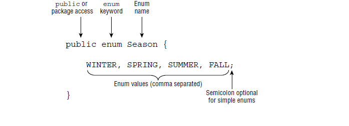
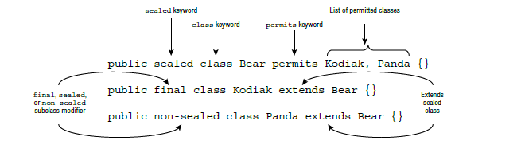
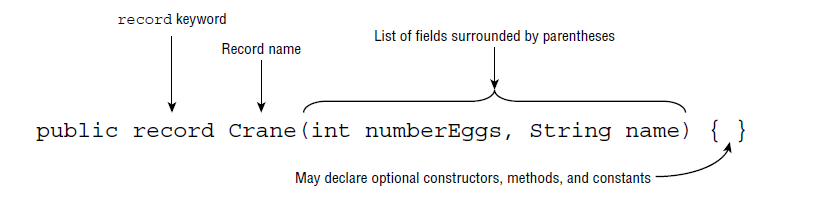
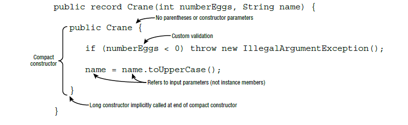

						Advanced Class Design - Beyond Classes
						
					
# Créer des classes abstraites: (Creating Abstract Classes)  
Nous commençons notre discussion sur la conception de classe avancée avec des classes abstraites. Comme vous le verrez, les classes abstraites ont des utilisations importantes dans la définition d'un framework que d'autres développeurs peuvent utiliser.  
### Présentation des classes abstraites : (Introducing Abstract Classes)  
Au chapitre 8, vous avez appris qu'une sous-classe peut redéfinir une méthode héritée définie dans une classe parent. Le remplacement d'une méthode modifie potentiellement le comportement d'une méthode dans la classe parente. Par exemple, regardez la classe Bird suivante et sa sous-classe Stork.  

		class Bird {
			public String getName() { return null; }
			public void printName() {
				System.out.println(getName());
			}
		}
		public class Stork extends Bird{
			public String getName() { return "Stork!"; }
			public static void main(String[] args) {
				new Stork().printName();
			}
		}
Ce programme afficher *Stork!* à l'excution. Noter que la méthode getName() est redéfinie dans la sous-classe Stork. Même si l'implementation de la méthode printName() est définie dans la classe Bird, le fait que getName() est redéfinie dans la sous-calsse signifie qu'il est remplacé partout même dans la classe parente.   
Supposant on veut définir la classe Bird et  un autre developpeur l'hétitée er l'utilisée, mais nous voulons que le nouveau developpeur définie ça propre version de Bird, donc il doit redéfinir la méthode getName().    
Entrez des classes abstraites. Une classe abstraite est une classe qui ne peut pas être instanciée et peut contenir des méthodes abstraites. Une méthode abstraite qui ne définit pas une implémentation lorsqu'elle est déclarée. Les classes abstraites et les méthodes abstraites sont désignées par le modificateur *abstract*.   
Comparons l'implementation précedente avec celle là: 

		abstract class Bird {
			public abstract String getName();
			public void printName() {
				System.out.println(getName());
			}
		}
		public class Stork extends Bird{
			public String getName() { return "Stork!"; }
			public static void main(String[] args) {
				new Stork().printName();
			}
		}
La première difference la classe Bird est marquée comme abstract, le deuxième difference est la méthode getName() de la classe Bird est aussi marquée abstract, et finallement l'implementation de la méthode getName() entre braces {} était remplacée par un point-virgule (semicolon).  
Maintenant regardons la classe Stork, elle est exactement la même. Bien que cela puisse sembler identique, les règles relatives à la manière dont la classe doit être implémentée ont changé. En particulier la classe Stork **doit** désormais redéfinir la méthode  getName().  
Par exemple, l'implémentation suivante ne se compile pas car Stork ne redéfinie pas la méthode abstraite getName () requise:  

	public class Stork extends Bird { }	// DOES NOT COMPILE
Une classe abstraite est plus souvent utilisée lorsque vous souhaitez qu'une autre classe hérite des propriétés d'une classe particulière, mais que vous souhaitez que la sous-classe remplisse certains des détails d'implémentation. Dans notre exemple, l'auteur de la classe Bird a écrit la méthode printName() mais ne savait pas ce qu'elle allait faire à l'exécution, car l'implémentation getName() n'avait pas encore été fournie. 

*Override vs. Implement*: Souvent, lorsqu'une méthode abstraite est redéfinie dans une sous-classe, elle est appelée implémentation de la méthode. Il est décrit de cette manière parce que la sous-classe fournit une implémentation pour une méthode qui n'en a pas encore. Bien que nous ayons tendance à utiliser les termes implémenter et redéfinir de manière interchangeable pour les méthodes abstraites, le terme redéfinition est plus précis.

Plus tôt, nous avons dit qu'une *classe abstraite* **ne peut pas être instanciée**:  

	public abstract class Alligator {
		public static void main(String[] args) {
			var a = new Alligator();	// DOES NOT COMPILE
		}
	}
Une classe abstraite peut être initialisée, mais uniquement dans le cadre de l'instanciation d'une sous-classe non abstraite.   
### Defining an Abstract Class: (Defining an Abstract Class)   
Nous avons vu toute à l'heure, qu'une classe abstract peut contenir des méthodes non-abstract, en occurence la méthode printName(). Le fait qu'une classe abstract peut inclure tout les membres de non-abstract classe, incluant les variables, les methodes d'instances et les méthode statics, ainsi que les classes interne. Comme vous le verrez dans la section suivante une classe abstract peut aussi inclure des consturcteurs.  
L'une des caractéristiques les plus importantes d'une classe abstraite est qu'elle n'est en fait pas obligée d'inclure des méthodes abstraites. Par exemple, le code suivant se compile même s'il ne définit aucune méthode abstact.

		public abstract class Llama {
			public void chew() {}
		}
Bien qu'une classe abstract n'est pas obligée de declarée une méthode abstract, des qu'ume méthode abstract est declarée dans une classe elle la rend abstract. Cet exepmle ci-dessous ne compile pas:

	public class Egret {	// DOES NOT COMPILE
		public abstract void peck();
	}
Comme le modificateur final, le modifiacteur abstract peut être placer avant le modificatuer d'accés de la classe, regardons la classe Tiger: 

		abstract public class Tigre {
			abstract public void claw() {}
		}
Mais il faut faire attention, le modificateur abstract ne peut être palcer après le mot-clé classe dans la déclarattion d'une classe, et ne peut être aussi placer après le type de retour d'une méthode. Le programme suivant ne compile pas à cause de ces deux raisons: 

	public class abstract Jackal {	// DOES NOT COMPILE
		public int abstract claw() {}	// DOES NOT COMPILE
	} 
##### Constructeurs dans les classes abstraites: (Constructors in Abstract Classes)  
Même si une classe abstract ne peut pas être instancier, Ils sont toujours initialisés via les constructeurs par leurs sous-classes. Est ce programme suivant compile ?  

		abstract class Bear {
			abstract CharSequence chew();
			public Bear() {
				System.out.println(chew());
			}
		}
		public class Panda extends Bear{
			CharSequence chew() { return "yummy!"; }
			public static void main(String[] args) {
				new Panda();
			}
		} 
En utilisant les règles de constructeur que vous avez apprises au chapitre 8, le compilateur insère un constructeur sans argument par défaut dans la classe Panda, qui appelle d'abord super() dans la classe Bear. Le constructeur Bear n'est appelé que lorsque la classe abstraite est initialisée via une sous-classe, par conséquent, il existe une implémentation de chew() au moment où le constructeur est appelé. Ce code compile et imprime yummy! lors de l'exécution.   

La principale différence entre un constructeur dans une classe abstraite et une classe non abstraite est qu'un constructeur dans une classe abstraite ne peut être appelé que lorsqu'il est initialisé par une sous-classe non abstraite. Cela a du sens, car les classes abstraites ne peuvent pas être instanciées.  
##### Déclarations de méthode abstraite non valides: (Invalid Abstract Method Declarations) 
Les rédacteurs d'examens sont également friands de questions avec des méthodes marquées comme abstraites pour lesquelles une implémentation est également définie. Quelles sont les méthodes qui compilent dans cet exemple ci-dessous:  

	public abstract class Turtle {
		public abstract long eat()	// DOES NOT COMPILE
		public abstract void swim() { };	// DOES NOT COMPILE
		public abstract int getAge() {	// DOES NOT COMPILE
			return 10;
		}
		public void sleep;	// DOES NOT COMPILE
		public void getInShell();	// DOES NOT COMPILE
	}
La méthode eat(): ne compile pas parce qu'elle finisse pas avec le semicolon(;)  
Les méthode swim() et getAge() ne compilent pas parce qu'elles sont marquées abstract mais elles impelementent un code entre braces {}, même le corps est vide dans la méthode swim().  
La méthode sleep ne compile pas parce qu'elle manque les parenthèses de paramètre de méthode.  
La méthode getInShell() ne compile parce qu'elle n'est pas marquée abstract *ou* elle ne définit pas un corps de méthode.   
##### Modificateurs non valides: (Invalid Modifiers)
Dans cette section nous examinons le modificateur abstract et quel modificateur et compatible avec lui:   
###### Modificateurs abstraits et finaux : (abstract and final Modifiers)  
Marquer une classe ou méthode avec abstract, vous donnez l'impression que vous voulez etendre ou implementer ça. Mais de marquer qques choses par final, vous prévenez de ne pas etendre une classe ou implemente une méthode. Donc de marquer une classe ou méthode au même temps avec abstrac et final crée un conflit, du coup ce n'est pas compatible. Le code suivant ne compile pas :

		public final abstract class Tortoise { // DOES NOT COMPILE
			public abstract final void walk();	// DOES NOT COMPILE
		}
Dans cet example ni la classe ni la méthode compile en marquant les deux au même temps abstract et final.   
###### Modificateurs abstraits et privés: (abstract and private Modifiers)  
On ne peut pas marquer une méthode à la fois abstract et private. Cette règle à un sens si on résone comme ça, pourquoi on définit une sous-classe pour implémnter une méthode, alors que cette méthode ne peut pas être héritée. Regardons cet exemple:   

		public abstract class Whale {
			private abstract void sing();	// DOES NOT COMPILE
		}
		class HumpbackWhale extends Whale {
			private void sing() {
				System.out.println("Humpback Whale is singing");
			}
		}
Dans cet exemple, la méthode abstraite sing() définie dans la classe parente Whale n'est pas visible par la sous-classe HumpbackWhale. Même si HumpbackWhale fournit une implémentation, elle n'est pas considérée comme un remplacement de la méthode abstraite puisque la méthode abstraite n'est pas héritée. Le compilateur reconnaît cela dans la classe parent et signale une erreur dès que privé et abstrait sont appliqués à la même méthode.   

Si on change le modificateur d'accés de private à protected dans la classe Whale, est ce code compile ? 

	public abstract class Whale {
		protected abstract void sing();
	}
	class HumpbackWhale extends Whale {
		private void sing() {	// DOES NOT COMPILE
			System.out.println("Humpback Whale is singing");
		}
	}
Dans cet exemple modifié, le code ne sera toujours pas compilé mais pour une raison complètement différente. Si vous vous souvenez des règles précédentes dans ce chapitre pour remplacer une méthode, la sous-classe ne peut pas réduire la visibilité de la méthode parente, sing(). Étant donné que la méthode est déclarée protégée dans la classe parent, elle doit être marquée comme protégée ou publique dans la classe enfant. Même avec des méthodes abstraites, les règles de substitution des méthodes doivent être suivies.
###### Modificateurs abstraits et statiques: (abstract and static Modifiers)  
Nous avons vu dans le chapitre 8 qu'une méthode static ne peut pas être redéfinie. Il est défini comme appartenant à la classe et non comme une instance de la classe. Si une méthode statique ne peut pas être remplacée ne peut pas être remplacée, il s'ensuit qu'elle ne peut pas non plus être marquée comme abstraite puisqu'elle ne peut jamais être implémentée. Par exemple, la classe suivante ne compile pas:   

	abstract class Hippopotamus {
		abstract static void swim();	// DOES NOT COMPILE
	}
### Créer une classe concrète: (Creating a Concrete Class)  
Une classe abstraite devient utilisable lorsqu'elle est étendue par une sous-classe concrète. Une *classe concrète* est une classe non abstraite. La première sous-classe concrète qui étend une classe abstraite est requise pour implémenter toutes les méthodes abstraites héritées. Cela inclut l'implémentation de toutes les méthodes abstraites héritées des interfaces héritées, comme nous le verrons plus loin dans ce chapitre.   
Lorsque vous voyez une classe concrète étendre une classe abstraite sur l'examen, assurez-vous qu'elle implémente toutes les méthodes abstraites requises. Pouvez-vous voir pourquoi la classe Walrus suivante ne se compile pas ?  

		public abstract class Animal {
			public abstract String getName();
		}
		class Walrus extends Animal { }	// DOES NOT COMPILE
Dans cet exemple la classe Animal est marquée abstract et la classe Walrus non, cela signifie que la classe Walrus est une sous-classe concrète de Animal, alors elle *doit* implementer toutes les méthodes abstracts de la classe Animal, en occurence la méthode getName(), or ce n'est pas le cas du coup le coompilateur génère une erreur.  

Nous mettons en évidence la *première sous-classe concrète* pour une raison. Une classe abstraite peut étendre une classe non abstraite, et vice versa. Chaque fois qu'une classe concrète étend une classe abstraite, elle doit implémenter toutes les méthodes héritées de manière abstraite. Illustrons cela avec un ensemble de classes héritées:  

	public abstract class Mammal {
		abstract void showHorn();
		abstract void eatLeaf();
	}
	
	abstract class Rhino extends Mammal { 
		void showHorn() { }
	}
	
	class BlackRhino extends Rhino {
		void eatLeaf() { }
	}
Dans cette exemple la classe BlackRhino est le première sous-classe concrète, ce pendant les deux classes Mammal et Rhino sont abstract. La classe BlackRhino hérite la méthode eatLeaf() comme abstraite et doit donc fournir une implémentation, ce qu'elle fait. Mais pourquoi pas aussi la méthode showHorn() ?  en fait cette méthode est déja implementé dans la classe Rhino donc n'est plus désormais abstract ce qui entraine que la première sous-classe concrète n'est pas obligé à l'implementée. 

Maintenant si nous supprimons le modificateur abstract de la classe Rhino. 

	class Rhino extends Mammal {	// DOES NOT COMPILE
		void showHorn() { }
	}  
Désormais Rhino est devenue une classe concrète, en plus elle la premières non-abstract class qui étend de la classe Mammal, du coup elle doit implementer les deux methodes showHorn() et eatLeaf(). Alors notre code implemente juste une seule alors le compilateur génèr une erreur.

Regardons un autre exemple. La classe concrète suivante Lion hérite deux abstract méthodes, getName() et roar(): 

		public abstract class Animal {
			abstract String getName();
		}
		abstract class BigCat extends Animal {
			protected abstract void roar();
		}
		class Lion extends BigCat {
			public String getName() {
				return "Lion";
			}
			public void roar() {
				System.out.println("The Lion lets out a loud ROAR!");
			}
		}
Dans cet exemple, BigCat étend la classe Animal mais elle est marquée abstract, du coup elle n'est pas obligée d'implementée le méthode getName(). La classe Lion n'est pas marquée comme abstract, en plus elle est la première sous-classe concrète, donc elle doit implementer toutes les méthodes abstractes et non définissent dans les classes parents, alors les trois classes compiles sans erreurs.     
### Révision des règles de classe abstraite: (Reviewing Abstract Class Rules)  
Voici des listes de règles pour les classes abstraites et les méthodes abstraites que nous avons couvertes dans cette section. Lisez et comprenez ces règles avant de passer l'examen.  
##### Règles de définition de classe abstraite: (Abstract Class Definition Rules) 
1. Les classes abstraites ne peuvent pas être instanciées directement.  
2. Une classe de niveau supérieur **top-level** (une classe qui n'est pas définie dans une autre classe ou inner class), y compris aussi une classe abstract ne peut pas marquée comme protected ou privée.  
3. Les classes abstraites ne peuvent pas être marquées comme finales.  
4. La classe abstraite peut inclure zéro ou plusieurs méthodes abstraites et non abstraites.  
5. Classe abstraite qui étend une autre classe abstraite hérite de toutes ses méthodes abstraites.  
6. La première classe concrète qui étend une classe abstraite doit fournir une implémentation pour toutes les méthodes abstraites héritées.   
7. Les constructeurs de classes abstraites suivent les mêmes règles d'initialisation que les constructeurs réguliers, sauf qu'ils ne peuvent être appelés que dans le cadre de l'initialisation d'une sous-classe.  

#####  Règles de définition de méthode abstraite: (Abstract Method Definition Rules)
Ces règles pour les méthodes abstraites s'appliquent indépendamment du fait que la méthode abstraite soit définie dans une classe abstraite ou une interface. 
1. Les méthodes abstraites ne peuvent être définies que dans des classes abstraites ou des interfaces.  
2. Les méthodes abstraites ne peuvent pas être déclarées privées ou finales ou static.  
3. Les méthodes abstraites ne doivent pas fournir un corps/une implémentation de méthode dans la classe abstraite pour laquelle elle est déclarée.   
4. L'implémentation d'une méthode abstraite dans une sous-classe suit les mêmes règles pour redéfinir une méthode, y compris le type de retour covariant, la déclaration d'exception, etc.  

# Implémentation d'interfaces: (Implementing Interfaces)
Bien que Java n'autorise pas l'héritage multiple, il permet aux classes d'implémenter n'importe quel nombre d'interfaces. Une interface est un type de données abstrait qui définit une liste de méthodes publiques abstraites que toute classe implémentant l'interface doit fournir. Une interface peut également inclure une liste de variables constantes et de méthodes par défaut, que nous aborderons dans cette section.     
### Définition d'une interface: (Defining an Interface)  
En Java, une interface est définie avec le mot clé interface, analogue au mot clé class utilisé lors de la définition d'une classe. Une classe appelle l'interface en utilisant le mot clé implements dans sa définition de classe.  

	public abstract interface CanBurrow {
		public static final int MINIMUM_DEPTH = 2;	// Interface variable
		public abstract int getSpeed(int age);	// Abstract Interface method
	}
Les mots clé d'une interface: 
* public: une interface peut avoir deux modificateur d'accés public ou package-private, comme une classe.  
* abstract: modificateur implicite (n'est pas obligatoire).  
* CanBurrow: le nom de l'interface.
* interface: le mot clé pour déclarer une interface.  

les mots clé des membres d'une interface:
* public static final: modificateur implicite pour déclaré une variable constante.
* public abstract: modificateur implicite pour déclarer une méthode abstract d'interface.

*Note:* Par souci de concision, nous disons parfois "une instance d'une interface" pour désigner une instance d'une classe qui implémente l'interface. 
Que signifie le fait qu'une variable ou une méthode soit supposée être un code ? Un aspect d'une déclaration d'interface qui diffère d'une classe abstraite est qu'elle contient des modificateurs implicites. Un modificateurs implicite est un modificateur que le compilateur l'ajoute automatiquement à une classe, ou à une interface, ou à une méthode ou à une déclaration de variable. Par exemple une interface est toujours considérée être abstract, même si ce n'est pas marquée.  
Commençons par un exemple. Imaginons que nous ayons une interface WalsOnTwoLegs, défini comme suit:  

		public abstract interface WalsOnTwoLegs {} 
Il compile car les interfaces ne sont pas obligées de définir des méthodes. Le modificateur abstrait dans cet exemple est facultatif pour l'interface, le compilateur l'insérant s'il n'est pas fourni. Maintenant, considérons les deux exemples suivants, qui ne se compilent pas:

		public class Biped {
			public static void main(String[] args) {
				var e = new WalsOnTwoLegs();	// DOES NOT COMPILE
			}
		}

		public final interface WalsOnTwoLegs {}	// DOES NOT COMPILE
Le premier exemple ne compile pas, parce que WalsOnTwoLegs est une interface donc on ne peut pas l'instanciée.   
Le deuxième exemple ne compile pas, parce qu'une interface ne peut pas être marquée par final.  

Comment utilisez-vous une interface ? Disons que nous avons une interface Climb, définie comme suit:  

		interface Climb {
			Number getSpeed(int age);
		}
Ensuite, nous avons une classe concrète FieldMouse qui appelle l'interface Climb en utilisant le mot clé *implements* dans sa déclaration de classe.

		public class FieldMouse implements Climb, CanBurrow{
			public Number getSpeed(int age) {
				return 11f;
			}
		}
La classe FieldMouse déclare qu'elle implémente l'interface Climb et inclut une version redéfinie de getSpeed() héritée de l'interface Climb. La signature de la méthode de getSpeed() est exacte, et le type de retour est covariant. Le modificateur d'accés de la méthode d'interface est supposée public dans l'interface Climb, Bien que la classe concrète FieldMouse doit la déclaré explicitement.  
L'exemple de la classe FieldMouse montre qu'une classe peut implementer plusieur interface, chacune est séparée par une virgule (a comma ,). Si l'un des interfaces définit des méthodes abstract alors la classe est obligée de la redéfinir.    

Comme une classe, une interface peut étendre une autre interface à l'aide du mot clé extend.

	interface Nocturnal {}

	public interface HasBigEyes extends Nocturnal { }
Contrairement à une classe qui ne peut pas héritée qu'une seule classe, une interface peut étendre plusieurs interfaces.  

		interface Nocturnal {
			int hunt();
		}
		interface CanFly {
			void flap();
		}
		
		interface HasBigEyes extends Nocturnal, CanFly { }
		
		public class Owl implements Nocturnal, CanFly {
			public void flap() { System.out.println("Flap!");}
			public int hunt() { return 5; }
		}
La classe  Owl doit implementée les deux méthodes flap() et hunt().  
De nombreuses règles pour les déclarations de classe s'appliquent également à l'interface, notamment les suivantes:  
* Le fichier Java peut avoir qu'une seule classe ou une interface public *principale ou top-level* et doit correspondre au nom du fichier.  
* la classe ou l'interface *principale ou top-level* ne peut être déclarée qu'avec un accès public ou package-private.   

*Que dire de type Enum:* Dans cette section, nous avons décrit comment une classe Java peut avoir au plus un élément public *principal lop-level*, une classe ou une interface. Cet élément public de premier niveau peut également être une énumération, ou **enum** pour faire court. Une énumération est un type spécialisé qui définit un ensemble de valeurs fixes. il est déclaré avec le mot-clé enum. Voici un exemple simple d'énumération pour Color:

		public enum Color {
			RED, YELOW, BLUE, GREEN, ORANGE, PURPLE
		}
Comme les classes et les interfaces, les énumérations peuvent avoir des formations plus complexes comprenant des méthodes, des constructeurs des variables d'instance.      
Le constructeur enum doit avoir une portée **privée ou une portée de package-private (par défaut)**. Vous ne pouvez pas utiliser de constructeurs publics ou protected pour une énumération Java.    
### Insertion de modificateurs implicites: (Inserting Implicit Modifiers)    
Comme on vient de le dire, un *modificateur implicite* celui qui le compilateur l'ajoute automatiquement, ça rappelle le compilateur ajoute *non-argument par défault consturcteur* si on a pas définit un consturcteur dans la classe. En fait t'as le choix soit d'insérer le modificatuer implicite ou de laisser le compilatuer de faire ça à ta place.  
La liste suivante comprend les modificateurs implicites des interfaces que vous devez connaître pour l'examen: 
* Les interfaces sont supposées être abstraites.
* Les variables d'interfaces sont supposées être public, static et final.  
* Les méthodes d'interfaces sans corps sont supposées être abstract et public.  

Par exemple, les deux définitions d'interface suivantes sont équivalentes, car le compilateur les convertira toutes les deux en deuxième déclaration:  

		public interface Soar {
			int MAX_HEIGHT = 10;
			final static boolean UNDERWATER = true;
			void fly(int speed);
			abstract void takeOff();
			public abstract double drive();
		}
Le compilation va ajouter les modificatuers implicites:  

		public interface Soar {
			public static final int MAX_HEIGHT = 10;	//ADD  public static final
			public final static boolean UNDERWATER = true;	// ADD public
			public abstract void fly(int speed);	// ADD public abstract
			public abstract void takeOff();	// ADD public
			public abstract double drive();
		}
##### Modificateurs en conflit: (Conflicting Modifiers)  
Que se passe-t-il si un développeur marque une méthode ou une variable avec un modificateur qui entre en conflit avec un modificateur implicite ? Par exemple, si une méthode abstraite est supposée être publique, elle peut alors être explicitement marquée comme protégée ou privée ?  

	public interface Dance {
		private int count = 4;	// DOES NOT COMPILE
		protected void step();	// DOES NOT COMPILE
	}
Aucune de ces déclarations de membre d'interface n'est compilée, car le compilateur appliquera le modificateur public aux deux members, ce qui entraînera un conflit.  
Alors que les problèmes avec les modificateurs d'accès privés et protégés dans les interfaces sont faciles à repérer, qu'en est-il de l'accès package-private  ? Par exemple, quel est le niveau d'accès des deux éléments suivants volume et start() ?

		public interface Sing {
			float volume = 10;
			abstract void start();
		}
Si tu dis public, alors t'as raison, quand on tavaille avec les membres de classe, si on omet le modificateur d'acces alors il est par défaut (package-private). Alors quand on travaille avec les membres interface, et on omet le modificateur d'accés ça sera obligatoirement public. 

Essayons un autre. Quelle(s) ligne(s) de cette déclaration d'interface de niveau supérieur (top-level) ne compile pas ?  

		private final interface Crawl {
			String distance;
			private int MAXIMUM_DEPTH = 100;
			protected abstract boolean UNDERWATER = false;
			private void dig(int depth);
			protected abstract double depth();
			public final void surface();
		}
Toutes les lignes dans cet exemple ci-dessus, ne compilent pas:   
La première ligne ne compile pas à cause de plusieurs raison, premièrement une interface ne peut pas être marquée final, la deuxième raison le modificateur d'accés private n'est pas autorisé, en fait une déclaration d'interface ne peut être que public ou package-privae.  
Ligne 2: la variable distance n'est pas initialiée. Souviens-toi qu'une variable d'interface est supposée être une constante static final et initialisée.   
Ligne 3: ne compile pas parce que une variable d'interface est supposée être public.  
Ligne 4: ne compile pas pour deux raison, parce que une variable d'interface est supposée être public, et aussi une variable ne peut pas être marquée abstract.  
Ligne 5 et 6: ne complient pas parce que une méthode d'interface est supposée être public, donc être marquée private ou protected gènère une erreur de compilation.  
Ligne 7: ne compile pas parce que la méthode surface() est marquée final.  
##### Différences entre les interfaces et les classes abstraites: (Differences between Interfaces and Abstract Classes)   
Même si les classes abstraites et les interfaces sont toutes deux considérées comme des types abstraits, seules les interfaces utilisent des modificateurs implicites. Cela signifie qu'une classe abstraite et une interface avec des déclarations similaires peuvent avoir des propriétés très différentes. Par exemple, en quoi les méthodes play() diffèrent-elles dans les deux définitions suivantes ?    

		abstract class Husky {
			abstract void play();
		}
		
		interface Poodle {
			void play();
		}
Les deux méthodes sont considérée comme abstract. Cela dit, la classe Husky ne se compilera pas si la méthode play() n'est pas marquée abstraite, alors que la méthode paly() dans l'interface Poodle compile avec ou sans le modifiactuer abstract.   
Que peut on dire de niveau d'accés de la méthode paly() ? Même si ni l'un ni l'autre n'a de modificateur d'accès, elles ont pas le même niveau d'accès. La méthode play() dans la classe Husky est considérée default (package-private), alors que la méthode play() dans l'interface Poodle est supsosée être public. Ceci est particulièrement important lorsque vous créez des classes qui héritent de ces définitions. Par exemple, pouvez-vous repérer quelque chose de mal avec les définitions de classe suivantes qui utilisent nos types abstraits ?  

		class Webby extends Husky {
			void play() {}	// COMPILE
		}
		
		class Georgette implements Poodle {
			void play() {}	// DOES NOT COMPILE
		}
La classe Webby mais la classe Georgette ne compile pas, poutant les deux implémentent presque la même méthode, en fait le méthode de la classe Georgette viole les règle de redéfinition, parce que le modéficateur d'accès est public dans une interface dans la méthode play() doit avoir au moins le même modificateur au plus et comme public est le plus grand alors doit être public.  

		class Georgette implements Poodle {
			public void play() {}	// COMPILE
		} 
### Hériter d'une interface: (Inheriting an Interface)  
Une interface peut être héritée de trois manières:  
* Une interface peut étendre (extends) une autre interface.
* Une classe peut implémenter une interface.  
* Une classe peut étendre une autre classe dont l'ancêtre implémente une interface.  

##### Interface redéfinie une méthode d'une interface héritée: 
Regardons cet exemples:

	interface Walk {
		public List move(); 
	}
	interface Run extends Walk {
		public ArrayList move(); 
	}
L'interface Run remplace correctement la méthode héritée move() de l'interface Walk en utilisant un type de retour covariant.     

Lorsqu'une interface est héritée, toutes les méthodes abstraites sont héritées. Comme nous l'avons vu avec les classes abstraites, si le type héritant de l'interface est également abstrait, comme une interface ou une classe abstraite, il n'est pas nécessaire d'implémenter les méthodes d'interface. D'autre part, la première sous-classe concrète qui hérite de l'interface doit implémenter toutes les méthodes abstraites héritées.  
Prenons l'exemple suivant:   

		public interface HasTail {
			 public int getTailLength();
		}
		
		public interface HasWhiskers {
			public int getNumberOfWhiskers();
		}
		
		public abstract class HarborSeal implements HasTail, HasWhiskers {
		}
		
		public class CommonSeal extends HarborSeal { // DOES NOT COMPILE
		}
Dans cet exemple, nous voyons que HarborSeal est une classe abstraite et se compile sans problème, comme elle est abstract n'est pas obligée d'implementée les méthodes abstract des interfaces HasTail et HasWhiskers.   
CommonSeal est la première classe concète, elle extends la classe abstact HarborSeal, alors elle est obligée d'implementer toutes les méthodes abstract, et comme cette classe n'implémnte aucune méthode (getTailLength() et getNumberOfWhiskers()) le compilateur génère une erreur de compilation.  
##### Mélange de mots-clés de classe et d'interface: (Mixing Class and Interface Keywords)  
Les créateurs d'examens sont friands de questions qui mélangent la terminologie de classe et d'interface. Bien qu'une classe puisse implémenter une interface, une classe ne peut pas étendre une interface. De même, alors qu'une interface peut étendre une autre interface, une interface ne peut pas implémenter une autre interface. Les exemples suivants illustrent ces principes:  

		public interface CanRun {}
		public class Cheetah extends CanRun {} // DOES NOT COMPILE
		public class Hyena {}
		public interface HasFur extends Hyena {} // DOES NOT COMPILE
Le premier exemple montre une classe essayant d'étendre une interface qui ne compile pas.    
Le deuxième exemple montre une interface essayant d'étendre une classe, qui ne compile pas non plus. Méfiez-vous des exemples de l'examen qui mélangent les définitions de classe et d'interface.     
Voici la seule syntaxe valide pour relier la classe et les interfaces dans leurs déclarations:    
  
*class1 extends class2*   
*interface1 extends interface2, interface3, ....*   
*class1 implements interface1, interface2, ...*    
##### Déclarations de méthode d'interface en double: (Duplicate Interface Method Declarations)  
Puisque Java permet l'héritage multiple via des interfaces, vous vous demandez peut-être ce qui se passera si vous définissez une classe qui hérite de deux interfaces qui contiennent la même méthode abstraite:   

		public interface Herbivore {
			 public void eatPlants();
		}
		
		public interface Omnivore {
			 public void eatPlants();
			 public void eatMeat();
		}
Dans ce scénario, les signatures des deux méthodes d'interface eatPlants() sont des dupliquées. Comme ils ont des déclarations de méthode identiques, ils sont également considérés comme *compatibles*. Par compatibilité, nous entendons que le compilateur peut résoudre les différences entre les deux déclarations sans trouver de conflit. Vous pouvez définir une classe qui implemente les deux interfaces simultanément. 

		class Bear implements Herbivore, Omnivore {
			public void eatMeat() {
				System.out.println("Eating meat");
			}
		
			public void eatPlants() {
				System.out.println("Eating plants");
			}
		}
Comme dit précédemment, les interfaces définissent simplement un ensemble de ce qu'une classe les implémentant doit suivre. Si deux méthodes d'interface abstraites ont des comportements identiques - ou dans ce cas la même déclaration de méthode (même signature) - il vous suffit de pouvoir créer une seule méthode qui redéfinit les deux méthodes abstraites héritées en même temps.  

Que se passe-t-il si les deux méthodes ont des signatures différentes? Si le nom de la méthode est le même mais que les paramètres d'entrée sont différents, il n'y a pas de conflit car cela est considéré comme une surcharge de méthode. Nous démontrons ce principe dans l'exemple suivant:  

		public interface Herbivore {
			public int eatPlants(int quantity);
		}
		
		interface Omnivore {
			public void eatPlants();
		}
		
		class Bear implements Herbivore, Omnivore {
			public int eatPlants(int quantity) {
				System.out.println("Eating plants: " + quantity);
				return quantity;
			}
		
			public void eatPlants() {
				System.out.println("Eating plants");
			}
		}
Dans cet exemple, nous voyons que la classe qui implémente les deux interfaces doit fournir des implémentations des deux versions de eatPlants(), puisqu'elles sont considérées comme des méthodes distinctes.   

Que faire si les méthodes dupliquées ont la même signature mais des types de retour différents ? Dans ce cas, vous devez examiner les règles de remplacement des méthodes. Essayons un exemple:

		public interface Dance {
			String swingArms();
		}
		interface EatsFish {
			CharSequence swingArms();
		}
		
		class Penguin implements Dance, EatsFish {	// COMPILE
			public String swingArms() {
				return "swing!";
			}
		}     
Dans cet exemple, la classe Penguin se compile. La version Dances de la méthode swingArms() est trivialement remplacée dans la classe Penguin, car la déclaration dans Dances et Penguin a les mêmes déclarations de méthode. La version EatsFish de swingArms() est également redéfinie car String et CharSequence sont des types de retour covariants.  

Jetons un coup d'œil à un exemple où les types de retour ne sont pas covariants:  

		public interface Dance {
			int countMoves();
		}
		interface EatsFish {
			boolean countMoves();
		}
		
		class Penguin implements Dance, EatsFish {	// DOES NOT COMPILE
			...
		}
Ce n'est pas possible de définire une version de la méthode countMoves() qui retourne à la fois int et un type boolean, il n'y a pas d'implémentation du Penguin qui permettra à cette déclaration de compiler.   
Le compilateur génère une erreur de complilation si vous définissez une classe abstraite ou une interface qui hérite de deux types abstraits en conflit, comme indiqué ici:  

	public interface LongEars {
		int softSkin();
	}
	interface LongNose {
		void softSkin();
	}
	
	interface Donkey extends LongEars, LongNose { }	// DOES NOT COMPILE
	
	abstract class Aardvark implements LongEars, LongNose { }	// DOES NOT COMPILE
Tous les types de cet exemple sont abstraits, aucun n'est concret. Malgré le fait qu'ils soient tous abstraits, le compilateur détecte que Donkey et Aardvark contiennent des méthodes incompatibles et les empêche de compiler.   
### Méthodes d'interface par défaut: (Default Interface Methods)
Avec la sortie de Java 8, les auteurs de Java ont introduit un nouveau type de méthode dans une interface, appelée *méthode par defaut*. La méthode par défaut est une méthode définie dans une interface avec le mot-clé par defaut dans lequel un corps de méthode est fourni. Comparez les méthodes par défaut avec les méthodes «régulières» dans une interface, qui sont supposées être abstraites et peuvent ne pas avoir de corps de méthode.     
##### Méthode par defaut: (Default Method)  
Une méthode par défaut dans une interface définit avec le modificateur **defaut**. Les classes ont la possibilité de redéfinir la méthode par defaut si elles en **ont besoin**, mais elles **ne sont pas obligées** de le faire. Si la classe ne remplace pas la méthode, l'implémentation par defaut sera utilisée. De cette manière, la définition de la méthode est concrète et non abstraite.     
Voici un exemple de méthode par defaut définie dans une interface:   

		public interface IsWarmBlooded {
			boolean hasScales();
			public default double getTemperature() {
				return 10.0;
			}
		}
Cet exemple définit deux méthodes d'interface, l'une est une méthode abstraite normale et l'autre une méthode par défaut. Notez que les deux méthodes sont supposées être publiques, car toutes les méthodes d'une interface sont publiques. La première méthode se termine par un point-virgule et ne fournit pas de corps, tandis que la deuxième méthode par défaut fournit un corps.   
Voici les règles de méthode d'interface par défaut avec lesquelles vous devez vous familiariser:  
1. Une méthode par défaut ne peut être déclarée que dans une interface et non dans une classe ou une classe abstraite.  
2. Une méthode par défaut doit être marquée avec le mot-clé par **defaut**. Si une méthode est marquée par défaut, elle doit fournir un corps de méthode.   
3. Une méthode par défaut **ne** peut **pas** être **static**, **finale** ou **abstraite**, car elle peut être utilisée ou redéfinie par une classe qui implémente l'interface.  
4. Comme toutes les méthodes d'une interface, une méthode par défaut est supposée être **public** et ne sera pas compilée si elle est marquée comme privée ou protégée.   

Par exemple, les extraits de code suivants ne seront pas compilés:  

	public interface Carnivore {
		public default void eatMeat(); // DOES NOT COMPILE
	
		public int getRequiredFoodAmount() { // DOES NOT COMPILE
			return 13;
		}
		private default int getNumberOfFins() {	// DOES NOT COMPILE
			return 4;
		}
		protected default double getLongestFinLength() {	// DOES NOT COMPILE
			return 20.0;
		}
		static default boolean doFinsHaveScales() {	// DOES NOT COMPILE
			return true;
		}
	}
Dans cet exemple, la première méthode, eatMeat(), ne compile pas car elle est marquée par défaut mais ne fournit pas de corps de méthode.  
La deuxième méthode, getRequiredFoodAmount(), ne compile pas non plus car elle fournit un corps de méthode mais n'est pas marquée avec le mot-clé par défaut.  
Les trois dernières méthodes ne compilent pas, parce que les modificateurs private, protected et static ne sont pas permis avec la méthode par défaut dans une interface.  
##### Méthodes par défaut et héritage multiple: (Default Methods and Multiple Inheritance)
Comme on a dit toute àl'heure, une classe qui implemente une interface qui inclut une méthode par défaut, n'est pas obligé de redéfinir la méthode, et peut l'utiliser comme elle est.  

		interface Vehicle {
			default void print() {
				System.out.println("I am a vehicle!");
			}
		}
		public class Car implements Vehicle{
			public static void main(String[] args) {
				new Car().print();
			}
		}  
Ce code affiche: *I am a vehicle!*

Vous avez peut-être réalisé qu'en autorisant les méthodes par défaut dans les interfaces, couplé au fait qu'une classe peut implémenter plusieurs interfaces, Java a essentiellement ouvert la porte à de multiples problèmes d'héritage. Par exemple, quelle valeur le code suivant produirait-il ?  

		interface Walk {
			public default int getSpeed() {
				return 5;
			}
		}
		interface Run {
			public default int getSpeed() {
				return 10;
			}
		}
		public class Cat implements Walk, Run{	// DOES NOT COMPILE
			public static void main(String[] args) {
				System.out.println(new Cat().getSpeed());
			}
		}  
Dans cet exemple, Cat hérite les deux méthodes par défaut getSpeed() des deux interfaces Waldk et Run, alors laquelle utilise-t-il ? En termes d'utilisation dans la classe Cat, il n'est pas clair si le code doit afficher 5 ou 10. La réponse est que le code ne produit aucune valeur et il une erreur de compilation.      
### Static Interface Methods: (Static Interface Methods)    
Java 8 inclut désormais également la prise en charge des méthodes statiques dans les interfaces. Ces méthodes sont définies explicitement avec le mot-clé static et fonctionnent presque de la même manière que les méthodes statiques définies dans les classes, comme discuté au chapitre 4. En fait, il n'y a vraiment qu'une seule distinction entre une méthode statique dans une classe et une interface. Une méthode statique définie dans une interface n'est héritée dans aucune classe qui implémente l'interface.    
Voici les règles de méthode d'interface statique avec lesquelles vous devez vous familiariser:   
* Comme toutes les méthodes d'une interface, une méthode statique est supposée être **public** et ne sera pas compilée si elle est marquée comme privée ou protégée.  
* Pour référencer la méthode statique, une référence au nom de l'interface doit être utilisée.    

Voici un exemple de méthode statique définie dans une interface:   

		public interface Hop {
			static int getJumpHeight() {
				return 8;
			}
		}
La méthode getJumpHeight() fonctionne comme une méthode statique telle que définie dans une classe. En d'autres termes, il est accessible sans instance de la classe en utilisant la syntaxe Hop.getJumpHeight(). Notez également que le compilateur insérera automatiquement le modificateur d'accès public puisque toutes les méthodes des interfaces sont supposées être publiques.  

Voici un exemple de classe Bunny qui implémente Hop:  

		public class Bunny implements Hop {
			public void printDetails() {
				System.out.println(getJumpHeight()); // DOES NOT COMPILE
			}
		}
Comme vous pouvez le voir, sans référence explicite au nom de l'interface, le code ne compilera pas, même si Bunny implémente Hop. De cette manière, les méthodes d'interface statiques ne sont pas héritées par une classe implémentant l'interface. La version modifiée suivante du code résout le problème avec une référence au nom de l'interface Hop:  

		class Bunny implements Hop {
			public void printDetails() {
				System.out.println(Hop.getJumpHeight());
			}
		}
Il s'ensuit donc qu'une classe qui implémente deux interfaces contenant des méthodes statiques avec la même signature sera toujours compilée à l'exécution, car les méthodes statiques ne sont pas héritées par la sous-classe et doivent être accédées avec une référence au nom de l'interface. Comparez cela avec le comportement que vous avez vu pour les méthodes d'interface par défaut dans la section précédente: le code se compilerait si la sous-classe remplaçait les méthodes par défaut et échouait à compiler autrement. Vous pouvez voir que les méthodes d'interface statiques n'ont aucun des mêmes problèmes et règles d'héritage multiples que les méthodes d'interface par défaut.   
##### Méthode d'interface privée (méthode d'instance et méthode de classe): (Private Interface Methods)    
Depuis Java 9, les méthode d'interface peuvent être private, (méthode d'instance ou de méthode de classe), dans les deux cas, la méthode privée n'est pas héritée par les sous-interfaces ou les implémentations. Ils sont principalement là pour améliorer la réutilisation du code dans l'interface uniquement - améliorant ainsi l'encapsulation.  
Regardons ce programme:   

	interface CustomInterface {
		public default void method2() {
			method4(); // private method inside default method
			method5(); // static method inside other non-static method
			System.out.println("default method");
		}
	
		private void method4() {
			System.out.println("private method");
		}
	
		private static void method5() {
			System.out.println("private static method");
		}
	}
	
	public class CustomClass implements CustomInterface{
		public static void main(String[] args) {
			new CustomClass().method2();
	
		}
	}
Ce programme compile et affiche: 

	private method
	private static method
	default method
### Polymorphisme et interfaces: (Polymorphism and Interfaces)    
Dans le chapitre 8, nous avons introduit le polymorphisme et on a montré comment un objet en Java peut prendre de nombreuses formes via des références. Bien que plusieurs des mêmes règles s'appliquent, le fait qu'une classe puisse hériter de plusieurs interfaces limite certaines des vérifications que le compilateur peut effectuer.   
##### Types de références abstraites: (Abstract Reference Types)    
Lorsque vous travaillez avec des types abstraits, vous pouvez préférer travailler avec les types de référence abstraits, plutôt qu'avec des classes concrètes. Ceci est particulièrement courant lors de la définition des paramètres de méthode. Considérez l'implémentation suivante:   

		public class Zoo {
			public void sortAndPrintZooAnimals(List<String> animals) {
				Collections.sort(animals);
				for(String a : animals) {
					System.out.println(a);
				}
			}
		}
Cette classe définit une méthode qui trie et affiche les animaux par ordre alphabétique. A aucun moment, cette classe ne s'intéresse à ce qu'est l'objet réel sous-jacent pour les animaux. Cela peut être une ArrayList, que vous avez déjà vu, mais il peut également s'agir d'une LinkedList ou d'un Vector.  
##### Interfaces de casting: (Casting Interfaces)  
Disons que vous avez une variable de type référence abstraite, qui a été dans la sous-classe concrète. Si vous avez besoin d'accéder à une méthode qui n'est déclarée que dans la sous-classe concret, vous devrez alors transtyper la référence d'interface vers ce type, en supposant que le cast est pris en charge au moment de l'exécution. Cela nous ramène à la règle dont nous avons discuté au chapitre 8, à savoir que le comilateur n'autorise pas les conversions vers des types non liés. Par exemple, ce qui suit n'est pas autorisé car le compilateur détecte que les classes String et Long ne sont pas liées:   

		String lion = "Bert";
		Long tiger = (Long) lion;	// DOES NOT COMPILE
Avec les interfaces, il existe des limites à ce que le compilateur peut valider. Par exemple, le programme suivant compile-t-il ?   

		interface Canine { }
		class Dog implements Canine { }
		class Wolf implements Canine { }
		
		public class BadCasts {
			public static void main(String [] args) {
				Canine canine = new Wolf();
				Canine badDog = (Dog) canine;
			}
		}
Dans ce programme, un objet Wolf est créé puis affecté à un type de référence Canine. En raison du polymorphisme, Java ne peut pas être sûr du type de classe spécifique de l'instance canine. Par conséquent, il autorise la conversion non valide vers le type de références Dog, même si Dog et Wolf ne sont pas liés. Le code se compile mais lève une ClassCastException au moment de l'exécution.   
Cette limitation mise à part, le compilateur peut appliquer une règle concernant le casting d'interface. Le compilateur n'autorise pas une conversion d'une référence d'interface vers une référence d'objet si la compilation du programme échoue:   

		Object badDog = (Dog) canine;	// DOES NOT COMPILE
Puisque String n'implémente pas Canine, le compilateur reconnaît que cette conversion n'est pas possible.   
##### Interfaces et l'opérateur instanceof: (Interfaces and the instanceof Operator)   
Dans le chapitre 3, nous devrions que le compilateur signale une erreur si vous essayez d'utiliser l'opérateur instanceof avec deux classes non liées, comme suit:  

		Number tickets = 4;
		if(tickets instanceof String) { }	// DOES NOT COMPILE
Avec les interfaces, le compilateur a une capacité limitée à appliquer cette règle car même via un type de référence peut ne pas implémenter une interface, l'une de ses sous-classes le pourrait. Par exemple, ce qui suit compile:  

		Number tickets = 4;
		if(tickets instanceof List) { }	// COMPILE
Même si Number n'hérite pas de List, il est possible que la variable tickets soit une référence à une sous-classe de Number qui hérite de List. Par exemple, la variable tickets peut être affectée à une instance de la classe MyNumber suivante (en supposant que toutes les méthodes héritées ont été implémentées):   

		public class MyNumber extends Number implements List 
Cela dit, le compilateur peut vérifier les interfaces non liées si la référence est une classe qui est marquée comme final:    

		Integer tickets = 4;
		if(tickets instanceof List) { }	// DOES NOT COMPILE
Le complilateur génère une erreur parce que la classe Integer est marquée final et n'hérite pas de List. Par conséquent, il n'est pas possible de créer une sous-classe d'Integer qui hérite de l'interface List.    
### Révision des règles d'interfaces: (Reviewing Interfaces Rules)   
Nous résumons les règles d'interface dans cette partie du chapitre dans la liste suivante. Si vous comparez la liste de règles pour une définition de classe abstraite, les quatre premières règles sont similaires.   
##### Règles de définition d'interface: (Interface Definition Rules)  
1. L'interface ne peut pas être instanciée.   
2. Tous les types de niveau supérieur (top-level), y compris les interfaces, ne peuvent pas être marqués comme protected ou private.     
3. Les interfaces sont supposées être abstraites et ne peuvent pas être marquées comme final.   
4. Les interfaces peuvent inclure zéro ou plusieurs méthodes abstraites.     
5. Une interface peut étendre n'importe quel nombre d'interfaces.  
6. Une référence d'interfaces peut être convertie en toute référence qui hérite de l'interface, bien que cela puisse produire une exception à l'exécution si la classe n'est pas liée.   
7.  Le compilateur signalera uniquement une erreur de type non liée pour une opération instanceof avec une interface sur le côté droit si la référence sur le côté gauche est une classe finale qui n'hérite pas de l'interface.  
8. Une méthode d'interface avec un corps doit être marquée, default, private, static ou private static. 

##### Règles de méthode d'interface abstraite:(Abstract Interface Method Rules)   
1. Les méthodes abstraites ne peuvent être définies que dans des classes abstraites ou des interfaces.   
2. Les méthodes abstraites (Pas une méthode d'interface) ne peuvent pas être déclarées privées ou finales.  
3. Les méthodes abstraites ne doivent pas fournir un corps/une implémentation de méthode dans la classe abstraite pour laquelle elle est déclarée.   
4. L'implémentation d'une méthode abstraite dans une sous-classe suit les mêmes règles pour redéfinir une méthode, y compris les types de retour covariants, la déclaration d'exception, etc.  
5. Une méthode d'interface sans corps est supposée être abstract et public.   
  
##### Règles des variables d'interface: (Interface Variables Rules)
1. Les variables d'interface sont supposées être public, static et final. Par conséquent, le marquage d'une variable comme private ou protected ou abstract déclenchera une erreur du compilateur.    
2. La valeur d'une variable d'interface doit être initialisée lorsqu'elle est déclarée car elle est marquée comme final.  

# Présentation des classes internes: (Introducing Inner Classes)  
Nous concluons ce chapitre par une brève discussion des classes internes. Pour l'examen 1Z0-815, il vous suffit de connaître les bases des classes internes. En particulier, vous devez connaître la différence entre une classe de premier niveau et une classe interne, les modificateurs d'accès autorisés pour une classe interne et comment définir une classe interne de memeber.   
* Remarque: Pour plus de simplicité, nous ferons souvent référence aux interfaces internes ou imbriquées comme des classes internes, car les règles décrites dans ce chapitre pour les classes internes s'appliquent à la fois au type de classe et d'interface.         

### Définition de membres de classes Internes: (Defining a Member Inner Classes)   
*Une classe interne*: est une classe définie au niveau de membre de la classe (le même niveau que les méthodes, les variables d'instance et les constructeurs). C'est l'opposé d'une classe de premier niveau, en ce sens qu'elle ne peut être déclarée que si elle se trouve dans une autre classe.    
les développeurs définissent souvent une classe interne membre dans une autre classe si la relation entre les deux classes est très étroite. Par exemple, un zoo vend des billets pour ses clients, par conséquent, il peut souhaiter gérer le cycle de vie de l'objet Ticket.   
Voici un exemple de la classe externe Zoo avec une classe interne Ticket:   

		public class Zoo {
			public class Ticket {}
		}
Nous pouvons étendre cela pour inclure une interface:  

		public class Zoo {
			private interface Paper {}
			public class Ticket implements Paper {}
		}
Alors que les classes et interfaces de niveau supérieur ne peuvent être définies qu'avec un accès public ou package-private, la classe interne membre n'a pas la même restriction. Une classe interne membre peut être déclarée avec tous les mêmes modificateurs d'accès qu'un membre de classe, comme, public, protected, package-private et private.    
Une classe interne membre peut contenir un grand nombre des mêmes méthodes et variables qu'une classe de niveau supérieur. Certains membres ne sont pas autorisés dans la classe interne, tels que les membres statiques, bien que vous n'ayez pas besoin de le savoir pour l'examen 1Z0-815. Mettons à jour notre exemple avec quelques membres d'instance.   

		public class Zoo {
			private interface Paper {
				String getId();
			}
			public class Ticket implements Paper {
				private String serialNumber;
				public String getId() { return serialNumber;}
			}
		}
Nos exemples de Zoo et de Ticket commencent à devenir plus intéressants. Dans la section suivante, nous vous montrerons comment les utiliser.   
### Utilisation de membres de classes Internes: (Using a Member Inner Classes)  
Une des façons d'utiliser une classe interne membre est de l'appeler dans la classe externe. Poursuivant notre exemple précédent, définissons une méthode dans Zoo qui utilise la classe interne membre avec une nouvelle méthode sellTicket().   

	public class Zoo {
		private interface Paper {
			String getId();
		}
		public class Ticket implements Paper {
			private String serialNumber;
			public String getId() { return serialNumber;}
		}
		
		public Ticket sellTicket(String serialNumber) {
			var t = new Ticket();
			t.serialNumber = serialNumber;
			return t;
		}
	}
l'avantage d'utiliser une classe interne membre dans cet exemple est que la classe Zoo gère complètement le cycle de vie de la classe Ticket.  
ajoutons un point d'entrée à cet exemple:

		public class Zoo {
		...
			public static void main(String... unsuse) {
				var z = new Zoo();
				var t = z.sellTicket("12345");
				System.out.println(t.getId()+" Ticket sold!");
			}
		} 
Cela compile et afficher *12345 Ticket sold!* au moment de l'exécution.    
Pour l'examen 1Z0-815, c'est l'étendue de ce que vous devez savoir sur les classes internes. Comme indiqué, lorsque vous étudiez pour l'examen 1Z0-816, vous devrez en savoir beaucoup plus.    
# Working with Enums (Travailler avec des énumérations):
En programmation, il est courant d'avoir un type qui ne peut avoir qu'un ensemble fini de valeurs, telles que les jours de la semaine, les saisons de l'année, les couleurs primaires, etc. Une énumération, ou enum en abrégé, est comme un ensemble fixe de constantes.   
 
Utiliser une Enum est bien mieux que d’utiliser un tas de constantes car elle permet une vérification de type sécurisé. Avec des constantes numériques ou de chaîne, vous pouvez transmettre une valeur non valide et ne la découvrir qu'au moment de l'exécution. Avec les énumérations, il est impossible de créer une valeur d'énumération invalide sans introduire une erreur du compilateur.   

Les énumérations apparaissent chaque fois que vous disposez d'un ensemble d'éléments dont les types sont connus au moment de la compilation. Les exemples courants incluent les directions de la boussole, les mois de l'année, les planètes du système solaire et les cartes d'un jeu (enfin, peut-être pas les planètes d'un système solaire, étant donné que Pluton a vu son statut planétaire révoqué).    
### Creating Simple Enums (Création de simple énumérations):  
Pour créer une Enum, déclarez un type avec le mot-clé **enum**, un nom et une liste de valeurs, comme indiqué ci-dessous:  

 

Nous faisons référence à une énumération qui contient uniquement une liste de valeurs comme une simple énumération. Lorsque vous travaillez avec des énumérations simples, le point-virgule à la fin de la liste **est facultatif**. Gardez l'énumération Season à portée de main, car nous l'utilisons tout au long de cette section.   

Utiliser une énumération est très simple:  

	var s = Season.SUMMER;
	System.out.println(Season.SUMMER); // SUMMER
	System.out.println(s == Season.SUMMER); // true
Comme vous pouvez le voir, les énumérations affiche le nom de l'énumération lorsque toString() est appelée. Ils peuvent être comparés en utilisant == car ils sont comme des constantes finales statiques. En d'autres termes, vous pouvez utiliser equals() ou == pour comparer les énumérations, puisque chaque valeur d'énumération n'est initialisée qu'une seule fois dans la machine virtuelle Java (JVM).    

Attention on **ne peut pas étendre** d'une Enum !  

	public enum ExtendedSeason extends Season {} // DOES NOT COMPILE
Les valeurs d'une énumération sont fixes. Vous ne pouvez pas en ajouter davantage en étendant l'énumération.   
### Calling the values(), name(), and ordinal() Methods: 
Une énumération fournit une méthode **values()** pour obtenir un tableau de toutes les valeurs. Vous pouvez l'utiliser comme n'importe quel tableau normal, y compris dans une boucle for-each :  

	for(var season: Season.values()) {
		System.out.println(season.name() + " " + season.ordinal());
	}
Le résultat montre que chaque valeur enum a une valeur int correspondante, et les valeurs sont répertoriées dans l'ordre dans lequel elles sont déclarées:   

	WINTER 0
	SPRING 1
	SUMMER 2
	FALL 3
La valeur int restera la même pendant votre programme, mais le programme est plus facile à lire si vous vous en tenez à la valeur enum lisible.
De toute façon, vous ne pouvez pas comparer directement une valeur int et une valeur enum puisqu'une énumération est un type, comme une classe Java, et non un int primitif.  

	if ( Season.SUMMER == 2) {} // DOES NOT COMPILE
### Calling the valueOf () Method: 
Une autre fonctionnalité utile consiste à récupérer une valeur enum à partir d’une **String** à l’aide de la méthode valueOf(). Ceci est utile lorsque vous travaillez avec du code plus ancien ou lorsque vous analysez les entrées de l'utilisateur. Cependant, la chaîne transmise doit correspondre exactement à la valeur de l'énumération.   

	Season s = Season.valueOf("SUMMER"); // SUMMER
En revanche:  

	Season t = Season.valueOf("summer"); // IllegalArgumentException
La première instruction fonctionne et attribue la valeur d'énumération appropriée à s. Notez que cette ligne ne crée pas de valeur enum, du moins pas directement. Chaque valeur d'énumération est **créée une fois lors du premier chargement de l'énumération**. Une fois l'énumération chargée, il récupère la valeur d'énumération unique avec le nom correspondant.  
La deuxième déclaration rencontre un problème. Il n'y a pas de valeur enum avec le nom minuscule summer. Java lève les mains en signe de défaite et lance une IllegalArgumentException.   
### Using Enums in switch Statements:
Les énumérations peuvent être utilisées dans les instructions et expressions switch. Faites attention aux valeurs de cas dans ce code:  

	Season summer = Season.SUMMER;
	switch(summer) {
		case WINTER:
			System.out.print("Get out the sled!");
			break;
		case SUMMER:
			System.out.print("Time for the pool!");
			break;
		default:
			System.out.print("Is it summer yet?");
	}
Le code affiche *Time for the pool!*  puisqu'il correspond à SUMMER. Dans chaque instruction case, nous avons simplement **tapé la valeur de l'enum plutôt que d'écrire Season.WINTER**. Après tout, le compilateur sait déjà que les seules correspondances possibles peuvent être des valeurs d'énumération. Java traite le type enum comme implicite. 

En fait, si vous tapez case Season.WINTER, il ne sera pas compilé. Vous ne nous croyez pas ? Jetez un œil à cet exemple équivalent en utilisant une expression switch:  

	Season summer = Season.SUMMER;
	var message = switch(summer) {
		case Season.WINTER ->
			"Get out the sled!"; // DOES NOT COMPILE
		case 0 ->
			"Time for the pool!"; // DOES NOT COMPILE
		default ->
			"Is it summer yet?";
	};
	System.out.print(message);
• La première instruction case ne compile pas car Season est utilisée dans la valeur case. Si nous modifions Season.WINTER en WINTER, alors la ligne serait compilée.   
• Qu’en est-il de la deuxième déclaration de cas ? Tout comme nous avons dit précédemment que vous ne pouvez pas comparer les énumérations avec des valeurs int, vous ne pouvez pas les utiliser dans une instruction switch avec des valeurs int. Lors de l'examen, faites particulièrement attention lorsque vous travaillez avec des énumérations, à ce qu'elles soient utilisées uniquement comme énumérations.
  
### Adding Constructors, Fields, and Methods: 
Alors qu'une énumération simple est composée uniquement d'une liste de valeurs, nous pouvons définir une énumération complexe avec des éléments supplémentaires. Supposons que notre zoo souhaite suivre les schémas de circulation pour déterminer les saisons qui attirent le plus de visiteurs.  

	2: WINTER("Low"), SPRING("Medium"), SUMMER("High"), FALL("Medium");
	3: 		private final String expectedVisitors;
	4: 		private Season(String expectedVisitors) {
	5: 			this.expectedVisitors = expectedVisitors;
	6: 		}
	7: 		public void printExpectedVisitors() {
	8: 			System.out.println(expectedVisitors);
	9: 		} 
		}
Il y a quelques choses à remarquer ici. À la ligne 2, la liste des valeurs d'énumération se termine par un point-virgule (;). Bien que cela soit facultatif lorsque notre énumération est composée uniquement d'une liste de valeurs, cela est **obligatoire** s'il y a autre chose dans l'énumération que les valeurs.   
Les lignes 3 à 9 sont du code Java standard. Nous avons une variable d'instance, un constructeur et une méthode. Nous marquons la variable d'instance privée et finale sur la ligne 3 afin que nos propriétés enum ne puissent pas être modifiées.  

Et les parenthèses à la ligne 2 ? Ce sont des appels de constructeur, mais sans le mot-clé new normalement utilisé pour les objets. La première fois que nous demandons l’une des valeurs d’énumération, Java construit toutes les valeurs d’énumération. Après cela, Java renvoie simplement les valeurs d'énumération déjà construites. Compte tenu de cette explication, vous pouvez comprendre pourquoi cela appelle le constructeur une seule fois :

	public enum OnlyOne {
		ONCE(true);
		private OnlyOne(boolean b) {
			System.out.print("constructing,");
		}
	}

	public class PrintTheOne {
		public static void main(String[] args) {
			System.out.print("begin,");
			OnlyOne firstCall = OnlyOne.ONCE; // Prints constructing,
			OnlyOne secondCall = OnlyOne.ONCE; // Doesn't print anything
			System.out.print("end");
		}
	}
Cette classe ci-dessus affiche: 

	begin,constructing,end
Si l'énumération OnlyOne a été utilisée plus tôt dans le programme, et donc initialisée plus tôt, alors la ligne qui déclare la variable firstCall n'affiche rien.  

Comment appelle-t-on une méthode enum ? C'est aussi simple : nous utilisons simplement la valeur enum suivie de l'appel de méthode.  

	Season.SUMMER.printExpectedVisitors();
Parfois, vous souhaitez définir différentes méthodes pour chaque énumération. Par exemple, notre zoo a des horaires saisonniers différents. Il fait froid et la nuit tombe tôt en hiver. Nous pouvons suivre les heures via des variables d'instance, ou nous pouvons laisser chaque valeur d'énumération gérer elle-même les heures.  

	public enum Season {
	
		WINTER {
			public String getHours() {
				return "10am-3pm";
			}
		},
		SPRING {
			public String getHours() {
				return "9am-5pm";
			}
		},
		SUMMER {
			public String getHours() {
				return "9am-7pm";
			}
		},
		FALL {
			public String getHours() {
				return "9am-5pm";
			}
		};
	
		public abstract String getHours();
	}
Que se passe t-il ici? Il semble que nous ayons créé une classe abstraite et un tas de petites sous-classes. D’une certaine manière, nous l’avons fait. L'**énumération elle-même a une méthode abstraite**. Cela signifie que chaque valeur d'énumération est requise pour implémenter cette méthode. Si nous oublions d'implémenter la méthode pour l'une des valeurs, nous obtenons une erreur du compilateur:  

	The enum constant WINTER must implement the abstract method getHours()
Mais que se passe-t-il si nous ne voulons pas que chaque valeur d'énumération ait une méthode ? Aucun problème. Nous pouvons créer une implémentation pour toutes les valeurs et la remplacer uniquement pour les cas particuliers.   

	public enum Season {
		WINTER {
			public String getHours() { 
				return "10am-3pm";
			}
		},
		SUMMER {
			public String getHours() { 
				return "9am-7pm";
			}
		},
		SPRING, 
		FALL;
		
		public String getHours() { 
			return "9am-5pm";
		}
	}
Cela a l'air mieux. Nous codons uniquement les cas particuliers et laissons les autres utiliser l'implémentation fournie par enum.   

Une énumération peut même implémenter une interface, car cela nécessite simplement de remplacer les méthodes abstraites :

	public interface Weather { 
		int getAverageTemperature(); 
	}
	
	public enum Season implements Weather {
		WINTER, SPRING, SUMMER, FALL;
		
		public int getAverageTemperature() {
			return 30; 
		}
	}
Ce n’est pas parce qu’une énumération peut avoir de nombreuses méthodes qu’elle devrait le faire. Essayez de garder vos énumérations simples. Si votre énumération fait plus d'une page ou deux, elle est probablement trop longue. Lorsque les énumérations deviennent trop longues ou trop complexes, elles sont difficiles à lire.    
# Sealing Classes (Java SE 17 - 1Z0-829): 
Une classe scellée est une classe qui restreint les autres classes qui peuvent l'étendre directement. Ce sont des nouveautés dans Java 17, alors attendez-vous à voir au moins une question à leur sujet lors de l'examen.    

### Declaring a Sealed Class:   

Avez-vous remarqué quelque chose de nouveau ? Java 17 inclut trois nouveaux mots-clés que vous devez connaître pour l'examen. Nous utilisons souvent final avec des sous-classes scellées, mais nous abordons chacune d'elles après avoir couvert les bases.    
Mots-clés de classe scellée (Sealed Class Keywords) :    
• sealed: indique qu'une classe ou une interface ne peut pas être étendue/implémentée **que** par un nom de classes ou interfaces.   
• permits: utilisé avec le mot-clé sealed pour répertorier les classes et les interfaces autorisées.   
• non-sealed: appliqué à une classe ou une interface qui étend d'une classe scellée, indiquant qu'elle peut être étendue par des classes non spécifiées

Assez facile jusqu’à présent, non ? L’examen est tout aussi susceptible de vous tester sur les raisons pour lesquelles les classes scellées ne peuvent pas être utilisées. Par exemple, voyez-vous pourquoi chacun de ces ensembles de déclarations ne compile pas ?    

	public class sealed Frog permits GlassFrog {} // DOES NOT COMPILE
	public final class GlassFrog extends Frog {}
l'exemple ne compile pas car la classe et le modificateur sealed sont dans le mauvais ordre.   

	public abstract sealed class Wolf permits Timber {}
	public final class Timber extends Wolf {}
	public final class MyWolf extends Wolf {} // DOES NOT COMPILE
L'exemple ne compile pas car la classe MyWolf n'est pas répertoriée dans la déclaration de Wolf.   

Déclarer une classe scellée avec le modificateur sealed est la partie la plus facile. La plupart du temps, si vous voyez une question à l'examen sur les classes scellées, ils testent vos connaissances pour savoir si la sous-classe étend correctement la classe scellée. Il y a un certain nombre de règles importantes que vous devez connaître pour passer l'examen, alors lisez attentivement les sections suivantes.     

### Compiling Sealed Classes (Compilation de classes scellées): 
Disons que nous créons une classe Penguin et la compilons dans un nouveau package sans aucun autre code source. Dans cet esprit, est-ce que ce qui suit compile ?    

	package a;
	public sealed class Penguin permits Emperor {}
	
	package b;
	public final class Emperor extends Penguin {} // DOES NOT COMPILE
La réponse est qu'une classe scellée doit être déclarée (et compilée) dans **le même package** que ses sous-classes directes.    

	package zoo;
	public sealed class Penguin permits Emperor {}
	
	package zoo;
	public final class Emperor {} // DOES NOT COMPILE
Ce code aussi ne compile pas, parce que la classe Emperor n'etend pas la classe Penguin.   

### Specifying the Subclass Modifier (Spécification du modificateur de sous-classe):  
Alors que certains types, comme les interfaces, ont un certain nombre de modificateurs implicites, ce n'est pas le cas des classes scellées. Chaque classe qui étend directement une classe scellée doit spécifier exactement l'un des trois modificateurs suivants : **final, sealed ou non-sealed**. N'oubliez pas cette règle pour l'examen !  

• A final Subclass : Le premier modificateur que nous allons examiner et qui peut être appliqué à une sous-classe directe d’une classe scellée est le modificateur final.         
	
	public sealed class Antelope permits Gazelle {}
	
	public final class Gazelle extends Antelope {}
	
	public class George extends Gazelle {} // DOES NOT COMPILE
Tout comme pour une classe normale, le modificateur final empêche la sous-classe Gazelle d'être étendue davantage.   

• A sealed Subclass : Examinons ensuite un exemple utilisant le modificateur sealed.       
	
	public sealed class Mammal permits Equine {}
	
	public sealed class Equine extends Mammal permits Zebra {}
	
	public final class Zebra extends Equine {}
Le modificateur scellé appliqué à la sous-classe Equine signifie que le même type de règles que nous avons appliqué à la classe parent Mammal doit être présent. À savoir, Equine définit sa propre liste de sous-classes autorisées. Notez dans cet exemple que Zebra est une sous-classe indirecte de Mammal mais n'est pas nommé dans la classe Mammal.  

• A non-sealed Subclass : Le modificateur non-sealed est utilisé pour ouvrir une classe parent sealed à des sous-classes potentiellement inconnues. Modifions notre exemple précédent pour permettre à MyWolf de compiler sans modifier la déclaration de Wolf.     
	
	public sealed class Wolf permits Timber {}
	
	public non-sealed class Timber extends Wolf {}
	
	public class MyWolf extends Timber {}
Dans cet exemple, nous pouvons créer une sous-classe indirecte de Wolf, qui étend de la classe non-sealed Timber appelée MyWolf (non nommée dans la déclaration de Wolf). Notez également que MyWolf n'est pas final, elle peut donc être étendue par n'importe quelle sous-classe, telle que MyFurryWolf.  

	public class MyFurryWolf extends MyWolf {}
##### Omitting the permits Clause (Omettre la clause de permis):  
Jusqu’à présent, tous les exemples que vous avez vus nécessitaient une clause permits lors de la déclaration d’une classe scellée, mais ce n’est pas toujours le cas. Imaginez que vous ayez **un fichier Snake.java** contenant deux classes de niveau supérieur définies **(le deux classes sont dans le même fichier)**.    

// Snake.java

	public sealed class Snake permits Cobra {}
	
	final class Cobra extends Snake {}
Dans ce cas, la clause de permis est facultative et peut être omise. Le mot-clé extends est toujours requis dans la sous-classe, c'est-à-dire:  

// Snake.java

	public sealed class Snake {}
	
	final class Cobra extends Snake {} // Compile OK

##### Sealing Interfaces (Interfaces scelée):  
Outre les classes, les interfaces peuvent également être scellées. L’idée est analogue à celle des classes, et bon nombre des mêmes règles s’appliquent. Par exemple, l’interface scellée doit apparaître dans le même package ou module nommé que les classes ou interfaces qui l’étendent ou l’implémentent directement.   
Une caractéristique distincte d'une interface scellée est que la liste des permis peut s'appliquer à une classe qui implémente l'interface ou à une interface qui étend l'interface.   

	// Sealed interface
	public sealed interface Swims permits Duck, Swan, Floats {}
	
	// Classes permitted to implement sealed interface
	public final class Duck implements Swims {}
	public final class Swan implements Swims {}
	
	// Interface permitted to extend sealed interface
	public non-sealed interface Floats extends Swims {}
Qu’en est-il du modificateur appliqué aux interfaces qui étendent l’interface scellée ? Eh bien, rappelez-vous que les interfaces sont implicitement abstraites et ne peuvent pas être marquées comme finales. Pour cette raison, les interfaces qui prolongent une interface scellée ne peuvent être marquées que comme sealed ou non-sealed. Ils ne peuvent pas être marqués comme final.     

##### Reviewing Sealed Class Rules: 
Chaque fois que vous voyez une classe sealed à l’examen, portez une attention particulière à la déclaration et aux modificateurs de la sous-classe.  
	• Les classes sealed sont déclarées avec les modificateurs **sealed** et **permits**.   
	• Les classes sealed doivent être déclarées dans le même package ou module nommé que leurs sous-classes directes.   
	• Les sous-classes directes des classes sealed doivent être marquées final, seales ou non-sealed.  
	• La clause permits est facultative si la classe scellée et ses sous-classes directes sont déclarées dans le même fichier ou si les sous-classes sont imbriquées dans la classe scellée.   
	• Les interfaces peuvent être sealed pour limiter les classes qui les implémentent ou les interfaces qui les étendent.   
# Records: (Java SE 16 - 1Z0-829)
Nous avons gardé le meilleur nouveau type Java pour la fin ! Si vous avez entendu parler des nouvelles fonctionnalités de Java, vous avez probablement entendu parler des enregistrements. Les enregistrements sont passionnants car ils suppriment une tonne de code passe-partout. Avant d'entrer dans les enregistrements, il est utile d'avoir un contexte sur la raison pour laquelle ils ont été ajoutés au langage, nous commençons donc par l'encapsulation.   
### Understanding Encapsulation (Comprendre l'encapsulation):  
Un POJO, qui signifie Plain Old Java Object, est une classe utilisée pour modéliser et transmettre des données, souvent avec peu ou pas de méthodes complexes (d'où la partie "simple" de la définition). Vous avez peut-être également entendu parler d'un JavaBean, qui est un POJO auquel certaines règles supplémentaires sont appliquées.   
Créons un POJO simple avec deux champs :   

	public class Crane {
		int numberEggs;
		String name;
	
		public Crane(int numberEggs, String name) {
			this.numberEggs = numberEggs;
			this.name = name;
		}
	}

Euh oh, les champs sont l'accès au paquet (package access). Pourquoi s'en soucie-t-on ? Cela signifie qu'une personne extérieure à la classe dans le même package pourrait modifier ces valeurs et créer des données invalides telles que :

	public class Poacher {
		public void badActor() {
			var mother = new Crane(5, "Cathy");
			mother.numberEggs = -100;
		}
	}
Ce n'est clairement pas bon. Nous ne voulons pas que la mère Grue ait un nombre d'œufs négatif ! L'encapsulation à la rescousse. L'encapsulation est un moyen de protéger les membres d'une classe en limitant leur accès. En Java, il est généralement implémenté en déclarant toutes les variables d'instance privées. Les appelants doivent utiliser des méthodes pour récupérer ou modifier des variables d'instance.     

L'encapsulation consiste à protéger une classe contre une utilisation inattendue. Cela nous permet également de modifier ultérieurement les méthodes et le comportement de la classe sans que quelqu'un ait déjà un accès direct à une variable d'instance au sein de la classe. Par exemple, nous pouvons changer le type de données d'une variable d'instance mais conserver les mêmes signatures de méthode. De cette manière, nous maintenons un contrôle total sur le fonctionnement interne d'une classe.    

Jetons un coup d'œil à la classe Crane nouvellement encapsulée (et immuable) :

	public final class Crane {
		private final int numberEggs;		// line 2
		private final String name;		// line 3
	
		public Crane(int numberEggs, String name) {
			if (numberEggs >= 0)
				this.numberEggs = numberEggs; // guard condition
			else
				throw new IllegalArgumentException();
			this.name = name;
		}
	
		public int getNumberEggs() { // getter line 9
			return numberEggs;
		}
	
		public String getName() { // getter
			return name;
		}
	}
Notez que les variables d'instance sont désormais privées sur les lignes 2 et 3. Cela signifie que seul le code de la classe peut lire ou écrire leurs valeurs. Depuis que nous avons écrit la classe, nous savons mieux que de définir un nombre négatif d'œufs. Nous avons ajouté une méthode aux lignes 9 à 11 pour lire la valeur, qui s'appelle une méthode d'accès ou un getter.    

Vous avez peut-être remarqué que nous avons marqué la classe et ses variables d'instance comme final, et que nous n'avons pas de méthodes de mutation, ni de setters, pour modifier la valeur des variables d'instance. C'est parce que nous voulons que notre classe soit immuable en plus d'être bien encapsulée. Comme vous l'avez vu au chapitre 6, le modèle d'objets immuables est un modèle de conception orienté objet dans lequel un objet ne peut pas être modifié après sa création. Au lieu de modifier un objet immuable, vous créez un nouvel objet qui contient toutes les propriétés de l'objet d'origine que vous souhaitez copier.   

Pour passer en revue, rappelez-vous que les données (une variable d'instance) sont privées et que les getters/setters sont publics pour l'encapsulation. Vous n'avez même pas besoin de fournir des getters et des setters. Tant que les variables d'instance sont privées, tout va bien. Par exemple, la classe suivante est bien encapsulée, bien qu'elle ne soit pas très utile car elle ne déclare aucune méthode non privée :   

	public class Vet {
		private String name = "Dr Rogers";
		private int yearsExperience = 25;
	}
Vous devez omettre les setters pour qu'une classe soit immuable. Revoyez le chapitre 6 pour les règles supplémentaires sur la création d'objets immuables.      
### Applying Records:   
Notre classe Crane comptait 15 lignes. Nous pouvons écrire cela beaucoup plus succinctement, comme le montre la figure . En mettant de côté la clause de garde sur numberEggs dans le constructeur pour un moment, cet enregistrement est équivalent et immuable (un record ne crée pas vraiment un objet immuable) !    

Ouah! Ce n'est qu'une ligne ! Un enregistrement est un type spécial de classe orientée données dans laquelle le compilateur insère pour vous du code passe-partout.    

En fait, le compilateur insère bien plus que les 14 lignes que nous avons écrites précédemment. En prime, le compilateur insère des implémentations utiles des méthodes Object equals(), hashCode() et toString(). Nous avons couvert beaucoup de choses en une seule ligne de code !   

Imaginons maintenant que nous ayons 10 champs de données au lieu de 2. Cela fait beaucoup de méthodes qui nous évitent d'écrire. Et nous n'avons même pas parlé des constructeurs ! Pire encore, chaque fois que quelqu'un modifie un champ, des dizaines de lignes de code associées peuvent avoir besoin d'être mises à jour. Par exemple, name peut être utilisé dans le constructeur, toString(), la méthode equals(), etc. Si nous avons une application avec des centaines de POJO, un enregistrement peut nous faire gagner un temps précieux.    

Créer une instance d'une grue et afficher certains champs est facile :  

	var mommy = new Crane(4, "Cammy");
	System.out.println(mommy.numberEggs()); // 4
	System.out.println(mommy.name()); // Cammy
Quelques éléments devraient ressortir ici. Premièrement, nous n'avons jamais défini de constructeurs ou de méthodes dans notre déclaration Crane. Comment le compilateur sait-il quoi faire ? Dans les coulisses, il crée un constructeur pour vous avec les paramètres dans le même ordre dans lequel ils apparaissent dans la déclaration d'enregistrement. Omettre ou modifier l'ordre des types entraînera des erreurs de compilation :    

	var mommy1 = new Crane("Cammy", 4); // DOES NOT COMPILE
	var mommy2 = new Crane("Cammy"); // DOES NOT COMPILE
Pour chaque champ, il crée également un accesseur comme nom de champ, plus un ensemble de parenthèses. Contrairement aux POJO traditionnels ou aux JavaBeans, les méthodes n'ont pas le préfixe get ou is. Juste quelques caractères de plus que les enregistrements vous évitent d'avoir à taper ! Enfin, les enregistrements remplacent un certain nombre de méthodes dans Object pour vous.   

Membres **automatiquement** ajoutés aux enregistrements (Records) :  

• Constructeur : un constructeur avec les paramètres dans le même ordre que la déclaration d'enregistrement.     
• Méthode d'accès : un accesseur pour chaque champ (exemple : les métodes name() et numberEggs()).   
• equals() : une méthode pour comparer deux éléments qui renvoi true si chaque champ est égal en termes de equals().    
• hashCode() : une méthode hashCode() cohérente utilisant tous les champs.  
• toString() : Une implémentation de toString() qui affiche chaque champ de l'enregistrement dans un format pratique et facile à lire.       

Ce qui suit montre des exemples des nouvelles méthodes. N'oubliez pas que la méthode println() appellera automatiquement la méthode toString() sur tout objet qui lui est passé.  

	var father = new Crane(0, "Craig");
	System.out.println(father); // Crane[numberEggs=0, name=Craig]

	var copy = new Crane(0, "Craig");
	System.out.println(copy); // Crane[numberEggs=0, name=Craig]
	System.out.println(father.equals(copy)); // true
	System.out.println(father.hashCode() + ", " + copy.hashCode()); // 1007, 1007
	
C'est la base des enregistrements. Nous disons "basiques" car vous pouvez en faire beaucoup plus, comme vous le verrez dans les sections suivantes.   

Fait amusant : il est légal d'avoir un enregistrement sans aucun champ. Il est simplement déclaré avec le mot-clé record et des parenthèses :   

	public record Crane() {}
Ce n'est pas le genre de chose que vous utiliseriez dans votre propre code, mais cela pourrait apparaître à l'examen.   
### Understanding Record Immutability: 
Comme vous l'avez vu, les records n'ont pas de setters. Chaque champ est intrinsèquement final et ne peut pas être modifié après avoir été écrit dans le constructeur. Pour « modifier » un enregistrement, vous devez créer un nouvel objet et copier toutes les données que vous souhaitez conserver.   

	var cousin = new Crane(3, "Jenny");
	var friend = new Crane(cousin.numberEggs(), "Janeice");
Tout comme les interfaces sont implicitement abstraites, les enregistrements sont également **implicitement finaux**. Le modificateur final est facultatif mais supposé.  

	public final record Crane(int numberEggs, String name) {}
Comme les énumérations, cela signifie que vous ne pouvez pas étendre ou hériter d'un enregistrement.  

	public record BlueCrane() extends Crane {} // DOES NOT COMPILE   
Tout comme les énumérations, un enregistrement peut implémenter une interface régulière ou scellée, à condition qu'il implémente toutes les méthodes abstraites.    

	public interface Bird {}
	public record Crane(int numberEggs, String name) implements Bird {}
### Declaring Constructors :  
Et si vous deviez déclarer un record avec des contrôles comme nous l'avons fait plus tôt ? Dans cette section, nous couvrons deux façons d'y parvenir avec des enregistrements.   
##### The Long Constructor : 
Tout d'abord, nous pouvons simplement déclarer le constructeur que le compilateur insère normalement automatiquement, que nous appelons le constructeur long.   

	public record Crane(int numberEggs, String name) {
		public Crane(int numberEggs, String name) {
			if (numberEggs < 0) throw new IllegalArgumentException();
			this.numberEggs = numberEggs;
			this.name = name;
		}
	}
Le compilateur n'insérera pas de constructeur si vous en définissez un avec la même liste de paramètres dans le même ordre. Étant donné que chaque champ est final, le constructeur doit définir chaque champ. Par exemple, cet enregistrement ne compile pas :   

	public record Crane(int numberEggs, String name) {
		public Crane(int numberEggs, String name) {} // DOES NOT COMPILE
	}
Bien que pouvoir déclarer un constructeur soit une fonctionnalité intéressante des enregistrements, c'est également problématique. Si nous avons 20 champs, nous devrons déclarer des affectations pour chacun, en introduisant le passe-partout que nous avons cherché à supprimer. Oh frere!   
##### Compact Constructors:  
Heureusement, les auteurs de Java ont ajouté la possibilité de définir **un constructeur compact** pour les enregistrements.     
Un constructeur compact est un type spécial de constructeur utilisé pour les enregistrements afin de traiter succinctement la validation et les transformations. **Il ne prend aucun paramètre et définit implicitement tous les champs**. La figure montre un exemple de constructeur compact.

Super ! Maintenant, nous pouvons vérifier les valeurs que nous voulons, et nous n'avons pas à lister tous les paramètres du constructeur et les affectations triviales.   
Java exécutera le constructeur complet après le constructeur compact. Vous devez également vous rappeler qu'un constructeur compact est déclaré **sans parenthèses**, car l'examen pourrait essayer de vous tromper à ce sujet. Comme le montre la figure, nous pouvons même transformer les paramètres du constructeur comme nous en discuterons plus en détail dans la section suivante.  
##### Transforming Parameter:  
Les constructeurs compacts vous permettent d'appliquer des transformations à n'importe laquelle des valeurs d'entrée. Voyez si vous pouvez comprendre ce que fait le constructeur compact suivant :    

	public record Crane(int numberEggs, String name) {
		public Crane {
			if (name == null || name.length() < 1)
				throw new IllegalArgumentException();
			name = name.substring(0, 1).toUpperCase() + name.substring(1).toLowerCase();
		}
	}
Bien que les constructeurs compacts **puissent modifier les paramètres du constructeur**, ils **ne peuvent pas modifier les champs de l'enregistrement**. Par exemple, cela ne compile pas :   

	public record Crane(int numberEggs, String name) {
		public Crane {
			this.numberEggs = 10; // DOES NOT COMPILE
		}
	}
La suppression de la référence this permet au code de se compiler, car le paramètre constructeur est modifié à la place.   
##### Overloaded Constructors :  
Vous pouvez également créer des constructeurs surchargés qui prennent une liste de paramètres complètement différente. Ils sont plus étroitement liés au constructeur de forme longue et n'utilisent aucune des caractéristiques syntaxiques des constructeurs compacts.    

	public record Crane(int numberEggs, String name) {
		public Crane(String firstName, String lastName) {
			this(0, firstName + " " + lastName);
		}
	}
La première ligne d'un constructeur surchargé doit être un appel explicite à un autre constructeur via this(). S'il n'y a pas d'autres constructeurs, le constructeur long doit être appelé. Comparez cela avec ce que vous avez appris au chapitre 6, où l'appel de super() ou this() était souvent facultatif dans les déclarations de constructeur. De plus, contrairement aux constructeurs compacts, vous ne pouvez transformer les données que sur la première ligne. Après la première ligne, tous les champs seront déjà attribués et l'objet est immuable.   

	public record Crane(int numberEggs, String name) {
		public Crane(int numberEggs, String firstName, String lastName) {
			this(numberEggs + 1, firstName + " " + lastName);
			numberEggs = 10; // NO EFFECT (applies to parameter, not instance field)
			this.numberEggs = 20; // DOES NOT COMPILE
		}
	}
Comme vous l'avez vu au chapitre 6, vous ne pouvez pas non plus déclarer deux constructeurs d'enregistrement qui s'appellent à l'infini ou comme un cycle.  

	public record Crane(int numberEggs, String name) {
		public Crane(String name) {
			this(1); // DOES NOT COMPILE
		}
	
		public Crane(int numberEggs) {
			this(""); // DOES NOT COMPILE
		}
	}
### Customizing Records :  
Étant donné que les enregistrements sont axés sur les données, nous nous sommes concentrés sur les fonctionnalités des enregistrements que vous êtes susceptible d'utiliser. Les enregistrements prennent en charge bon nombre des mêmes fonctionnalités qu'une classe. Voici quelques-uns des membres que les dossiers peuvent inclure et que vous devriez connaître pour l'examen :

• Re-définir et compact consturcteur.   
• Méthodes d'instance, y compris le remplacement de toutes les méthodes fournies (accessors, equals(), hashCode(), toString()).      
• Classes imbriquées, interfaces, annotations, énumérations et enregistrements.        
	
À titre d'exemple illustratif, ce qui suit remplace deux méthodes d'instance à l'aide de l'annotation facultative @Override :    

	public record Crane(int numberEggs, String name) {
		@Override public int numberEggs() { return 10; }
		@Override public String toString() { return name; }
	}
Bien que vous puissiez ajouter des méthodes, des champs statiques et d'autres types de données, vous **ne pouvez pas ajouter de champs d'instance en dehors de la déclaration d'enregistrement**, même s'ils sont privés. Cela va à l'encontre de l'objectif d'utilisation d'un enregistrement et pourrait briser l'immuabilité !    

	public record Crane(int numberEggs, String name) {
		private static int type = 10;
		public int size; // DOES NOT COMPILE
		private boolean friendly; // DOES NOT COMPILE
		
	}
Les enregistrements ne prennent pas non plus en charge les initialiseurs d'instance. Toute initialisation des champs d'un enregistrement doit se produire dans un constructeur.