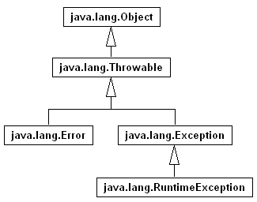
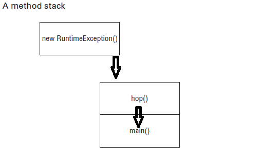

											EXCEPTIONS

											
# Understanding Exceptions: (Comprendre les exceptions)   
Un programme peut échouer pour n'importe quelle raison. Voici quelques possibilités:  
* Le code tente de se connecter à un site Web, mais la connexion Internet est interrompue.  
* Vous avez commis une erreur de codage et tenté d'accéder à un index non valide dans un tableau.  
* Une méthode en appelle une autre avec une valeur que la méthode ne prend pas en charge.   

Comme vous pouvez le voir, certaines de ces erreurs sont des erreurs de codage. D'autres sont totalement hors de votre contrôle. Votre programme ne peut pas l’aider si la connexion Internet tombe en panne. Ce qu'il peut faire, c'est gérer la situation.   
Tout d'abord, nous examinerons le rôle des exceptions. Nous aborderons ensuite les différents types d'exceptions, suivis d'une explication sur la manière de lever une exception en Java.   
### The Role of Exceptions: (Le rôle des exceptions)  
Une exception est la manière de Java de dire: «J'abandonne. Je ne sais pas quoi faire maintenant. Lorsque vous écrivez une méthode, vous pouvez soit gérer l'exception, soit laisser le problème au code appelant. Ce sont les deux approches utilisées par Java pour traiter les exceptions.  
Des exceptions peuvent se produire tout le temps, même dans un code de programme solide. À l'examen, les exceptions concernent en grande partie des erreurs dans les programmes. Par exemple, un programme peut essayer d'accéder à une position non valide dans un tableau. Le point clé à retenir est que les exceptions modifient le *flux du programme*. 

Vous avez vu une exception dans le chapitre 1, «Bienvenue à Java», avec un exemple très simple de Zoo. Vous avez écrit une classe qui a imprimé le nom du zoo:     

		public class Zoo {
			public static void main(String[] args) {
				System.out.println(args[0]);	// Line 3
				System.out.println(args[1]);	// Line 4
			}
		}
Ensuite, vous avez essayé de l'appeler sans suffisamment d'arguments:   
> javac Zoo.java   
> java Zoo zoo

À la ligne 4, Java a réalisé qu’il n’y avait qu’un seul élément dans le tableau et que l’index 1 n’était pas autorisé. Java a jeté ses mains dans la défaite et a jeté une exception. Il n’a pas essayé de gérer l’exception. Il a simplement dit: "Je ne peux pas y faire face" et l'exception a été affichée:     
*Exception in thread "main" java.lang.ArrayIndexOutOfBoundsException: Index 1 out of bounds for length 1  at ocp.chapiter10.Zoo.main(Zoo.java:4)* 
### Understanding Exception Types: (Comprendre les types d'exceptions)   
Comme nous l'avons expliqué, une exception est un événement qui modifie le flux du programme. Java a une superclasse **Throwable** pour tous les objets qui représentent ces événements. Tous n'ont pas le mot exception dans leur nom de classe, ce qui peut prêter à confusion. Ci-dessous on montre les sous-classes clés de Throwable.      

Une erreur signifie que quelque chose s'est tellement mal passé que votre programme ne devrait pas tenter de s'en remettre. Par exemple, le lecteur de disque a «disparu» ou le programme a manqué de mémoire. Ce sont des conditions anormales que vous ne rencontrerez probablement pas et dont vous ne pourrez pas vous remettre.    
Pour l'examen, la seule chose que vous devez savoir sur Throwable est qu'il s'agit de la classe *parente de toutes les exceptions,* y compris la classe Error.  Bien que vous puissiez gérer les exceptions Throwable et Error, il n'est pas recommandé de le faire en le faisant dans le code de votre application. Dans ce chapitre, lorsque nous faisons référence aux exceptions, nous entendons généralement toute classe qui hérite de Throwable, bien que nous travaillions presque avec la classe ou la sous-classe Exception de celle-ci.   
##### Checked Exceptions: (Exceptions Contrôlées)  
Une *exception contrôlée* est une exception qui doit être déclarée ou gérée par le code d'application là où elle est levée. En Java, les exceptions contrôlée héritent toutes de la classe Exception mais pas de RuntimeException. les exceptions vérifiées ont tendance à être une exception anticipée - par exemple, essayer de lire un fichier qui n'existe pas.   
Exceptions contrôlée ? Que contrôlons-nous ? Java a une règle appelée le gestionnaire ou la règle de déclaration. Pour les exceptions contrôlée, Java requiert que le code les gère ou les déclare dans la signature de la méthode.   
Parce que les exceptions contrôlées ont tendance à être anticipées, Java impose au programmeur de faire quelque chose pour montrer que l'exception a été pensée. Peut-être que cela a été géré dans la méthode. Ou peut-être que la méthode déclare qu'elle ne peut pas gérer l'exception et que quelqu'un d'autre devrait le faire.
###### Comment déclarer une exception:        
Jetons un œil à un exemple. La méthode fall() suivante déclare qu'elle pourrait lever une IOException, qui est une exception contrôlée: 

		void fall(int distance) throws IOException {
			if(distance > 10) {
				throw new IOException();
			}
		}
Remarque: dans cet exemple on utilise deux mot-clé, le premier **throw** dit a Java que vous voulez **lever** une exception, alors que le mot-clé **throws déclare** que votre méthode pourrait **propager une exception** .      
###### Comment gérer une exception:  
Maintenant que vous savez comment déclarer une exception, comment la gérez-vous ? La version alternative suivante de la méthode fall() gère l'exception:  

		void fall(int distance){
			try {
				if(distance > 10) {
					throw new IOException();
				}
			}catch(Exception e) {
				e.printStackTrace();
			}
		}
Notez que l'instruction catch utilise Exception, pas IOException. Étant donné que IOException est une sous-classe d'Exception, le bloc catch est autorisé à l'attraper. Nous aborderons plus en détail les blocs try et catch plus loin dans ce chapitre. Donc on peut conculure que les excéptions vérifiées ou contrôlées **sont gérer par le bloc try-catch**.              
##### Unchecked Exceptions: (Exceptions non Contrôlées)
Une *exception non contrôlée* est une exception qui n'a pas besoin d'être déclarée ou gérée par le code d'application où elle est levée. Exception non contrôlée est souvent appelée exception d'exécution, bien qu'en Java, exception non contrôlée inclut toute classe qui hérite de RuntimeException ou Error.   
L'exception de d'exécution *runtime exception*, est définie dans la classe RuntimeException et ses sous-classes.    
Les exceptions de d'exécutions ont tendance à être inattendus mais pas nécessairement fatals. Par exemple, l'accès à un index de tableau non valide est inattendu. Même s'ils héritent de la classe Exception, ils ne sont pas des exceptions contrôlées.   
*Runtime vs. at the Time the Program is Run (Exécution vs au moment où le programme est compilé)*: Une exception d'exécution (non contrôlée) est un type d'exception spécifique. Toutes les exceptions se produisent au moment de l'exécution du programme. (L'alternative est le temps de compilation, ce qui serait une erreur du compilateur.) Les gens ne se réfèrent pas à eux comme des exceptions d'exécution car ce serait trop facile à confondre avec l'exécution! Lorsque vous voyez runtime, cela signifie non contrôlé.   
Une exception non contrôlée peut souvent se produire sur presque toutes les lignes du code, car il n'est pas nécessaire de la traiter ou de la déclarer. Par exemple, un NullPointerException peut être levé dans le corps de la méthode suivante si la référence d'entrée est nulle:

		void fall(String input) {
			System.out.println(input.toLowerCase());
		} 
Nous travaillons si fréquemment avec des objets en Java qu'un NPE peut se produire presque partout. Si vous deviez déclarer une exception non contrôlée partout, chaque méthode aurait cet encombrement!  
*Checked vs. Unchecked (Runtime) Exceptions: (Contôlée vs non contrôlée exception )* Par le passé, les développeurs utilisaient plus souvent des exceptions contrôlées qu'aujourd'hui. Selon Oracle, ils sont destinés aux problèmes dont un programmeur «pourrait raisonnablement s'attendre à se remettre». Ensuite, les développeurs ont commencé à écrire du code où une chaîne de méthodes continuait à déclarer la même exception et personne ne l'a réellement gérée. Certaines bibliothèques ont commencé à utiliser des exceptions d'exécution pour les problèmes dont un programmeur pourrait raisonnablement s'attendre à récupérer. De nombreux programmeurs peuvent tenir un débat avec vous sur l'approche qui est la meilleure. Pour l'examen OCA, vous devez connaître les règles de fonctionnement des exceptions contrôlées et non contrôlées. Vous n’avez pas à décider philosophiquement si une exception doit être contrôlée ou non.       
### Throwing an Exception: (Lever une exception)  
Tout code Java peut lever une exception, cela inclut le code que vous écrivez. Pour l'examen OCP, vous apprendrez à créer vos propres classes d'exception. L'examen OCA est limité aux exceptions créées par quelqu'un d'autre. Très probablement, ce seront des exceptions fournies avec Java. Vous pouvez rencontrer une exception qui a été compensée pour l'examen. C'est bon. La question rendra évident que ce sont des exceptions en ayant le nom de classe se terminant par exception. Par exemple, «MyMadeUpException» est clairement une exception.    
Lors de l'examen, vous verrez deux types de code qui entraînent une exception. Le premier est un code erroné. Par exemple:  

		String[] animals = new String[0];
		System.out.println(animals[0]);
Ce code lève une ArrayIndexOutOfBoundsException car le tableau ne contient aucun élément. Cela signifie que les questions sur les exceptions peuvent être cachées dans des questions qui semblent concerner autre chose.   

La deuxième façon pour que le code génère une exception est de demander explicitement à Java d'en lancer une. Java vous permet d'écrire des instructions comme celles-ci:   

		throw new Exception();
		throw new Exception("Ow! I fell.");
		throw new RuntimeException();
		throw new RuntimeException("Ow! I fell.");
Le mot-clé throw indique à Java que vous souhaitez qu'une autre partie du code traite l'exception. C'est la même chose que la jeune fille qui pleure pour son papa. Quelqu'un d'autre doit déterminer ce qu'il faut faire à propos de l'exception.   
* throw vs throws: Chaque fois que vous voyez throw ou throws dans l'examen, assurez-vous que le bon est utilisé. Le mot clé throw est utilisé comme une instruction à l'intérieur d'un bloc de code pour lever une nouvelle exception ou renvoyer une exception existante, tandis que le mot clé throws n'est utilisé qu'à la fin d'une déclaration de méthode pour indiquer quelle exception sera propagée.  

Lors de la création d'une exception, vous pouvez généralement transmettre un paramètre String avec un message ou vous ne pouvez passer aucun paramètre et utiliser les valeurs par défaut. Nous disons généralement parce que c'est une convention. Quelqu'un pourrait créer une classe d'exception qui n'a pas de constructeur qui accepte un message. Les deux premiers exemples créent un nouvel objet de type Exception et le lancent. Les deux derniers montrent que le code est le même quel que soit le type d'exception que vous lancez.  

En outre, vous devez savoir qu'*une exception est un objet*. Cela signifie que vous pouvez stocker dans une variable, et c'est légale:  

			Exception e = new RuntimeException();
			throw e;
Le code instancie une exception sur une ligne, puis lève sur la suivante. L'exception peut venir de n'importe où, même passée dans une méthode. Tant qu'il s'agit d'une exception valide, elle peut être levée.  

L'examen pourrait également essayer de vous tromper. Voyez-vous pourquoi ce code ne se compile pas ?  

		throw RuntimeException();	//DOES NOT COMPILE
Si votre réponse est qu'il manque un mot-clé, vous avez absolument raison. L'exception est toujours instanciée avec le mot-clé **new**.

Jetons un coup d'œil à un autre endroit où l'examen pourrait essayer de vous tromper. Pouvez-vous voir pourquoi ce qui suit ne compile pas.  

		try {
				throw new RuntimeException();	// Line 4
				throw new ArrayIndexOutOfBoundsException();	//DOES NOT COMPILE
		}catch(Exception e) {
				...
		}   
Puisque la ligne 4 lève une exception, la ligne 5 ne peut jamais être atteinte pendant l'exécution. La compilation reconnaît cela et signale une erreur de code inaccessible.   
* Runtime exception: Sous-classe de RuntimeException, le programme peut catcher l'exception, Le programme n'est pas obligé de la traiter ou la déclarer.    
* Checked exception: Sous-classe d'exception mais pas sous-classe de RuntimeException, le programme peut catcher l'exception, le programme doit traiter *(gérer l'exceptions avec un bloc try-catch)* ou la déclarer *(utiliser le mot-clé throws)*.  
* Error: Sous-classe de Error, le programme ne peut pas catcher l'exception, Le programme n'est pas obligé de la traiter ou la déclarer. 

# Recognizing Exception Classes: (Reconnaître les classes d'exception)  
Vous devez reconnaître trois types d'exceptions pour l'examen, les exceptions d'exécution (runtime exceptions), les exceptions contrôlées et les erreurs (Error). Nous examinerons des exemples courants de chaque type. Pour l’examen, vous devrez reconnaître de quel type d’exception il s’agit et si elle est lancée par la JVM ou un programmeur. Pour que vous puissiez les reconnaître, nous allons vous montrer quelques exemples de code pour ces exceptions.
### Runtime Exception Classes: (Classes d'exception à l'exécution - type unchecked Exception)  
Les exceptions d'exécution étendent de RuntimeException. Ils n’ont pas à être manipulés ou déclarés. Ils peuvent être lancés par le programmeur ou par la JVM. Les exceptions d'exécution courantes sont les suivantes: 
##### ArithmeticException:  
Lancé par la JVM lorsque le code tente de diviser par zéro.  

	int answer = 11 / 0;
L'exécution de ce code entraîne la sortie suivante:
*java.lang.ArithmeticException: / by zero*
##### ArrayIndexOutOfBoundsException:  
Lancé par la JVM lorsque le code utilise un index illégal pour accéder à un tableau. 
Vous savez maintenant que les index de tableau commencent par 0 et vont jusqu'à 1 de moins que la longueur du tableau - ce qui signifie que ce code lèvera une ArrayIndexOutOfBoundsException:  

		int[] countsOfMoose = new int[3];
		System.out.println(countsOfMoose[-1]); 
C'est un problème car il n'existe pas d'index de tableau négatif. L'exécution de ce code produit la sortie suivante:
*java.lang.ArrayIndexOutOfBoundsException: Index -1 out of bounds for length 3*
##### ClassCastException: 
Lancé par la JVM lors d'une tentative de conversion d'une exception vers une sous-classe dont elle n'est pas une instance.  
Java essaie de vous protéger des casts impossibles. Ce code compile pas car Integer n'est pas une sous-classe de String:  

		String type = "moose";
		Integer number = (Integer) type; // DOES NOT COMPILE
Un code plus compliqué contredit les tentatives de Java pour vous protéger. Lorsque le cast échoue à l'exécution, Java lèvera une ClassCastException:   

		String type = "moose";
		Object obj = type;
		Integer number = (Integer) obj; 
Le compilateur voit une conversion de Object en Integer. Cela pourrait être correct. Le compilateur ne réalise pas qu'il y a une chaîne dans cet objet. Lorsque le code s'exécute, il donne la sortie suivante:  
*java.lang.ClassCastException: class java.lang.String cannot be cast to class java.lang.Integer*
##### NullPointerException:  
Lancé par la machine viruelle Java lorsqu'il existe une référence nulle où un objet est requis.   
Les variables et méthodes d'instance doivent être appelées sur une référence non nulle. Si la référence est null, la JVM lèvera une NullPointerException. C'est généralement subtil, comme cet exemple, qui vérifie si vous vous souvenez que les références de variable d'instance sont par défaut nulles.  

		String name = null;
		System.out.println(name.length());
L'exécution de ce code entraîne cette sortie:  
*java.lang.NullPointerException*
##### IllegalArgumentException:  
Lancé par le programmeur pour indiquer qu'une méthode a reçu un argument illégal ou inapproprié.  
IllegalArgumentException est un moyen pour votre programme de se protéger. Nous avons d'abord vu la méthode setter suivante dans la classe Swan au chapitre 7, «Méthodes et encapsulation».  

		public void setNumberEggs(int numberEggs) {// setter
			if (numberEggs >= 0) // guard condition
				this.numberEggs = numberEggs;
		}
Ce code fonctionne, mais nous ne voulons pas vraiment ignorer la demande de l'appelant quand il nous dit qu'un cygne a –2 œufs. Nous voulons dire à l'appelant que quelque chose ne va pas. Les exceptions sont un moyen efficace de le faire. Voir le code se terminer par une exception est un excellent rappel que quelque chose ne va pas:  

		public void setNumberEggs(int numberEggs) {
			if (numberEggs < 0)
				throw new IllegalArgumentException(
						 "# eggs must not be negative");
			this.numberEggs = numberEggs;
		}
Le programme lève une exception lorsqu'il n'est pas satisfait des valeurs des paramètres. La sortie ressemble à ceci:   
*java.lang.IllegalArgumentException: # eggs must not be negative*
##### NumberFormatException:  
Lancé par le programmeur lorsqu'une tentative est faite pour convertir une chaîne en type numérique mais que la chaîne n'a pas un format approprié.   
Java fournit des méthodes pour convertir des chaînes en nombres. Lorsque ceux-ci reçoivent une valeur non valide, ils lèvent une NumberFormatException. L'idée est similaire à IllegalArgumentException. Puisqu'il s'agit d'un problème courant, Java lui attribue une classe distincte. En fait, NumberFormatException est une sous-classe d'IllegalArgumentException. Voici un exemple de tentative de conversion d'un élément non numérique en un entier:  

		Integer.parseInt("abc");
La sortie ressemble à ceci:  
*java.lang.NumberFormatException: For input string: "abc"*
### Checked Exception Classes: (Classes d'exception contôlées)  
Les exceptions contrôlées ont une exception dans leurs hiérarchie mais n'est pas RuntimeException. Elles doivent être gérées ou déclarées. elles peuvent être lancées par le programmeur ou par la JVM. Les exceptions contrôlées les plus courantes sont les suivantes.  
##### IOException: 
Lancé par le programme en cas de problème de lecture ou d'écriture d'un fichier.   
##### FileNotFoundException:  
Lancé par le programme lorsque le code tente de référencer un fichier qui n'existe pas.  :

Pour l'examen, il vous suffit de savoir qu'il s'agit d'exceptions contrôlées. Gardez également à l'esprit que FileNotFoundException est une sous-classe d'IOException. Vous verrez bientôt pourquoi c'est important.  
### Errors Classes: (Classes d'erreurs - type unchecked Exception)
Les erreurs étendent la classe Error. Ils sont lancés par la JVM et ne doivent pas être traités ou déclarés. Les erreurs sont rares, mais vous pourriez les voir:  
##### ExceptionInInitializerError:
Lancé par la JVM lorsqu'un initialiseur statique lève une exception et ne la gère pas.  
Java exécute des initialiseurs statiques la première fois qu'une classe est utilisée. Si l'un des initialiseurs statiques lève une exception, Java ne peut pas commencer à utiliser la classe. Il déclare la défaite en lançant une ExceptionInInitializerError. Ce code montre un ArrayIndexOutOfBounds dans un initialiseur statique:    

		public class ErrorsExcep {
			static {
				int[] countsOfMoose = new int[3];
				int num = countsOfMoose[-1];
			}
			public static void main(String[] args) {
			}
		}
Ce code fournit des informations sur l'erreur et l'exception sous-jacente:  
*java.lang.ExceptionInInitializerError*   
*Caused by: java.lang.ArrayIndexOutOfBoundsException: Index -1 out of bounds for length 3*    
Nous obtenons le ExceptionInInitializerError car l'erreur s'est produite dans un initialiseur statique. Ces informations à elles seules ne seraient pas particulièrement utiles pour résoudre le problème. Par conséquent, Java nous indique également la cause initiale du problème: l'exception ArrayIndexOutOfBoundsException que nous devons corriger.
ExceptionInInitializerError est une erreur car Java n'a pas pu charger toute la classe. Cet échec empêche Java de continuer.    
##### StackOverflowError:
Lancé par la JVM lorsqu'une méthode s'appelle elle-même trop de fois (cela s'appelle une récursion infinie car la méthode s'appelle généralement sans fin).  
Lorsque Java appelle des méthodes, il place des paramètres et des variables locales sur la pile. Après avoir fait cela un très grand nombre de fois, la pile manque de place et déborde. Cela s'appelle une StackOverflowError. La plupart du temps, cette erreur se produit lorsqu'une méthode s'appelle elle-même.   

		public static void doNotCodeThis(int num) {
			doNotCodeThis(1);
		}
La sortie contient cette ligne:  
*Exception in thread "main" java.lang.StackOverflowError*   
Puisque la méthode s'appelle elle-même, elle ne s'arrêtera jamais. Finalement, Java manque de place sur la pile et renvoie l'erreur. C'est ce qu'on appelle la récursion infinie. C'est mieux qu'une boucle infinie car au moins Java l'attrapera et lèvera l'erreur. Avec une boucle infinie, Java utilise simplement tout votre processeur jusqu'à ce que vous puissiez le tuer.    
##### NoClassDefFoundError:  
Lancé par la JVM lorsqu'une classe utilisée par le code est disponible au moment de la compilation mais pas à l'exécution.  
Cette erreur n'apparaîtra pas dans le code de l'examen. Vous devez simplement savoir qu'il s'agit d'une erreur. NoClassDefFoundError se produit lorsque Java ne peut pas trouver la classe au moment de l'exécution.   
# Handling Exceptions: (Gestion des exceptions) 
Que faites-vous lorsque vous rencontrez une exception ? Comment gérez-vous ou récupérez-vous de l'exception ? Dans cette section, nous montrerons les différentes instructions en Java qui prennent en charge la gestion des exceptions et garantissent que certains codes, comme la fermeture d'une ressource, sont toujours exécutés.  
### Using try and catch Statements: (Utilisation des instructions try et catch)   
Maintenant que vous savez ce que sont les exceptions, voyons comment les gérer. Java utilise une instruction try pour séparer la logique qui pourrait lever une exception de la logique pour gérer cette exception.  Regardons l'example ci-dessous qui montre la syntaxe d'une instruction try:  

		try{
			// Protected code
		} catch( exception_type identifier ) {
			//exception handler 
		}
* try: Le mot-clé try  
* { }: Des accolades bouclées sont nécessaires(Curly braces are required).  
* catch: Le mot-clé catch.  
*  exception_type: Le type d'exception que vous essayez d'attraper.   
* dentifier: L'identificateur fait référence à l'objet d'exception intercepté.   

Le code du bloc try est exécuté normalement. Si l'une des instructions lève une exception qui peut être interceptée par le type d'exception répertorié dans le bloc catch, le bloc try cesse de s'exécuter et l'exécution passe à l'instruction catch. Si aucune des instructions du bloc try ne lève une exception pouvant être interceptée, la clause catch n'est pas exécutée.   
Vous avez probablement remarqué que les mots *bloc* et *clause* sont interchangeables. L'examen le fait également, alors nous vous y habituons. Les deux sont corrects. Block est correct car il y a des accolades présentes. Clause est correct car ils font partie d'une instruction try.   
Il n'y a pas une tonne de règles de syntaxe ici. Les accolades sont nécessaires pour les blocs try et catch.    
Dans notre exemple, la petite fille se relève toute seule la première fois qu'elle tombe. Voici à quoi cela ressemble:   

		void explore() {
			try {
				fall();	// Line 5
				System.out.println("never get here");
			} catch (RuntimeException e) {	// Line 6
				getUp();	// Line 8
			}
			seeAnimals();	// Line 10
		}
	
		void fall() { throw new RuntimeException(); }	// Line 12
Tout d'abord, la ligne 5 appelle la méthode fall(). La ligne 12 lève une exception. Cela signifie que Java saute directement au bloc catch, en sautant la ligne 6. La fille se lève sur la ligne 8. Maintenant, l'instruction try est terminée et l'exécution se déroule normalement avec la ligne 10.

Examinons à présent quelques déclarations d'essai non valides que l'examen pourrait essayer de vous tromper. Voyez-vous ce qui ne va pas avec celui-ci ?

		try // DOES NOT COMPILE
			fall();
		catch (Exception e)
			System.out.println("get up"); 
Le problème est que les accolades sont manquantes. Il doit ressembler à ceci:

		try {
			fall();
		} catch (Exception e) {
			System.out.println("get up");
		}
Les instructions try sont comme des méthodes en ce sens que les accolades sont requises même s'il n'y a qu'une seule instruction dans les blocs de code. Les instructions if et les boucles sont spéciales à cet égard car elles vous permettent d'omettre les accolades.   
Et celui-là ?  

		try {// DOES NOT COMPILE
			fall();
		}
Ce code ne se compile pas car le bloc try ne contient rien après. N'oubliez pas que le but d'une instruction try est que quelque chose se produise si une exception est levée. Sans une autre clause, l'instruction try est solitaire. Comme vous le verrez bientôt, il existe un type spécial d'instruction try qui inclut un bloc finally implicite, bien que la syntaxe pour cela soit assez différente de celle de cet exemple.  
### Chaining catch Blocks: (Chaînage des blocs de capture)   
Jusqu'à présent, vous n'avez attrapé qu'un seul type d'exception. Voyons maintenant ce qui se passe lorsque différents types d'exceptions peuvent être lancés à partir de la même try/catch bloc.   
Pour l'examen, il ne vous sera pas demandé de créer votre propre exception, mais il se peut que vous receviez des classes d'exception et que vous deviez comprendre comment elles fonctionnent. voici comment y faire face. Tout d'abord, vous devez être capable de reconnaître si l'exception est une exception cochée ou non cochée. Deuxièmement, vous devez déterminer si l'une des exceptions est une sous-classe des autres.    

		class AnimalsOutForAWalk extends RuntimeException { }
		class ExhibitClosed extends RuntimeException { }
		class ExhibitClosedForLunch extends ExhibitClosed { }
Dans cet exemple, il existe trois exceptions personnalisées. Toutes sont des exceptions non vérifiées car elles étendent directement ou indirectement RuntimeException. Nous capturons maintenant les deux types d'exceptions et les gérons en imprimant le message approprié:  

		public void visitPorcupine() {
		    try {
		    		seeAnimal();
			} catch (AnimalsOutForAWalk e) {// first catch block
				System.out.print("try back later");
			} catch (ExhibitClosed e) {// second catch block
				System.out.print("not today");
			}
		} 
Il existe trois possibilités pour l'exécution de ce code. Si seeAnimal() ne lève pas d’exception, rien n’est affiché. Si l'animal est en promenade, seul le premier bloc de catch fonctionne. Si l'exposition est fermée, seul le deuxième bloc catch s'exécute.  Il n'est pas possible que les deux blocs catch soient exécutés lorsqu'ils sont enchaînés comme ceci.   
Une règle existe pour l'ordre des blocs catch. Java les regarde dans leur ordre d'apparition. S'il est impossible d'exécuter l'un des blocs catch, une erreur du compilateur concernant le code inaccessible se produit. Cela se produit lorsqu'une superclasse est interceptée avant une sous-classe. N'oubliez pas que nous vous avons averti de faire attention à toute exception de sous-classe.    
Dans l'exemple du porc-épic, l'ordre des blocs catch pourrait être inversé car les exceptions n'héritent pas les unes des autres. Et oui, nous avons vu un porc-épic se promener en laisse.   

L'exemple suivant montre les types d'exceptions qui héritent les uns des autres:

		public void visitMonkeys() {
			try {
				seeAnimal();
			} catch (ExhibitClosedForLunch e) {// subclass exception
				System.out.print("try back later");
			} catch (ExhibitClosed e) {// superclass exception
				System.out.print("not today");
			}
		}
Si l'exception ExhibitClosedForLunch plus spécifique est levée, le premier bloc catch s'exécute. Sinon, Java vérifie si l'exception Superclass ExhibitClosed est levée et la rattrape. Cette fois, l'ordre des blocs de capture importe. L'inverse ne fonctionne pas.  

		public void visitMonkeys() {
			try {
				seeAnimal();
			} catch (ExhibitClosed e) {
				System.out.print("not today");
			} catch (ExhibitClosedForLunch e) {// DOES NOT COMPILE
				System.out.print("try back later");
			}
		}
Cette fois, si l'exception plus spécifique ExhibitClosedForLunch est levée, le bloc catch pour ExhibitClosed s'exécute, ce qui signifie qu'il n'y a aucun moyen pour le deuxième bloc catch de s'exécuter. Java nous dit correctement qu'il y a un bloc catch inaccessible.  

Essayons encore une fois. Voyez-vous pourquoi ce code ne se compile pas ?   

		public void visitSnakes() {
			try {
				seeAnimal();
			} catch (IllegalArgumentException e) {
			} catch (NumberFormatException e) {// DOES NOT COMPILE
			}
		}
Souvenons-nous, que *NumberFormatException* est une sous-classe de *IllegalArgumentException*, ce signifie que dans cet exemple si le bloc try lève une exception il sera catchée tout le temps dans le premier bloc, rendant le deuxième code de catch inaccessible qui ne compile pas. Egalement, pour l'examen on doit savoir que *FileNotFoundException* est une sous-classe de IOException.   

Pour revoir plusieurs blocs catch, rappelez-vous qu'au plus un bloc catch sera exécuté et que ce sera le premier bloc catch qui pourra le gérer. Souvenez-vous également qu'une exception définie par l'instruction catch n'est que *la portée de ce bloc catch*. Par exemple, l'exemple suivant provoque une erreur du compilateur car il tente d'utiliser la classe d'exception en dehors du bloc pour lequel elle a été définie:

		public void visitSnakes() {
			try {
				seeAnimal();
			} catch (NumberFormatException e1) {
				System.out.print(e1);
			} catch (IllegalArgumentException e2) {
				System.out.print(e1);// DOES NOT COMPILE
			}
		}
### Applying a Multi-catch Block: (Application d'un bloc multi-catch)   
Souvent, nous voulons que le résultat d'une exception levée soit le même, quelle que soit l'exception particulière levée. Par exemple, jetez un œil à cette méthode:  

		public static void main(String[] args) {
			try {
				System.out.println(Integer.parseInt(args[1]));
			}catch(ArrayIndexOutOfBoundsException e) {
				System.out.println("Missing or invalid input");
			}catch(NumberFormatException e) {
				System.out.println("Missing or invalid input");
			}
		}
Noter qu'on a le même message de println() instruction pour deux différents blocs catch. Comment on peut reduire la dupliction du code ? 
Une façon consiste à faire en sorte que les classes d'exceptions associées héritent toutes de la même interface ou étendent la même classe. Par exemple, vous pouvez avoir un seul bloc catch qui capture une simple Exception. Cela attrapera tous les évertissements. une autre façon est de déplacer l'instruction println() dans une méthode distincte et de demander à chaque bloc catch associé d'appeler cette méthode.    
Bien que ces solutions soient valides, Java fournit une autre structure pour gérer cela plus gracieusement appelé un *bloc multi-catch*. Un bloc multi-catch permet à plusieurs types d'exceptions d'être interceptés par le même bloc catch.
Réécrivons le précédent exemple en utilisant un bloc multi-catch:

		public static void main(String[] args) {
			try {
				System.out.println(Integer.parseInt(args[1]));
			}catch(ArrayIndexOutOfBoundsException | NumberFormatException e) {
				System.out.println("Missing or invalid input");
			}
		}
Ceci est vraiment mieux. Il n'y a pas de code en double, la logique commune est au même endroit et la logique est exactement là où vous vous attendez à la trouver. Si vous le souhaitez, vous pouvez toujours avoir un deuxième bloc catch pour Exception au cas où vous souhaiteriez gérer les autres types d'exceptions différemment.    
Montrons la syntaxe de multi-catch. C'est comme une clause catch régulière, sauf que deux types d'exception ou plus sont spécifiés séparés par un pipe. Le pipe (|) est également utilisé comme opérateur "ou", ce qui vous permet de vous rappeler facilement que vous pouvez utiliser l'un ou l'autre des types d'exception. Remarquez comment il y a un **seul** nom de variable dans la clause catch. Java dit que la variable nommée **e** peut être de type Exception1 ou Exception2.   

			try {
				// Protected code
			}catch(Exception1 | Exception2 e) {
				// Exception handler
			}
* Exception1 et Exception2: Attrapez l'une de ces exceptions.  
* |: Le pipe est obligatoire entre les types d'exceptions.  
* e: un seul identifiant pour tous les types d'exceptions.  

L'examen pourrait essayer de vous tromper avec une syntaxe incorrecte: 

		catch(Exception1 e | Exception2 e | Exception3 e)	// DOES NOT COMPILE
		catch(Exception1 e1 | Exception2 e2 | Exception3 e3)// DOES NOT COMPILE
		catch(Exception1 | Exception2 | Exception3 e)// COMPILE     
* La première ligne ne compile pas, parce que la variable e est apparue 3 fois, devant chaque type d'exception.   
* La deuxième ligne ne compile pas, parce que on utilise pour chaque types d'exceptions une variable.  
* Le toisième ligne compile normalement.   

Java a l'intention d'utiliser la multi-catch pour les exceptions **qui ne sont pas liées**, et cela vous empêche de spécifier des types redondants dans une multi-catch. Voyez-vous ce qui ne va pas ici ?   

		try {
			throw new IOException();
		}catch(FileNotFoundException | IOException e) {} // DOES NOT COMPILE
Le spécifier dans le multi-catch est redondant, et le compilateur donne un message comme celui-ci: *The exception C is already caught by the alternative IOException*.  
Comme FileNotFoundException est une sous-classe de IOException le code ne compile pas.     
Un bloc multi-catch suit des règles similaires à celles du chaînage des blocs catch que vous avez vu dans la section précédente. Par exemple, les deux déclenchent des erreurs du compilateur lorsqu'ils rencontrent du code inaccessible ou des exceptions en double interceptées. La seule différence entre les blocs multi-catch et les blocs de chaînage est que l'ordre n'a pas d'importance pour un bloc multi-catch dans une seule expression catch.    

Pour examiner les captures multiples, voyez combien d'erreurs vous pouvez trouver dans cette instruction try   

		private void mightThrow() throws DateTimeParseException, IOException {}
		
		try {
			mightThrow();
		}catch(FileNotFoundException | IllegalStateException e) { //Line 14
		}catch(InputMismatchException e| MissingResourceException e) { // Line 15
		}catch(FileNotFoundException | IllegalArgumentException e) {// Line 16
		}catch(Exception e) {// Line 17
		}catch(IOException e) {
		}
Dans ce code on a beaucoup d'erreurs. En fait, certaines erreurs en masquent d'autres, il se peut donc que vous ne les voyiez pas toutes dans le compilateur. Une fois que vous commencez à corriger certaines erreurs, vous verrez les autres. Voici ce qui ne va pas:   
* La ligne 15 a un nom de variable supplémentaire. N'oubliez pas qu'il ne peut y avoir qu'une seule variable d'exception par bloc catch.   
* La ligne 16 ne peut pas attraper FileNotFoundException car cette exception a déjà été interceptée à la ligne 14. Vous ne pouvez pas lister le même type d'exception plus d'une fois dans la même instruction try, tout comme avec les blocs catch "normaux".     
* Les lignes 17 et 18 sont inversées. Les superclasses plus générales doivent être interceptées après leur sous-classe. Bien que cela n'ait rien à voir avec la multi-catch, vous verrez des problèmes de bloc catch "normaux" mélangés avec la multi-catch.     

### Adding finally Blocks: (Ajouter le bloc finally)  
L'instruction try vous permet également d'exécuter du code à la fin avec une clause finally, qu'une exception soit levée ou non. La figure ci-dessous montre la syntaxe d'une instruction try avec cette fonctionnalité supplémentaire.  
		
		try {
			//protected code
		} catch ( exceptiontype identifier ) {
			//exception handler
		} finally {
			//finally block
		}
* Le block catch est optionnel quand finally est utilisé.  
* finally: Le mot-clé finally.  
* Le bloc finally: s'exécute toujours, qu'une exception se produise ou non dans le bloc try.
   
Il existe deux chemins dans le code avec à la fois un catch et un finally. Si une exception est levée, le bloc finally est exécuté après le bloc catch. Si aucune exception n'est levée, le bloc finally est exécuté une fois le bloc try terminé.  
Revenons à notre exemple de jeune fille, cette fois avec enfin:  

		void explore() {
			try {
				seeAnimals();
				fall();	// Line 15 
			} catch (Exception e) {
				getHugFromDaddy();	// Line 17
			} finally {
				seeMoreAnimals();	// Line 19
			}
			goHome();	// Line 21
		}
La fille tombe à la ligne 15. Si elle se lève d'elle-même, le code passe au bloc finally et exécute la ligne 19, et ensuite le code continue à la ligne 21. Si la fille ne se lève pas elle-même, elle lève une exception. Le bloc catch s'exécute et elle obtient un câlin sur la ligne 17. Ensuite avec ce câlin, elle est prête à voir plus d'animaux à la ligne 19, et le code continue à la ligne 21. Dans tous les cas, la fin est la même. Le bloc finally est exécuté et l'exécution se poursuit après l'instruction try.     

L'examen tentera de vous tromper avec des clauses manquantes ou des clauses dans le mauvais ordre. Voyez-vous pourquoi ce qui suit compile ou ne compile pas ?   

		try { // DOES NOT COMPILE  // Line 25
			fall();
		} finally {
			System.out.println("all better");
		} catch (Exception e) {
			System.out.println("get up");
		}	// Line 31

		try { // DOES NOT COMPILE	// Line 33
			fall();
		}	// Line 35
		
		try {	// Line 37
			fall();
		} finally {
			System.out.println("all better");
		}	// Line 41
Le premier exemple (lignes 25–31) ne compile pas car les blocs catch et finally sont dans le mauvais ordre. Le deuxième exemple (lignes 33–35) ne compile pas car il doit y avoir un bloc catch ou finally. Le troisième exemple (lignes 37–41) est juste fine. catch n'est pas nécessaire si le bloc finally est présent.    

Un problème avec finally est que toute utilisation réaliste de celui-ci est hors de la portée de l'examen. Enfin est généralement utilisé pour fermer des ressources telles que des fichiers ou des bases de données, qui sont tous deux des sujets de l'examen OCP-1Z0-816. Cela signifie que la plupart des exemples que vous rencontrez lors de l'examen avec finally auront finalement l'air artificiel. Par exemple, des questions vous seront posées telles que ce que ce code produit:  

		String s = "";
		try {
			s += "t";
		} catch (Exception e) {
			s += "c";
		} finally {
			s += "f";
		}
		s += "a";
		System.out.print(s);
La réponse est **tfa**. Le bloc try est exécuté. Puisqu'aucune exception n'est levée, Java passe directement au bloc finally. Ensuite, le code après l'instruction try est exécuté. Nous savons; c'est un exemple idiot. Attendez-vous à voir des exemples comme celui-ci à l'examen.   

Il y a une règle supplémentaire que vous devez connaître pour les blocs finally. D'une instruction try avec un bloc finally entré, le bloc finally sera toujours exécuté, que le code se termine ou non avec succès. Jetez un œil à la méthode goHome() suivante. En supposant qu'une exception peut ou non être levée à la ligne 14, quelles sont les valeurs possibles que cette méthode pourrait affichere ? De plus, quelle serait la valeur de retour dans chaque cas ?    

		int goHome() {
			try {
				// Optionally throw an exception here	line 14
				System.out.println("1");	// line 15
				return -1;
			}catch(Exception e) {
				System.out.println("2");
				return -2;
			}finally {
				System.out.println("3");
				return -3;
			}
		}
Si aucune exception est levée dans la ligne 14, alors la ligne 15 sera exécutée et affiche 1. Avant que la méthode exécute l'instruction return, le bloc finally est exécuté et affiche 3. En revanche si une exception est levée sur la lige 14 alors on va dans le bloc exception et on affich 2, ensuite 3 du bloc finally.   
La méthode goHome() **retourne -3** qq soit, il y a ou non une exception lévée. 

Regardons ce dernier exemple: 

		int goHome2() {
			try {
				System.out.print("1");
				return -1;
			}catch(Exception e) {
				System.out.print("2");
				return -2;
			}finally {
				System.out.print("3");
			}
		} 
La méthode goHome2() ne lève pas un exception donc on affiche 1 ensuite avant d'exécuter le return on va au bloc finally on affiche 3, et comme finally n'a pas de retrun on exécute le return du bloc try donc goHome() retourne -1.        

* System.exit: Il existe une exception à la règle « le bloc final doit toujours être exécuté » : Java définit une méthode que vous appelez en tant que System.exit(). Il prend un paramètre entier qui représente le code d'erreur qui est renvoyé.        

		try {
			System.exit(0);
		}finally {
			System.out.print("Never going to get here");	// Not printed
		}
Le paramètre entier est le code d'erreur renvoyé. System.exit dit à Java: «Arrêtez. Terminez le programme maintenant. Ne passez pas. Ne collectez pas 200 $. » Lorsque System.exit est appelé dans le bloc try ou catch, finalement ne s'exécute pas.     
### Finally Closing Resources: (fermeture des ressources dans finally):    
Souvent, votre application fonctionne avec des fichiers, des bases de données et des objets de connexion. Généralement, ces sources de données externes sont appelées ressources. Dans certains cas, vous ouvrez une connexion à la ressource, que ce soit sur le réseau ou dans un système de fichiers. Vous lisez / écrivez ensuite les données souhaitées. Enfin, vous fermez la ressource pour indiquer que vous en avez terminé.      
Ce qui se passe si on ferme pas la ressource ? Bref, beaucoup de mauvaises choses pourraient arriver. Si vous vous connectez à une base de données, vous pouvez utiliser toutes les connexions disponibles, ce qui signifie que personne ne peut se connecter à la base de données jusqu'à ce que vous libériez vos connexions. Bien que vous entendiez souvent parler de fuites de mémoire comme provoquant l'échec des programmes, une fuite de ressources est tout aussi grave et se produit lorsqu'un programme ne parvient pas à libérer ses connexions à une ressource, ce qui rend la ressource inaccessible.    
Ecrire du code qui ouvre un fichier, lit les données et le ferme:   

		FileInputStream is = null;
		try {
			is = new FileInputStream("myFile.txt");	// Line 7
			// Read file datad
		}catch(IOException e) {
			e.printStackTrace();
		}finally {
			if(is != null) {
				try {
					is.close();	// Line 14
				}catch(IOException e2) {
					e2.printStackTrace();
				}
			}
		}

Wow, c'est une longue méthode! pourquoi avez-vous deux blocs try et catch ? Eh bien, le code des lignes 7 et 14 inclut tous les deux les appels IOException vérifiés, ils doivent donc tous deux être capturés dans la méthode ou renvoyés par la méthode.   
La moitié des lignes de code de cette méthode ne font que fermer une ressource. Et plus vous avez de ressources, plus le code comme celui-ci devient long. Par exemple, vous pouvez avoir plusieurs ressources et elles doivent être fermées dans un ordre particulier. Vous ne voulez pas non plus qu'une exception à la fermeture d'une ressource empêche la fermeture d'une autre ressource.   
Pour résoudre ça. Java inclut l'instruction **try-with-resources** (Depuis **java 7**) pour fermer automatiquement toutes les ressources ouvertes dans une clause try. Cette fonctionnalité est également connue sous le nom de gestion automatique des ressources, car Java se charge automatiquement de la fermeture.   
Jetons un coup d'œil à notre même exemple en utilisant une instruction try-with-resources:  

		public void readFile(String file) {
			try(FileInputStream is = new FileInputStream("myFile.txt")){
				// Read file date
			}catch(IOException e) {
				e.printStackTrace();
			}
		}
Sur le plan fonctionnel, ils sont tous les deux assez similaires, mais notre nouvelle version comporte deux fois moins de lignes. Plus important encore, en utilisant une instruction try-with-resources, nous garantissons que dès que la connexion sortira du champ d'application, Java tentera de la fermer avec la même méthode.   
Dans les sections suivantes, nous examinerons la syntaxe try-with-resources et comment indiquer qu'une ressource peut être fermée automatiquement.  
* Implicit finally Blocks: (Bloc finally implicite)  Dans les coulisses, le compilateur remplace un bloc try-with-resources par un bloc try and finally. Nous nous référons à ce bloc finally "caché" comme un bloc finally implicite puisqu'il est créé et utilisé automatiquement par le compilateur. Vous pouvez toujours créer un bloc finally défini par le programme lorsque vous utilisez une instruction try-with-resources, sachez simplement que le bloc implicite sera appelée en premier.    
   
##### Basics of try-with-resources: (Les base de try-with-resources)     
L'exemple ci-dessous, montre à quoi ressemble une instruction try-with-resources. Notez qu'une ou plusieurs ressources peuvent être ouvertes dans la clause try. Lorsqu'il y a plusieurs ressources ouvertes, elles sont fermées dans l'odeder *inversé* à partir duquel elles ont été créées. Notez également que des parenthèses sont utilisées pour répertorier ces ressources et que des points-virgules sont utilisés pour séparer les déclarations. Cela fonctionne comme la décaration de plusieurs index dans une boucle for.     

		try(FileInputStream in = new FileInputStream("input.txt"); // Line 4
				FileOutputStream out = new FileOutputStream("output.txt");){// Line 5	
			// Protected code
		}	// line 7
* ';': le premier point-virgule ligne 4 est **obligatoire** mais le deuxième est facultatif ligne 5. 
*  les ressources "in" est "out" seront automatiquement fermées.
* "}": Les ressources sont fermées en ligne 7. 

Qu'est-il arrivé au bloc catch de la figure ? eh bien, il s'avère qu'un *bloc catch* est **facultatif** avec une instruction try-with-resources. Par exemple, nous pouvons réécrire l'exemple readFile() précédent afin que la méthode **renvoie l'exception** pour la rendre encore plus courte.   

	public void readFile(String file) throws IOException {
		try(FileInputStream is = new FileInputStream("myFile.txt")){
			// Read file date
		}
	}
Plus tôt dans le chapitre, vous avez appris qu'une instruction try doit avoir un ou plusieurs blocs catch ou un bloc finally. Ceci est toujours vrai. La clause finally existe implicitement. Tu n'as juste pas à le taper.  

Dans cet exemple, on va monter qu'une instruction try-with-resources permet toujours d'avoir les blocs catch et/ou finally. En fait, si le code dans le bloc try lève une exception vérifiée non déclarée par la méthode dans laquelle elle est définie ou gérée par un autre bloc try / catch, alors elle devra être gérée par le bloc catch. En outre, les blocs catch et finally sont exécutés en plus de celui implicite qui ferme les ressources. Pour l'examen, vous devez savoir que le bloc finally implicite s'exécute avant tout bloc codé par le programmeur.    

		try(FileInputStream in = new FileInputStream("input.txt");
				FileOutputStream out = new FileOutputStream("output.txt");){
			// Protected code
		}catch(IOException e) {
			// Exception handler
		}finally {
			// finally block
		}
Pour vous assurer que vous avez bien compris la différence, vous devriez être en mesure de remplir les éléments ci-dessous.  
* Dans le cas traditionel de l'instruction try:
*0 bloc catch:* 0 bloc finally (illégal) | 1 bloc finally (légal) | 2 ou plus bloc finally (illégal)    
*1 ou plusieurs bloc catch:* 0 bloc finally (légal) | 1 bloc finally (légal) | 2 ou plus bloc finally (illégal)     
* Dans le cas de l'instruction try-with-resources:   
*0 bloc catch:* 0 bloc finally (légal) | 1 bloc finally (légal) | 2 ou plus bloc finally (illégal)    
*1 ou plusieurs bloc catch:* 0 bloc finally (légal) | 1 bloc finally (légal) | 2 ou plus bloc finally (illégal)   

Remarque :     
Vous ne pouvez pas simplement mettre une classe aléatoire dans une instruction try. Les classes requises par Java utilisées dans un try-with-resource implémentent l'interface **AutoCloseable**, qui comprend la méthode *void close()*.    
##### Declaring Resources: (Déclaration des ressources)  
Alors que try-with-resources prend en charge la déclaration de plusieurs variables, chaque variable doit être déclarée dans une instruction distincte. Par exemple, ce qui suit ne compile pas:   

		try(MyFileClass is = new MyFileClass(1), // DOES NOT COMPILE
				os = new MyFileClass(2)) {
		}
		
		try(MyFileClass ab = new MyFileClass(1), // DOES NOT COMPILE
			 MyFileClass cd = new MyFileClass(2)) {
		}
Une instruction try-with-resources ne prend pas en charge la déclaration de plusieurs variables. Le premier exemple ne compile pas car il manque le type de données et il utilise une virgule (,) au lieu d'un point-virgule (;). Le deuxième exemple ne compile pas car il utilise également une virgule (,) au lieu d'un point-virgule (;). Chaque ressource doit inclure le type de données et être séparée par un simicolon (;).     
Vous pouvez déclarer une ressource en utilisant var comme type de données dans une instruction try-with-resources, car les ressources sont des variables locales.   

		try(var f = new BufferedInputStream(new FileInputStream("it.txt"))){
			// Process file
		}
La déclaration de ressources est une situation courante où l'utilisation de var est très utile, car elle raccourcit la ligne déjà longue.    
##### Scope of try-with-resources: (Portée de try-with-resources)     
Les ressources créées dans la clause try sont uniquement dans la portée du bloc try. C'est une autre façon de se souvenir que l'implicite s'exécute enfin avant tout bloc catch/finally que vous codez vous-même. La fermeture implicite a déjà été exécutée et la ressource n'est plus disponible. Voyez-vous pourquoi les lignes 6 et 8 ne se compilent pas dans cet exemple ?    

		try(Scanner s = new Scanner(System.in)) {
			s.nextLine();
		} catch(Exception e) { // Line 6 DOES NOT COMPILE
			s.nextInt();
		}finally {
			s.nextInt();	// Line 8 DOES NOT COMPILE
		}  
Le problème est que Scanner est devenu hors de portée à la fin de la clause try. Les lignes 6 et 8 n'y ont pas accès. C'est en fait une fonctionnalité intéressante. Vous ne pouvez pas utiliser accidentellement un objet qui a été fermé. Dans une instruction try traditionnelle, la variable doit être déclarée avant l'instruction try afin que le bloc try et finally puisse y accéder, ce qui a pour effet secondaire désagréable de rendre la variable dans la portée du reste de la méthode, en vous invitant simplement appeler accident.   
##### Following Order of Operation: (Suivant l'ordre d'opération)    
Vous avez appris deux nouvelles règles pour l'ordre dans lequel le code s'exécute dans une instruction try-with-resources:   
* Les ressources sont fermées après la fin de la clause try avant toute clause catch/finally.      
* Les ressources sont fermées dans l'ordre inverse à partir duquel elles ont été créées.      

Passons en revue ces principes avec un exemple plus complexe. Tout d'abord, nous définissons une classe personnalisée que vous pouvez utiliser avec l'instruction twr, car elle implémente AutoCloseable.  
  
	public class MyFileClass implements AutoCloseable {

		private final int num;
		public MyFileClass(int num) {
			this.num = num;	
		}
		@Override
		public void close() throws Exception {
			System.out.println("Closing:" + num);
		}

	}
Il s'agit d'une classe assez simple qui affiche num, défini par le constructeur, lorsqu'une ressource est fermée. Sur la base de ces règles, pouvez-vous comprendre ce que cette méthode imprime  ?     

		public static void main(String [ ] argv) {
		try(MyFileClass a1 = new  MyFileClass(1);
		    MyFileClass a2 = new  MyFileClass(2)){
			throw new RuntimeException();
		}catch(Exception e) {
			System.out.println("ex");
		}finally {
			System.out.println("finally");
		}
	}
puisque les ressources sont fermées dans l'ordre **inverse** à partir duquel elles sont ouvertes, nous avons Closing: 2 puis Closing: 1. Après cela, le bloc catch et le bloc finally sont exécutés comme ils le sont dans une instruction try régulière. La sortie est la suivante:   

	Closing:2
	Closing:1
	ex
	finally
Pour l'examen, assurez-vous de comprendre pourquoi la méthode affiche les instructions dans cet ordre. Rappelez-vous, les ressources sont fermées dans l'ordre inverse à partir duquel elles sont déclarées, et le finally implicite est exécuté avant le finalement défini par le programmeur.  
### Throwing Additional Exceptions: (Lever des exceptions supplémentaires)    
Un bloc catch ou finally peut contenir n'importe quel code Java valide, y compris une autre instruction try. Que se passe-t-il lorsqu'une exception est lancée à l'intérieur d'un bloc catch ou finally ?    
Pour y répondre, regardons un exemple concret:  

	public static void main(String[] args) {
		FileReader reader = null;
		try {
			reader = read();
		}catch(IOException e) { // LINE 20
			try {
				if(reader != null) reader.close(); // LINE 22
			}catch (IOException inner) { // LINE 23
				
			}
		}	// LINE 25
	}
	
	private static FileReader read() throws IOException {
		// CODE GOES HERE LINE 28
	}
Le cas le plus simple est si la ligne 28 ne lève pas d'exception. Ensuite, tout le bloc catch sur les lignes 20–25 est ignoré. Ensuite, considérez si la ligne 28 lève une NullPointerException. Ce n’est pas une IOException, donc le bloc catch sur les lignes 20 à 25 sera quand même ignoré, aboutissant à la fin prématurée de la méthode main().   
Si la ligne 28 lance une IOException, le bloc catch des lignes 20–25 est exécuté. La ligne 22 tente de fermer le lecteur. Si cela se passe bien, le code se termine et la méthode main() se termine normalement. Si la méthode close() lève une exception, Java recherche plus de blocs catch. Cette exception est interceptée à la ligne 23. Quoi qu'il en soit, l'exception à la ligne 28 est gérée. Une exception différente peut être lancée, mais celle de la ligne 28 est terminée.         
La plupart des exemples que vous voyez avec la gestion des exceptions sur l'examen sont abstraits. Ils utilisent des lettres ou des chiffres pour s'assurer que vous comprenez le flux. Celui-ci montre que seule la dernière exception à lancer compte.    

		try {
	    	throw new RuntimeException(); // LINE 27
		} catch (RuntimeException e) { // LINE 28
			throw new RuntimeException();	// LINE 29
		} finally {
			throw new Exception();	// LINE 31
		}
La ligne 27 lance une exception, qui est interceptée sur la ligne 28. Le bloc catch lance alors une exception sur la ligne 29. S'il n'y avait pas de bloc finally, l'exception de la ligne 29 serait lancée. Cependant, le bloc finally s'exécute après le bloc try. Puisque le bloc finally lève une exception sur la ligne 31, celle-ci est lancée. L'exception du bloc catch est oubliée. C'est pourquoi vous voyez souvent un autre try/catch dans un bloc finally - pour vous assurer qu'il **ne masque pas** l'exception du bloc catch.      
Ensuite, nous allons vous montrer l'exemple le plus difficile que l'on puisse vous demander concernant les exceptions. Que pensez-vous que cette méthode renvoie? Va lentement. C'est délicat:   

	public class ExampleTricky {

		public static void main(String[] args) {
			ExampleTricky exce = new ExampleTricky();
			System.out.println(exce.exceptions());
		}
		
		public String exceptions() {
			String result = "";
			String v = null;
			try {
				try {
					result += "before_";	// LINE 35
					v.length();	// LINE 36
					result += "after_";	// LINE 37
				} catch (NullPointerException e) {	// LINE 38
					result += "catch_";	// LINE 39
					throw new RuntimeException();	// LINE 40
				} finally {
					result += "finally_";
					throw new Exception();
				}	// LINE 44
			} catch (Exception e) {	// LINE 45
				result += "done";
			}
			return result;
		}
	}
La bonne réponse est *before_catch_finally_done*. Tout est normal jusqu'à la ligne 35, quand "before_" est ajouté. La ligne 36 lève une NullPointerException. La ligne 37 est ignorée car Java passe directement au bloc catch. La ligne 38 attrape l'exception, et "catch_" est ajouté à la ligne 39. Ensuite, la ligne 40 lance une RuntimeException. Le bloc finally s'exécute après la catch, qu'une exception soit levée ou non, il ajoute «finally_» au résultat. À ce stade, nous avons terminé l'instruction try interne qui s'exécutait aux lignes 34–44. Le bloc catch extérieur voit alors qu'une exception a été lancée et l'attrape sur la ligne 45, il ajoute «done» au résultat.         
# Calling Methods That Throw Exceptions: (Appel de méthodes qui lèvent des exceptions)   
Lorsque vous appelez une méthode qui lève une exception, les règles sont les mêmes que dans une méthode. Voyez-vous pourquoi ce qui suit ne compile pas ?    

	class NoMoreCarrotsException extends Exception {}
	
	public class Bunny {
	
		public static void main(String[] args) {
			eatCarrot();// DOES NOT COMPILE
		}
		
		private static void eatCarrot() throws NoMoreCarrotsException { }
	}
Le problème est que NoMoreCarrotsException est une exception vérifiée. Les exceptions vérifiées doivent être traitées ou déclarées. Le code se compilerait si nous changions la méthode main() en l'une des deux:   

	public static void main(String[] args)
	throws NoMoreCarrotsException {// declare exception
		eatCarrot();
	}
	
	OU
	
	public static void main(String[] args) {
		try {
			eatCarrot();
		} catch (NoMoreCarrotsException e ) {// handle exception
			System.out.print("sad rabbit");
		}
	}
Vous avez peut-être remarqué que eatCarrot() n'a pas lancé d'exception; il a simplement déclaré qu'il le pouvait. Cela suffit pour que le compilateur demande à l'appelant de gérer ou de déclarer l'exception.      
Le compilateur est toujours à la recherche de code inaccessible. La déclaration d'une exception inutilisée n'est pas considérée comme un code inaccessible. Cela donne à la méthode la possibilité de modifier l'implémentation pour lever cette exception à l'avenir. Voyez-vous le problème ici ?   

	public void bad() {
		try {
			eatCarrot();
		} catch (NoMoreCarrotsException e ) {// DOES NOT COMPILE
			System.out.print("sad rabbit");
		}
	}
	
	public void good() throws NoMoreCarrotsException {
		eatCarrot();
	}
	
	private static void eatCarrot() { }
Java sait que eatCarrot() ne peut pas lancer d'exception vérifiée - ce qui signifie qu'il n'y a aucun moyen d'atteindre le bloc catch dans bad(). En comparaison, good() est libre de déclarer d'autres exceptions.    
### Declaring and Overriding Methods with Exceptions: (Déclaration et redéfinissant de méthodes avec des exceptions)   
Maintenant que vous avez une meilleure compréhension des exceptions, examinons les méthodes de redéfinition avec des exceptions dans la déclaration de méthode. Lorsqu'une classe redéfinie une méthode d'une superclasse ou implémente une méthode à partir d'une interface, elle n'est pas autorisée à ajouter de nouvelles exceptions vérifiées à la signature de la méthode. Par exemple, ce code n'est pas autorisé:   

	class CanNotHopException extends Exception { }
	
	class Hopper {
		public void hop() { }
	}
	
	class Bunny extends Hopper {
		public void hop() throws CanNotHopException { } // DOES NOT COMPILE
	}
Java sait que hop() n'est pas autorisé à lancer des exceptions vérifiées car la superclasse Hopper n'en déclare aucune. Imaginez ce qui se passerait si les sous-classes pouvaient ajouter des exceptions vérifiées - vous pourriez écrire du code qui appelle la méthode hop() de Hopper et ne gérer aucune exception. Ensuite, si Bunny était utilisé à sa place, le code ne saurait gérer ou déclarer CanNotHopException.    
Une sous-classe est autorisée à déclarer moins d'exceptions que la superclasse ou l'interface. Ceci est légal car les appelants les traitent déjà.   

	class Hopper {
		public void hop() throws CanNotHopException { }
	}
	
	class Bunny extends Hopper {
		public void hop() { }
	} 
Une sous-classe ne déclarant pas d'exception est similaire à une méthode déclarant qu'elle lève une exception qu'elle ne lève jamais réellement. C'est parfaitement légal.    
De même, une classe est autorisée à déclarer une sous-classe d'un type d'exception. L'idée est la même. La superclasse ou l'interface a déjà pris en charge un type plus large. Voici un exemple:   

	class Hopper {
		public void hop() throws Exception { }
	}
	
	class Bunny extends Hopper {
		public void hop() throws CanNotHopException { }
	}
Bunny pourrait déclarer qu'il lève une exception directement, ou il pourrait déclarer qu'il lève un type d'exception plus spécifique. Il pourrait même déclarer qu'il ne jette rien du tout.    
Cette règle s'applique uniquement aux **exceptions vérifiées**. Le code suivant est légal car il comporte une exception d'exécution dans la version de la sous-classe:     

	class Hopper {
		public void hop() { }
	}
	
	class Bunny extends Hopper {
		public void hop() throws IllegalStateException { }
	}
La raison pour laquelle il est acceptable de déclarer de nouvelles exceptions d'exécution (**runtime exception**) dans une méthode de sous-classe est que la déclaration est redondante. Les méthodes sont libres de lever toutes les exceptions d'exécution qu'elles souhaitent sans les mentionner dans la déclaration de méthode.     
### Printing an Exception: (Affichage d'une Exception)  
Il existe trois façons d'afficher une exception. Vous pouvez laisser Java l'afficher, n'affiche que le message ou affiche d'où provient la trace de la pile (stack). Cet exemple montre les trois approches:    

	public static void main(String[] args) {
			try {
				hop();
			} catch (Exception e) {
				System.out.println(e);
				System.out.println(e.getMessage());
				e.printStackTrace();
			}
		}
	
	private static void hop() {
		throw new RuntimeException("cannot hop");
	}
Ce code entraîne la sortie suivante:   

	java.lang.RuntimeException: cannot hop
	cannot hop
	java.lang.RuntimeException: cannot hop
		at ocp.chapiter10.PrintingAnException.hop(PrintingAnException.java:16)
		at ocp.chapiter10.PrintingAnException.main(PrintingAnException.java:7)
* La première ligne montre ce que Java imprime par défaut: le type d'exception et le message: System.out.println(e);       
	java.lang.RuntimeException: cannot hop     
* La deuxième ligne montre uniquement le message: System.out.println(e.getMessage());      
	cannot hop    
* Le reste montre une trace de pile: e.printStackTrace();        
	java.lang.RuntimeException: cannot hop     
		at ocp.chapiter10.PrintingAnException.hop(PrintingAnException.java:16)    
		at ocp.chapiter10.PrintingAnException.main(PrintingAnException.java:7)     

La trace de la pile montre toutes les méthodes de la pile. La figure ci-deessous montre à quoi ressemble la pile pour ce code. Chaque fois que vous appelez une méthode, Java l'ajoute à la pile jusqu'à ce qu'elle se termine. Lorsqu'une exception est levée, elle parcourt la pile jusqu'à ce qu'elle trouve une méthode capable de la gérer ou qu'elle soit à court de pile.   

