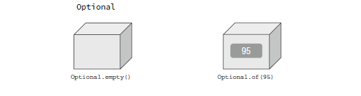
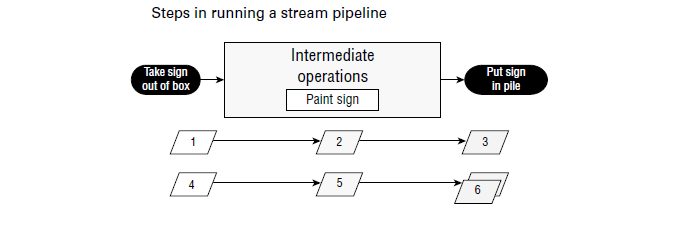
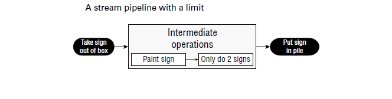

				STREAM (Flux)

			
En Java, les flux (**Stream**) dont nous avons parlé sont représentés par l'interface Stream<T>, définie dans le package java.util.stream.      
Cette classes prend en charge les opérations de style fonctionnel sur les flux d'éléments, telles que les transformations map-reduce sur les collections. 
# Returning an Optional (Renvoyer un facultatif):  
Supposons que vous suiviez un cours d’introduction à Java et que vous obteniez des notes de 90 et 100 aux deux premiers examens. Maintenant, nous vous demandons quelle est votre moyenne. Une moyenne est calculée en additionnant les scores et en divisant par le nombre de scores, vous obtenez donc (90+100)/2. Cela donne 190/2, donc vous répondez par 95. Génial !   

Supposons maintenant que vous suiviez votre deuxième cours sur Java et que ce soit le premier jour de cours. Nous vous demandons quelle est votre moyenne dans cette classe qui vient de commencer. Vous n’avez pas encore passé d’examens, vous n’avez donc aucune moyenne à faire. Il ne serait pas exact de dire que votre moyenne est nulle. Cela semble mauvais et ce n’est pas vrai. Il n’y a tout simplement pas de données, donc vous n’avez pas de moyenne.   

Comment exprimer cette réponse « nous ne savons pas » ou « sans objet » en Java ? Nous utilisons le type Optional . Un Optional  est créé à l’aide d’une factory (fabrique). Vous pouvez soit demander un Optional vide, soit transmettre une valeur pour l'option à envelopper. Considérez un Optional comme une boîte qui pourrait contenir quelque chose ou qui pourrait être vide. La figure ci-dessous montre les deux options.   

 
### Creating an Optional (Création d'un facultatif): 
Voici comment coder votre méthode moyenne:   

	     public static Optional<Double> average(int... scores) {
	     	if (scores.length == 0)
	11: 		return Optional.empty();
	12: 	int sum = 0;
	13: 	for (int score : scores)
	 		sum += score;
	14: 	return Optional.of((double) sum / scores.length);
	    }
La ligne 11 renvoie un Optional vide lorsque nous ne pouvons pas calculer de moyenne. Les lignes 12 et 13 additionnent les scores. Il existe une méthode de programmation fonctionnelle pour effectuer ce calcul, mais nous y reviendrons plus tard dans le chapitre. En fait, toute la méthode pourrait être écrite sur une seule ligne, mais cela ne vous apprendrait pas comment fonctionne Optionnel ! La ligne 14 crée un Optional pour envelopper la moyenne.   

L'appel de la méthode montre ce qu'il y a dans nos deux boîte :   

	System.out.println(average(90, 100)); // Optional[95.0]
	System.out.println(average()); // Optional.empty
Vous pouvez voir qu’un facultatif contient une valeur et que l’autre est vide. Normalement, nous voulons vérifier si une valeur est présente et/ou la sortir de la boîte. Voici une façon de procéder:  

	Optional<Double> opt = average(90, 100);
	if (opt.isPresent())
		System.out.println(opt.get()); // 95.0
Nous vérifions d’abord si l’Optionnel contient une valeur. Ensuite, nous l'affichonss. Et si nous n’avions pas effectué la vérification et que le champ Facultatif était vide?   

	Optional<Double> opt = average();
	System.out.println(opt.get()); // NoSuchElementException
Nous aurions une exception car il n’y a aucune valeur à l’intérieur de l’option *java.util.NoSuchElementException: No value present*.     

Lors de la création d'un Optional, il est courant de vouloir utiliser la métode empty() lorsque la valeur est nulle. Vous pouvez le faire avec une instruction if ou un opérateur ternaire. Nous utilisons l'opérateur ternaire (? :) pour simplifier le code, que vous avez vu au chapitre 2, « Opérateurs ».   

	Optional o = (value == null) ? Optional.empty() : Optional.of(value);
Si la valeur est nulle ou si le champ Optional vide  est attribué. Sinon, nous enveloppons la valeur. Puisqu'il s'agit d'un modèle très courant, Java fournit une méthode d'usine pour faire la même chose qu'avec un opérateur ternaire **ofNullable()**.     

	Optional o = Optional.ofNullable(value);
Cela couvre les méthodes statiques que vous devez connaître en option. Le tableau ci-dessous résume la plupart des méthodes d'instance d'Optional que vous devez connaître pour l'examen. Il y en a quelques autres qui impliquent un chaînage. Nous les abordons plus loin dans le chapitre.

|Method                |When Optional is empty                      |When Optional contains value|
|----------------------|:-------------------------------------------|----------------------------|
|get()                 |Throws exception                            |Returns value               |
|ifPresent(Consumer c) |Does nothing                                |Calls Consumer with value   |
|isPresent()           |Returns false                               |Returns true                |
|orElse(T other)       |Returns other parameter                     |Returns value               |
|orElseGet(Supplier s) |Returns result of calling Supplier          |Returns value               |
|orElseThrow()         |Throws NoSuchElementException               |Returns value               |
|orElseThrow(Suppliers)|Throws exception created by calling Supplier|Returns value               |

Vous avez déjà vu get() et isPresent(). Les autres méthodes vous permettent d'écrire du code qui utilise un Optional sur une seule ligne sans avoir à utiliser l'opérateur ternaire. Cela rend le code plus facile à lire. Au lieu d'utiliser une instruction if, que nous avons utilisée lors de la vérification de la moyenne plus tôt, nous pouvons spécifier un consommateur à exécuter lorsqu'il y a une valeur dans l'option. Lorsqu’il n’y en a pas, la méthode ignore simplement l’exécution du consommateur.

	Optional<Double> opt = average(90, 100);
	opt.ifPresent(System.out::println);
Utiliser ifPresent() exprime mieux notre intention. Nous voulons que quelque chose soit fait si une valeur est présente. Vous pouvez le considérer comme une instruction if sans else.   
### Dealing with an Empty Optional (Gérer un facultatif vide):  
Les méthodes restantes vous permettent de spécifier quoi faire si une valeur n'est pas présente. Il y a quelques choix. Les deux premiers vous permettent de spécifier une valeur de retour soit directement, soit à l'aide d'un Supplier (fournisseur).  

	30: Optional<Double> opt = average();
	31: System.out.println(opt.orElse(Double.NaN));
	32: System.out.println(opt.orElseGet(() -> Math.random()));
Cela affiche une chose comme ce-dessous:  

	NaN
	0.49775932295380165
La ligne 31 montre que vous pouvez renvoyer une valeur ou une variable spécifique. Dans notre cas, nous imprimons la valeur « pas un nombre ». La ligne 32 montre l'utilisation d'un Supplier (fournisseur) pour générer une valeur au moment de l'exécution à renvoyer à la place. Je suis content que nos professeurs ne nous aient pas donné une moyenne aléatoire.    

Alternativement, nous pouvons demander au code de lever une exception si le paramètre Facultatif est vide.    

	30: Optional<Double> opt = average();
	31: System.out.println(opt.orElseThrow());
Cela affiche une chose comme ce-dessous:  

	Exception in thread "main" java.util.NoSuchElementException:
		No value present
		at java.base/java.util.Optional.orElseThrow(Optional.java:382)
Sans spécifier de Supplier pour l'exception, Java lancera un NoSuchElementException. Alternativement, nous pouvons demander au code de lever une exception personnalisée si l'option Facultative est vide. N'oubliez pas que la trace de la pile semble étrange car les lambdas sont générés plutôt que des classes nommées.   

	30: Optional<Double> opt = average();
	31: System.out.println(opt.orElseThrow(
	32: () -> new IllegalStateException())); 
Cela affiche une chose comme ce-dessous:

	Exception in thread "main" java.lang.IllegalStateException
	at optionals.Methods.lambda$orElse$1(Methods.java:31)
	at java.base/java.util.Optional.orElseThrow(Optional.java:408)
La ligne 32 montre l'utilisation d'un fournisseur pour créer une exception qui doit être levée. Notez que nous n’écrivons pas throw new IllegalStateException(). La méthode orElseThrow() se charge de lever l'exception lorsque nous l'exécutons.   

Les deux méthodes qui utilisent un Supplier portent des noms différents. Voyez-vous pourquoi ce code ne compile pas?  

	System.out.println(opt.orElseGet(
	() -> new IllegalStateException())); // DOES NOT COMPILE
La variable opt est un Optional<Double>. Cela signifie que le Supplier doit restituer un Double. Puisque ce fournisseur renvoie une exception, le type ne correspond pas.   

Le dernier exemple avec Optionnel est vraiment simple. À votre avis, qu'est-ce que cela fait ?

	Optional<Double> opt = average(90, 100);
	System.out.println(opt.orElse(Double.NaN));
	System.out.println(opt.orElseGet(() -> Math.random()));
	System.out.println(opt.orElseThrow());
Il affich 95,0 trois fois. Puisque la valeur existe, il n’est pas nécessaire d’utiliser la logique « ou bien "or else" ».   

• Note - Is Optional the Same as null? (Optional est-il identique à null ?) : La première est qu’il n’existe pas de moyen clair d’exprimer que null pourrait être une valeur spéciale. En revanche, renvoyer un Optional est une déclaration claire dans l'API indiquant qu'il n'y a peut-être pas de valeur.   
Un autre avantage de Optionnel est que vous pouvez utiliser un style de programmation fonctionnel avec ifPresent() et les autres méthodes plutôt que d'avoir besoin d'une instruction if.   

# Using Streams (Utiliser des flux):  
Un flux en Java est une séquence de données. Un pipeline de flux comprend les opérations exécutées sur un flux pour produire un résultat. Tout d’abord, nous examinons conceptuellement le flux des pipelines. Après cela, nous entrons dans le code.    
### Understanding the Pipeline Flow (Comprendre le pipeline du flux): 
Considérez un pipeline comme une chaîne de montage dans une usine. Supposons que nous dirigions une chaîne de montage pour fabriquer des panneaux pour les expositions d'animaux au zoo. Nous avons plusieurs emplois. C’est le travail d’une seule personne de sortir les panneaux d’une boîte. C’est le travail d’une deuxième personne de peindre le panneau. C’est le travail d’une tierce personne de marquer au pochoir le nom de l’animal sur le panneau. C’est le travail de la dernière personne de mettre le panneau complété dans une boîte qui sera transportée jusqu’à l’exposition appropriée.   

Notez que la deuxième personne ne peut rien faire tant qu’un panneau n’a pas été retiré de la boîte par la première personne. De même, la troisième personne ne peut rien faire tant qu’un panneau n’a pas été peint, et la dernière personne ne peut rien faire tant qu’il n’est pas peint au pochoir.   

La chaîne de montage pour fabriquer des panneaux est limitée. Une fois que nous avons traité le contenu de notre boîte de pancartes, nous avons terminé. Les flux finis ont une limite. D’autres chaînes d’assemblage fonctionnent pratiquement indéfiniment, comme celle destinée à la production alimentaire. Bien sûr, ils s’arrêtent à un moment donné lorsque l’usine ferme ses portes, mais ils font semblant que cela n’arrive pas. Ou considérez un cycle lever/coucher du soleil comme infini, car il ne se termine pas avant une période de temps excessivement longue.   

Une autre caractéristique importante d’une chaîne de montage est que chaque personne touche chaque élément pour effectuer son opération, et cette donnée disparaît ensuite. Cela ne revient pas. C'est à ce moment-là que la personne suivante s'en occupe. Ceci est différent des listes et des files d'attente que vous avez vues dans le chapitre précédent. Avec une liste, vous pouvez accéder à n’importe quel élément à tout moment. Avec une file d'attente, vous êtes limité aux éléments auxquels vous pouvez accéder, mais tous les éléments sont là. Avec les flux, les données ne sont pas générées à l’avance : elles sont créées lorsque cela est nécessaire. Il s'agit d'un exemple d'évaluation paresseuse, qui retarde l'exécution jusqu'à ce que cela soit nécessaire.    

Beaucoup de choses peuvent se produire dans les stations de la chaîne de montage en cours de route. En programmation fonctionnelle, celles-ci sont appelées opérations de flux. Tout comme pour la chaîne de montage, les opérations se déroulent dans un pipeline. Quelqu'un doit commencer et terminer le travail, et il peut y avoir un nombre illimité de stations entre les deux. Après tout, un travail avec une seule personne n’est pas une chaîne de montage ! Un pipeline de flux comporte trois parties, comme le montre la figure ci-dessous.   

• Source (Source): D'où vient le flux.   
• Intermediate operations (Opérations intermédiaires): Transforme le flux en un autre. Il peut y avoir autant d’opérations intermédiaires que vous le souhaitez. Étant donné que les flux utilisent une évaluation paresseuse, les opérations intermédiaires ne s'exécutent pas tant que l'opération du terminal n'est pas exécutée.   
• Terminal operation (Fonctionnement du terminal): produit un résultat. Étant donné que les flux ne peuvent être utilisés qu’une seule fois, ils ne sont plus valides une fois l’opération du terminal terminée.   

 

Notez que les opérations nous sont inconnues. Lorsque vous regardez la chaîne de montage de l’extérieur, vous ne vous souciez que de ce qui entre et sort. Ce qui se passe entre les deux est un détail de mise en œuvre.  

Vous devrez bien connaître les différences entre les opérations intermédiaires et terminales. Assurez-vous de pouvoir remplir le tableau ci-dessous.    

|Scenario                                |Intermediate operation  |Terminal operation|
|----------------------------------------|:-----------------------|------------------|
| Required part of useful pipeline?      |No                      | Yes              |
| Can exist multiple times in pipeline?  |Yes                     | No               |
| Return type is stream type?            |Yes                     | No               |
| Executed upon method call?             |No                      | Yes              |
| Stream valid after call?               |Yes                     | No               |

Une factory (usine) a généralement un contremaître qui supervise le travail. Java sert de chef de file lorsque l'on travaille avec des pipelines de flux. Il s'agit d'un rôle très important, en particulier lorsqu'il s'agit d'évaluations paresseuses et de flux infinis. Pensez à déclarer le flux comme à donner des instructions au contremaître. Au fur et à mesure que le contremaître découvre ce qui doit être fait, il installe les postes et indique aux travailleurs quelles seront leurs tâches. Cependant, les ouvriers ne démarrent que lorsque le contremaître leur demande de commencer. Le contremaître attend de voir le fonctionnement du terminal pour lancer les travaux. Ils surveillent également les travaux et arrêtent la ligne dès que les travaux sont terminés.    

Examinons quelques exemples de cela. Nous n'utilisons pas de code dans ces exemples car il est très important de comprendre le concept de pipeline de flux avant de commencer à écrire le code. La figure cid-dessous montre un pipeline de flux avec une opération intermédiaire.   

 

Voyons ce qui se passe du point de vue du contremaître. Premièrement, ils voient que la source sort les signes des sentiers battus. Le contremaître installe un ouvrier à la table pour déballer la boîte et dit d'attendre un signal pour démarrer. Ensuite, le contremaître voit l'opération intermédiaire pour peindre l'enseigne. Ils ont installé un ouvrier avec de la peinture et lui ont dit d'attendre un signal pour démarrer. Finalement, le contremaître assiste à l'opération du terminal pour empiler les panneaux. Ils ont désigné un ouvrier pour le faire et ont crié que les trois ouvriers devraient commencer.    

Supposons qu'il y ait deux signes dans la boîte. À l’étape 1, le premier travailleur sort une pancarte de la boîte et la remet au deuxième travailleur. Étape 2 : le deuxième ouvrier le peint et le remet au troisième ouvrier. L'étape 3 est celle où le troisième ouvrier le met dans la pile. Les étapes 4 à 6 suivent le même processus pour l'autre signe. Le contremaître constate alors qu’il n’y a plus aucun signe et ferme toute l’entreprise.   

Le contremaître est intelligent et peut prendre des décisions sur la meilleure façon d’effectuer le travail en fonction des besoins. À titre d’exemple, explorons le pipeline de flux dans la figure ci-dessous.   

 

Le contremaître voit toujours une façon de sortir les panneaux de la boîte et charge un travailleur de le faire sur commande. Ils voient toujours une opération intermédiaire pour peindre et installent un autre ouvrier avec pour instruction d'attendre puis de peindre. Ensuite, ils voient une étape intermédiaire selon laquelle nous n’avons besoin que de deux signes. Ils ont chargé un ouvrier de compter les panneaux qui passent et d'avertir le contremaître lorsque l'ouvrier en a vu deux. Finalement, ils ont désigné un ouvrier pour l'exploitation du terminal pour mettre les panneaux en pile.    

Cette fois, supposons qu’il y ait 10 signes dans la boîte. On recommence comme la dernière fois. Le premier signe fait son chemin dans le pipeline. Le deuxième signe fait également son chemin dans le pipeline. Lorsque l’ouvrier chargé du comptage voit le deuxième panneau, il en informe le contremaître. Le contremaître laisse le préposé à l'exploitation du terminal terminer sa tâche, puis crie : « Arrêtez la ligne ». Peu importe qu’il y ait huit signes supplémentaires dans la boîte. Nous n’en avons pas besoin, ce serait donc un travail inutile de les peindre. Et nous voulons tous éviter les travaux inutiles !     

De même, le contremaître aurait arrêté la ligne après le premier panneau si l'opération du terminal devait trouver le premier panneau créé.   

Dans les sections suivantes, nous couvrons les trois parties du pipeline. Nous discutons également des types spéciaux de flux pour les primitives et de la manière d'imprimer un flux.   
### Creating Stream Sources (Création Surce de flux)
En Java, les flux dont nous avons parlé sont représentés par l'interface Stream<T>, définie dans le package java.util.stream.  :
##### Création de flux finis: (Creating Finite Streams)   
Pour plus de simplicité, nous allons commencer par les flux finis. Il existe plusieurs façons de créer
eux.    

		Stream<String> empty = Stream.empty(); // count = 0
		Stream<Integer> singleElement = Stream.of(1); // count = 1
		Stream<Integer> fromArray = Stream.of(1, 2, 3); // count = 3
La 1ere ligne montre comment créer un flux vide.    
La 2eme ligne montre comment créer un flux avec un seul élément.     
La 3eme ligne montre comment créer un flux à partir d'un varargs. Vous avez sans doute remarqué qu'il n'y a pas de tableau à la ligne 3. La signature de la méthode utilise varargs, qui vous permet de spécifier un tableau ou des éléments individuels.   

Java fournit également un moyen pratique de convertir une collection en flux.   

		var list = List.of("a", "b", "c");
		Stream<String> fromList = list.stream();
Cette ligne montre qu'il s'agit d'un simple appel de méthode pour créer un flux à partir d'une liste. Ceci est utile car de telles conversions sont courantes.   

##### Creating Infinite Streams (Créer des flux infinis):    
Jusqu'à présent, ce n'est pas particulièrement impressionnant. Nous pourrions faire tout cela avec des listes. Cependant, nous ne pouvons pas créer une liste infinie, ce qui rend les flux plus puissants.   

	Stream<Double> randoms = Stream.generate(Math::random);
	Stream<Integer> oddNumbers = Stream.iterate(1, n -> n + 2);
La ligne 1 génère un flux de nombres aléatoires. Combien de nombres aléatoires ? Quel que soit le nombre dont vous avez besoin. Si vous appelez randoms.forEach(System.out::println), le programme imprimera des nombres aléatoires jusqu'à ce que vous le tuiez. Plus loin dans le chapitre, vous découvrirez des opérations telles que limit() pour transformer le flux infini en un flux fini.   
La ligne 2 vous donne plus de contrôle. La méthode iterate() prend une valeur de départ comme premier paramètre. C'est le premier élément qui fera partie du flux. L'autre paramètre est une expression lambda qui obtient la valeur précédente et génère la valeur suivante. Comme pour l'exemple des nombres aléatoires, il continuera à produire des nombres impairs aussi longtemps que vous en aurez besoin.   
• Affichage d'une référence de flux:  
Si vous essayez d'appeler System.out.println(stream), vous obtiendrez quelque chose comme ce qui suit:    

	java.util.stream.ReferencePipeline$3@4517d9a3
Ceci est différent d'une collection, où vous voyez le contenu. Vous n’avez pas besoin de le savoir pour l’examen. Nous le mentionnons afin que vous ne soyez pas surpris lorsque vous écrivez du code pour vous entraîner.   

Et si vous vouliez juste des nombres impairs inférieurs à 100 ? Il existe une version surchargée de iterate() qui aide :

	Stream<Integer> oddNumberUnder100 = Stream.iterate(
	1, // seed
	n -> n < 100, // Predicate to specify when done
	n -> n + 2); // UnaryOperator to get next value
Cette méthode prend trois paramètres. Remarquez comment ils sont séparés par des virgules (,), comme dans toutes les autres méthodes. L'examen peut tenter de vous tromper en utilisant des points-virgules car il est similaire à une boucle for. Semblable à une boucle for, vous devez veiller à ne pas créer accidentellement un flux infini.
##### Reviewing Stream Creation Methods (Révision des méthodes de création de flux):
Pour passer en revue, assurez-vous de connaître toutes les méthodes du tableau ci-dessous. Ce sont les moyens de créer une source pour les flux, à partir d'une instance de collection coll.   

|Method                                         |Finite or infinite?  |Notes                                                                                                                                                      |
|-----------------------------------------------|:--------------------|-----------------------------------------------------------------------------------------------------------------------------------------------------------|
| Stream.empty()                                | Finite              | Creates Stream with zero elements.                                                                                                                        |
| Stream.of(varargs)                            | Finite              | Creates Stream with elements listed.                                                                                                                      |
| coll.stream()                                 | Finite              | Creates Stream from Collection.                                                                                                                           |
| coll.parallelStream()                         | Finite              | Creates Stream from Collection where the stream can run in parallel.                                                                                      | 
| Stream.generate(supplier)                     | Infinite            | Creates Stream by calling Supplier for each element upon request.                                                                                         | 
| Stream.iterate(seed,unaryOperator)            | Infinite            | Creates Stream by using seed for first element and then calling UnaryOperator for each subsequent element upon request.                                   | 
| Stream.iterate(seed, predicate, unaryOperator | Finite or infinite  | Creates Stream by using seed for first element and then calling UnaryOperator for each subsequent element upon request. Stops if Predicate returns false. | 

### Using Common Terminal Operations (Utilisation des opérations de terminal communes): 
Vous pouvez effectuer une opération de terminal sans aucune opération intermédiaire, mais pas l'inverse. C’est pourquoi nous parlons d’abord des opérations des terminaux. Les réductions sont un type spécial d'opération de terminal dans lequel tout le contenu du flux est combiné en une seule primitive ou objet. Par exemple, vous pourriez avoir un int ou une collection.    

Le tableau ci-dessous, résume cette section. N'hésitez pas à l'utiliser comme guide pour mémoriser les points les plus importants au fur et à mesure que nous les examinons individuellement. Nous les expliquons du plus simple au plus complexe plutôt que par ordre alphabétique.   

|Method            |What happens for infinite streams  |Return value    | Reduction  |
|------------------|:---------------------------------:|----------------|------------|
| count()          | Does not terminate                | long           | Yes        |
| min()            | Does not terminate                | Optional<T>    | Yes        |
| max()            | Does not terminate                | Optional<T>    | Yes        |
| findAny()        | Terminates                        | Optional<T>    | No         |
| findFirst()      | Terminates                        | Optional<T>    | No         |
| allMatch()       | Sometimes terminates              | boolean        | No         |
| anyMatch()       | Sometimes terminates              | boolean        | No         |
| noneMatch()      | Sometimes terminates              | boolean        | No         |
| forEach()        | Does not terminate                | void           | No         |
| reduce()         | Does not terminate                | Varies         | Yes        |
| collect()        | Does not terminate                | Varies         | Yes        |

###### count():    
La méthode count() détermine le nombre d'éléments dans un flux fini. Pour un flux infini, il ne se termine jamais. Pourquoi? Comptez de 1 à l'infini et dites-nous quand vous avez terminé. Ou plutôt, ne le faites pas parce que nous préférons que vous étudiiez pour l'examen plutôt que de passer le reste de votre vie à compter. La méthode count() est une réduction car elle examine chaque élément du flux et renvoie une valeur unique. La signature de la méthode est la suivante:   

	long count()
Cet exemple montre l'appel de count() sur un flux fini:  

	Stream<String> s = Stream.of("monkey", "gorilla", "bonobo");
	System.out.println(s.count()); // 3  
###### min() and max():   
Les méthodes min() et max() vous permettent de passer un comparateur personnalisé et de trouver la valeur la plus petite ou la plus grande dans un flux fini en fonction de cet ordre de tri. Comme la méthode count(), min() et max() se bloquent sur un flux infini car ils ne peuvent pas être sûrs qu'une valeur plus petite ou plus grande n'arrive pas plus tard dans le flux. Les deux méthodes sont des réductions car elles renvoient une valeur unique après avoir examiné l'intégralité du flux. Les signatures de méthode sont les suivantes: 

	Optional<T> min(Comparator<? super T> comparator)
	Optional<T> max(Comparator<? super T> comparator)
Cet exemple trouve l'animal avec le moins de lettres dans son nom:  

		Stream<String> s = Stream.of("monkey", "ape", "bonobo");
		Optional<String> min = s.min((s1, s2) -> s1.length()-
		s2.length());
		min.ifPresent(System.out::println); // ape
###### findAny() and findFirst():   
Les méthodes findAny() et findFirst() renvoient un élément du flux sauf si le flux est vide. Si le flux est vide, ils renvoient un Optinal vide. C’est la première méthode que vous voyez et qui peut se terminer par un flux infini. Puisque Java génère uniquement la quantité de flux dont vous avez besoin, le flux infini ne doit générer qu'un seul élément.  

Comme son nom l'indique, la méthode findAny() peut renvoyer n'importe quel élément du flux. Lorsqu'il est appelé sur les flux que vous avez vus jusqu'à présent, il renvoie généralement le premier élément, bien que ce comportement ne soit pas garanti. Comme vous le voyez au flux parallèles, la méthode findAny() est plus susceptible de renvoyer un élément aléatoire.    

Ces méthodes sont des opérations terminales mais pas des réductions. La raison est qu’ils reviennent parfois sans traiter tous les éléments. Cela signifie qu'ils renvoient une valeur basée sur le flux mais ne réduisent pas l'intégralité du flux en une seule valeur. Les signatures de méthode sont les suivantes:    

	public Optional<T> findAny()
	public Optional<T> findFirst()
Cet exemple trouve un animal:  

	Stream<String> s = Stream.of("monkey", "gorilla", "bonobo");
	Stream<String> infinite = Stream.generate(() -> "chimp");
	
	s.findAny().ifPresent(System.out::println); // monkey
	infinite.findAny().ifPresent(System.out::println); // chimp
Trouver une correspondance est plus utile qu’il n’y paraît. Parfois, nous souhaitons simplement échantillonner les résultats et obtenir un élément représentatif, mais nous n’avons pas besoin de gaspiller le traitement pour les générer tous. Après tout, si nous envisageons de travailler avec un seul élément, pourquoi s’embêter à en examiner davantage?   
###### allMatch(), anyMatch(), and noneMatch():   
Les méthodes allMatch(), anyMatch() et noneMatch() recherchent un flux et renvoient des informations sur la façon dont le flux se rapporte au prédicat. Ceux-ci peuvent ou non se terminer pour des flux infinis. Cela dépend des données. Comme les méthodes de recherche, ce ne sont pas des réductions car elles ne prennent pas nécessairement en compte tous les éléments.   
Les signatures de méthode sont les suivantes:  

	public boolean anyMatch(Predicate <? super T> predicate)
	public boolean allMatch(Predicate <? super T> predicate)
	public boolean noneMatch(Predicate <? super T> predicate)
Cet exemple vérifie si les noms d'animaux commencent par des lettres:  

	var list = List.of("monkey", "2", "chimp");
	Stream<String> infinite = Stream.generate(() -> "chimp");
	
	Predicate<String> pred = x -> Character.isLetter(x.charAt(0));
	
	System.out.println(list.stream().anyMatch(pred)); // true
	System.out.println(list.stream().allMatch(pred)); // false
	System.out.println(list.stream().noneMatch(pred)); // false
	System.out.println(infinite.anyMatch(pred)); // true
Cela montre que nous pouvons réutiliser le même prédicat, mais nous avons besoin d'un flux différent à chaque fois. La méthode anyMatch() renvoie true car deux des trois éléments correspondent. La méthode allMatch() renvoie false car l’une ne correspond pas. La méthode noneMatch() renvoie également false car au moins une correspondance. Sur le flux infini, une correspondance est trouvée, donc l'appel se termine. Si nous appelions allMatch(), il fonctionnerait jusqu'à ce que nous terminions le programme.        
###### forEach():   
Comme dans Java Collections Framework, il est courant de parcourir les éléments d’un flux. Comme prévu, l'appel de forEach() sur un flux infini ne se termine pas. Puisqu’il n’y a pas de valeur de retour, il ne s’agit pas d’une réduction.  

Avant de l’utiliser, demandez-vous si une autre approche serait meilleure. Les développeurs qui ont d’abord appris à écrire des boucles ont tendance à les utiliser pour tout. Par exemple, une boucle avec une instruction if pourrait être écrite avec un filtre. Vous découvrirez les filtres dans la section des opérations intermédiaires. La signature de la méthode est la suivante:  

	public void forEach(Consumer<? super T> action)
Notez qu'il s'agit de la seule opération de terminal avec un type de retour void. Si vous voulez que quelque chose se produise, vous devez le faire se produire chez le consommateur. Voici une façon d’affciher les éléments du flux (il existe d’autres façons, que nous aborderons plus loin dans le chapitre) :    

	Stream<String> s = Stream.of("Monkey", "Gorilla", "Bonobo");
	s.forEach(System.out::print); // MonkeyGorillaBonobo
Notez que vous ne pouvez pas utiliser une boucle for traditionnelle sur un flux.  

	Stream<Integer> s = Stream.of(1);
	for (Integer i : s) {} // DOES NOT COMPILE
Bien que forEach() ressemble à une boucle, il s'agit en réalité d'un opérateur de terminal pour les flux. Les flux ne peuvent pas être utilisés comme source dans une boucle for-each car ils n'implémentent pas l'interface Iterable.  
###### reduce(): 
La méthode réduire() combine un flux en un seul objet. C'est une réduction, ce qui signifie qu'elle traite tous les éléments. Les trois signatures de méthode sont les suivantes:   

	public T reduce(T identity, BinaryOperator<T> accumulator)
	
	public Optional<T> reduce(BinaryOperator<T> accumulator)
	
	public <U> U reduce(U identity, BiFunction<U,? super T,U> accumulator,
		BinaryOperator<U> combiner)
Prenons-les un à la fois. La manière la plus courante d'effectuer une réduction est de commencer par une valeur initiale et de continuer à la fusionner avec la valeur suivante. Pensez à la façon dont vous concaténeriez un tableau d’objets String en une seule String sans programmation fonctionnelle.  

Cela pourrait ressembler à ceci:  

	var array = new String[] { "w", "o", "l", "f" };
	var result = "";
	for (var s: array) 
		result = result + s;
	System.out.println(result); // wolf
L'identité est la valeur initiale de la réduction, dans ce cas un String vide. L'accumulateur combine le résultat actuel avec la valeur actuelle dans le flux. Avec les lambdas, on peut faire la même chose avec un stream et une réduction:  

	Stream<String> stream = Stream.of("w", "o", "l", "f");
	String word = stream.reduce("", (s, c) -> s + c);
	System.out.println(word); // wolf
Remarquez que nous avons toujours la chaîne vide comme identité. Nous concaténons également les objets String pour obtenir la valeur suivante. Nous pouvons même réécrire cela avec une référence de méthode :

	Stream<String> stream = Stream.of("w", "o", "l", "f");
	String word = stream.reduce("", String::concat);
	System.out.println(word); // wolf

Essayons-en un autre. Pouvez-vous écrire une réduction pour multiplier tous les objets Integer dans un flux ? Essayez-le. Notre solution est présentée ici :  

	Stream<Integer> stream = Stream.of(3, 5, 6);
	System.out.println(stream.reduce(1, (a, b) -> a*b)); // 90
Nous mettons l'identity (identité) à 1 et l'accumulateur à la multiplication. Dans de nombreux cas, l’identité n’est pas vraiment nécessaire, donc Java nous permet de l’omettre. Lorsque vous ne spécifiez pas d'identité, un facultatif est renvoyé car il se peut qu'il n'y ait aucune donnée. Il existe trois choix pour ce qui est Optional:  

• Si le flux est vide, un Optional vide est renvoyé.  
• Si le flux comporte un élément, il est renvoyé.  
• Si le flux comporte plusieurs éléments, l'accumulateur est appliqué pour les combiner.  

Ce qui suit illustre chacun de ces scénarios: 

	BinaryOperator<Integer> op = (a, b) -> a * b;
	Stream<Integer> empty = Stream.empty();
	Stream<Integer> oneElement = Stream.of(3);
	Stream<Integer> threeElements = Stream.of(3, 5, 6);

	empty.reduce(op).ifPresent(System.out::println); // no output
	oneElement.reduce(op).ifPresent(System.out::println); // 3
	threeElements.reduce(op).ifPresent(System.out::println); // 90
Pourquoi existe-t-il deux méthodes similaires ? Pourquoi ne pas toujours exiger l’identity ? Java aurait pu faire ça. Cependant, il est parfois utile de différencier le cas où le flux est vide plutôt que le cas où il existe une valeur qui correspond à l'identité renvoyée par le calcul. La signature renvoyant un Optionnel nous permet de différencier ces cas. Par exemple, nous pourrions renvoyer Optionnel.empty() lorsque le flux est vide et Optionnel.of(3) lorsqu'il y a une valeur.   

La troisième signature de méthode est utilisée lorsque nous traitons de différents types. Il permet à Java de créer des réductions intermédiaires puis de les combiner à la fin. Jetons un coup d'œil à un exemple qui compte le nombre de caractères dans chaque chaîne:   

	Stream<String> stream = Stream.of("w", "o", "l", "f!");
	int length = stream.reduce(0, (i, s) -> i+s.length(), (a, b) -> a+b);
	System.out.println(length); // 5

Le premier paramètre (0) est la valeur de l'initialiseur. Si nous avions un flux vide, ce serait la réponse. Le deuxième paramètre est l'accumulateur. Contrairement aux accumulateurs que vous avez vus précédemment, celui-ci gère des types de données mixtes. Dans cet exemple, le premier argument, i, est un entier, tandis que le deuxième argument, s, est une chaîne. Il ajoute la longueur de la chaîne actuelle à notre total cumulé. Le troisième paramètre est appelé le combineur, qui combine tous les totaux intermédiaires. Dans ce cas, a et b sont tous deux des valeurs entières.  

L'opération réduire() à trois arguments est utile lorsque vous travaillez avec des flux parallèles car elle permet au flux d'être décomposé et réassemblé par des threads séparés. Par exemple, si nous devions compter la longueur de quatre chaînes de 100 caractères, les deux premières valeurs et les deux dernières valeurs pourraient être calculées indépendamment. Le résultat intermédiaire (200 + 200) serait ensuite combiné dans la valeur finale.   
###### collect():   
La méthode collect() est un type spécial de réduction appelé réduction mutable. C'est plus efficace qu'une réduction régulière car on utilise le même objet mutable lors de l'accumulation. Les objets mutables courants incluent StringBuilder et ArrayList. C'est une méthode vraiment utile, car elle nous permet d'extraire des données des flux et sous une autre forme. Les signatures de méthode sont les suivantes: 

	<R> R collect(Supplier<R> supplier, BiConsumer<R, ? super T> accumulator,
	BiConsumer<R, R> combiner)
et 

	<R,A> R collect(Collector<? super T, A,R> collector)
Commençons par la première signature, qui est utilisée lorsque nous voulons coder spécifiquement le fonctionnement de la collecte. Notre exemple de loup de réduire peut être converti pour utiliser collect():

	Stream<String> stream = Stream.of("w", "o", "l", "f");
	StringBuilder word = stream.collect(StringBuilder::new,
								StringBuilder::append,
								StringBuilder::append);

	System.out.println(word); // wolf
Regardons cet exemple: 
Le premier paramètre est le Supplier (fournisseur), qui crée l'objet qui stockera les résultats au fur et à mesure que nous collectons les données. N'oubliez pas qu'un fournisseur ne prend aucun paramètre et renvoie une valeur. Dans ce cas, il construit un nouveau StringBuilder.   
Le deuxième paramètre est l'accumulateur, qui est un BiConsumer qui prend deux paramètres et ne renvoie rien. Il est chargé d’ajouter un élément supplémentaire à la collecte de données. Dans cet exemple, il ajoute la chaîne suivante au StringBuilder.    
Le dernier paramètre est le combineur, qui est un autre BiConsumer. Il est chargé de prendre deux collections de données et de les fusionner. Ceci est utile lorsque nous traitons en parallèle. Deux collections plus petites sont formées puis fusionnées en une seule. Cela ne fonctionnerait avec StringBuilder que si nous ne nous souciions pas de l'ordre des lettres. Dans ce cas, l’accumulateur et le combineur ont une logique similaire.    

Regardons maintenant un exemple où la logique est différente dans l'accumulateur et le combineur :

	Stream<String> stream = Stream.of("w", "o", "l", "f");
	TreeSet<String> set = stream.collect(TreeSet::new, TreeSet::add, 								TreeSet::addAll);
	System.out.println(set); // [f, l, o, w]
Le collecteur comporte trois parties comme auparavant. Le fournisseur crée un TreeSet vide. L'accumulateur ajoute une seule chaîne du Stream au TreeSet. Le combinateur ajoute tous les éléments d'un TreeSet à un autre au cas où les opérations auraient été effectuées en parallèle et devraient être fusionnées.  

Nous avons commencé par la signature longue car c’est ainsi que vous implémentez votre propre collecteur. Il est important de savoir comment procéder pour l'examen et de comprendre le fonctionnement des collectors. Dans la pratique, de nombreux collectors courants reviennent sans cesse. Plutôt que d'obliger les développeurs à réimplémenter les mêmes, Java fournit une classe avec des collecteurs communs intelligemment nommés Collectors. Cette approche rend également le code plus facile à lire car plus expressif. Par exemple, nous pourrions réécrire l’exemple précédent comme suit :  

		Stream<String> streamWolf = Stream.of("w", "o", "l", "f", "w");
		List<String> listWolf = streamWolf.collect(Collectors.toList()); // ligne 7
		System.out.print(listWolf);
		Set<String> setWolf = streamWolf.collect(Collectors.toSet());	// ligne 9 
		System.out.print(setWolf);	
cela affiche :  

		[w, o, l, f, w]
		Exception in thread "main" java.lang.IllegalStateException: stream has already been operated upon or closed
ça génère une exeception, est ça du que après 1er appel la méthode collect dans la ligne 7 le streamWolf est fermé, donc, toute autre opération sur le flux va lever le **IllegalStateException** , et que ce qui est arrivé après avoir invoqué la méthode collect sur le ligne 9.   
En termes simples, la solution consiste à créer un nouveau Stream à chaque fois que nous en avons besoin.     

		Stream<String> streamWolf = Stream.of("w", "o", "l", "f", "w");
		List<String> listWolf = streamWolf.collect(Collectors.toList());
		System.out.println(listWolf);
		Stream<String> streamWolf2 = Stream.of("w", "o", "l", "f", "w");
		Set<String> setWolf = streamWolf2.collect(Collectors.toSet());
		System.out.println(setWolf); 
cela affiche: 

		[w, o, l, f, w]
		[f, w, l, o]
### USING COMMON INTERMEDIATE OPERATIONS (UTILISER DES OPÉRATIONS INTERMÉDIAIRES COMMUNES):  
Contrairement à une opération de terminal, une opération intermédiaire produit un flux comme résultat. Une opération intermédiaire peut également traiter un flux infini simplement en renvoyant un autre flux infini. Puisque les éléments sont produits uniquement en fonction des besoins, cela fonctionne très bien. L’opérateur de la chaîne de montage n’a pas à se soucier du nombre d’éléments supplémentaires qui passent et peut plutôt se concentrer sur l’élément actuel.   
##### filter():   
La méthode filter() renvoie un Stream avec des éléments qui correspondent à une expression donnée. Voici la signature de la méthode :  

	public Stream<T> filter(Predicate<? super T> predicate)
Cette opération est facile à retenir et puissante car on peut lui transmettre n'importe quel prédicat. Par exemple, cela conserve tous les éléments commençant par la lettre m :  

	Stream<String> s = Stream.of("monkey", "gorilla", "bonobo");
	s.filter(x ->x.startsWith("m"))
						.forEach(System.out::print); // monkey
##### distinct():  
La méthode distinct() renvoie un flux avec les valeurs en double supprimées. Il n'est pas nécessaire que les doublons soient adjacents pour être supprimés. Comme vous pouvez l'imaginer, Java appelle equals() pour déterminer si les objets sont équivalents. La signature de la méthode est la suivante:    

	public Stream<T> distinct()
Voici un exemple:  

	Stream<String> s = Stream.of("duck", "duck", "duck", "goose");
	s.distinct().forEach(System.out::print); // duckgoose
##### limit() and skip():  
Les méthodes limit() et skip() peuvent réduire la taille d'un Stream, ou limit() peut créer un flux fini à partir d'un flux infini. Les signatures de méthode sont affichées ici :  

	public Stream<T> limit(long maxSize)
	public Stream<T> skip(long n)
Le code suivant crée un flux infini de nombres à partir de 1. L'opération skip() renvoie un flux infini commençant par les nombres à partir de 6, car elle ignore les cinq premiers éléments. L'appel limit() prend les deux premiers d'entre eux. Nous avons maintenant un flux fini avec deux éléments, que nous pouvons ensuite imprimer avec la méthode forEach() :   

	Stream<Integer> s = Stream.iterate(1, n -> n + 1);
	s.skip(5).limit(2)
			.forEach(System.out::print); // 67
##### map():  
La méthode map() crée un mappage one-to-one (un-à-un) des éléments du flux vers les éléments de l'étape suivante du flux. La signature de la méthode est la suivante :

	public <R> Stream<R> map(Function<? super T, ? extends R> mapper)
Celui-ci semble plus compliqué que les autres que vous avez vus. Il utilise l'expression lambda pour déterminer le type transmis à cette fonction et celui renvoyé. Le type de retour est le flux renvoyé.   
• Note: La méthode map() sur les flux sert à transformer les données. Ne le confondez pas avec l'interface Map, qui mappe les clés aux valeurs.    

À titre d'exemple, ce code convertit une liste d'objets String en une liste d'objets Integer représentant leurs longueurs :   

	Stream<String> s = Stream.of("monkey", "gorilla", "bonobo");
	s.map(String::length).forEach(System.out::print); // 676
N'oubliez pas que *String::length* est un raccourci pour *lambda x -> x.length()*, ce qui montre clairement qu'il s'agit d'une fonction qui transforme une chaîne en un entier.   
##### flatMap():  
La méthode flatMap() prend chaque élément du flux et transforme tous les éléments qu'il contient en éléments de niveau supérieur dans un seul flux. Ceci est utile lorsque vous souhaitez supprimer des éléments vides d'un flux ou combiner un flux de listes. Nous vous montrons la signature de la méthode par souci de cohérence avec les autres méthodes afin que vous ne pensiez pas que nous cachons quoi que ce soit. On ne s’attend pas à ce que vous soyez capable de lire ceci :   

	public <R> Stream<R> flatMap(
				Function<? super T, ? extends Stream<? extends R>> mapper)
Ce charabia dit essentiellement qu'il renvoie un Stream du type que la fonction contient à un niveau inférieur. Ne vous inquiétez pas pour la signature. C'est un casse-tête.   

Ce que vous devez comprendre, c'est l'exemple. Cela place tous les animaux au même niveau et supprime la liste vide.  

	List<String> zero = List.of();
	var one = List.of("Bonobo");
	var two = List.of("Mama Gorilla", "Baby Gorilla");
	Stream<List<String>> animals = Stream.of(zero, one, two);
	
	animals.flatMap(m -> m.stream()).forEach(System.out::println);
Ce code affiche:  

	Bonobo
	Mama Gorilla
	Baby Gorilla
Comme vous pouvez le voir, il a complètement supprimé la liste vide et a modifié tous les éléments de chaque liste pour qu'ils soient au niveau supérieur du flux.   

• Concatenating Streams: Bien que flatMap() soit adapté au cas général, il existe un moyen plus pratique de concaténer deux flux.  

	var one = Stream.of("Bonobo");
	var two = Stream.of("Mama Gorilla", "Baby Gorilla");
	Stream.concat(one, two).forEach(System.out::println);
This produces the same three lines as the previous example. The two streams are
concatenated, and the terminal operation, forEach(), is called.
##### sorted():  
La méthode sorted() renvoie un flux avec les éléments triés. Tout comme le tri des tableaux, Java utilise l'ordre naturel, sauf si nous spécifions un comparateur. Les signatures de méthode sont les suivantes:   

	public Stream<T> sorted()
	public Stream<T> sorted(Comparator<? super T> comparator)
L'appel de la première signature utilise l'ordre de tri par défaut.

	Stream<String> s = Stream.of("brown-","bear-");
	s.sorted().forEach(System.out::print); // bear-brown
Nous pouvons éventuellement utiliser une implémentation de Comparator via une méthode ou un lambda. Dans cet exemple, nous utilisons une méthode:    

	Stream<String> s = Stream.of("brown bear-", "grizzly-");
	s.sorted(Comparator.reverseOrder()).forEach(System.out::print); // grizzly-brown bear-
Ici, nous passons un Comparator pour spécifier que nous voulons trier dans l'ordre inverse de l'ordre de tri naturel. Prêt pour une partie délicate ? Voyez-vous pourquoi cela ne compile pas ?   

	Stream<String> s = Stream.of("brown bear-", "grizzly-");
	s.sorted(Comparator::reverseOrder); // DOES NOT COMPILE
Jetez à nouveau un œil à la deuxième signature de la méthode sorted(). Il faut un Comparator, qui est une interface fonctionnelle qui prend deux paramètres et renvoie un int. Cependant, Comparator::reverseOrder ne fait pas cela. Étant donné que reverseOrder() ne prend aucun argument et renvoie une valeur, la référence de méthode est équivalente à () -> Comparator.reverseOrder(), qui est en réalité un Supplier<Comparator>. Ce n'est pas compatible avec sorted(). Nous abordons cela pour vous rappeler que vous devez vraiment bien connaître les références des méthodes.   
##### peek(): 
La méthode peek() est notre dernière opération intermédiaire. C'est utile pour le débogage car cela nous permet d'effectuer une opération de flux sans modifier le flux. La signature de la méthode est la suivante :  

	public Stream<T> peek(Consumer<? super T> action)
Vous remarquerez peut-être que l’opération intermédiaire peek() prend le même argument que l’opération terminal forEach(). Considérez peek() comme une version intermédiaire de forEach() qui vous renvoie le flux d'origine.   

L'utilisation la plus courante de peek() consiste à afficher le contenu du flux au fur et à mesure de son passage. Supposons que nous ayons fait une faute de frappe et que nous ayons compté les ours commençant par la lettre g au lieu de b. Nous ne savons pas pourquoi le décompte est de 1 au lieu de 2. Nous pouvons ajouter une méthode peek() pour découvrir pourquoi.  

	var stream = Stream.of("black bear", "brown bear", "grizzly");
	long count = stream.filter(s -> s.startsWith("g"))
				.peek(System.out::println).count(); // grizzly
	System.out.println(count); // 1

### ASSEMBLER LE PIPELINE :(PUTTING TOGETHER THE PIPELINE)
Les flux vous permettent d'utiliser le chaînage et d'exprimer ce que vous voulez accomplir plutôt que comment le faire. Disons que nous voulions obtenir les deux premiers noms de nos amis par ordre alphabétique qui comportent quatre caractères. Sans flux, nous devrions écrire quelque chose comme ceci: 

		var list = List.of("Toby", "Anna", "Leroy", "Alex");
		List<String> filtered = new ArrayList<>();
		for (String name: list)
		if (name.length() == 4) filtered.add(name);
		Collections.sort(filtered);
		var iter = filtered.iterator();
		if (iter.hasNext()) System.out.println(iter.next());
		if (iter.hasNext()) System.out.println(iter.next());
Cela marche. Il faut un peu de lecture et de réflexion pour comprendre ce qui se passe. Le problème que nous essayons de résoudre se perd dans la mise en œuvre. Il est également très axé sur le comment plutôt que sur le quoi. Avec les flux, le code équivalent est le suivant:     

		var listPuttingTogether = List.of("Toby", "Anna", "Leroy", "Alex");
		list.stream()
			.filter(n -> n.length() == 4)
			.sorted()
			.limit(2)
			.forEach(System.out::println);  
La différence est que nous exprimons ce qui se passe. Nous nous soucions des objets String de longueur 4. Ensuite, nous voulons qu'ils soient triés. Ensuite, nous voulons les deux premiers. Ensuite, nous voulons les imprimer. Cela correspond mieux au problème que nous essayons de résoudre et c’est plus simple.  

Une fois que vous commencez à utiliser des flux dans votre code, vous risquez de vous retrouver à les utiliser à de nombreux endroits. Avoir un code plus court, plus bref et plus clair est définitivement une bonne chose !  

Dans cet exemple, vous voyez les trois parties du pipeline. La figure ci-dessous, montre comment chaque opération intermédiaire du pipeline alimente la suivante.  

N'oubliez pas que le contremaître de la chaîne de montage réfléchit à la meilleure façon de mettre en œuvre le pipeline de flux. Ils ont dressé toutes les tables avec pour instruction d'attendre avant de commencer. Ils disent au travailleur limit() de les informer lorsque deux éléments passent. Ils disent au travailleur sorted() qu'il doit simplement collecter tous les éléments au fur et à mesure de leur arrivée et les trier tous en même temps. Après le tri, ils devraient commencer à les transmettre un par un au travailleur limit(). Le flux de données ressemble à ceci :

Vous pouvez même relier deux pipelines ensemble. Voyez si vous pouvez identifier les deux sources et les deux opérations de terminal dans ce code.  

	30: long count = Stream.of("goldfish", "finch")
	31: .filter(s -> s.length()> 5)
	32: .collect(Collectors.toList())
	33: .stream()
	34: .count();
	35: System.out.println(count); // 1
Les lignes 30 à 32 constituent un pipeline, tandis que les lignes 33 et 34 en sont un autre. Pour le premier pipeline, la canalisation 30 est la source et la canalisation 32 est l'exploitation du terminal. Pour le deuxième pipeline, la canalisation 33 est la source et la canalisation 34 est l'exploitation du terminal. Voilà une façon compliquée d’afficher le chiffre 1 !   
# Working with Primitive Streams (Travailler avec des flux primitifs): 
Jusqu'à présent, tous les flux que nous avons créés utilisaient l'interface Stream avec un type générique, comme Stream<String>, Stream<Integer>, etc. Pour les valeurs numériques, nous utilisons des classes wrapper. Nous l'avons fait avec l'API Collections.  

Java inclut en fait d'autres classes de flux que Stream que vous pouvez utiliser pour travailler avec des primitives sélectionnées : int, double et long. Voyons pourquoi cela est nécessaire. Supposons que nous voulions calculer la somme des nombres dans un flux fini:  

	Stream<Integer> stream = Stream.of(1, 2, 3);
	System.out.println(stream.reduce(0, (s, n) -> s + n)); // 6
Pas mal. Ce n’était pas difficile d’écrire une réduction. Nous avons démarré l'accumulateur avec zéro. Nous avons ensuite ajouté chaque numéro à ce total cumulé au fur et à mesure qu'il apparaissait dans le flux. Il existe une autre façon de procéder, illustrée ici :

	Stream<Integer> stream = Stream.of(1, 2, 3);
	System.out.println(stream.mapToInt(x -> x).sum()); // 6
	
Cette fois, nous avons converti notre Stream<Integer> en IntStream et avons demandé à IntStream de calculer la somme pour nous. Un **IntStream** possède bon nombre des mêmes méthodes intermédiaires et terminales qu'un Stream, mais inclut des méthodes spécialisées pour travailler avec des données numériques. Les flux primitifs savent effectuer automatiquement certaines opérations courantes.  

Jusqu’à présent, cela semble être une commodité intéressante, mais pas très importante. Réfléchissez maintenant à **la façon dont vous calculeriez une moyenne (average)**. Vous devez diviser la somme par le nombre d'éléments. Le problème est que **les flux n’autorisent qu’un seul passage**. Java reconnaît que le calcul d'une moyenne est une chose courante et fournit une méthode pour calculer la moyenne sur les classes de flux pour les primitives.     

	IntStream intStream = IntStream.of(1, 2, 3);
	OptionalDouble avg = intStream.average();
	System.out.println(avg.getAsDouble()); // 2.0
Non seulement il est possible de calculer la moyenne, mais c’est aussi facile à faire. De toute évidence, les flux primitifs sont importants. Nous étudions la création et l'utilisation de tels flux, y compris les options et les interfaces fonctionnelles.  
### Creating Primitive Streams (Création de flux primitifs):  
Voici les trois types de flux primitifs :  
• IntStream : utilisé pour les types primitifs int, short, byte et char
• LongStream : utilisé pour le type primitif long
• DoubleStream : utilisé pour les types primitifs double et float

Pourquoi chaque type primitif n’a-t-il pas son propre flux primitif ? Ces trois éléments étant les plus courants, les concepteurs d’API les ont choisis.  

Le tableau ci-dessous, montre certaines des méthodes propres aux flux primitifs. Notez que nous n'incluons pas de méthodes dans le tableau comme empty() que vous connaissez déjà depuis l'interface Stream.  

| Method                                      | Primitive stream   | Description                                                                            |
|---------------------------------------------|:-------------------|---------------------------------------------------------------------------------------|
| OptionalDouble average()                    | IntStream          | Arithmetic mean of elements                                                           |
| OptionalDouble                              | LongStream         | Arithmetic mean of elements                                                           |
| OptionalDouble                              | DoubleStream       | Arithmetic mean of elements                                                           |
| Stream<T> boxed()                           | IntStream          | Stream<T> where T is wrapper class associated with primitive value                    |
| Stream<T> boxed()                           | LongStream         | Stream<T> where T is wrapper class associated with primitive value                    |
| Stream<T> boxed()                           | DoubleStream       | Stream<T> where T is wrapper class associated with primitive value                    |
| OptionalInt max()                           | IntStream          | Maximum element of stream                                                             |
| OptionalLong max()                          | LongStream         | Maximum element of stream                                                             |
| OptionalDouble max()                        | DoubleStream       | Maximum element of stream                                                             |
| OptionalInt min()                           | IntStream          | Minimum element of stream                                                             |
| OptionalLong min()                          | LongStream         | Minimum element of stream                                                             |
| OptionalDouble min()                        | DoubleStream       | Minimum element of stream                                                             |
| IntStream range(int a, int b)               | IntStream          | Returns primitive stream from a (inclusive) to b (exclusive)                          |
| LongStream range(long a, long b)            | LongStream         | Returns primitive stream from a (inclusive) to b (exclusive)                          |
| IntStream rangeClosed(int a, int b)         | IntStream          | Returns primitive stream from a (inclusive) to b (inclusive)                          |
| LongStream rangeClosed(long a, long b)      | LongStream         | Returns primitive stream from a (inclusive) to b (inclusive)                          |
| int sum()                                   | IntStream          | Returns sum of elements in stream                                                     |
| long sum()                                  | LongStream         | Returns sum of elements in stream                                                     |
| double sum()                                | DoubleStream       | Returns sum of elements in stream                                                     |
| IntSummaryStatistics summaryStatistics()    | IntStream          | Returns object containing numerous stream statistics such as average, min, max, etc.  |
| LongSummaryStatistics summaryStatistics()   | LongStream         | Returns object containing numerous stream statistics such as average, min, max, etc.  |
| DoubleSummaryStatistics summaryStatistics() | DoubleStream       |   Returns object containing numerous stream statistics such as average, min, max, etc. |

Certaines des méthodes de création d'un flux primitif sont équivalentes à la façon dont nous avons créé la source d'un flux standard. Vous pouvez créer un flux vide avec ceci :  

	DoubleStream empty = DoubleStream.empty();
Une autre façon consiste à utiliser la méthode de fabrique of() à partir d'une seule valeur ou en utilisant la surcharge varargs.   

	DoubleStream oneValue = DoubleStream.of(3.14);
	oneValue.forEach(System.out::println);
	
	DoubleStream varargs = DoubleStream.of(1.0, 1.1, 1.2);
	varargs.forEach(System.out::println);
Ce code génère ce qui suit :  

	3.14
	1.0
	1.1
	1.2
Vous pouvez également utiliser les deux méthodes pour créer des flux infinis, comme nous l'avons fait avec Stream.  

	var random = DoubleStream.generate(Math::random);
	var fractions = DoubleStream.iterate(.5, d -> d / 2);
	random.limit(3).forEach(System.out::println);
	fractions.limit(3).forEach(System.out::println);
Étant donné que les flux sont infinis, nous avons ajouté une opération intermédiaire limite afin que la sortie n'imprime pas les valeurs pour toujours. Le premier flux appelle une méthode statique sur Math pour obtenir un double aléatoire. Puisque les nombres sont aléatoires, votre résultat sera évidemment différent. Le deuxième flux continue de créer des nombres plus petits, divisant à chaque fois la valeur précédente par deux. Le résultat de l’exécution de ce code était le suivant :   

	0.07890654781186413
	0.28564363465842346
	0.6311403511266134
	0.5
	0.25
	0.125
Vous n'avez pas besoin de le savoir pour l'examen, mais la classe Random fournit une méthode pour obtenir directement des flux primitifs de nombres aléatoires. Fait amusant! Par exemple, ints() génère un IntStream infini de primitives.  

Cela fonctionne de la même manière pour chaque type de flux primitif. Lorsqu'il s'agit de primitives int ou longues, il est courant de compter. Supposons que nous voulions un flux avec les nombres de 1 à 5. Nous pourrions écrire ceci en utilisant ce que nous avons expliqué jusqu'à présent :  

	IntStream count = IntStream.iterate(1, n -> n+1).limit(5);
	count.forEach(System.out::print); // 12345
Ce code imprime les chiffres 1 à 5. Cependant, il faut beaucoup de code pour faire quelque chose d'aussi simple. Java fournit une méthode permettant de générer une plage de nombres.   

	IntStream range = IntStream.range(1, 6);
	range.forEach(System.out::print); // 12345
C'est mieux. Si nous voulions les numéros 1 à 5, pourquoi avons-nous adopté les numéros 1 à 6 ? Le premier paramètre de la méthode range() est inclusif, ce qui signifie qu'il inclut le nombre. Le deuxième paramètre de la méthode range() est exclusif, ce qui signifie qu'il s'arrête juste avant ce nombre. Cependant, cela pourrait encore être plus clair. Nous voulons les chiffres 1 à 5 inclus. Heureusement, il existe une autre méthode, rangeClosed(), qui inclut les deux paramètres.   

	IntStream rangeClosed = IntStream.rangeClosed(1, 5);
	rangeClosed.forEach(System.out::print); // 12345
Encore mieux. Cette fois, nous avons exprimé notre souhait d’une fourchette fermée ou d’une fourchette inclusive. Cette méthode correspond mieux à la façon dont nous exprimons une plage de nombres en anglais simple.  
### Mapping Streams (Mappage des flux): 
Une autre façon de créer un flux primitif consiste à mapper à partir d’un autre type de flux. Le tableau ci-dessous, montre qu'il existe une méthode de mappage entre tous les types de flux.  
 
|Source stream class   |To create Stream  |To create DoubleStream | To create IntStream|To create LongStream |
|----------------------|:-----------------|-----------------------|--------------------|---------------------|
| Stream<T>            | map()            | mapToDouble()         | mapToInt()         | mapToLong()         |
| DoubleStream         | mapToObj()       | map()                 | mapToInt()         | mapToLong()         |
| IntStream            | mapToObj()       | mapToDouble()         | map()              | mapToLong()         |
| LongStream           | mapToObj()       | mapToDouble()         | mapToInt()         | map()               |

Évidemment, ils doivent être de types compatibles pour que cela fonctionne. Java nécessite qu'une fonction de mappage soit fournie en paramètre, par exemple :  

	Stream<String> objStream = Stream.of("penguin", "fish");
	IntStream intStream = objStream.mapToInt(s -> s.length());
Cette fonction prend un objet, qui est une chaîne dans ce cas. La fonction renvoie un int. Les mappages de fonctions sont ici intuitifs. Ils prennent le type source et renvoient le type cible. Dans cet exemple, le type de fonction réel est ToIntFunction. Le tableau 10.7 montre les noms des fonctions de mappage. Comme vous pouvez le constater, ils font ce à quoi vous vous attendez.   

Vous devez mémoriser le tableau ci-dessus et le tableau ci-dessous. Ce n’est pas aussi difficile qu’il y paraît. Il y a des modèles dans les noms si vous vous souvenez de quelques règles. Pour le tableau ci-dessus, le mappage vers le même type avec lequel vous avez commencé s'appelle simplement map(). Lors du renvoi d'un flux d'objets, la méthode est mapToObj(). Au-delà, c'est le nom du type primitif dans le nom de la méthode map.    

Pour le tableau ci-dessous, vous pouvez commencer par réfléchir aux types source et cible. Lorsque le type de cible est un objet, vous supprimez le To du nom. Lorsque le mappage est du même type que celui avec lequel vous avez commencé, vous utilisez un opérateur unaire au lieu d'une fonction pour les flux primitifs.   

|Source stream class   |To create Stream   |To create DoubleStream | To create IntStream  |To create LongStream   |
|----------------------|:------------------|-----------------------|----------------------|-----------------------|
| Stream<T>            | Function<T,R>     | ToDouble Function<T>  | ToInt Function<T>    | ToLong Function<T>    |
| DoubleStream         | DoubleFunction<R> | DoubleUnary Operator  | DoubleToInt Function | DoubleToLong Function |
| IntStream            | IntFunction<R>    | IntToDouble Function  | IntUnary Operator    | IntToLong Function    |
| LongStream           | Long Function<R>  | LongToDouble Function | LongToInt Function   | LongUnary Operator    |

De plus, vous pouvez créer un Stream à partir d'un flux primitif. Ces méthodes montrent deux manières d'y parvenir :  

	private static Stream<Integer> mapping(IntStream stream) {
		return stream.mapToObj(x -> x);
	}
	
	private static Stream<Integer> boxing(IntStream stream) {
		return stream.boxed();
	}
La première utilise la méthode mapToObj() que nous avons vue précédemment. Le second est plus succinct. Il ne nécessite pas de fonction de mappage car tout ce qu'il fait est d'autoboxer chaque primitive vers l'objet wrapper correspondant. La méthode boxed() existe sur les trois types de flux primitifs.   
### Using Optional with Primitive Streams (Utilisation d'Optional avec des flux primitifs):  
Plus tôt dans le chapitre, nous avons écrit une méthode pour calculer la moyenne d'un int[] et avons promis une meilleure méthode plus tard. Maintenant que vous connaissez les flux primitifs, vous pouvez calculer la moyenne sur une ligne.  

	var stream = IntStream.rangeClosed(1,10);
	OptionalDouble optional = stream.average();
Le type de retour n'est pas le type Optional que vous avez l'habitude d'utiliser. Il s'agit d'un nouveau type appelé **OptionalDouble**. Pourquoi avons-nous un type distinct, vous demandez-vous peut-être ? Pourquoi ne pas simplement utiliser Optional<Double> ? La différence est que OptionDouble est destiné à une primitive et que Option<Double> est destiné à la classe wrapper Double. Travailler avec la classe Optional primitive ressemble à travailler avec la classe Optinal elle-même.   

	optional.ifPresent(System.out::println); // 5.5
	System.out.println(optional.getAsDouble()); // 5.5
	System.out.println(optional.orElseGet(() -> Double.NaN)); // 5.5
La seule différence notable est que nous avons appelé getAsDouble() plutôt que get(). Cela montre clairement que nous travaillons avec une primitive. De plus, orElseGet() prend un DoubleSupplier au lieu d'un Supplier (Fournisseur).  

Comme pour les flux primitifs, il existe trois classes spécifiques au type pour les primitives. Le tableau ci-dessous montre les différences mineures entre les trois. Vous ne serez probablement pas surpris de devoir également mémoriser ce tableau. C'est vraiment facile à retenir puisque le nom primitif est le seul changement. Comme vous devez vous en souvenir dans la section des opérations du terminal, un certain nombre de méthodes de flux renvoient une option telle que min() ou findAny(). Ceux-ci renvoient chacun le type facultatif correspondant. Les implémentations de flux primitifs ajoutent également deux nouvelles méthodes que vous devez connaître. La méthode sum() ne renvoie pas de valeur optionnelle. Si vous essayez d’additionner un flux vide, vous obtenez simplement zéro. La méthode average() renvoie toujours un OptionDouble puisqu'une moyenne peut potentiellement contenir des données fractionnaires pour n'importe quel type.   

|                              |OptionalDouble   |OptionalInt    | OptionalLong  |
|------------------------------|:----------------|---------------|---------------|
|Getting as primitive          | getAsDouble()   |getAsInt()     |getAsLong()    |
|orElseGet() parameter type    | DoubleSupplier  |IntSupplier    |LongSupplier   |
|Return type of max() and min()| OptionalDouble  |OptionalInt    |OptionalLong   |
|Return type of sum()          | double          |int            |long           |
|Return type of average()      | OptionalDouble  |OptionalDouble |OptionalDouble |

Essayons un exemple pour être sûr que vous comprenez ceci :

	5: LongStream longs = LongStream.of(5, 10);
	6: long sum = longs.sum();
	7: System.out.println(sum); // 15
	8: DoubleStream doubles = DoubleStream.generate(() -> Math.PI);
	9: OptionalDouble min = doubles.min(); // runs infinitely
La ligne 5 crée un flux de longues primitives avec deux éléments. La ligne 6 montre que nous n’utilisons pas d’option pour calculer une somme. La ligne 8 crée un flux infini de doubles primitives. La ligne 9 est là pour vous rappeler qu'une question sur du code qui s'exécute à l'infini peut également apparaître avec des flux primitifs.    
### Summarizing Statistics (Résumer les statistiques):  
Vous en avez suffisamment appris pour pouvoir tirer le meilleur parti d’un flux de primitives int. Si le flux est vide, nous voulons lever une exception.   

	private static int max(IntStream ints) {
		OptionalInt optional = ints.max();
		return optional.orElseThrow(RuntimeException::new);
	}
Cela devrait être du vieux chapeau maintenant. Nous avons un OptionInt parce que nous avons un IntStream. Si l'optionnel contient une valeur, nous la renvoyons. Sinon, nous lançons une nouvelle RuntimeException.  

Nous voulons maintenant changer la méthode pour prendre un IntStream et renvoyer une plage. La plage est la valeur minimale soustraite de la valeur maximale. Euh-oh. min() et max() sont des opérations de terminal, ce qui signifie qu'elles utilisent le flux lorsqu'elles sont exécutées. Nous ne pouvons pas exécuter deux opérations de terminal sur le même flux. Heureusement, il s’agit d’un problème courant, et les flux primitifs le résolvent pour nous grâce à des statistiques récapitulatives. La statistique n'est qu'un grand mot pour désigner un nombre calculé à partir de données.  

	private static int range(IntStream ints) {
		IntSummaryStatistics stats = ints.summaryStatistics();
		if (stats.getCount() == 0) throw new RuntimeException();
		return stats.getMax()-stats.getMin();
	}
Ici, nous avons demandé à Java d'effectuer de nombreux calculs sur le flux. Les statistiques récapitulatives comprennent les éléments suivants :   

• getCount() : renvoie un long représentant le nombre de valeurs.   
• getAverage() : renvoie un double représentant la moyenne. Si le flux est vide, renvoie 0.   
• getSum() : renvoie la somme sous forme de double pour DoubleSummaryStream et de long pour IntSummaryStream et LongSummaryStream.   
• getMin() : renvoie le plus petit nombre (minimum) sous forme de double, d'entier ou de long, selon le type de flux. Si le flux est vide, renvoie la plus grande valeur numérique en fonction du type.   
• getMax() : renvoie le plus grand nombre (maximum) sous forme de double, d'entier ou de long selon le type de flux. Si le flux est vide, renvoie la plus petite valeur numérique basée sur le type.  

# Working with Advanced Stream Pipeline Concepts (Utilisation des concepts avancés de pipeline de flux):  
Félicitations, il ne vous reste plus que quelques sujets ! Dans cette dernière section sur les flux, nous découvrons la relation entre les flux et les données sous-jacentes, le chaînage facultatif et le regroupement des collecteurs. Après cela, vous devriez être un pro des streams !   
### Linking Streams to the Underlying Data (Lier les flux aux données sous-jacentes):
Qu'affiche ce code:  

	25: var cats = new ArrayList<String>();
	26: cats.add("Annie");
	27: cats.add("Ripley");
	28: var stream = cats.stream();
	29: cats.add("KC");
	30: System.out.println(stream.count());
La bonne réponse est 3. Les lignes 25 à 27 créent une liste avec deux éléments. La ligne 28 demande qu'un flux soit créé à partir de cette liste. N'oubliez pas que les flux sont évalués paresseusement. Cela signifie que le flux n'est pas créé à la ligne 28. Un objet est créé qui sait où chercher les données lorsqu'elles sont nécessaires. À la ligne 29, la Liste reçoit un nouvel élément. Sur la ligne 30, le pipeline Stream fonctionne. Tout d’abord, il regarde la source et voit trois éléments.  
### Chaining Optionals (Options de chaînage):
Vous connaissez désormais les avantages du chaînage des opérations dans un pipeline de flux. Quelques-unes des opérations intermédiaires pour les flux sont disponibles pour un Optional.

Supposons que vous receviez un Optional<Integer> et que vous soyez invité à imprimer la valeur, mais uniquement s'il s'agit d'un nombre à trois chiffres. Sans programmation fonctionnelle, vous pourriez écrire ce qui suit :

	private static void threeDigit(Optional<Integer> optional) {
		if (optional.isPresent()) { // outer if
			var num = optional.get();
			var string = "" + num;
			if (string.length() == 3) // inner if
				System.out.println(string);
		}
	}

Cela fonctionne, mais il contient des instructions **if imbriquées**. C’est une complexité supplémentaire. Essayons à nouveau avec la programmation fonctionnelle:  

	private static void threeDigit2(Optional<Integer> optional) {
		optional.map(n -> "" + n) // part 1
				.filter(s -> s.length() == 3) // part 2
				.ifPresent(System.out::println); // part 3
	}
• La première approche renvoie false pour l'instruction if externe.  
• La deuxième approche voit un Optional vide et le fait passer à la fois par map() et par filter(). Ensuite, ifPresent() voit un Optional vide et n'appelle pas le paramètre Consumer.   

C'est beaucoup plus court et plus expressif. Avec les lambdas, l'examen aime découper une seule déclaration et identifier les morceaux avec un commentaire. Nous avons fait cela ici pour montrer ce qui se passe avec les approches de programmation fonctionnelle et de programmation non fonctionnelle.  

Le cas suivant est celui où nous recevons un Option.of(4). La première approche renvoie false pour l'instruction if interne. La deuxième approche mappe le chiffre 4 à « 4 ». Le filter() renvoie alors un facultatif vide puisque le filtre ne correspond pas, et ifPresent() n'appelle pas le paramètre Consumer.   

Le dernier cas est celui où nous recevons un Optionnel.of(123). La première approche renvoie vrai pour les deux instructions if. La deuxième approche mappe le nombre 123 à « 123 ». Le filter() renvoie alors le même facultatif, et ifPresent() appelle désormais le paramètre Consumer.   

Supposons maintenant que nous voulions obtenir un Option<Integer> représentant la longueur de la chaîne contenue dans un autre Option. Assez facile:  

	Optional<Integer> result = optional.map(String::length); // DOES NOT COMPILE
Et si nous avions une méthode d'assistance qui effectuait la logique de calculer pour nous quelque chose qui renvoie Optional<Integer> ?,  L'utilisation d'une Map ne fonctionne pas:  

	Optional<Integer> result = optional
				.map(ChainingOptionals::calculator); // DOES NOT COMPILE
Le problème est que la calculatrice renvoie Optional<Integer>. La méthode map() ajoute un autre Optional, nous donnant Optional<Optional<Integer>>. Eh bien, ce n'est pas bon. La solution consiste à appeler **flatMap()** à la place:    

	Optional<Integer> result = optional
			.flatMap(ChainingOptionals::calculator);
Celui-ci fonctionne car flatMap supprime le calque inutile. En d’autres termes, cela aplatit le résultat. Le chaînage des appels à flatMap() est utile lorsque vous souhaitez transformer un type Optional en un autre.  
### Using a Spliterator (Utiliser un séparateur):
Supposons que vous achetiez un sac de nourriture pour que deux enfants puissent nourrir les animaux du zoo. Pour éviter les disputes, vous êtes venu préparé avec un sac vide supplémentaire. Vous sortez environ la moitié de la nourriture du sac principal et la mettez dans le sac que vous avez ramené de chez vous. Le sachet d'origine existe toujours avec l'autre moitié de la nourriture.    

Un Spliterator offre ce niveau de contrôle sur le traitement. Cela commence par une collection ou un flux : c'est votre sac de nourriture. Vous appelez trySplit() pour sortir de la nourriture du sac. Le reste de la nourriture reste dans l'objet Spliterator d'origine.   

Les caractéristiques d'un Spliterator dépendent de la source de données sous-jacente. Une source de données Collection est un Spliterator de base. En revanche, lors de l'utilisation d'une source de données Stream, le Spliterator peut être parallèle voire infini. Le Stream lui-même est exécuté paresseusement plutôt que lorsque le Spliterator est créé.  

La mise en œuvre de votre propre Spliterator peut devenir compliquée et ne fait idéalement pas partie de l'examen. Vous devez savoir comment utiliser certaines des méthodes courantes déclarées sur cette interface. Les méthodes simplifiées que vous devez connaître se trouvent dans le tableau ci-dessous.  

| Method                                      | Primitive stream   |                               
|--------------------------------------|:-------------------|
| Spliterator<T> trySplit()            |   Renvoie Spliterator contenant idéalement la moitié des données, qui sont supprimées du Spliterator actuel. Cette méthode peut être appelée    plusieurs     fois et renverra éventuellement null lorsque les données ne pourront plus être divisées.    |
| void forEachRemaining(Consumer<T> c) |  Traite les éléments restants dans Spliterator |
| boolean tryAdvance(Consumer<T> c)    | S'il reste un élément à traiter alors applique le Consumer sur cet élément et renvoie true sinon renvoie false   |

Regardons maintenant un exemple où nous divisons le sac en trois:  

	12: var stream = List.of("bird-", "bunny-", "cat-", "dog-", "fish-", "lamb-",
	13: "mouse-");
	14: Spliterator<String> originalBagOfFood = stream.spliterator();
	15: Spliterator<String> emmasBag = originalBagOfFood.trySplit();
	16: emmasBag.forEachRemaining(System.out::print); // bird-bunny-cat-
	17:
	18: Spliterator<String> jillsBag = originalBagOfFood.trySplit();
	19: jillsBag.tryAdvance(System.out::print); // dog-20:
	20: jillsBag.forEachRemaining(System.out::print); // fish-
	
	22: originalBagOfFood.forEachRemaining(System.out::print); // lamb-mouse-
Aux lignes 12 et 13, nous définissons une Liste. Les lignes 14 et 15 créent deux références Spliterator. Le premier est le sac original, qui contient les sept éléments. La seconde est notre séparation du sac d'origine, mettant environ la moitié des éléments à l'avant dans le sac d'Emma. Nous affichons ensuite les trois contenus du sac d’Emma sur la ligne 16.    
Notre sac de nourriture original contient désormais quatre éléments. Nous créons un nouveau Spliterator sur la ligne 18 et mettons les deux premiers éléments dans le sac de Jill. Nous utilisons tryAdvance() à la ligne 19 pour afficher un seul élément, puis la ligne 20 affiche tous les éléments restants (il n'en reste qu'un !).    
Nous avons commencé avec sept éléments, en avons supprimé trois, puis en avons supprimé deux autres. Cela nous laisse avec deux éléments dans le sac d'origine créé à la ligne 14. Ces deux éléments sont sortis à la ligne 22.    

Essayons maintenant un exemple avec un Stream. C'est une manière compliquée d'affciher 123:   

	var originalBag = Stream.iterate(1, n -> ++n).spliterator();
	
	Spliterator<Integer> newBag = originalBag.trySplit();
	newBag.tryAdvance(System.out::print); // 1
	newBag.tryAdvance(System.out::print); // 2
	newBag.tryAdvance(System.out::print); // 3
Vous avez peut-être remarqué qu'il s'agit d'un flux infini. Aucun problème! Le Spliterator reconnaît que le flux est infini et n’essaie pas de vous en donner la moitié. Au lieu de cela, newBag contient un grand nombre d'éléments. Nous obtenons les trois premiers puisque nous appelons tryAdvance() trois fois. Ce serait une mauvaise idée d'appeler forEachRemaining() sur un flux infini !    

Notez qu'un Spliterator peut avoir un certain nombre de caractéristiques telles que CONCURRENT, ORDERED, SIZED et SORTED. Vous ne verrez qu’un simple Spliterator lors de l’examen. Par exemple, notre flux infini n’était pas TAILLE.   
### Collecting Results (Collecte des résultats):
Vous avez presque fini de vous renseigner sur les flux. Le dernier sujet s’appuie sur ce que vous avez appris jusqu’à présent pour regrouper les résultats. Au début du chapitre, vous avez vu le fonctionnement du terminal collect(). Il existe de nombreux collecteurs prédéfinis, notamment ceux présentés dans le tableau ci-dessous. Ces collecteurs sont disponibles via des méthodes statiques sur la classe Collectors. Nous examinons les différents types de collectors dans les sections suivantes. Nous avons laissé de côté les types génériques par souci de simplicité.   
##### Using Basic Collectors (Utiliser des collecteurs de base):  
Heureusement, beaucoup de ces collectors travaillent de la même manière. Regardons un exemple :  

	var ohMy = Stream.of("lions", "tigers", "bears");
	String result = ohMy.collect(Collectors.joining(", "));
	System.out.println(result); // lions, tigers, bears
Remarquez comment les collecteurs prédéfinis se trouvent dans la classe **Collectors** plutôt que dans l'interface Collector.    

| Collector                                                  | Description                                                                                                  | Return value when passed to collect|
| ------------------------------------                       |-----------------------------------------------------                                                         |------------------------------------|
| averagingDouble(ToDoubleFunction f)                        | Calculates average for three core primitive types                                                            | Double                             |
| averagingInt(ToIntFunction f)                              | Calculates average for three core primitive types                                                            | Double                             |
| averagingLong(ToLongFunction f)                            | Calculates average for three core primitive types                                                            | Double                             |
| counting()                                                 | Counts number of elements                                                                                    | Long                               |
| filtering(Predicate p, Collector c)                        | Applies filter before calling downstream collector                                                           | R                                  |
| groupingBy(Function f)                                     | Creates map grouping by specified function with optional map type supplier and optional downstream collector |Map<K, List<T>>                     |
| groupingBy(Function f, Collector dc)                       | Creates map grouping by specified function with optional map type supplier and optional downstream collector |Map<K, List<T>>                     |
| groupingBy(Function f, Supplier s, Collector dc)           | Creates map grouping by specified function with optional map type supplier and optional downstream collector |Map<K, List<T>>                     |
| joining(CharSequence cs)                                   | Creates single String using cs as delimiter between elements if one is specified                             | String                             |    
| maxBy(Comparator c)                                        | Finds largestelements                                                                                        | Optional<T>                        |  
| minBy(Comparator c)                                        | Finds largest elements                                                                                       | Optional<T>                        |  
| mapping(Function f, Collector dc)                          | Adds another level of collectors                                                                             | Collector                          |  
| partitioningBy(Predicate p)                                | Creates map grouping by specified predicate with optional further downstream collector                       | Map<Boolean, List<T>>              |  
| partitioningBy(Predicate p, Collector dc)                  | Creates map grouping by specified predicate with optional further downstream collector                       | Map<Boolean, List<T>>              |  
| summarizingDouble(ToDoubleFunction f)                      | Calculates average, min, max, etc.                                                                           | DoubleSummaryStatistics            |  
| summarizingInt(ToIntFunction f)                            | Calculates average, min, max, etc.                                                                           | IntSummaryStatistics               |  
| summarizingLong(ToLongFunction f)                          | Calculates average, min, max, etc.                                                                           | LongSummaryStatistics              |  
| summingDouble(ToDoubleFunction f)                          | Calculates sum for our three core primitive types                                                            | Double                             |  
| summingInt(ToIntFunction f)                                | Calculates sum for our three core primitive types                                                            | Integer                            |  
| summingLong(ToLongFunction f)                              | Calculates sum for our three core primitive types                                                            | Long                               |  
| teeing(Collector c1, Collector c2, BiFunction f)           | Works with results of two collectors to create new type                                                      | R                                  |  
| toList()                                                   | Creates arbitrary type of list                                                                               | List                               |  
| toSet()                                                    | Creates arbitrary type of set                                                                                | Set                                |  
| toCollection(Supplier s)                                   | Creates Collection of specified type                                                                         | Collection                         |  
| toMap(Function k, Function v)                              | Creates map using functions to map keys, values, optional merge function, and optional map type supplier     | Map                                |  
| toMap(Function k, Function v,BinaryOperator m)             | Creates map using functions to map keys, values, optional merge function, and optional map type supplier     | Map                                |  
| toMap(Function k, Function v,BinaryOperator m, Supplier s) | Creates map using functions to map keys, values, optional merge function, and optional map type supplier     | Map                                |  

Nous passons le collecteur join() prédéfini à la méthode collect(). Tous les éléments du flux sont ensuite fusionnés dans une chaîne avec le délimiteur spécifié entre chaque élément. Il est important de passer le Collector à la méthode collect. Il existe pour aider à collecter des éléments. Un collectionneur ne fait rien tout seul.   

Essayons un autre exemple. Quelle est la longueur moyenne des trois noms d’animaux ?

	var ohMy = Stream.of("lions", "tigers", "bears");
	
	Double result = ohMy.collect(Collectors.averagingInt(String::length));
	System.out.println(result); // 5.333333333333333
Le modèle est le même. Nous passons un collecteur à collect(), et il effectue la moyenne pour nous. Cette fois, nous devions transmettre une fonction pour indiquer au collecteur quelle devait être la moyenne. Nous avons utilisé une référence de méthode, qui renvoie un int lors de l'exécution. Avec les flux primitifs, le résultat d'une moyenne était toujours un double, quel que soit le type moyenné. Pour les collectors, c'est un Double puisque ceux-ci ont besoin d'un Objet.    

Souvent, vous vous retrouverez à interagir avec du code écrit sans flux. Cela signifie qu'il attendra un type Collection plutôt qu'un type Stream. Aucun problème. Vous pouvez toujours vous exprimer à l’aide d’un Stream, puis le convertir en Collection à la fin. Par exemple:   

	var ohMy = Stream.of("lions", "tigers", "bears");
	TreeSet<String> result = ohMy.filter(s -> s.startsWith("t"))
					.collect(Collectors.toCollection(TreeSet::new));
	System.out.println(result); // [tigers]
Cette fois, nous avons les trois parties du pipeline de flux. Stream.of() est la source du flux. L'opération intermédiaire est filter(). Enfin, l'opération du terminal est collect(), qui crée un TreeSet. Si nous ne nous souciions pas de l’implémentation de Set que nous avions, nous aurions pu écrire Collectors.toSet() à la place.  

À ce stade, vous devriez pouvoir utiliser tous les collecteurs du tableau 10.10 à l'exception de groupingBy(), mapping(), partitioningBy(), toMap() et teeing().
##### Collecting into Maps (Collecte dans Maps):   
Le code utilisant des collecteurs impliquant des Map peut être assez long. Nous allons le construire petit à petit. Assurez-vous de bien comprendre chaque exemple avant de passer au suivant. Commençons par un exemple simple pour créer une Map à partir d'un flux :  
	
	var ohMy = Stream.of("lions", "tigers", "bears");
	Map<String, Integer> map = ohMy.collect( Collectors.toMap(s -> s, String::length));
	System.out.println(map); // {lions=5, bears=5, tigers=6}ub	
Lors de la création d'une Map, vous devez spécifier deux fonctions. La première fonction indique au collectionneur comment créer la clé. Dans notre exemple, nous utilisons la chaîne fournie comme clé. La deuxième fonction indique au collectionneur comment créer la valeur. Dans notre exemple, nous utilisons la longueur de la chaîne comme valeur.    

Nous voulons maintenant faire l’inverse et mapper la longueur du nom de l’animal au nom lui-même. Notre première tentative incorrecte est affichée ici:   

	var ohMy = Stream.of("lions", "tigers", "bears");
	Map<Integer, String> map = ohMy.collect(Collectors.toMap(String::length,k -> k)); // BAD
L'exécution de ceci donne une exception similaire à la suivante :   

	Exception in thread "main"
		java.lang.IllegalStateException: Duplicate key 5
Qu'est-ce qui ne va pas? Deux des noms d'animaux ont la même longueur. Nous n'avons pas dit à Java quoi faire. Le collectionneur doit-il choisir le premier qu’il rencontre ? Le dernier qu'il rencontre ? Concaténer les deux ? Puisque le collectionneur n'a aucune idée de quoi faire, il « résout » le problème en lançant une exception et en en faisant notre problème. Comme c’est attentionné. Supposons que notre exigence soit de créer une chaîne séparée par des virgules avec les noms d'animaux. On pourrait écrire ceci:   

	var ohMy = Stream.of("lions", "tigers", "bears");
	Map<Integer, String> map = ohMy.collect(Collectors.toMap(
	String::length, k -> k, (s1, s2) -> s1 + "," + s2));
	System.out.println(map); // {5=lions,bears, 6=tigers}
	System.out.println(map.getClass()); // class java.util.HashMap
Il se trouve que la Map renvoyée est une HashMap. Ce comportement n'est pas garanti. Supposons que nous souhaitions exiger que le code renvoie un TreeMap à la place. Aucun problème. Nous ajouterions simplement une référence de constructeur en paramètre :   

	var ohMy = Stream.of("lions", "tigers", "bears");
	TreeMap<Integer, String> map = ohMy.collect(Collectors.toMap( String::length,
					k -> k, (s1, s2) -> s1 + "," + s2, TreeMap::new));
	System.out.println(map); // // {5=lions,bears, 6=tigers}
	System.out.println(map.getClass()); // class java.util.TreeMap
Cette fois, nous obtenons le type que nous avons spécifié. Avec nous jusqu'à présent ? Ce code est long mais pas particulièrement compliqué. On vous avait promis que le code serait long !   
##### Grouping, Partitioning, and Mapping (Regroupement, partitionnement et mappage):  
Excellent travail pour arriver jusqu'ici. Les créateurs d’examens aiment poser des questions sur groupingBy() et partitioningBy(), alors assurez-vous de bien comprendre ces sections. Supposons maintenant que nous souhaitions obtenir des groupes de noms en fonction de leur longueur. Nous pouvons le faire en disant que nous voulons regrouper par longueur.   

	var ohMy = Stream.of("lions", "tigers", "bears");
	Map<Integer, List<String>> map = ohMy.collect(Collectors.groupingBy(String::length));
	System.out.println(map); // {5=[lions, bears], 6=[tigers]} 
Le collecteur groupingBy() indique à collect() qu'il doit regrouper tous les éléments du flux dans une Map. La fonction détermine les clés dans la Map. Chaque valeur de la Map est une liste de toutes les entrées qui correspondent à cette clé.   

Supposons que nous ne voulions pas de liste comme valeur dans la Map et préférions plutôt un Set. Aucun problème. Il existe une autre signature de méthode qui nous permet de transmettre un collecteur en aval. Il s'agit d'un deuxième collectionneur qui fait quelque chose de spécial avec les valeurs.

	var ohMy = Stream.of("lions", "tigers", "bears");
	Map<Integer, Set<String>> map = ohMy.collect(Collectors.groupingBy(String::length,
					Collectors.toSet()));
	System.out.println(map); // {5=[lions, bears], 6=[tigers]}
Nous pouvons même changer le type de Map renvoyé via encore un autre paramètre.   

	var ohMy = Stream.of("lions", "tigers", "bears");
	TreeMap<Integer, Set<String>> map = ohMy.collect(Collectors.groupingBy(String::length, 
				TreeMap::new,Collectors.toSet()));
	System.out.println(map); // {5=[lions, bears], 6=[tigers]}
C'est très flexible. Que se passe-t-il si nous voulons changer le type de Map renvoyé mais laisser le type de valeurs seul sous forme de liste ? Il n’existe pas de méthode spécifique pour cela car il est assez simple d’écrire avec celles existantes.   

	var ohMy = Stream.of("lions", "tigers", "bears");
	TreeMap<Integer, List<String>> map = ohMy.collect(Collectors.groupingBy(String::length,
			TreeMap::new, Collectors.toList()));
	System.out.println(map);
Le partitionnement est un cas particulier de regroupement. Avec le partitionnement, il n'y a que deux groupes possibles : vrai et faux. Le partitionnement revient à diviser une liste en deux parties.   

Supposons que nous fassions une pancarte à placer à l’extérieur de l’exposition de chaque animal. Nous avons deux tailles de panneaux. On peut accueillir des noms de cinq caractères ou moins. L'autre est nécessaire pour les noms plus longs. Nous pouvons partitionner la liste selon le signe dont nous avons besoin.   

	var ohMy = Stream.of("lions", "tigers", "bears");
	Map<Boolean, List<String>> map = ohMy.collect(Collectors.partitioningBy(s -> s.length() <= 5));
	System.out.println(map); // {false=[tigers], true=[lions, bears]}
Ici, nous passons un prédicat avec la logique à laquelle appartient chaque nom d'animal. Supposons maintenant que nous ayons compris comment utiliser une police différente et que sept caractères puissent désormais tenir sur le plus petit signe. Pas de soucis. Nous changeons simplement le prédicat.   

	var ohMy = Stream.of("lions", "tigers", "bears");
	Map<Boolean, List<String>> map = ohMy.collect(Collectors.partitioningBy(s -> s.length() <= 7));
	System.out.println(map); // {false=[], true=[lions, tigers, bears]}
Notez qu'il y a encore deux clés dans la Map : une pour chaque valeur booléenne. Il se trouve qu'une des valeurs est une liste vide, mais elle est toujours là. Comme avec groupingBy(), nous pouvons changer le type de List en autre chose.    

	var ohMy = Stream.of("lions", "tigers", "bears");
	Map<Boolean, Set<String>> map = ohMy.collect(Collectors.partitioningBy(s ->s.length() <= 7,
			Collectors.toSet()));
	System.out.println(map); // {false=[], true=[lions, tigers, bears]}
Contrairement à groupingBy(), nous ne pouvons pas modifier le type de Map renvoyé. Cependant, il n’y a que deux clés dans la Map, le type de Map que nous utilisons est-il vraiment important ?    

Au lieu d'utiliser le collecteur en aval pour spécifier le type, nous pouvons utiliser n'importe lequel des collecteurs que nous avons déjà présentés. Par exemple, nous pouvons regrouper selon la longueur du nom de l'animal pour voir combien de chaque longueur nous avons.   

	var ohMy = Stream.of("lions", "tigers", "bears");
	Map<Integer, Long> map = ohMy.collect(Collectors.groupingBy(String::length,
			Collectors.counting()));
	System.out.println(map); // {5=2, 6=1}
Enfin, il existe un collecteur mapping() qui nous permet de descendre d'un niveau et d'ajouter un autre collecteur. Supposons que nous voulions obtenir la première lettre du premier animal par ordre alphabétique de chaque longueur. Pourquoi? Peut-être pour un échantillonnage aléatoire. Les exemples de cette partie de l’examen sont également assez artificiels. Nous écrivions ce qui suit :    

	var ohMy = Stream.of("lions", "tigers", "bears");
	Map<Integer, Optional<Character>> map = ohMy.collect(Collectors.groupingBy(String::length, 
			Collectors.mapping(s ->s.charAt(0),Collectors.minBy((a, b) ->a - b))));
	System.out.println(map); // {5=Optional[b], 6=Optional[t]}
Nous n’allons pas vous dire que ce code est facile à lire. Nous vous dirons que c’est la chose la plus compliquée à comprendre pour l’examen. En le comparant à l’exemple précédent, vous pouvez voir que nous avons remplacé counting() par mapping(). Il se trouve que mapping() prend deux paramètres : la fonction pour la valeur et comment la regrouper davantage.  

Vous verrez peut-être des collecteurs utilisés avec une importation statique pour raccourcir le code. L'examen pourrait même utiliser var pour la valeur de retour et moins d'indentation que celle utilisée. Cela signifie que vous pourriez voir quelque chose comme ceci :   

	var ohMy = Stream.of("lions", "tigers", "bears");
	var map = ohMy.collect(groupingBy(String::length,
		mapping(s -> s.charAt(0), minBy((a, b) -> a -b))));
	System.out.println(map); // {5=Optional[b], 6=Optional[t]}
Le code fait la même chose que dans l'exemple précédent. Cela signifie qu'il est important de reconnaître les noms des collecteurs, car vous n'aurez peut-être pas le nom de la classe Collectors pour attirer votre attention sur celui-ci.   
##### Teeing Collectors (Collectionneurs de départs): 
Supposons que vous souhaitiez renvoyer deux choses. Comme nous l’avons appris, cela pose problème avec les flux car vous n’obtenez qu’un seul laissez-passer. Les statistiques récapitulatives sont utiles lorsque vous souhaitez effectuer ces opérations. Heureusement, vous pouvez utiliser teeing() pour renvoyer plusieurs de vos propres valeurs.  

Tout d’abord, définissez le type de retour. Nous utilisons ici un enregistrement :  

	record Separations(String spaceSeparated, String commaSeparated) {}
Maintenant, nous écrivons le flux. Pendant que vous lisez, faites attention au nombre de collectors :   

	var list = List.of("x", "y", "z");
	Separations result = list.stream()
		.collect(Collectors.teeing(Collectors.joining(" "),
			Collectors.joining(","),(s, c) -> new Separations(s, c)));
	System.out.println(result);
Une fois exécuté, le code affiche ce qui suit :  

	Separations[spaceSeparated=x y z, commaSeparated=x,y,z]
Il y a trois collectors dans ce code. Deux d'entre eux sont destinés à join() et produisent les valeurs que nous voulons renvoyer. Le troisième est teeing(), qui combine les résultats dans l’objet unique que nous souhaitons renvoyer. De cette façon, Java est satisfait car un seul objet est renvoyé, et nous sommes satisfaits car nous n'avons pas besoin de parcourir le flux deux fois.

