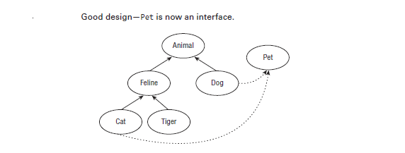
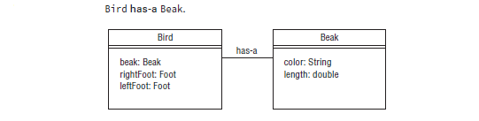
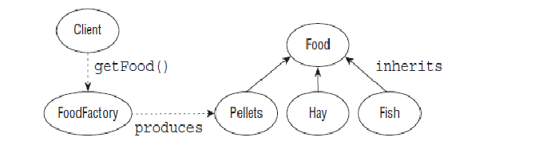

								    #UNDERSANTING DESIGN PATTERN#

Un principe de conception est une idée établie ou une meilleure pratique qui facilite le processus de conception de logiciels. Dans cette section, nous discuterons des principes de conception pour créer des classes Java et pourquoi ces principes conduisent à des bases de code meilleures et plus gérables. En général, suivre de bons principes de conception conduit à:    
* Code plus logique.   
* Code plus facile à comprendre.   
* Des classes plus faciles à réutiliser dans d'autres relations et applications.   
* Code plus facile à maintenir et qui s'adapte plus facilement à l'évolution des exigences applicatives.   

Tout au long de cette section, nous ferons référence à la décision de structurer les relations de classe en tant que modèle de données sous-jacent. Dans le développement logiciel, un modèle de données est la représentation de nos objets et de leurs propriétés au sein de notre application et de la manière dont ils se rapportent aux éléments du monde réel.    
# Encapsulating Data (Encapsulation des données): 
L’un des principes fondamentaux de la conception orientée objet est le concept d’encapsulation des données. Dans le développement de logiciels, l'encapsulation est l'idée de combiner des champs et des méthodes dans une classe de telle sorte que les méthodes opèrent sur les données, par opposition aux utilisateurs de la classe accédant directement aux champs. En Java, il est généralement implémenté avec des membres d'instance privés qui disposent de méthodes publiques pour récupérer ou modifier les données, communément appelées respectivement getters et setters.    

L’idée sous-jacente de l’encapsulation est qu’aucun acteur autre que la classe elle-même ne doit avoir un accès direct à ses données. On dit que la classe encapsule les données qu’elle contient et empêche quiconque d’y accéder directement.  

Avec l'encapsulation, une classe est capable de conserver certains invariants concernant ses données internes. Un invariant est une propriété ou une vérité qui est conservée même après la modification des données. Par exemple, imaginez que nous concevons une nouvelle classe Animal et que nous ayons les exigences de conception suivantes :   

• Chaque animal possède un champ espèce non nul et non vide.  
• Chaque animal possède un champ d'âge supérieur ou égal à zéro.  

Le but de la conception de notre classe Animal serait de s'assurer que nous n'arrivons jamais à une instance d'Animal qui viole l'une de ces propriétés. En utilisant des membres d'instance privés ainsi que des méthodes getter et setter qui valident les données d'entrée, nous pouvons garantir que ces invariants restent vrais.    

Un exemple illustratif pourrait éclairer ce concept. Nous définissons d’abord votre classe Animal sans encapsulation :   

	public class Animal {
		public String species;
		public int age;
	}
Une fois la classe Animal définie, il est facile de créer une instance d'Animal qui viole nos deux invariants :   

	Animal animal = new Animal();
	animal.age = -100;
Dans cet exemple, la premiere propiété est violée dès la création de l'objet, l'espèce étant par défaut nulle. L'utilisateur définit ensuite le champ d'âge sur -100, puisque ce champ est accessible publiquement, ce qui entraîne la violation du deuxième invariant. Cet objet peut désormais être transmis aux méthodes, les utilisateurs ignorant que les deux invariants ont été violés.   

Comment pouvons-nous résoudre ce problème en utilisant l’encapsulation ? Nous devons d’abord rendre les variables d’instance privées. De cette façon, la classe est la seule à pouvoir modifier directement les données. Ensuite, nous devons définir des constructeurs, des getters et des setters qui appliquent ces invariants. Voici une implémentation qui applique les invariants en utilisant l'encapsulation :  

	public class Animal {
		private String species;
		private int age;
		public Animal(String species) {
			this.setSpecies(species);
		}
		public String getSpecies() {
			return species;
		}
		public void setSpecies(String species) {
			if(species == null || species.trim().length()==0) {
				throw new IllegalArgumentException("Species is required");
			}
			this.species = species;
		}
		public int getAge() {
			return age;
		}
		public void setAge(int age) {
			if(age<0) {
			throw new IllegalArgumentException("Age cannot be a negative number");
			}
			this.age = age;
		}
	}  
Comme vous pouvez le voir dans cet exemple, l'espèce et l'âge sont tous deux marqués comme privés, avec les méthodes publiques getSpecies() et getAge() pour lire les données. Ensuite, nos méthodes setSpecies() et setAge() valident désormais l'entrée et lèvent une exception si l'un de nos invariants est violé. Enfin, un constructeur autre que celui par défaut a été ajouté qui nécessite une valeur d'espèce et utilise la méthode setter pour valider l'entrée.    

L'avantage de cette nouvelle implémentation de la classe Animal est qu'elle utilise l'encapsulation pour appliquer les principes de conception de la classe. Chaque fois qu'une instance d'un objet Animal est transmise à une méthode, elle peut être utilisée sans nécessiter la validation de ses invariants.   
# Creating JavaBeans (Création de JavaBeans):  
L'encapsulation est si répandue en Java qu'il existe un standard pour créer des classes stockant des données, appelé JavaBeans. Un JavaBean est un principe de conception permettant d'encapsuler des données dans un objet en Java. Le tableau ci-dessous répertorie les règles de dénomination des JavaBeans.   

| Rule                                     |     Example                       |
| -----------------------------------------|:---------------------------------:|
| Properties are private.                  | private int age;                 |
| Getter for non‐boolean properties begins  with get.   | public int getAge() { return age; }   |
| Getters for boolean properties may begin with is or get. | public boolean isBird() { return bird; }|
| Getters for boolean properties may begin with is or get. | public boolean isBird() { return bird; }|
| Setter methods begin with set.  | public void setAge(int age) { this.age = age; } |
| The method name must have a prefix of set/get/is followed by the first letter of the property in uppercase and followed by the rest of the property name. | public void setNumChildren(int numChildren) { this.numChildren = numChildren; } |

Jetons un coup d’œil à quelques exemples. Disons que nous avons les deux variables privées suivantes définies dans notre classe :  

	private boolean playing;
	private Boolean dancing;
Lequel des éléments suivants pourrait être correctement inclus dans un JavaBean ?  

	public boolean isPlaying() { return playing; }
	public boolean getPlaying() { return playing; }
	public Boolean isDancing() { return dancing; }
La première ligne est correcte car elle définit un getter approprié pour une variable booléenne.   
Le deuxième exemple est également correct, puisque boolean peut utiliser is ou get.    La troisième ligne est incorrecte, **car un wrapper booléen doit commencer par get**, puisqu'il s'agit d'un objet. 

Qu’en est-il de ces exemples ?  

	public String name;
	public String name() { return name; }
	public void updateName(String n) { name = n; }
	public void setname(String n) { name = n; }  
Aucune de ces lignes ne suit les bonnes pratiques JavaBean ! La première ligne rend le nom public, alors qu'il devrait être privé. La deuxième ligne ne définit pas de getter approprié et devrait être getName(). Les deux dernières lignes sont toutes deux des setters incorrects, puisque la première ne commence pas par set et la seconde n'a pas la première lettre du nom de l'attribut en majuscule.  

# Applying the Is‐a Relationship (Appliquer la relation est-une):  
Au chapitre 1, vous avez découvert l'opérateur instanceof et montré comment il pouvait être utilisé pour déterminer quand un objet est une instance d'une classe, d'une superclasse ou d'une interface particulière. Dans la conception orientée objet, nous décrivons la propriété d'un objet étant une instance d'un type de données comme ayant une relation est-une. La relation est-une est également connue sous le nom de test d'héritage.  

Le résultat fondamental du principe est-un est que si A est un B, alors toute instance de A peut être traitée comme une instance de B. Cela est vrai pour un enfant qui est une sous-classe d'un parent, qu'il soit un enfant direct. sous-classe ou un enfant éloigné. Comme nous l’avons vu avec le polymorphisme, les objets peuvent prendre de nombreuses formes différentes.   

Lors de la construction d'un modèle de données basé sur l'héritage, il est important d'appliquer régulièrement la relation is-a, afin de concevoir des classes qui ont un sens conceptuel. Par exemple, imaginons que nous ayons une classe Cat qui étend une classe Pet, comme le montre la figure ci-dessous:  

 

La classe parent, Pet, comporte des champs couramment utilisés tels que le nom et l'âge. En tant que développeur, vous pouvez également concevoir une classe Tiger, et comme les tigres ont aussi un âge et un nom, vous pourriez être enclin à réutiliser la classe Pet parent dans le but d'économiser du temps et des lignes de code, comme le montre la figure ci-dessous:

Malheureusement, Pet a également une méthode cuddle(), avec pour résultat que vous encouragez les gens à câliner les tigres ! En réutilisant la classe Pet parent, vous déclarez conceptuellement qu'un Tigre est un Animal de compagnie, même si un Tigre n'est pas un Animal de compagnie. Bien que cet exemple soit fonctionnellement correct et permette d'économiser du temps et des lignes de code, le résultat de l'échec de l'application de la relation is-a est que vous avez créé une relation qui viole le modèle de données.   

Essayons de résoudre le problème en plaçant Pet et Tiger sous une classe parent Feline et voyons si cela résout le problème, comme le montre la figure ci-dessous:  

  

Notre structure de classe fonctionne désormais et est cohérente, mais comme le montre la figure ci-dessus, si nous ajoutons un enfant Dog à Pet, nous rencontrons un problème avec le test is-a. Un chien est un animal de compagnie et un animal de compagnie est un félin, mais le modèle implique qu'un chien est un félin, ce qui n'est évidemment pas vrai.    

Comme vous l'avez vu dans cet exemple, le test est-une relation nous aide à éviter de créer des modèles d'objet contenant des contradictions. Une solution dans cet exemple consiste à ne pas combiner Tiger et Pet dans le même modèle, préférant écrire du code en double plutôt que de créer des données incohérentes. Une autre solution pourrait être d'utiliser les propriétés d'héritage multiple des interfaces et de déclarer Pet une interface plutôt qu'une classe parent, comme le montre la figure ci-dessous: 

Vous voyez dans cet exemple que le modèle objet est désormais correct en utilisant le test is-a. Par exemple, le chat est un animal, le tigre est un félin, le chien est un animal, etc. Pet est désormais distinct du modèle d'héritage de classe, mais en utilisant des interfaces, nous préservons la relation selon laquelle Cat est un animal de compagnie et Dog est un animal de compagnie.   
# Applying the Has‐a Relationship (Appliquer la relation a-une relation) - Aggregation:   
Dans la conception orientée objet, nous souhaitons souvent tester si un objet contient une propriété ou une valeur particulière. Nous appelons la relation has-a la propriété d'un objet ayant un objet de données nommé ou une primitive comme membre. La relation a-a est également connue sous le nom de test de composition d'objets, décrit dans la section suivante.  

Jetons un coup d'œil à un exemple avec les classes Bird et Beak, comme le montre la figure ci-dessous:  

Dans cet exemple, Bird et Beak sont deux classes avec des attributs et des valeurs différents. Bien qu'ils échouent évidemment au test "est-un", puisqu'un oiseau n'est pas un bec, et qu'un bec n'est pas non plus un oiseau, ils réussissent le test "a-a", comme un oiseau a un bec.  

L'héritage va encore plus loin en permettant de dire que tout enfant d'Oiseau doit aussi avoir un Bec. Plus généralement, si un parent a un objet en tant que membre protégé ou public, alors tout enfant du parent doit également avoir cet objet en tant que membre. Notez que cela ne s'applique pas aux membres privés définis dans les classes parentes, car les membres privés ne sont pas hérités en Java.  

# Composition - Part-of:   
Dans la conception orientée objet, nous faisons référence à la composition d'objets comme à la propriété de construire une classe en utilisant des références à d'autres classes afin de réutiliser les fonctionnalités des autres classes. En particulier, la classe contient les autres classes au sens has-a-a et peut déléguer des méthodes aux autres classes.   

La composition d'objets doit être considérée comme une alternative à l'héritage et est souvent utilisée pour simuler un comportement polymorphe qui ne peut être obtenu via un héritage unique. Par exemple, imaginez que nous ayons les deux classes suivantes :  

	public class Flippers {
		public void flap() {
			System.out.println("The flippers flap back and forth");
		}
	}
	
	public class WebbedFeet {
		public void kick() {
			System.out.println("The webbed feet kick to and fro");
		}
	}
Essayer de relier ces objets en utilisant l'héritage n'a pas de sens, car WebbedFeet n'est pas la même chose que Flippers. Au lieu de cela, nous pouvons composer une nouvelle classe qui contient ces deux objets et leur délègue ses méthodes, comme dans le code suivant :  

	public class Penguin {
		private final Flippers flippers;
		private final WebbedFeet webbedFeet;
		
		public Penguin() {
			this.flippers = new Flippers();
			this.webbedFeet = new WebbedFeet();
		}
		
		public void flap() {
			this.flippers.flap();
		}
		
		public void kick() {
			this.webbedFeet.kick();
		}
	}
Comme vous pouvez le constater, cette nouvelle classe Penguin est composée d'instances de Flippers et WebbedFeet. De plus, le gros du travail de flap() et kick() est délégué aux autres classes, les méthodes de la classe Penguin ne faisant qu'une seule ligne. Notez que les implémentations de ces méthodes dans les classes déléguées ne comportent également qu’une seule ligne, bien qu’elles pourraient éventuellement être beaucoup plus complexes.  

L’un des avantages de la composition d’objets par rapport à l’héritage est qu’elle tend à favoriser une plus grande réutilisation du code. En utilisant la composition d’objets, vous accédez à d’autres classes et méthodes qui seraient difficiles à obtenir via le modèle d’héritage unique de Java.  

Dans notre exemple précédent, la classe Flippers peut être réutilisée dans des classes totalement indépendantes d'un Pingouin ou d'un Oiseau, comme dans une classe Dauphin ou Tortue. Alternativement, si la classe Flippers avait été héritée de la classe Penguin, son utilisation dans d'autres classes non liées serait difficile sans casser le modèle de classe ou sans que l'autre classe contienne une instance de Penguin. Par exemple, il serait idiot de dire qu'un Dolphin est hérité d'un Penguin ou possède une instance d'une classe Penguin, simplement parce qu'un Dolphin a des Flippers et que Flippers hérite de la classe Penguin.   

La composition d'objets peut sembler plus attrayante que l'héritage en raison de sa nature réutilisable, mais gardez à l'esprit que l'une des forces de Java réside dans son puissant modèle d'héritage. La composition d'objets nécessite toujours que vous exposiez explicitement manuellement les méthodes et les valeurs sous-jacentes, tandis que l'héritage inclut automatiquement les membres protégés et publics. De plus, l’utilisation de la surcharge de méthodes pour déterminer dynamiquement quelle méthode sélectionner au moment de l’exécution constitue un outil extrêmement puissant pour créer des classes intelligentes. En d’autres termes, la composition des objets et l’héritage ont tous deux leur place dans le développement d’un bon code et, dans de nombreux cas, il peut être difficile de décider quelle voie choisir.  
# Aggregation vs Composition:  
• Dependency (Dépendance ):L'agrégation implique une relation dans laquelle l'enfant peut exister indépendamment du parent. Par exemple, Banque et Employé, supprimez la Banque et l'Employé existe toujours. alors que la composition implique une relation dans laquelle l'enfant ne peut exister indépendamment du parent. Exemple : L'humain et le cœur, le cœur n'existe pas séparément d'un humain.     
• Type of Relationship: la relation d'agrégation est une relation « has-a » et la composition est une relation « Part-of »    
• Type of association: La composition est une association forte alors que l'agrégation est une association faible .
# Working with Design Patterns (Travailler avec des modèles de conception):
Un modèle de conception est une solution générale établie à un problème de développement logiciel courant. Le but d’un modèle de conception est de tirer parti de la richesse des connaissances des développeurs qui vous ont précédé afin de résoudre d’anciens problèmes que vous pourriez rencontrer facilement. Il donne également aux développeurs un vocabulaire commun dans lequel ils peuvent discuter des problèmes et des solutions courants. Par exemple, si vous dites que vous avez écrit des getters/setters ou implémenté le modèle singleton, la plupart des développeurs comprendront la structure de votre code sans avoir à entrer dans les détails de bas niveau.   

Dans ce chapitre, nous nous concentrons principalement sur les modèles de création, un type de modèle de conception logicielle qui gère la création d'objets au sein d'une application. Évidemment, vous savez déjà comment créer des objets en Java avec le mot-clé new, comme indiqué dans le code suivant:  

	Animal animal = new Camel();
Le problème de la création d’objets réside cependant dans la manière dont vous créez et gérez des objets dans des systèmes plus complexes. Dans cet exemple, nous devions savoir exactement quel type d'objet Animal, dans ce cas Camel , nous voulions créer au moment de la compilation. Mais que se passe-t-il si cela n’est pas connu avant l’exécution ? De plus, que se passerait-il si nous voulions créer un seul objet Animal en mémoire partagé par toutes les classes de notre application ? Nous étudierons ces types de problèmes de création de conception et leurs modèles associés dans cette section.  

Une chose à garder à l’esprit en lisant cette section est que sous les couvertures, le mot-clé new est toujours utilisé pour créer des objets en mémoire. Les modèles de création appliquent simplement un niveau d'indirection à la création d'objets en créant l'objet dans une autre classe, plutôt que de créer l'objet directement dans votre application. Le niveau d'indirection est un terme général désignant la résolution d'un problème de conception logicielle en séparant conceptuellement la tâche en plusieurs niveaux.     
### Applying the Singleton Pattern (Application du modèle Singleton):   
Le premier modèle de création dont nous allons parler est le modèle singleton.   
**Problème** Comment créer un objet en mémoire une seule fois dans une application et le faire partager par plusieurs classes ?   
**Motivation** Il y a des moments où nous ne voulons qu'une seule instance d'un type particulier d'objet en mémoire. Par exemple, nous pourrions vouloir gérer la quantité de foin disponible pour la nourriture des animaux du zoo dans toutes les classes qui l'utilisent. Nous pourrions passer le même objet HayManager partagé à chaque classe et méthode qui l'utilise, bien que cela créerait beaucoup de pointeurs supplémentaires et pourrait être difficile à gérer si l'objet est utilisé dans toute l'application. En créant un objet HayManager singleton, nous centralisons les données et supprimons le besoin de les faire circuler dans l'application.    
**Solution** Le modèle singleton est un modèle de création axé sur la création d'une seule instance d'un objet en mémoire dans une application, partageable par toutes les classes et tous les threads de l'application. L'objet disponible dans le monde entier créé par le modèle de singleton est appelé singleton. Les singletons peuvent également améliorer les performances en chargeant des données réutilisables qui, autrement, prendraient beaucoup de temps à stocker et à recharger chaque fois que cela est nécessaire.    
Nous présentons une implémentation simple de notre classe HayStorage sous forme de singleton et discutons de ses différentes propriétés:    

		public class HayStorage {
			
			private int quantity = 0;
			
			private HayStorage() {}	// constructeur privé
		
			private static final HayStorage instance = new HayStorage(); // variable Singleton
		
			public static HayStorage getInstance() { // accessibles via une seule méthode statique publique
				return instance;
			}
		
			public void addHay(int amount) {
				quantity += amount;
			}

			public int getHayQuantity() {
				return quantity;
			}
		}
Comme indiqué dans le code précédent, **les singletons en Java sont créés en tant que variables statiques privées** au sein de la classe, souvent avec le nom instance. Ils sont accessibles via **une seule méthode statique publique**, souvent nommée getInstance(), qui renvoie la référence à l'objet singleton. Enfin, tous les constructeurs d'une classe singleton sont marqués private, ce qui garantit qu'aucune autre classe n'est capable d'instancier une autre version de la classe.         
En marquant les **constructeurs privés**, nous avons implicitement marqué la classe finale. Rappelez-vous que chaque classe requiert au moins un constructeur, le constructeur sans argument par défaut étant ajouté si aucun n'est fourni. De plus, la première ligne de tout constructeur est un appel à un constructeur parent avec la commande super(). Si tous les constructeurs sont déclarés private dans la classe singleton, alors il est impossible de créer une sous-classe avec un constructeur valide - par conséquent, la classe singleton est effectivement finale.  
 
Maintenant testons notre exemple:    

		public class Chapiter12Main {
		
			public static void main(String[] args) {
		
				HayStorage instance1 = HayStorage.getInstance();
				instance1.addHay(2);
				System.out.println(instance1.getHayQuantity());	// 2
				HayStorage instance2 = HayStorage.getInstance();
				System.out.println(instance2.getHayQuantity());	// 2
				System.out.println(instance1 == instance2); // true
			}
		}
Cet exemple prouve que les deux instance instance1 et instance2 pointe sur le même objet malgré l'opération faite *addHay(2)* sur l'instance1.     
### Creating Immutable Objects - DESIGN PATTERN Immutable
Le prochain modèle de création dont nous discuterons est le modèle des objets immuables.   
Problème Comment créer des objets en lecture seule qui peuvent être partagés et utilisés par plusieurs classes ?  
**Motivation:** Parfois, nous voulons créer des objets simples qui peuvent être partagés entre plusieurs classes, mais pour des raisons de sécurité, nous ne voulons pas que leur valeur soit modifiée.      
**Solution:** Le modèle d'objet immuable est un modèle de création basé sur l'idée de créer des objets dont l'état ne change pas après leur création et qui peuvent être facilement partagés entre plusieurs classes. Les objets immuables vont de pair avec l'encapsulation, sauf qu'il n'existe aucune méthode setter qui modifie l'objet. Étant donné que l'état d'un objet immuable ne change jamais, ils sont intrinsèquement thread-safe.    
##### Applying an Immutable Strategy (Appliquer une stratégie immuable):   
Bien qu'il existe une variété de techniques pour rédiger une classe immuable, vous devez être familiarisé avec une stratégie courante pour rendre une classe immuable pour l'examen:   
1. Utilisez un constructeur pour définir toutes les propriétés de l'objet.
2. Marquez toutes les variables d'instance private et final .
3. Ne définissez aucune méthode de setter.
4. N'autorisez pas la modification ou l'accès direct aux objets mutables référencés.
5. Empêcher les méthodes d'être redéfinies en marquant la classe final.     

La première règle définit comment nous créons l'objet immuable, en passant l'information au constructeur, de sorte que toutes les données soient définies lors de la création.       
Les deuxième et troisième règles sont simples, car elles découlent d'une encapsulation appropriée. Si les variables d'instance sont private et final , et qu'il n'y a pas de méthodes setters, alors il n'y a aucun moyen direct de modifier la propriété d'un objet. Toutes les références et valeurs primitives contenues dans l'objet sont définies à la création et ne peuvent pas être modifiées.         
La quatrième règle nécessite un peu plus d'explications. Disons que vous avez un objet Animal immuable, qui contient une référence à une liste des aliments préférés de l'animal, comme le montre l'exemple suivant:     

	public final class Animal {
	
		private final List<String> favoriteFoods;
	
		public Animal(List<String> favoriteFoods) {
			if (favoriteFoods == null) {
				throw new RuntimeException("favoriteFoods is required");
			}
			this.favoriteFoods = new ArrayList<String>(favoriteFoods);
		}
	
		public List<String> getFavoriteFoods() { // MAKES CLASS MUTABLE!
			return favoriteFoods;
		}
	}   
Afin de s'assurer que la liste favorite des aliments n'est pas nulle, nous la validons dans le constructeur et lançons une exception si elle n'est pas fournie. Le problème dans cet exemple est que l'utilisateur a un accès direct à la liste définie dans notre instance d'Animal. Même s'ils ne peuvent pas modifier l'objet List vers lequel il pointe, ils peuvent modifier les éléments de la liste, par exemple, en supprimant tous les éléments en appelant getFavoriteFoods().clear(). Ils pourraient également remplacer, supprimer ou même trier la liste.   

	public class Chapiter12Main {
	
		public static void main(String[] args) {
			Animal animal = new Animal(List.of("favoriteFoods1", "favoriteFoods2"));
			animal.getFavoriteFoods().stream().forEach(System.out::println); // favoriteFoods1 favoriteFoods2
			animal.getFavoriteFoods().clear();
			animal.getFavoriteFoods().stream().forEach(System.out::println); // on a pu modifier la classe l'objet esy vide !!!
		}
	}
Pour en revenir à nos cinq règles, la dernière règle est importante car elle empêche quelqu'un de créer une sous-classe de votre classe dans laquelle une valeur auparavant immuable apparaît désormais mutable. Par exemple, ils pourraient remplacer une méthode qui modifie une variable différente dans la sous-classe.    

Voici un exemple de classe **Animal immuable** :

		public final class AnimalImmutable {
		
			private final String species;
			private final int age;
			private final List<String> favoriteFoods;
		
			public AnimalImmutable(String species, int age, List<String> favoriteFoods) {
				this.species = species;
				this.age = age;
				if (favoriteFoods == null) {
					throw new RuntimeException("favoriteFoods is required");
				}
				this.favoriteFoods = new ArrayList<String>(favoriteFoods);
			}
		
			public String getSpecies() {
				return species;
			}
		
			public int getAge() {
				return age;
			}
		
			public int getFavoriteFoodsCount() {
				return favoriteFoods.size();
			}
		
			public String getFavoriteFood(int index) {
				return favoriteFoods.get(index);
			}
		}
### Using the Builder Pattern (Utilisation du modèle de construction):  
Le troisième modèle de création dont nous allons parler est le modèle de construction.   
**Problème:** Comment créer un objet qui nécessite de définir de nombreuses valeurs au moment où l'objet est instancié ?   
**Motivation:** Au fur et à mesure que la taille de nos objets de données augmente, le constructeur peut devenir de plus en plus grand pour contenir de nombreux attributs. Par exemple, dans notre exemple de classe Animal immuable le plus récent, nous avions trois paramètres d'entrée : species , age et favoriteFoods . Si nous voulons ajouter cinq nouveaux attributs à l'objet, nous devrons ajouter cinq nouvelles valeurs dans le constructeur. Chaque fois que nous ajoutons un paramètre, le constructeur grandit ! Les utilisateurs qui référencent notre objet seraient également tenus de mettre à jour leurs appels de constructeur chaque fois que l'objet a été modifié, résultant en une classe qui serait difficile à utiliser et à maintenir. Alternativement, nous pourrions ajouter un nouveau constructeur à chaque fois que nous ajoutons un paramètre, mais avoir trop de constructeurs peut être assez difficile à gérer dans la pratique.    
**Solution:** Le modèle de construction est un modèle de création dans lequel les paramètres sont transmis à un objet de génération, souvent via un chaînage de méthodes, et un objet est généré avec un appel de génération final. Il est souvent utilisé avec des objets immuables, car les objets immuables n'ont pas de méthodes setter et doivent être créés avec tous leurs paramètres définis, bien qu'il puisse également être utilisé avec des objets mutables.   

		public class AnimalBuilder {
			
			private String species;
			private int age;
			private List<String> favoriteFoods;
			
			public String getSpecies() { return species; }
			public void setSpecies(String species) { this.species = species; }
			
			public int getAge() { return age; }
			public void setAge(int age) { this.age = age; }
			
			public List<String> getFavoriteFoods() { return favoriteFoods; }
			public void setFavoriteFoods(List<String> favoriteFoods) { this.favoriteFoods = favoriteFoods; }
			
			@Override
			public String toString() {
				return "AnimalBuilder [species=" + species + ", age=" + age + ", favoriteFoods=" + favoriteFoods +  "]";
			}
		
			static class Builder { // la classe Builder
				private String species;
				private int age;
				private List<String> favoriteFoods;
				
				Builder withSpecies(String species) { // renvoient une instance de l'objet Builder
					this.species = species;
					return this;
				}
				
				Builder withAge(int age) {
					this.age = age;
					return this;
				}
				
				Builder withFavoriteFoods(List<String> favorite){
					this.favoriteFoods = favorite;
					return this;
				}
				
				AnimalBuilder build() { // une méthode qui retourne un objet de type AnimalBuilder
					AnimalBuilder ab = new AnimalBuilder();
					ab.setAge(this.age);
					ab.setSpecies(this.species);
					ab.setFavoriteFoods(this.favoriteFoods);
					return ab;
				}
			}
		}
À première vue, ce code la classe Builder pourrait ressembler beaucoup à la classe AnimalBuilder, à tel point qu'il semble que nous l'ayons redéfini exactement, mais il y a quelques différences importantes:   
* toutes les méthodes de la classe Buildere renvoient une instance de l'objet Builder **this**.   
* Nous créons notre **méthode de construction** de l'objet cible *AnimalBuilder*, généralement nommée build().  
* Les méthodes de construction sont généralement **enchaînées ensemble**.   

Exécutons maintenant notre exemple:   

	public class Chapiter12Main {
		public static void main(String[] args) {
		
		AnimalBuilder build = new AnimalBuilder.Builder().withAge(5).withSpecies("spa")
					.withFavoriteFoods(Arrays.asList("Favo1", "Favo2")).build();
			System.out.println(build);
	
		}
	}
Ce code affiche:  

	AnimalBuilder [species=spa, age=0, favoriteFoods=[Favo1, Favo2]]
C'est Joli n'est ce pas ! 

### Creating Objects with the Factory Pattern (Création d'objets avec le modèle Usine):  
Le dernier modèle de création dont nous allons parler est le modèle d'Usine.   
**Problème:** Comment écrivons-nous du code qui crée des objets dans lesquels le type précis de l'objet peut ne pas être connu avant l'exécution ?    
**Motivation:** Comme vous l'avez vu avec le modèle de Consturction, la création d'objets peut être assez complexe. Nous aimerions un moyen d'encapsuler la création d'objets pour gérer la complexité de la création d'objets, y compris la sélection de la sous-classe à utiliser, ainsi qu'un couplage lâche de l'implémentation de création sous-jacente.    
**Solution:** Le modèle d'usine (factory pattern), parfois appelé modèle de méthode d'usine (**factory method pattern**), est un modèle de création basé sur l'idée d'utiliser une classe d'usine pour produire des instances d'objets basées sur un ensemble de paramètres d'entrée. Il est similaire au modèle de générateur, bien qu'il se concentre sur la prise en charge du polymorphisme de classe.    

Les modèles de fabrique sont souvent, mais pas toujours, implémentés à l'aide de méthodes statiques qui renvoient des objets et ne nécessitent pas de pointeur vers une instance de la classe de fabrique. C'est également une bonne pratique de codage de postfixer le nom de la classe avec le mot Factory, comme dans AnimalFactory, ZooFactory, etc.     

Essayons un exemple de modèle d'usine impliquant des animaux de zoo et de la nourriture. Imaginez un gardien de zoo qui a besoin de nourrir une variété d'animaux du zoo avec différents types d'aliments. Certains animaux mangent de la nourriture spécialisée, tandis que d'autres partagent le même type de nourriture. De plus, une valeur de quantité est associée à chaque distribution de nourriture à un animal. Nous illustrons cet exemple avec les définitions de classe suivantes:    

	public abstract class Food {
	
		private int quantity;
	
		public Food(int quantity) {
			this.quantity = quantity;
		}
	
		public int getQuantity() {
			return quantity;
		}
	
		public abstract void consumed();
	}
Ensuite on écrit trois classe qui hérite de cett classe abstracte:   
Les animeaux qui mangent le **Hay**:

	public class Hay extends Food {
			
		public Hay(int quantity) { super(quantity); }
	
		@Override
		public void consumed() { System.out.println("Hay eaten: "+getQuantity()); }
	
	}
Les animeaux qui mangent le **Pellets**:

	public class Pellets extends Food {
	
		public Pellets(int quantity) { super(quantity); }
	
		@Override
		public void consumed() { System.out.println("Pellets eaten: "+getQuantity()); }
	
	}
Et les animeaux qui mangent le **Fish**:

	public class Fish extends Food {
	
		public Fish(int quantity) { super(quantity); }
	
		@Override
		public void consumed() { System.out.println("Fish eaten: "+getQuantity()); }
	
	}
Maintenant, définissons une FoodFactory en utilisant le modèle d'usine qui renvoie un type d'aliment basé sur des paramètres d'entrées, illustrons notre exemple dans la figure ci-dessous:    

 
Maintenant nous implémentons notre classe Factory **FoodFactory**:

	public class FoodFactory {
	
		public static Food getFood(String animalName) {	  // une méthode static
			switch (animalName) {
			case "zebra":
				return new Hay(100);
			case "rabbit":
				return new Pellets(5);
			case "goat":
				return new Pellets(30);
			case "polar bear":
				return new Fish(10);
			}
			// Good practice to throw an exception if no matching subclass could be found
			throw new UnsupportedOperationException("Unsupported animal: "+animalName);
		}
	}
Testons maintenant notre classe Factory:    

		public class Chapiter12Main {
		
			public static void main(String[] args) {
				Food food = FoodFactory.getFood("polar bear");
				food.consumed();
			}
		}
Ce code affiche:  
		
		Fish eaten: 10

	
